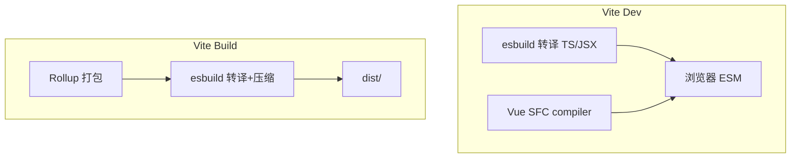
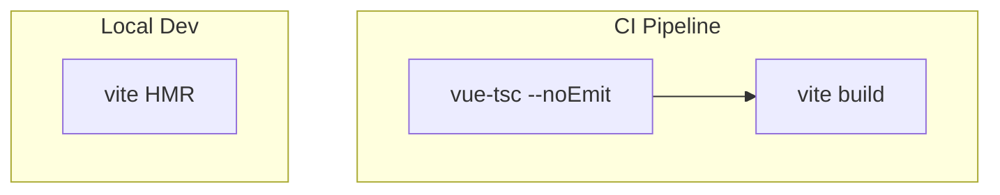
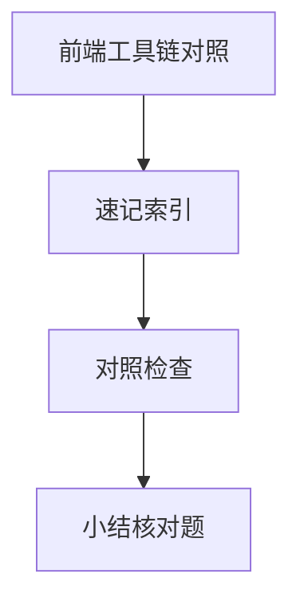

# 前端工具链对照

同一份 React/Vue 源码，在 Vite 开发、生产构建、Jest、ESLint 四条路径上经过的编译器组合不同。**对照表**理清 Babel、esbuild、SWC、框架编译器各自站位，避免「dev 能跑 build 挂」的盲区。

---

## 全景对照



详细构建分层见 工程化 02 · 模块化与构建层。

---

## 核心工具矩阵

| 工具 | 语言 | 强项 | 典型位置 |
|------|------|------|----------|
| **esbuild** | Go | 极快转译/打包 | Vite 依赖预构建、dev 转译 |
| **SWC** | Rust | 快，Next 默认 | `@swc/core`、部分 Jest |
| **Babel** | JS | 插件生态最全 | 自定义语法、旧 webpack 栈 |
| **Rollup** | JS | ESM tree-shake | Vite 生产打包 |
| **tsc** | TS | 类型检查 | CI、`vue-tsc` |
| **@vue/compiler-sfc** | TS | `.vue` 三块编译 | Vue 全栈 |
| **React Compiler** | — | 自动 memo | 实验性，见框架篇 |

---

## 从 main.ts 到浏览器（Vite + Vue 例）

```
main.ts
  → esbuild 转译 TS
  → 解析 import 图
  → .vue?  → @vue/compiler-sfc（template/script/style）
  → 浏览器以 ESM 按需加载
生产 build：
  → Rollup 全图打包 + tree-shake
  → esbuild minify
  → dist/assets/*.js（带 hash）
```

---

## Vue 编译链路

| 块 | 输入 | 输出 |
|----|------|------|
| `<template>` | HTML-like | render 函数 + `patchFlag` |
| `<script>` | TS/JS | 普通模块（经 esbuild） |
| `<style>` | CSS | scoped 选择器改写、CSS Modules |

与 Vue 07 编译渲染 衔接：编译期标记静态节点，运行时跳过 diff。

```javascript
// 编译后 render 片段（概念）
_createElementVNode("div", { class: "app" }, [...], 8 /* PROPS */)
//                                    patchFlag ─────┘
```

---

## React 编译链路

| 阶段 | 工具 | 说明 |
|------|------|------|
| JSX | babel-plugin 或 esbuild `jsx: automatic` | `_jsx` runtime |
| 新语法 | preset-env / esbuild target | 对齐 browserslist |
| RSC | 框架专用 loader | Server/Client 组件边界 |

React 19 Compiler 在 AST 层自动插入 memoization，减少手写 `useMemo` — 仍属编译期变换。

---

## 选型决策

| 需求 | 倾向 |
|------|------|
| 自定义 Babel 宏、旧插件 | 保留 Babel 管道 |
| Vite 默认栈 | esbuild + Rollup 足够多数项目 |
| Next.js | SWC 内置 |
| 最快 Jest 转译 | `@swc/jest` 或 esbuild-jest |
| 严格类型 | 始终独立跑 `tsc`/`vue-tsc` |

---

## 常见踩坑

| 现象 | 原因 |
|------|------|
| dev OK / build 失败 | 生产才做完整摇树或 `terser` 纯函数假设 |
| ESLint 与 Prettier 冲突 | 解析器 `ecmaVersion` / TS 项目不一致 |
| 双份 React | 预构建未 dedupe 或 alias 错误 |
| `.vue` 类型丢失 | 未配置 `vue-tsc` + Volar |

---

## 测试环境的编译

| 运行器 | 转译 |
|--------|------|
| Vitest | 与 Vite 同配置，esbuild |
| Jest | babel-jest 或 swc |
| Playwright | 通常跑已构建产物或 Vite preview |

测试栈应与生产语法目标一致，避免仅 Jest 开了某 Babel 插件。

---

## browserslist 在链路中的位置

```
package.json browserslist
    → Babel preset-env / Autoprefixer / postcss-preset-env
    → 决定哪些语法需要转译、哪些 CSS 前缀要加
```

与 Vite `build.target` 应对齐，否则可能出现「本地 Chrome 能跑、CI 构建目标过旧仍注入 polyfill」或相反。

---

## 环境矩阵对照

| 环境 | 转译 | 类型 | 打包 | 典型命令 |
|------|------|------|------|----------|
| Vite dev | esbuild | 可选 vue-tsc 并行 | 无，ESM 按需 | `vite` |
| Vite prod | esbuild + Rollup | CI `vue-tsc` | tree-shake + hash | `vite build` |
| Vitest | 同 Vite | 同 tsconfig | 无 | `vitest` |
| Jest | babel-jest / swc | tsc 或 @types | 无 | `jest` |



**原则**：类型检查与转译解耦 — CI 必跑 `tsc`/`vue-tsc`，不假设 `vite build` 会报类型错。

---

## PostCSS 与样式编译链

```
.vue style  →  @vue/compiler-sfc 提取
.scss       →  sass (dart-sass)
            →  PostCSS (autoprefixer, postcss-preset-env)
            →  浏览器可识别的 CSS
```

| 插件 | 作用 |
|------|------|
| `autoprefixer` | 按 browserslist 加前缀 |
| `postcss-preset-env` | 嵌套、`color-mix` 等降级 |
| `tailwindcss` | 扫描类名生成 utility |

样式链与 JS 转译**并行**但共享 browserslist — `package.json` 里宜只维护一份目标浏览器列表。

---

## 工具对照

| 需求 | 选型 |
|------|------|
| 极速 dev | Vite + esbuild |
| 库打包 | Rollup/tsup |
| 全量迁移 | Babel 插件生态 |
| 类型 | tsc / vue-tsc |
## SWC vs Babel

SWC/Rust 解析转译更快；Babel 插件生态最全。大型 monorepo 常用 SWC 做 dev，Babel 做特殊插件。
---

## 速记索引

| 小节 | 复习方式 |
|------|----------|
| 环境矩阵对照 | 复述定义 + 举一个前端相关例子 |
| PostCSS 与样式编译链 | 复述定义 + 举一个前端相关例子 |
| 工具对照 | 复述定义 + 举一个前端相关例子 |
| SWC vs Babel | 复述定义 + 举一个前端相关例子 |

## 对照检查

| 维度 | 自检 |
|------|------|
| 环境矩阵对照 易错 | 对照上文「易混点」或表格中的对比项 |
| PostCSS 与样式编译链 易错 | 对照上文「易混点」或表格中的对比项 |
| 工具对照 易错 | 对照上文「易混点」或表格中的对比项 |
| SWC vs Babel 易错 | 对照上文「易混点」或表格中的对比项 |



本节目标：离开文档仍能解释 **前端工具链对照** 的核心机制，并能在浏览器、Node 或工程排障中指认对应现象。
## 小结

Vite 用 esbuild 换开发速度、Rollup 换生产体积；Vue/React 各有模板/JSX 编译层；类型检查独立于转译器。对照 工程化 02 把「模块图 + 编译」连成完整工程视图。

**易混点**：esbuild 不能替代完整 Babel 插件生态；SWC 与 Babel AST 不通用；`vite build` 不等于 `tsc`。

核对：列出从 `main.ts` 到浏览器执行经过哪些包？Vue SFC 三块分别由谁处理？
