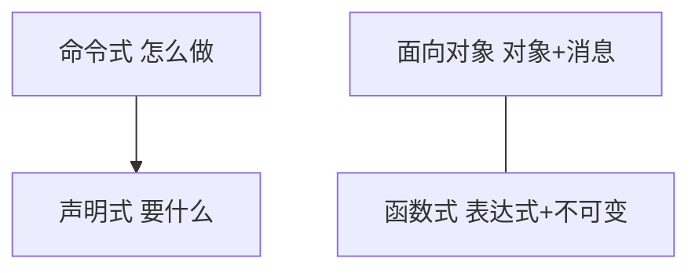
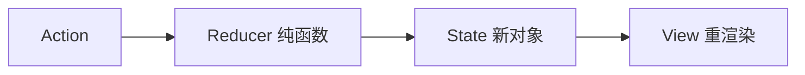
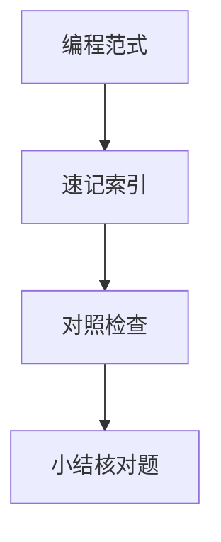

# 编程范式

语言塑造思维方式。**命令式、声明式、面向对象、函数式**在前端并存：DOM 命令式改节点，React 声明式描述 UI，Vue 组合式抽逻辑，Redux 借函数式不可变 — 识别范式有助于选型与读框架源码。

---

## 四大范式速览



| 范式 | 核心 | 前端例子 |
|------|------|----------|
| 命令式 | 逐步改变状态 | `el.textContent = 'x'` |
| 声明式 | 描述结果 | JSX、Vue template |
| OO | 封装、继承、多态 | Class 组件、`this` |
| 函数式 | 纯函数、高阶函数 | `map/filter`、Redux reducer |

---

## 命令式 vs 声明式

```javascript
// 命令式：一步步改 DOM
const ul = document.querySelector('ul');
ul.innerHTML = '';
items.forEach(i => {
  const li = document.createElement('li');
  li.textContent = i;
  ul.appendChild(li);
});

// 声明式：描述 UI 与数据关系
// React: return <ul>{items.map(i => <li key={i}>{i}</li>)}</ul>
```

框架接管**命令式 DOM 更新**，开发者写声明式视图；调和算法是命令式实现。

| 维度 | 命令式 | 声明式 |
|------|--------|--------|
| 关注点 | 步骤、顺序 | 状态与视图映射 |
| 调试 | 逐步跟踪 | 看数据是否驱动 UI |
| 性能优化 | 手动少改 DOM | 框架 diff / 编译期标记 |

---

## 面向对象在前端

| 概念 | JS 体现 |
|------|---------|
| 封装 | 模块、`#` 私有字段 |
| 继承 | `class extends`、原型链 |
| 多态 | 接口（TS）、鸭子类型 |

React 趋势从 Class → Function + Hooks，并非抛弃 OO，而是**组合优于继承**（composition）。

```typescript
// 组合：用 hooks 拼行为，而非深继承
function useAuth() { /* … */ }
function useCart() { /* … */ }
function CheckoutPage() {
  const auth = useAuth();
  const cart = useCart();
  // …
}
```

---

## 函数式要点

| 原则 | 实践 |
|------|------|
| 纯函数 | 同输入同输出，无副作用 |
| 不可变 | 新对象代替 mutate，`...spread` |
| 高阶函数 | `useCallback`、中间件 |
| 引用透明 | 可缓存、易推理 |

```javascript
// 可变 — 难推理、难并发
state.list.push(item);
// 不可变 — Redux/React 更新模式
return { ...state, list: [...state.list, item] };
```

Vue 3 `reactive` 用 Proxy 追踪变更，表面可变、内部仍靠依赖追踪 — 范式与实现分层。

---

## 多范式混合

| 栈 | 混合方式 |
|----|----------|
| React | 声明 UI + 函数组件 + 可选 OOP 错误边界 |
| Vue | 声明模板 + 组合式函数 + OOP 选项 API |
| Node | 命令式 I/O + 函数式工具库 lodash/fp |

TypeScript 不强制范式，靠 lint 与团队约定收敛风格。

---

## 与并发模型的关系

命令式共享可变状态 + 多线程易竞态；函数式不可变 + 事件循环单线程降低一类风险，但仍有闭包、异步顺序问题 — 见 16-并发与并行。

```
  共享可变 state + 多线程  →  需锁 / 原子操作
  不可变 + 单线程事件循环  →  无数据竞态，仍有竞态条件（异步顺序）
```

---

## 范式与框架 API 对照

| API 风格 | 更接近 |
|----------|--------|
| `document.createElement` | 命令式 |
| JSX / template | 声明式 |
| `class Component` | OO |
| `useReducer` + 纯 reducer | 函数式 |

读文档时看官方倾向：React 文档强调「UI = f(state)」是声明式 + 函数式习惯，而非要求纯 FP 语言。

---

## 不可变数据流示意



| 库 | 范式倾向 |
|----|----------|
| Redux Toolkit | 不可变 + 纯 reducer |
| Zustand | 可变式 set，偏命令式 API |
| Vue reactive | 可变对象 + 依赖追踪 |
| Immer | 写法可变、底层 produce 新对象 |

选型时问：**团队更熟哪种心智模型** — 没有绝对优劣，但要统一约定避免同一项目混用多种状态风格。

---

## 反应式与事件驱动（简记）

| 风格 | 前端例子 |
|------|----------|
| 反应式 | Vue `computed`、Signals |
| 事件驱动 | DOM 事件、`EventEmitter` |
| 数据流单向 | Redux dispatch → reducer |

```javascript
// 命令式监听
btn.addEventListener('click', () => { count++; render(); });
// 反应式：改 ref 即触发视图更新（框架负责 render）
```

读源码时区分「谁在驱动更新」：手动 `render()` 是命令式；依赖追踪是反应式实现，API 仍可声明式。

---

## 范式对照

| 范式 | JS 体现 |
|------|---------|
| 命令式 | 循环、赋值 |
| 函数式 | map/filter、不可变 |
| 面向对象 | class、原型 |
| 事件驱动 | 回调、观察者 |

React Hooks 偏函数式；Redux reducer 强调纯函数。
## 不可变数据

函数式强调 immutable — Immer 写「可变」语法生成新状态，适合 Redux reducer。
---

## 速记索引

| 小节 | 复习方式 |
|------|----------|
| 不可变数据流示意 | 复述定义 + 举一个前端相关例子 |
| 反应式与事件驱动（简记） | 复述定义 + 举一个前端相关例子 |
| 范式对照 | 复述定义 + 举一个前端相关例子 |
| 不可变数据 | 复述定义 + 举一个前端相关例子 |

## 对照检查

| 维度 | 自检 |
|------|------|
| 不可变数据流示意 易错 | 对照上文「易混点」或表格中的对比项 |
| 反应式与事件驱动（简记） 易错 | 对照上文「易混点」或表格中的对比项 |
| 范式对照 易错 | 对照上文「易混点」或表格中的对比项 |
| 不可变数据 易错 | 对照上文「易混点」或表格中的对比项 |



本节目标：离开文档仍能解释 **编程范式** 的核心机制，并能在浏览器、Node 或工程排障中指认对应现象。
## 小结

前端工程是声明式 UI 叠在命令式运行时之上，函数式习惯改善状态管理，OO 仍见于组件类与 DOM API。读源码时先问「这段是描述什么还是怎么做」。

**易混点**：声明式 ≠ 函数式；Hooks 不是 FP 语言；`class` 组件仍是原型继承语法糖。

核对：Redux 为何强调 immutable？Vue `ref` 赋值为何不算违背声明式？
