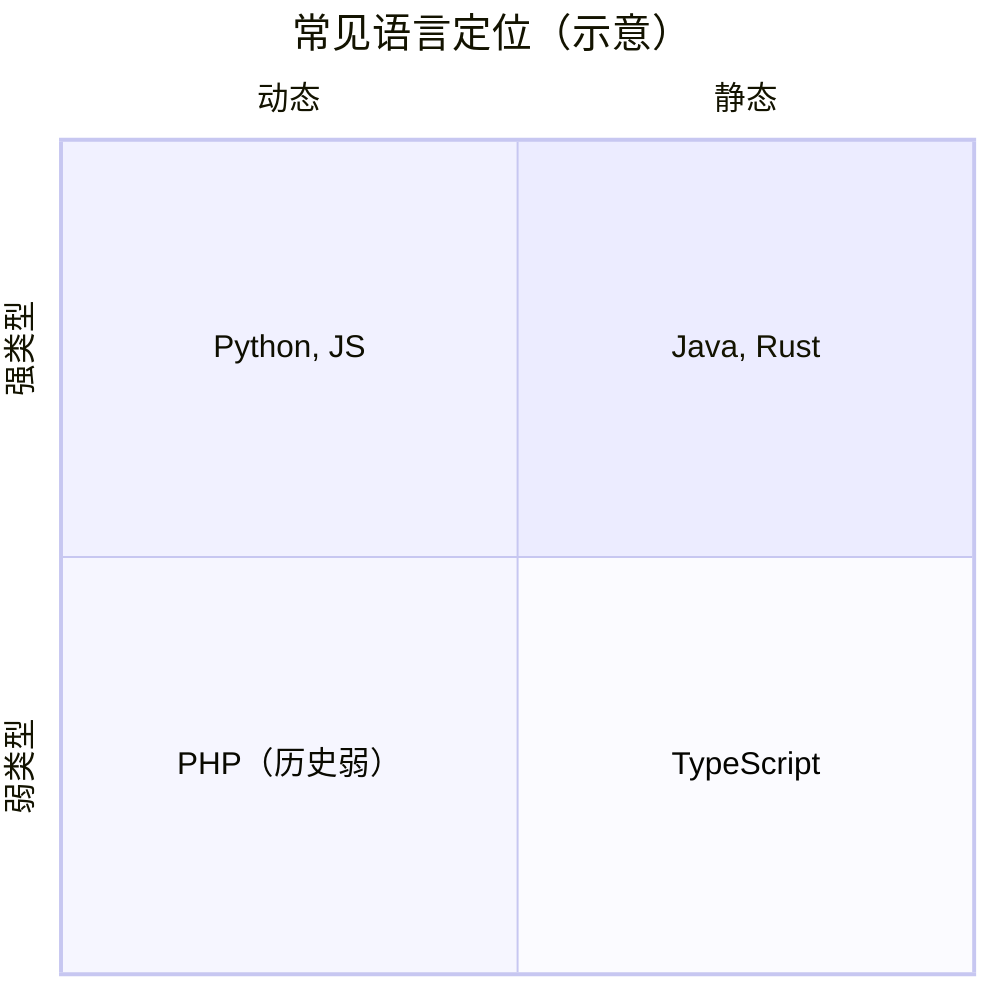
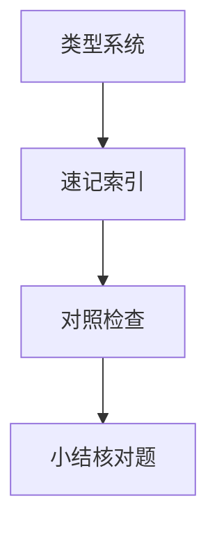

# 类型系统

类型系统决定**哪些操作合法、何时发现错误**。JavaScript 动态弱类型 + TypeScript 渐进静态层，构成前端最常见的类型光谱；读懂它，才能解释 `strict`、泛型组件与运行时仍可能 `undefined` 的原因。

---

## 分类坐标



| 维度 | 含义 | JS | TS |
|------|------|----|----|
| 静态/动态 | 检查时机 | 运行时 | 编译期（擦除） |
| 强/弱 | 隐式转换宽容度 | 弱：`'1'+1` | 可禁止隐式 any |
| 名义/结构 | 相容规则 | 结构（鸭子） | 默认结构类型 |

---

## JavaScript 运行时类型

```javascript
typeof null        // 'object' — 历史 bug
typeof []          // 'object'
Array.isArray([])  // true
1 + '2'            // '12' — 弱类型转换
```

| 值类型 | 存储 | 注意 |
|--------|------|------|
| primitive | 栈上值 | `===` 比 `==` |
| object | 堆引用 | 比较引用地址 |

V8 用**隐藏类（Map）**优化属性访问 — 随意增删属性键会降低优化，见 05-运行时与V8概览。

---

## TypeScript 静态层

```typescript
type ID = string | number;
interface Props { title: string; count?: number }

function greet(p: Props) {
  return `${p.title}: ${p.count ?? 0}`;
}
```

| 特性 | 用途 |
|------|------|
| 联合 `A \| B` | 有限状态 |
| `A & B` | 混入 |
| 泛型 `<T>` | 组件 props、API 响应 |
| 条件类型 | 工具类型 `Pick`、`ReturnType` |
| `unknown` vs `any` | 安全收窄 vs 放弃检查 |

`strictNullChecks`：把 `null`/`undefined` 纳入类型，对齐运行时 NPE 风险。

---

## 类型擦除

TS 编译后**无类型字节码**，类型仅存在于编译期：

```typescript
const x: number = 1;
// → const x = 1;
```

运行时泛型信息丢失 — `typeof T` 非法；需工厂函数或 schema（zod）做运行时校验。

---

## 渐进类型

| 策略 | 说明 |
|------|------|
| `.js` + JSDoc | `@ts-check` 渐进加类型 |
| `allowJs` | TS 与 JS 混编 |
| `any` 逃生舱 | 遗留代码迁移 |

与 06-JS与TS在语言谱系中的位置 连贯。

---

## 与编译器的关系

类型检查属 04-语义分析与类型检查 阶段；Babel 剥注解，**不能**替代 `tsc`。

---

## 运行时校验补充

| 场景 | 方案 |
|------|------|
| API 响应 | zod / valibot schema parse |
| 表单 | 与 TS 类型双写或从 schema 推导 |
| `JSON.parse` | 结果类型为 `any`，需窄化 |

```typescript
import { z } from 'zod';
const User = z.object({ id: z.string(), age: z.number() });
type User = z.infer<typeof User>; // 单一事实来源
```

编译期类型无法防止**边界外**恶意 JSON；前后端契约常以 OpenAPI + 生成类型，仍建议关键路径运行时校验。

---

## `any` 与 `unknown` 对比

```typescript
let a: any = fetchData();
a.foo();           // 编译通过，运行可能炸

let u: unknown = fetchData();
u.foo();           // 编译错误
if (typeof u === 'object' && u && 'foo' in u) { /* 窄化后使用 */ }
```

---

## 型变（Variance）直觉

| 型变 | 含义 | TS 例 |
|------|------|-------|
| 协变 | 子类型可替代父类型 | 返回类型协变 |
| 逆变 | 参数类型反向 | 函数参数逆变 |
| 不变 | 必须精确匹配 | 多数可变属性 |

```typescript
type Animal = { name: string };
type Dog = Animal & { bark(): void };

let f1: (a: Animal) => void = (d: Dog) => {}; // 参数逆变：错误
let f2: () => Dog = () => ({ name: 'x', bark() {} });
let f1b: () => Animal = f2; // 返回协变：OK
```

函数类型参数位置**逆变**、返回位置**协变** — 理解 `strictFunctionTypes` 报错时有用。日常组件 props 多为对象结构类型（协变友好）。

---

## 字面量类型与 `satisfies`

```typescript
const routes = {
  home: '/',
  user: '/u/:id',
} as const satisfies Record<string, string>;

type RouteKey = keyof typeof routes; // 'home' | 'user'
```

| 写法 | 效果 |
|------|------|
| `as const` | 收窄为只读字面量 |
| `satisfies` | 检查形状且保留窄类型 |
| `enum` | 运行时对象，摇树略差 |

API 常量表优先 `as const` + `satisfies`，减少魔法字符串又不必引入 `enum` 运行时开销。

---

## 静态 vs 动态

| | 静态 | 动态 |
|---|------|------|
| 检查时机 | 编译 | 运行 |
| 例子 | TS、Java | JS、Python |
| 错误发现 | 早 | 晚 |

渐进类型：JS 上加 TS，`any` 是逃生舱。
## 结构类型

TS 结构兼容：多余属性检查仅对 fresh object literal；变量赋值更宽。

`as const` 收窄字面量类型 — 配合 discriminated union。
---

## 速记索引

| 小节 | 复习方式 |
|------|----------|
| 型变（Variance）直觉 | 复述定义 + 举一个前端相关例子 |
| 字面量类型与 `satisfies` | 复述定义 + 举一个前端相关例子 |
| 静态 vs 动态 | 复述定义 + 举一个前端相关例子 |
| 结构类型 | 复述定义 + 举一个前端相关例子 |

## 对照检查

| 维度 | 自检 |
|------|------|
| 型变（Variance）直觉 易错 | 对照上文「易混点」或表格中的对比项 |
| 字面量类型与 `satisfies` 易错 | 对照上文「易混点」或表格中的对比项 |
| 静态 vs 动态 易错 | 对照上文「易混点」或表格中的对比项 |
| 结构类型 易错 | 对照上文「易混点」或表格中的对比项 |



本节目标：离开文档仍能解释 **类型系统** 的核心机制，并能在浏览器、Node 或工程排障中指认对应现象。
## 小结

JS 动态弱类型在运行时暴露一切；TS 在编译期加约束且擦除到 JS。强类型习惯（`strict`、窄化、`unknown`）减少线上 `undefined is not a function`。

**易混点**：`interface` 与 `type` 大多可互换；结构类型下「多余属性检查」仅对字面量；泛型运行时不存在。

核对：`any` 与 `unknown` 在赋值时有何区别？为何 `typeof null === 'object'`？
