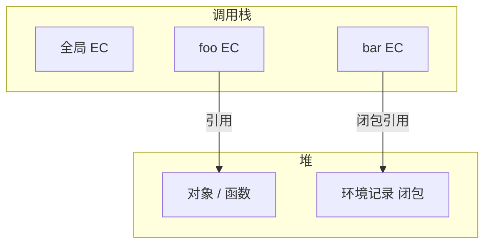
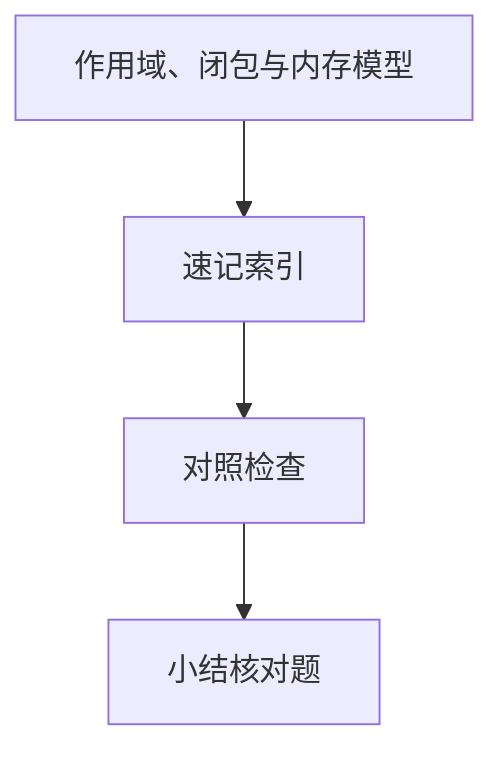

# 作用域、闭包与内存模型

JavaScript 用**词法作用域**查变量，用**栈帧 + 堆对象**存数据，用**闭包**让外层环境在函数返回后仍存活。事件监听泄漏、`let` 与 `var` 差异、模块私有 — 都可追溯到这一套模型；细节语法见 基础 JS 03 · JavaScript 体系。

---

## 栈、堆与执行上下文



| 区域 | 内容 |
|------|------|
| 栈 | 原始值、调用帧、返回地址 |
| 堆 | 对象、数组、函数对象、外层环境 |
| 执行上下文 EC | 词法环境、变量环境、`this` |

同步递归过深 → **栈溢出**；大对象在堆上由 GC 回收。

---

## 词法作用域与作用域链

```javascript
const a = 1;
function outer() {
  const b = 2;
  return function inner() {
    console.log(a, b); // 沿作用域链：inner → outer → global
  };
}
```

| 概念 | 说明 |
|------|------|
| 词法作用域 | 由源码嵌套决定，非调用位置 |
| 作用域链 | 查找变量时沿链向外 |
| 块级作用域 | `let`/`const` 在 `{}` 内 |

`var` 函数作用域 + 提升；`let`/`const` 暂时性死区（TDZ）。

```javascript
console.log(x); // ReferenceError（TDZ）
let x = 1;
```

---

## 闭包

**闭包** = 函数 + 其引用的外层词法环境。

```javascript
function makeCounter() {
  let n = 0;
  return () => ++n;
}
const c = makeCounter();
c(); c(); // 2 — n 活在堆上环境，非栈帧
```

| 用途 | 风险 |
|------|------|
| 模块私有状态 | 意外持有大对象 |
| 柯里化、工厂 | DOM 监听未移除 → 泄漏 |
| React Hooks 状态 | 陈旧闭包（依赖数组） |

Chrome DevTools **Memory** 堆快照可看到 `Closure` 保留链。

---

## `this` 与作用域分离

`this` 由**调用方式**绑定，不在作用域链上：

| 调用 | `this` |
|------|--------|
| `obj.fn()` | `obj` |
| `fn()` 严格模式 | `undefined` |
| `new Fn()` | 新实例 |
| 箭头函数 | 词法继承外层 `this` |

```javascript
const obj = { fn() { return this; } };
const f = obj.fn;
f() === obj; // false（非严格下为 global）
```

---

## 模块作用域

ESM 顶层的 `const` 不挂 `window`；每个文件独立模块记录。与脚本模式全局污染对比，是工程化隔离基础。

| 模式 | 顶层 `const foo` |
|------|------------------|
| `<script>` 经典 | 不自动全局（`var` 会） |
| `<script type="module">` | 模块作用域 |
| Node ESM | 文件作用域 |

---

## 与引擎优化

V8 快速属性访问依赖对象**形状稳定**；闭包环境是堆对象，频繁创建小闭包有分配成本，但通常小于 DOM 操作。热点函数经 **Ignition → TurboFan** JIT；类型突变会 deopt 回字节码。

| 写法 | 引擎影响 |
|------|----------|
| 固定属性顺序构造对象 | 共享隐藏类 |
| 动态增删键 | 隐藏类迁移 |
| 单态调用 | 利于内联 |

---

## 经典面试：`for` 与闭包

```javascript
for (var i = 0; i < 3; i++) setTimeout(() => console.log(i), 0);
// 3 3 3 — 同一 var 绑定

for (let i = 0; i < 3; i++) setTimeout(() => console.log(i), 0);
// 0 1 2 — 每轮迭代新词法环境
```

`let` 在循环头声明时，引擎常为每次迭代创建新环境记录，故闭包捕获不同 `i`。

---

## 模块与 CommonJS 作用域对比

| 特性 | ESM | CJS |
|------|-----|-----|
| 作用域 | 模块静态 | 函数包裹 `(function(exports){...})` |
| 导出 | 编译期绑定 | `exports.x =` 运行时 |
| 顶层 this | `undefined`（模块） | `module.exports` |

```javascript
// CJS 每个文件独立函数作用域，require 缓存同一实例
const fs = require('fs');
```

打包器把 ESM 编成 `__esModule` + helper — 调试栈里常见 `__vite_ssr_import__` 等别名，本质仍是模块级隔离。

---

## 执行上下文的创建与执行阶段

| 阶段 | `var` | `let`/`const` |
|------|-------|---------------|
| 创建 | 绑定并提升为 `undefined` | 建槽位，处于 TDZ |
| 执行 | 赋值生效 | 运行到声明行初始化 |

```javascript
console.log(typeof fn); // 'function'
function fn() {}
console.log(typeof x);  // ReferenceError
let x = 1;
```

箭头函数无 `arguments` 对象（除非外层非箭头）；`new` 箭头函数会报错 — 与 `this` 词法绑定相关。

---

## 词法作用域

```javascript
function outer() {
  const x = 1;
  return function inner() { return x; }; // 闭包捕获 x
}
```

| 环境 | 存储 |
|------|------|
| 栈 | 原始值、引用 |
| 堆 | 对象、闭包单元 |
## TDZ

`let/const` 声明前访问抛 ReferenceError —  temporal dead zone。

`var` 函数作用域提升；循环里 `var` 闭包经典面试题用 `let` 修复。
---

## 速记索引

| 小节 | 复习方式 |
|------|----------|
| 模块与 CommonJS 作用域对比 | 复述定义 + 举一个前端相关例子 |
| 执行上下文的创建与执行阶段 | 复述定义 + 举一个前端相关例子 |
| 词法作用域 | 复述定义 + 举一个前端相关例子 |
| TDZ | 复述定义 + 举一个前端相关例子 |

## 对照检查

| 维度 | 自检 |
|------|------|
| 模块与 CommonJS 作用域对比 易错 | 对照上文「易混点」或表格中的对比项 |
| 执行上下文的创建与执行阶段 易错 | 对照上文「易混点」或表格中的对比项 |
| 词法作用域 易错 | 对照上文「易混点」或表格中的对比项 |
| TDZ 易错 | 对照上文「易混点」或表格中的对比项 |



本节目标：离开文档仍能解释 **作用域、闭包与内存模型** 的核心机制，并能在浏览器、Node 或工程排障中指认对应现象。
## 小结

变量查找走词法作用域链；值在栈/堆分配；闭包延长外层环境生命周期。排查内存与 `this` 问题时，先画栈帧与环境引用图。

**易混点**：作用域链 ≠ 原型链；闭包不是「匿名函数」专有；`let` 无提升 usable 前访问会 TDZ。

核对：`for (var i)` 与 `for (let i)` 在循环闭包中有何差异？如何验证监听未卸导致泄漏？
