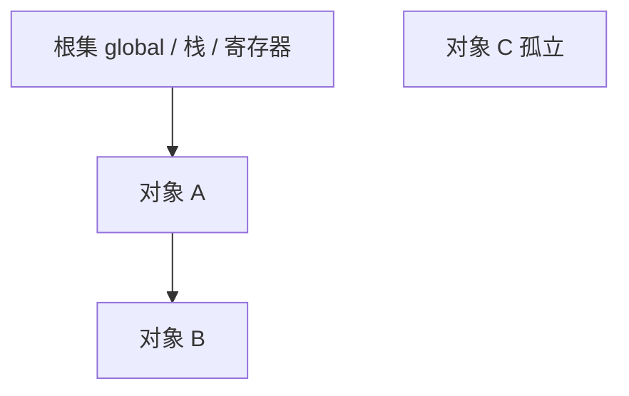
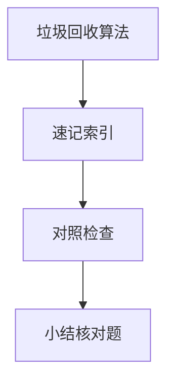

# 垃圾回收算法

堆上对象不再可达时，**垃圾回收（GC）**自动释放内存。V8 主线程 GC 停顿会影响长任务与帧率；理解标记清除、分代与引用计数局限，才能解释 Chrome Performance 里的 GC 锯齿与「分离 DOM 仍泄漏」。

---

## 可达性与根



从**根**出发沿引用能走到的对象 = **存活**；走不到的标记为垃圾。与 03-作用域闭包与内存模型 中堆引用一致。

| 根来源 | 例子 |
|--------|------|
| 全局对象 | `window`、模块顶层绑定 |
| 调用栈 | 当前执行函数局部变量 |
| 闭包环境 | 仍被引用的外层变量 |

---

## 标记-清除（Mark-Sweep）

| 阶段 | 动作 |
|------|------|
| 标记 | 从根遍历，标记可达 |
| 清除 | 未标记对象回收 |
| 整理（可选） | 压缩堆减碎片 |

现代引擎几乎不用纯**引用计数**作主 GC：`循环引用` A↔B 计数永不为零。

```javascript
// 循环引用 — 标记清除仍能回收（若无外部引用）
let a = {}; let b = {};
a.ref = b; b.ref = a;
a = b = null; // 二者不可达 → 可 GC
```

IE 旧 COM 曾用引用计数 + 循环检测；与 V8 无关。

---

## 分代假说


| 区域 | 策略 | 特点 |
|------|------|------|
| 新生代 | Scavenge 复制 | 频繁、快、小对象 |
| 老生代 | Mark-Sweep + 增量/并发 | 大对象、长寿命 |

**晋升**：新生代多轮 GC 仍存活 → 移入老生代。短生命周期临时对象（渲染中间数据）应尽量局部化，减少晋升压力。

```
  新生代 (Semi-space)
  ┌─────────┬─────────┐
  │ From    │ To      │  复制存活对象到 To，清空 From
  └─────────┴─────────┘
         │ 多次存活
         ▼
  老生代 — Major GC 成本更高
```

---

## V8 中的 GC 与主线程

| 技术 | 目的 |
|------|------|
| 增量标记 | 拆分标记工作，减停顿 |
| 并发标记 | 辅助线程标记 |
| 并行 Scavenge | 多线程复制新生代 |

Chrome Performance：**Minor GC**（新生代）、**Major GC**（老生代）。长任务与 GC 重叠会导致掉帧。

---

## 前端常见「泄漏」

| 情况 | 是否 GC 能收 |
|------|----------------|
| 全局变量挂大数组 | ❌ 根可达 |
| 闭包持有已卸组件 state | ❌ 闭包链可达 |
| `detached DOM` 仍被 JS 引用 | ❌ |
| `WeakMap` 键对象无其他引用 | ✅ 键可回收 |

`WeakMap`/`WeakRef` 不阻止键对象被 GC — 适合缓存 DOM 元数据。

```javascript
// 泄漏模式：定时器闭包持有组件 state
useEffect(() => {
  const id = setInterval(() => setCount(c => c + 1), 1000);
  return () => clearInterval(id); // 必须清理
}, []);
```

---

## 与 DevTools 对照

| 工具 | 用途 |
|------|------|
| Memory → Heap snapshot | 对比快照找 Retainers |
| Performance → Memory | GC 事件时间线 |
| `performance.memory` | Chromium 非标准 API，粗看堆 |

分离节点在 Elements 里不见，但快照里 `Detached HTMLElement` 仍被函数引用 — 典型 SPA 泄漏模式。

---

## 减少 GC 压力的习惯

| 做法 | 说明 |
|------|------|
| 复用对象池（谨慎） | 游戏/图表场景；业务层勿过度 |
| 避免在热路径创建临时数组 | `arr.filter().map()` 链可合并 |
| 卸监听 / 清定时器 | 断掉根引用 |
| 大列表虚拟滚动 | 少 DOM、少闭包 |

不必为 GC 手写对象池 — 先修泄漏与巨型结构，再看 Performance 里 GC 占比。

---

## WeakRef 与 FinalizationRegistry（ES2021）

```javascript
const cache = new Map();
const wm = new WeakMap();
let obj = { data: huge };
wm.set(obj, 'meta');
obj = null; // 无其他引用时，key 可被 GC，wm 项自动消失
```

| API | 用途 |
|-----|------|
| `WeakMap` | 键为对象，不阻止键被 GC |
| `WeakSet` | 弱引用对象集合 |
| `WeakRef` | 弱引用单个对象，需 `deref()` |
| `FinalizationRegistry` | 对象被 GC 时回调（清理外部资源） |

DOM 组件卸载后，若 WeakMap 仍关联 detached 节点且别处强引用节点，一样泄漏 — Weak 只弱键不弱 value。

---

## 堆外内存与监控盲区

`ArrayBuffer`、`WebGL` 缓冲区、WASM 线性内存可能不在 V8 **JS heap** 曲线里体现，但进程 RSS 仍涨。大图表、视频解码场景要同时看：

| 视图 | 看什么 |
|------|--------|
| Performance → Memory | JS 堆 GC |
| 任务管理器 / `top` | 进程总 RSS |
| `performance.measureUserAgentSpecificMemory()` | 实验 API，粗分堆外 |

---

## GC 算法

| 算法 | 特点 |
|------|------|
| 标记-清除 | 碎片 |
| 标记-整理 | 移动对象 |
| 分代 | 新生代 Scavenge |

V8 短生命周期对象在新生代；老生代 Mark-Compact — `JSON.parse` 大对象直接进老生代。
## 写屏障

并发 GC 需写屏障记录引用变更 — 避免漏标。V8 增量标记期间 mutator 仍运行。

DevTools Memory 堆快照对比 retained size 找泄漏 —  detached DOM 常见。
---

## 速记索引

| 小节 | 复习方式 |
|------|----------|
| WeakRef 与 FinalizationRegistry（ES2021） | 复述定义 + 举一个前端相关例子 |
| 堆外内存与监控盲区 | 复述定义 + 举一个前端相关例子 |
| GC 算法 | 复述定义 + 举一个前端相关例子 |
| 写屏障 | 复述定义 + 举一个前端相关例子 |

## 对照检查

| 维度 | 自检 |
|------|------|
| WeakRef 与 FinalizationRegistry（ES2021） 易错 | 对照上文「易混点」或表格中的对比项 |
| 堆外内存与监控盲区 易错 | 对照上文「易混点」或表格中的对比项 |
| GC 算法 易错 | 对照上文「易混点」或表格中的对比项 |
| 写屏障 易错 | 对照上文「易混点」或表格中的对比项 |



本节目标：离开文档仍能解释 **垃圾回收算法** 的核心机制，并能在浏览器、Node 或工程排障中指认对应现象。
## 小结

V8 以分代标记清除为主，新生代复制、老生代增量/并发减停顿。前端性能除算法外，更要避免闭包与全局持有无用 DOM/监听器。

**易混点**：GC ≠ 立刻回收；`null` 赋值只是断引用；WeakMap 的 value 强引用仍可能泄漏。

核对：循环引用在 V8 中会否泄漏？如何读堆快照中的 Retainer 链？
