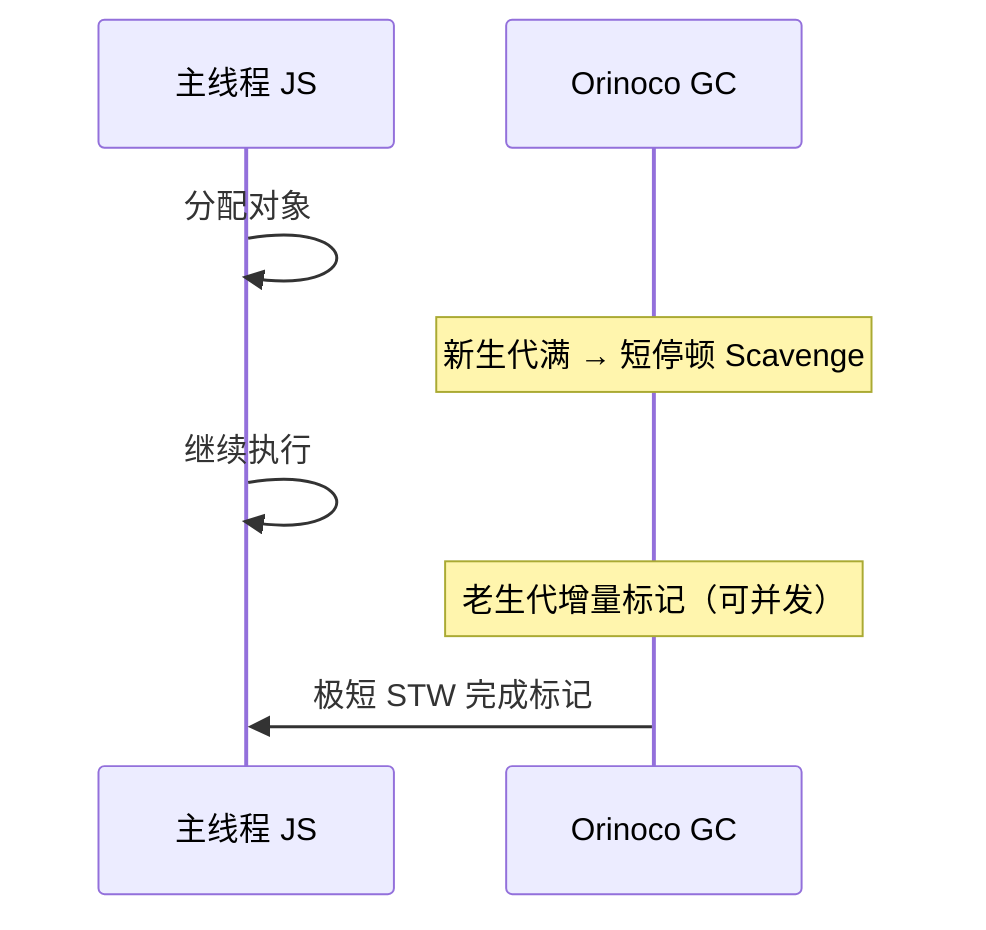
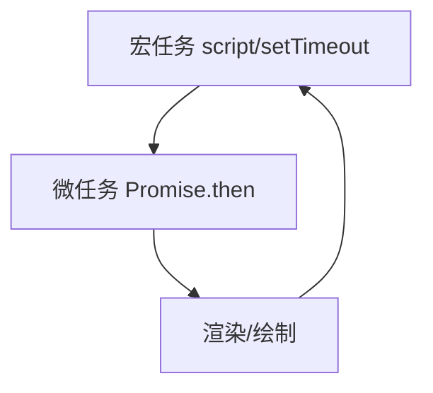
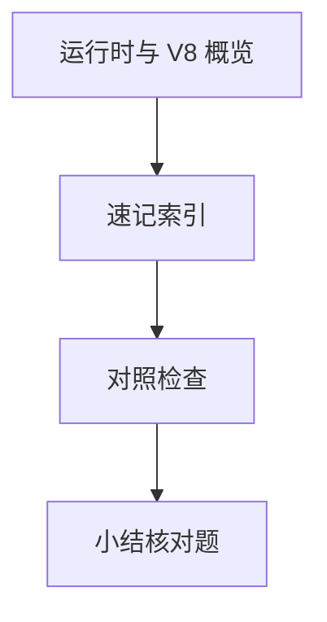

# 运行时与 V8 概览

浏览器里的 JavaScript 由 **V8**（Chrome/Edge/Electron）等引擎执行：解析 → 字节码 → 解释 → 热点 JIT 优化。Node 同源 V8 + libuv；读懂 Ignition/TurboFan 管线，有助于解释「为什么写法影响性能」与 deopt 警告。

---

## V8 执行管线


| 组件 | 角色 |
|------|------|
| Parser | 生成 AST |
| Ignition | 解释字节码，快速启动 |
| TurboFan | 基于类型反馈生成优化机器码 |
| Orinoco | GC 子系统 |

与 09-编译原理 中转译层分工：Babel 产出 JS，V8 再编译 JS。

---

## 隐藏类与内联

```javascript
function Point(x, y) {
  this.x = x;
  this.y = y;
}
// 连续用相同属性顺序构造 → 同一 Map（隐藏类）
```

| 实践 | 原因 |
|------|------|
| 固定属性初始化顺序 | 共享隐藏类 |
| 避免 delete / 随意增删键 | 触发 Map 迁移 |
| 单态调用 site | 利于内联 |

`obj.x` 在稳定形状下接近 C 结构体访问；字典模式慢。

---

## 去优化（Deoptimization）

TurboFan 假设类型稳定；若运行中类型突变：

```javascript
function add(a, b) { return a + b; }
add(1, 2); add(3, 4);     // 优化为整数加法
add('1', '2');            // 可能 deopt 回字节码
```

Chrome `chrome://flags` 与 d8 `--trace-deopt` 可调试；日常用 Performance 看长 JS 任务。

---

## 栈与堆（运行时视角）

| | 限制 |
|---|------|
| 调用栈深度 | 递归爆栈 |
| 堆大小 | 设备与 GC 策略，非无限 |
| 单字符串/数组长度 | 接近 2³¹ 受限 |

Web Worker **独立** V8 实例 + 堆，不共享普通对象（`SharedArrayBuffer` 例外）。

---

## Node 与浏览器差异

| | 浏览器 | Node |
|---|--------|------|
| 全局 | `window` | `global` / `globalThis` |
| I/O | Web API | libuv + 原生模块 |
| 模块 | ESM + 域限制 | ESM/CJS 完整 FS |

同份 TS 经 Vite 打进浏览器与经 tsx 跑 Node，**语法**一致，**宿主 API** 不同。

---

## 字节码与机器码

```
  JS 源码
     → Parser → AST
     → Ignition → 字节码（快速启动，省内存）
     → TurboFan（热点）→ 机器码（快执行）
     → deopt → 回字节码
```

字节码不是 WASM，也不等于最终 CPU 指令 — 是 V8 内部中间表示。

---

## 与其它引擎

| 引擎 | 宿主 |
|------|------|
| V8 | Chrome、Electron、Node、Deno |
| SpiderMonkey | Firefox |
| JavaScriptCore | Safari |

语法由 ECMAScript 规范统一；性能特征仍因实现而异，移动端 Safari 与桌面 Chrome 需分别压测。

---

## 调试与 profiling 入口

| 入口 | 用途 |
|------|------|
| Chrome DevTools → Performance | 火焰图、长任务、JS 采样 |
| `node ，inspect` + chrome://inspect | Node CPU Profile |
| `console.time` / `performance.now()` | 粗粒度分段 |
| Lighthouse | 主线程工作与 TBT 相关 |

优化前先测量：很多「慢」在布局/网络，而非 V8 本身。

---

## Orinoco GC 与主线程协作



| 阶段 | 用户感知 |
|------|----------|
| Minor GC | 通常 <5ms，频繁 |
| Major GC | 可能 10–50ms+，对象晋升多时 |
| 全停顿标记（旧策略） | 已大量改为增量/并发 |

长数组 `JSON.parse`、巨大对象图一次进堆，可能触发 Major GC — Performance 面板里 GC 与 Parse HTML/Script 相邻时，优先减 payload 而非微调语法。

---

## 与事件循环的衔接

V8 执行 JS 占满主线程时，**宏任务/微任务**无法穿插 — 长同步函数会阻塞渲染。浏览器侧事件循环按宏任务 → 清空微任务 → 渲染机会轮转；Node 侧由 libuv 分阶段调度，无渲染步骤。



---

## V8 流水线


热点函数 Tier-up；去优化（deopt）回字节码 — 类型不稳定触发。
## Inline Cache

单态 IC 最快；多态退化；超态 megamorphic 最慢 — 避免对同一 call site 传多种 shape 对象。
---

## 速记索引

| 小节 | 复习方式 |
|------|----------|
| Orinoco GC 与主线程协作 | 复述定义 + 举一个前端相关例子 |
| 与事件循环的衔接 | 复述定义 + 举一个前端相关例子 |
| V8 流水线 | 复述定义 + 举一个前端相关例子 |
| Inline Cache | 复述定义 + 举一个前端相关例子 |

## 对照检查

| 维度 | 自检 |
|------|------|
| Orinoco GC 与主线程协作 易错 | 对照上文「易混点」或表格中的对比项 |
| 与事件循环的衔接 易错 | 对照上文「易混点」或表格中的对比项 |
| V8 流水线 易错 | 对照上文「易混点」或表格中的对比项 |
| Inline Cache 易错 | 对照上文「易混点」或表格中的对比项 |



本节目标：离开文档仍能解释 **运行时与 V8 概览** 的核心机制，并能在浏览器、Node 或工程排障中指认对应现象。
## 小结

V8 以 Ignition 快速启动、TurboFan 优化热点；对象形状稳定利于隐藏类与内联。前端性能调优在 DOM 之外，也应避免触发频繁 deopt 与老生代 GC。

**易混点**：字节码 ≠ 机器码；JIT 优化的是 JS 非 WASM（除非 wasm）；每个 Tab 渲染进程内 V8 实例独立。

核对：为何 delete 动态属性可能变慢？Worker 与主线程是否共享同一堆？
