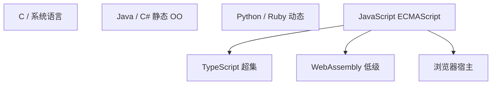

# JS 与 TS 在语言谱系中的位置

JavaScript 是**宿主驱动的动态脚本语言**；TypeScript 是其**渐进静态超集**。二者在语言家族中的坐标，解释为何前端「类型在编译期、行为在运行时」以及为何 TS 无法单独在浏览器执行。

---

## 谱系定位



| 语言 | 执行 | 典型用途 |
|------|------|----------|
| C/Rust | 机器码 | 引擎、原生模块 |
| Java | JVM 字节码 | 后端 |
| JS | 解释+JIT | Web、Node 脚本 |
| TS | 擦除→JS | 大型前端工程 |
| WASM | 线性内存+指令 | 重计算、移植库 |

---

## ECMAScript 演化

| 版本 | 前端相关特性 |
|------|----------------|
| ES5 | 严格模式、`JSON` |
| ES2015 | `let`、class、模块、Promise |
| ES2020 | 可选链、空值合并、`BigInt` |
| 年度版本 | `Array.at`、装饰器阶段等 |

Babel `preset-env` + **browserslist** 把新语法降到目标环境；引擎原生支持则跳过转译，减轻 V8 解析负担。

---

## JavaScript 的设计取舍

| 特点 | 后果 |
|------|------|
| 原型继承 | 灵活，类语法为糖 |
| 单线程 + 事件循环 | 无数据竞态，但有长任务阻塞 |
| 弱类型转换 | 需 `===`、lint |
| 一等函数 | 闭包、回调、FP 风格 |

与 Java/C# 名义类型、多线程模型形成对照 — 见 01-编程范式、02-类型系统。

---

## TypeScript 的角色

```typescript
// TS 独有，编译后消失
type ApiResult<T> = { data: T } | { error: string };
```

| 能力 | 运行时 |
|------|--------|
| 接口、泛型、枚举 | 擦除或变为对象 |
| 类型守卫 | 变为普通 `if` |
| `satisfies` | 仅检查 |

TS 是 **JavaScript 生态工具**，非独立运行时；deno/bun 内置 TS 转译仍是执行 JS。

---

## 与其它「编译到 JS」语言

| 语言 | 定位 |
|------|------|
| CoffeeScript | 语法糖，已式微 |
| Reason/ReScript | 强类型 ML 风味 → JS |
| Dart→JS | Flutter Web 历史路径 |

主流仍是 **TS + 原生 JS**；框架 DSL（Vue SFC、JSX）编译目标也是 JS。

---

## 宿主对象 + 语言

浏览器里的 JS 不仅是 ECMAScript，还包括 **Web API**（DOM、fetch、Timer）— 由宿主注入，不在 ES 规范内。

```
  ┌─────────────────────────────┐
  │  ECMAScript（语言核心）      │
  ├─────────────────────────────┤
  │  Web API / Node API（宿主）  │
  └─────────────────────────────┘
           │
           ▼
        V8 执行
```

Node 的 `fs`、`http` 同理 — 换宿主换 API，语言语法可复用。

---

## 面试常问坐标

| 问题 | 要点 |
|------|------|
| JS 单线程？ | 主线程单，Worker 另实例 |
| TS 强类型？ | 编译期强，运行时是 JS |
| 与 Java 比 | 结构类型、原型、动态 |
| 为何需要构建 | 新语法、TS、SFC、摇树 |

---

## TS `enum` 编译后形态

```typescript
enum Status { Pending, Done }
// 常见编译结果（概念）：
// var Status; (function (Status) { Status[Status["Pending"] = 0] = "Pending"; ... })(Status || (Status = {}));
```

`const enum` 可被内联擦除；`as const` 对象有时可替代枚举并更利于摇树。

---

## Deno / Bun 与 Node 坐标

| 运行时 | TS 支持 | 模块 | 与浏览器 |
|--------|---------|------|----------|
| Node | 需转译或 tsx | CJS/ESM | API 不同 |
| Deno | 原生 TS | ESM 优先 | 更接近 Web 标准 |
| Bun | 原生 TS | ESM/CJS | 内置 bundler |

语法层都是 ECMAScript；差异在**宿主 API 与工具链** — 同一份业务逻辑若只用标准库 + fetch，迁移成本低于深度绑定 `fs`/ `window` 的代码。

---

## TC39 提案与「未来 JS」

新语法常经历 Stage 0→4；Babel `preset-env` 按 browserslist **按需** 转译 Stage 4 已入标准的特性。

| Stage | 含义 |
|-------|------|
| 0 |  strawman 想法 |
| 1 | 提案初稿 |
| 2 | 草案 |
| 3 | 候选，实现验证 |
| 4 | 入 ECMAScript 标准 |

装饰器、Records/Tuples 等曾长期 Stage 2 — 生产依赖实验语法前要看目标引擎与 Babel 插件是否稳定。

---

## ESM 与 CJS 在语言坐标中的位置

| | ESM | CJS |
|---|-----|-----|
| 规范 | ECMAScript 模块 | Node 约定 |
| 静态分析 | `import` 编译期确定 | `require` 可动态 |
| 浏览器 | 原生支持 | 需打包 |

TS 的 `import type` 纯类型；运行时模块格式由 Node/Vite 决定。Deno/Bun「原生 TS」仍是 **先转译再执行 JS**，并非 TS 虚拟机。

---

## 语言谱系

| 特性 | JS/TS |
|------|-------|
| 原型 OOP | 灵活 |
| 一等函数 | 高阶、闭包 |
| 单线程 + 异步 | 事件循环 |
| TS 扩展 | 结构类型、泛型 |

与 Java/C# 名义类型不同 — 结构兼容 `{x:number}` 可赋给同形接口。
## 多范式取舍

同一项目可混范式 — 核心状态 immutable + UI 命令式 DOM 操作（React 封装后声明式）。

---

## 类型擦除与运行时边界

TS 编译后**无**泛型、接口、类型别名，运行时仍是 JS：

```typescript
function id<T>(x: T): T { return x; }
// 编译 ≈ function id(x) { return x; }
```

| 编译时 | 运行时 |
|--------|--------|
| 结构类型检查 | `typeof` / `instanceof` |
| 泛型约束 | 无 |
| `enum` | 对象或 IIFE |
| `as const` | 普通字面量 |

理解擦除后不会写 `if (x instanceof MyInterface)`，接口不存在于运行时；duck typing 用属性探测。

---

## 名义类型 vs 结构类型（面试对比）

| | Java/C# | TypeScript |
|---|---------|------------|
| 兼容规则 | 显式 implements/extends | **结构** — 形状相同即可赋 |
| 多余属性 | 编译期检查 | 对象字面量有 excess property 检查 |
| 私有 | 访问修饰符 | `private` 仅编译期 |

```typescript
type Point = { x: number; y: number };
const p = { x: 1, y: 2, z: 3 };
const q: Point = p;     // OK — p 变量多 z 无妨
const r: Point = { x: 1, y: 2, z: 3 }; // 报错 — 字面量 excess
```

从 Java 转 TS 时最易踩坑：以为「没 extends 就不兼容」，实则只要字段够就用。

## 小结

JS 是浏览器与 Node 的 lingua franca；TS 在其上叠加可擦除静态类型。理解谱系后，不会指望 TS 在运行时保留泛型，也不会用 Java 名义类型习惯硬套 JS。

**易混点**：JS 引擎 ≠ JS 语言；JSON 是数据格式非 ES 超集；WASM 不能直操 DOM。

核对：TS `enum` 编译后长什么样？为何说 JS 是「宿主对象 + 语言」组合？
