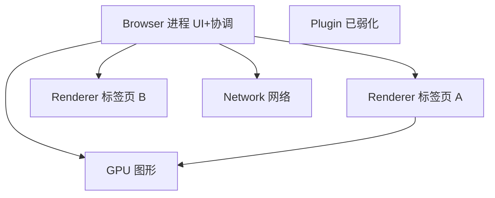
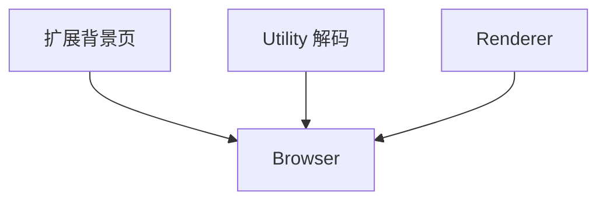

# 浏览器多进程架构

Chromium 系浏览器用**多进程**把 UI、页面渲染、网络、GPU 拆开：一个标签页里的 JS 死循环不会拖垮整个浏览器窗口，GPU 崩溃也尽量只影响图形而不必重启全部标签。Chrome 任务管理器里每一行进程，都对应这套分工 — 也是理解 Electron、Puppeteer 进程边界、以及「为什么 DevTools 网络数据来自网络进程」的起点。

---

## 进程全景

Browser 进程是「总调度」：管窗口、地址栏、权限、以及各子进程的生死。Renderer 跑具体页面的 HTML/CSS/JS；Network 统一处理 HTTP/QUIC；GPU 专责合成与 WebGL。

| 进程 | 职责 |
|------|------|
| **Browser** | 地址栏、书签、进程调度、权限弹窗 |
| **Renderer** | HTML/CSS/JS、布局绘制（Site Isolation 下按站点拆分） |
| **Network** | HTTP/QUIC、磁盘缓存、Cookie 存储与策略 |
| **GPU** | 合成层栅格化、WebGL、部分视频路径 |
| **Utility** | 音频解码、视频解码、存储服务等辅助 |

Renderer 数量随打开的标签、iframe、扩展背景页变化；内存占用常在任务管理器里排第一。

---

## 为何从单进程走向多进程

早期浏览器一个进程跑所有标签：插件（Flash 时代）或某页死循环会拖死全窗。多进程把故障域切开，再配合沙箱限制 Renderer 的系统权限。

| 单进程时代问题 | 多进程对策 |
|----------------|------------|
| 一个 tab 死循环卡全窗 | 独立 Renderer，Browser 可杀该进程 |
| 插件崩溃 | 独立插件进程（现已少见） |
| 恶意页读本地文件 | Renderer 沙箱，无直接 FS 访问 |

Renderer 跑在**沙箱**里：系统调用受限，读文件、开 socket 等需通过 IPC 向 Browser 或 Network 申请。Site Isolation 把不同站点拆进不同进程，与沙箱叠加构成纵深防御。

---

## 站点与进程分配策略

并非「一个标签页 = 一个进程」。Chromium 会在安全与内存之间折中：同源标签可能合并，跨站 iframe 可能独立进程。

| 模式 | 说明 |
|------|------|
| 每 tab 一进程 | 经典模型，内存开销大 |
| **Site Isolation** | 不同**站点**（eTLD+1）不同 Renderer，缓解 Spectre 读他站内存 |
| Process-per-origin | 同源可共享，跨源拆分 |

`chrome://process-internals` 可查看当前 URL 落在哪个进程。跨源 iframe 若独立进程，DevTools 调试时要 attach 对应 Renderer；`postMessage` 仍是跨进程消息，只是 API 看起来像在同一个 window 树里。

---

## Renderer 内部：进程与线程

一个 Renderer **进程**里仍有**多条线程**：主线程跑 JS 与大部分渲染管线，Compositor 与 Raster 线程池分担合成与栅格。

| 线程 | 典型工作 |
|------|----------|
| 主线程 | V8、DOM、样式、Layout、部分 Paint |
| Compositor | 滚动、合成层变换、提交帧 |
| Raster | 把 tile 栅格化成位图 |

进程隔离**内存与崩溃**；线程共享地址空间，协作完成一帧。Layout/Paint 多在主线程，Compositor 可并行滚动与合成层变换。

---

## IPC 与性能代价

Renderer ↔ Browser ↔ Network 通过 **Mojo IPC** 传结构化消息。DevTools Network 面板的数据由 Network 进程汇总后经 IPC 交给 Renderer 展示 — 因此能看到「请求在 Network 进程完成，但 Initiator 仍指向页面脚本」。

IPC 有序列化成本，但换来安全边界与独立伸缩：Network 进程可单独调优连接池，GPU 进程崩溃时 Browser 可尝试重启 GPU 而不杀所有 Renderer。

---

## 与前端开发的对应关系

| 现象 | 架构原因 |
|------|----------|
| `alert()` 阻塞整页 | 主线程_modal 循环，同 Renderer 内所有帧停住 |
| 跨域 iframe 拿不到 `contentDocument` | 进程 + 同源策略双重约束 |
| Electron 多窗口 | 多 Renderer；`nodeIntegration` 关闭沙箱时攻击面接近原生 |
| Service Worker | 独立线程/进程模型因版本而异，逻辑仍在 Browser 协调下 |

Electron 生产环境宜默认 `contextIsolation: true` + `sandbox: true`：页面 JS 与 Node 能力隔离，减 XSS 直达文件系统的风险。

---

## 内存与资源上限

| 资源 | 典型约束 |
|------|----------|
| 单 Renderer 内存 | 随设备变化，移动更紧 |
| 进程数 | 标签过多时可能合并 Renderer 或丢弃后台 tab |
| GPU 纹理 | 大 canvas、过多合成层占显存 |

`chrome://memory-internals` 可看各进程 RSS 与 V8 堆。排查「开很多 tab 后整机变卡」时，先看是否某 Renderer 泄漏，还是 GPU 纹理过多。

---

## 扩展、Utility 与崩溃恢复

| 组件 | 说明 |
|------|------|
| **扩展** | 常独立进程或共享 Utility，权限高于普通页 |
| **Utility 进程** | 音频/视频解码、网络服务、存储等 |
| **Crashpad** | 崩溃时写 minidump，Browser 可重启 Renderer |
| **zygote 式 fork** | 新 Renderer 从模板进程派生，加快启动 |

扩展能读 `chrome.tabs` 等特权 API — 安装来源不可信扩展等于扩大攻击面。Electron 应用若加载第三方 webview，进程模型类似但由应用自己配置。

---

## 导航与 bfcache

导航时 Browser 协调 Network 进程拉文档，再交给目标 Renderer 解析。**back/forward cache（bfcache）** 可能整页驻留内存不杀进程 — 返回极快，但 `pageshow` 事件 `persisted` 为 true 时需重新绑定时钟类逻辑。

| bfcache 条件 | 说明 |
|--------------|------|
| 未用 `unload` 监听 | 部分站点为兼容性主动禁用 |
| 无未释放 WebSocket | 长连接页常无法进缓存 |
| 内存压力 | 系统回收后需完整重新导航 |

`performance.getEntriesByType('navigation')[0].type === 'back_forward'` 可判断是否从 bfcache 恢复。

---

## Headless 与自动化测试

Puppeteer / Playwright 通过 **DevTools Protocol** 驱动 Chromium：Browser 进程仍协调，每个 **BrowserContext** 近似独立用户配置（Cookie、权限隔离）。

| 概念 | 含义 |
|------|------|
| Browser | 整个 Chromium 实例 |
| BrowserContext | 无痕/多账号隔离 |
| Page | 一个标签页，对应 Renderer |

CI 里 `--no-sandbox` 关闭 Renderer 沙箱是为容器权限，**生产 Electron 不应照搬**。

---

## DevTools 与进程 attach

| 面板 | 数据来源进程 |
|------|----------------|
| Elements / Console | 当前 Renderer |
| Network | Network 进程汇总后经 IPC |
| Performance | Renderer 主线程 + 合成线程 |
| Application → Storage | Browser 协调，Renderer 展示 |

调试跨源 iframe 时，DevTools 可能提示 **frame 在另一进程** — 需在该 frame 上下文单独执行 JS。Puppeteer `browser.pages()` 对应不同 Renderer 目标。

`chrome://gpu` 可查看 GPU 进程状态与合成问题；花屏、WebGL context lost 时优先看 GPU 进程是否反复崩溃重启。

移动端 Chrome 为省内存可能更激进地合并 Renderer 或冻结后台 tab — 性能与 Site Isolation 表现可能与桌面不同，真机需单独验证。

Worker 与 Service Worker 运行在独立线程/进程模型上，但页面主逻辑仍在 Renderer 主线程 — 重计算宜下沉 Worker，避免阻塞 Layout。

---

## 进程合并与 `Process-Swap`

内存压力下 Chromium 可能把多个同源 tab **合并**进同一 Renderer，或把后台 tab **丢弃**后切回时重新加载。`chrome://discards` 可查看各标签的丢弃优先级与原因。

| 信号 | 浏览器行为 |
|------|------------|
| 内存不足 | 杀后台 Renderer |
| 用户长时间未切回 | 提高丢弃分数 |
| 音频播放中 | 通常不丢弃 |

---

## 沙箱与系统调用边界

Renderer 沙箱通过 **seccomp / Job Object** 等机制限制可直接发起的系统调用；需要读文件、建 TCP、访问设备时，须经 **Mojo IPC** 向 Browser 或专用 Utility 进程申请。

| 能力 | Renderer 直接 | 典型路径 |
|------|---------------|----------|
| 读用户磁盘 | ❌ | `<input type=file>` 由 Browser 代开 |
| 发 HTTP | ❌ | Network 进程统一建连 |
| WebSocket | 经 Browser 协调 | 仍走 Network 栈 |
| 剪贴板 | 受限 | 需权限 + 用户手势 |

沙箱**不**等于「页面不能联网」— 网络由 Network 进程代理，Cookie 与缓存策略仍由 Browser 统一裁决。Electron 关闭 `sandbox` 或开启 `nodeIntegration` 时，Renderer 接近原生权限，XSS 可直接触达文件系统。

| 排障信号 | 可能原因 |
|----------|----------|
| 单 tab 崩溃其余正常 | 该 Renderer OOM 或 JS 致命错误 |
| 全浏览器闪退 | Browser 或 GPU 进程崩溃 |
| 网络全失败 | Network 进程异常或系统代理 |

`chrome://sandbox` 可查看沙箱启用状态；容器内跑 Chromium 常需 `--no-sandbox`，仅限 CI/自动化，桌面用户不应关闭。

---

## 进程优先级与后台节流

Browser 根据 tab 可见性调整 Renderer 优先级：后台 tab 的定时器、动画、甚至 JS 执行可能被**冻结**或**降频**，与前台 tab 的进程模型相同但调度策略不同。

| 状态 | 典型行为 |
|------|----------|
| 前台 active | 全速事件循环与 rAF |
| 后台 hidden | `setTimeout` 最小间隔增大 |
| discarded | 进程已杀，切回时重载 |

`document.visibilityState === 'hidden'` 时不宜依赖精确计时；音频播放中的 tab 通常不会被丢弃 — 与 `chrome://discards` 分数相关。

跨进程 **SharedArrayBuffer** 需站点隔离 + COOP/COEP 才可用；否则浏览器默认禁用以减 Spectre 风险。Wasm 线程与 SAB 同属高权限能力，部署时需同时检查响应头。

Puppeteer 的 `browserTarget()` 与 `page.target()` 对应不同 DevTools 目标 — 多 Renderer 场景下 attach 错进程会导致 `evaluate` 在空文档执行。自动化测试宜显式等待 `networkidle` 或特定选择器，而非固定 sleep。

`--single-process` 启动参数会把 Browser 与 Renderer 合并为单进程，仅用于调试 — 失去 Site Isolation 与崩溃隔离，切勿用于生产或安全测试。多窗口 Electron 应用每个 `BrowserWindow` 仍对应独立 Renderer，共享同一 Browser 进程协调。扩展的 background service worker 在 Manifest V3 下也运行在独立扩展进程中，与普通页面 Renderer 隔离。任务管理器里「扩展: xxx」一行即此类进程。

---

## 小结

Chromium 以 Browser 协调、Renderer 跑页面、Network/GPU 专责 I/O 与图形；Site Isolation 把安全边界推到进程级。排障时先确认问题在主线程、合成线程、Network 还是 GPU 进程。

**易混点**：进程数 ≠ 标签数（同源可能合并）；沙箱主要约束 Renderer；GPU 进程崩溃常表现为全页花屏或 WebGL 上下文丢失。

Network 进程与 Renderer 分离意味着 DevTools 里「禁用缓存」只影响当前调试会话，不改变磁盘缓存本身逻辑。

核对：为何跨源 iframe 在 Elements 里能 inspect 但 JS 不能读 `contentDocument`？Electron 里 `contextIsolation` 隔离的是什么？`--single-process` 与正常多进程相比牺牲了什么？
