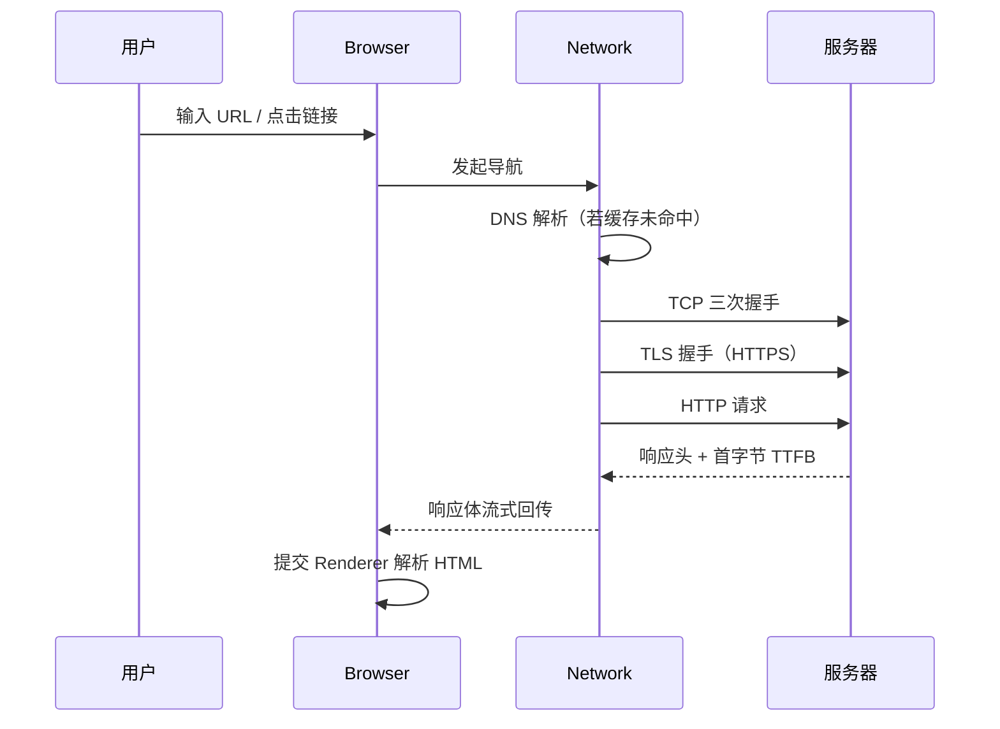
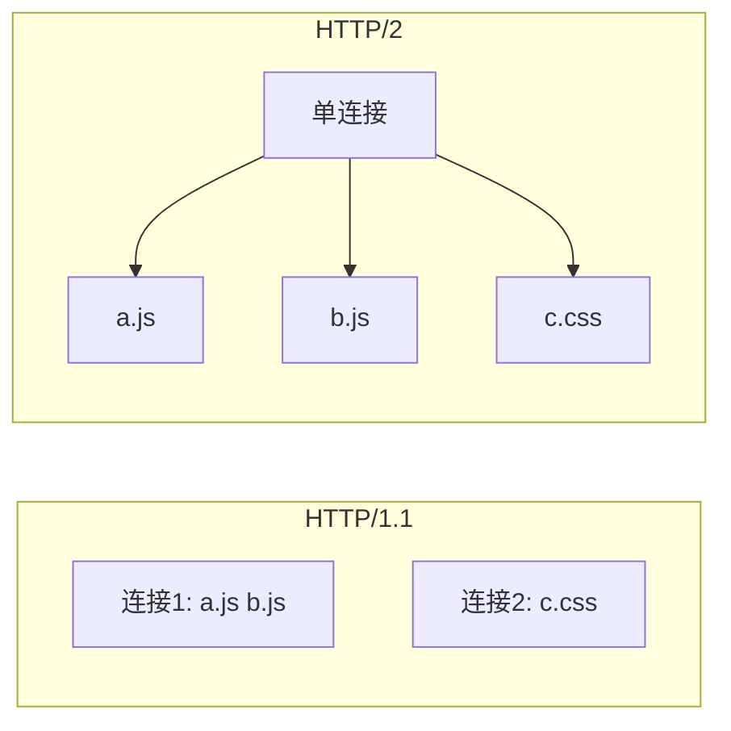
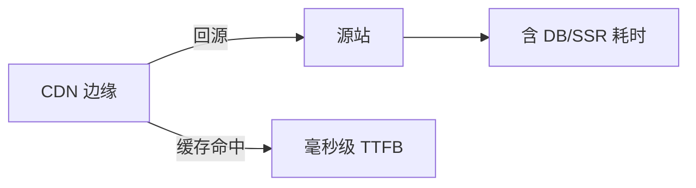
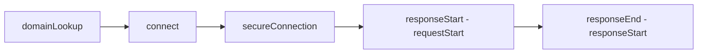

# URL 到首字节

地址栏按下回车后，在 HTML 第一个字节到达 Renderer 之前，DNS 解析、TCP 连接、TLS 握手、HTTP 请求与可能的 301 跳转已在 **Network 进程**里跑完一轮。DevTools 瀑布图上的 Queueing、Stalled、SSL、**TTFB** 各段，都对应这条链路上的不同环节 — 首屏慢时先分清是「连不上」还是「连上了但服务器慢」。

---

## 端到端序列

导航从 Browser 进程发起，Network 进程负责协议栈；首字节返回后，Browser 才把响应流交给 Renderer 开始 HTML 解析。



| 阶段 | 关键点 |
|------|--------|
| URL 解析 | scheme、host、port、path、query |
| DNS | 浏览器缓存 → OS 缓存 → 递归解析 |
| TCP | 三次握手；HTTPS 常用 443 |
| TLS | 证书校验、密钥协商、ALPN 选 h2/h3 |
| HTTP | 请求行/头、缓存协商、响应状态 |

TCP 三次握手建立可靠字节流；TLS 在握手阶段校验证书并协商对称密钥；HTTP 在加密通道上发请求行与头。ALPN 扩展在 TLS 里声明 `h2`/`http/1.1`，决定后续是否多路复用。

---

## DNS 与连接复用

每次新域名都要先解析 IP；已建立的 TCP+TLS 连接可复用，避免重复握手 RTT。

| 优化 | 机制 |
|------|------|
| DNS 预解析 | `<link rel="dns-prefetch" href="//cdn.example.com">` |
| 预连接 | `rel="preconnect"` 提前 TCP+TLS |
| HTTP/2 | 单连接多路复用多个请求 |
| HTTP/3 QUIC | UDP 上连接迁移、0-RTT 潜力 |

`dns-prefetch` 只解析主机名；`preconnect` 还会建连，适合确定很快会请求的 CDN 源。滥用 preconnect 会占满连接数。

Vite 开发服务器走 `localhost`，通常跳过公网 DNS；但 HMR 的 WebSocket 仍走本地 TCP，与生产导航路径不同（见下文）。

---

## 重定向与导航链

服务器可用 3xx 把 URL 改到另一地址；每次跳转至少多一轮 RTT（有时还要重新 TLS）。

```http
HTTP/1.1 301 Moved Permanently
Location: https://www.example.com/new
```

| 状态 | 影响 |
|------|------|
| 301/302/307/308 | 额外往返；链过长拖 TTFB |
| 304 Not Modified | 协商缓存命中，响应体极小 |
| 103 Early Hints | 在最终响应前推送 Link 预加载 |

Chrome DevTools **Network** 瀑布分段：**Queueing**（浏览器排队）、**Stalled**（等连接槽）、**Initial connection**、**SSL**、**Waiting (TTFB)**、**Content Download**。Waiting 长多半是服务端或 CDN 边缘慢，不是前端打包问题。

---

## 缓存如何缩短路径

命中强缓存时，Network 进程可能**不发网络请求**或只发验证请求；Service Worker 还能在更前面拦截 `fetch`。

| 类型 | 条件 |
|------|------|
| 强缓存 | `Cache-Control: max-age` / `Expires` |
| 协商缓存 | `ETag` / `Last-Modified` → 304 |
| Service Worker | `fetch` 事件自定义策略，可离线 |

304 仍有一次往返（带 `If-None-Match`），但省 body 下载。跨域资源命中缓存时，CORS 响应头仍需满足读 body 的条件 — 否则 JS 仍拿不到内容。

---

## TTFB 与用户体验指标

TTFB 只到**第一个字节**，不含 HTML 下载完，更不含 JS 执行与首次绘制。

| 指标 | 含义 |
|------|------|
| TTFB | 首字节时间 ≈ DNS+连接+TLS+服务端处理 |
| FCP | 首次任意内容绘制 |
| LCP | 最大内容元素绘制 |

降 TTFB：CDN 边缘、SSR 减少服务端模板耗时、减少重定向链。这与减小 JS bundle（改善 FCP/LCP）是不同方向的优化，需分别度量。

---

## Vite 开发服务器 vs 生产

| 维度 | 生产导航 | `vite` dev |
|------|----------|------------|
| 连接 | 公网 DNS + TLS + HTTP/2/3 | 本地 `127.0.0.1:5173`，常无 TLS |
| 资源形态 | 少量合并/分 chunk 文件 | 大量 ESM 模块小文件 |
| 首屏瓶颈 | TTFB + 关键资源下载 | 模块往返 + 转译，非典型 TTFB |

dev 里 Network 瀑布常出现上百条 `@vite/client`、`*.vue` 请求 — 慢在**往返次数与编译**，不是线上那种 TTFB。用 `vite build && vite preview` 更接近生产瀑布。HMR 走 WebSocket，不重复完整页面导航。

---

## HTTP/2 与 HTTP/3 对瀑布的影响

HTTP/1.1 时代常用**域名分片**（多个子域）绕过单连接 6 并发限制；HTTP/2 **多路复用**后，同一连接上并行请求，瀑布里「排队」段往往缩短。



HTTP/3 基于 QUIC（UDP），连接迁移、弱网重传策略不同；ALPN 在 TLS 握手时协商 `h2` / `h3`。前端打包仍应控制**关键路径资源数** — 多路复用不能消除大 JS 的下载与解析时间。

---

## 导航失败时的常见断点

| 现象 | 可能环节 |
|------|----------|
| `ERR_NAME_NOT_RESOLVED` | DNS |
| `ERR_CONNECTION_REFUSED` | TCP 目标端口无服务 |
| `ERR_CERT_AUTHORITY_INVALID` | TLS 证书 |
| 长时间 Waiting TTFB | 服务端/网关慢或冷启动 |
| 302 链过长 | 重定向配置 |

Service Worker 若拦截导航请求，瀑布里 Initiator 会显示 `ServiceWorker`；更新 SW 后首次导航可能多一次 `skipWaiting` 相关逻辑，与纯 Network 路径不同。

---

## 优先级与资源调度

浏览器为导航与资源请求维护**优先级队列**：HTML 文档、阻塞 CSS、同步 script 通常高于图片与 `prefetch`。

| 资源类型 | 典型优先级 |
|----------|------------|
| 主文档 | Highest |
| `@font-face` 阻塞字体 | High |
| `async` script | Low |
| `prefetch` | Lowest |

`fetchpriority="high"` 可提升 LCP 图片权重；过度标记会让关键 HTML 与 script 争抢带宽。HTTP/2 服务器推送（Push）已逐步被 103 Early Hints + preload 取代 — 推送时机难控，易浪费带宽。

---

## IPv6、Happy Eyeballs 与连接竞速

双栈主机可能同时尝试 IPv6 与 IPv4（Happy Eyeballs），短暂延迟后选用先连上的 — 瀑布里偶见两条 Initial connection 尝试。纯 IPv6 环境需确认 DNS AAAA 记录与服务器监听。

---

## 服务端时序与 CDN

TTFB 分解（概念上）：



| 优化 | 影响 TTFB |
|------|-----------|
| 边缘缓存 HTML | 降回源 |
| SSR 模板缓存 | 降 CPU |
| DB 慢查询 | 直接拉长 Waiting |
| 冷启动（Serverless） | 首请求 spike |

前端无法单独优化源站 DB，但可通过 **SSR 边缘渲染**、**静态化**、**Stale-While-Revalidate** 把 HTML 生成前移。

---

## `103 Early Hints` 与预加载

服务器在最终响应前可先返回 **103 Early Hints**，携带 `Link: </style.css>; rel=preload` 等头，让浏览器提前拉关键资源，缩短关键路径 — 需 CDN/源站支持，与 HTML 内 `<link rel=preload>` 互补。

---

## Navigation Timing 与分段度量

`PerformanceNavigationTiming` 把导航拆成可编程读取的时间段，与 DevTools 瀑布图一一对应，便于 RUM 上报。

```javascript
const [nav] = performance.getEntriesByType('navigation');
console.log({
  dns: nav.domainLookupEnd - nav.domainLookupStart,
  tcp: nav.connectEnd - nav.connectStart,
  tls: nav.secureConnectionStart > 0
    ? nav.connectEnd - nav.secureConnectionStart : 0,
  ttfb: nav.responseStart - nav.requestStart,
  download: nav.responseEnd - nav.responseStart,
});
```

| 字段区间 | 含义 |
|----------|------|
| `domainLookup*` | DNS 解析耗时 |
| `connectStart` → `connectEnd` | TCP 握手 |
| `secureConnectionStart` | TLS 起点（HTTPS） |
| `requestStart` → `responseStart` | Waiting (TTFB) |
| `responseStart` → `responseEnd` | Content Download |

`transferSize === 0` 且 `deliveryType` 为 `cache` 时表示强缓存命中 — 瀑布里可能看不到完整 SSL 段。`redirectCount > 0` 时应单独统计每次跳转的 RTT 叠加。



SPA 客户端路由切换**不**产生新的 navigation entry — 只有完整文档导航才更新 TTFB。对比线上与本地时，应用同一套 API 分段，避免用「首屏 FCP」替代 TTFB 结论。

---

## Cookie 与导航请求的时序

主文档导航携带的 Cookie 由 Network 进程在发 HTTP 请求前组装；`SameSite` 决定是否包含跨站 Cookie。第三方 iframe 子资源请求的 Cookie 规则与顶级导航不同 — 瀑布里同一域名可能出现「有 Cookie / 无 Cookie」两条行为差异。

| 场景 | Cookie 行为 |
|------|-------------|
| 顶级 HTTPS 导航 | 按 SameSite + Secure 附带 |
| 跨站 `` | 通常不带 SameSite=Strict |
| `fetch(..., { credentials: 'include' })` | 显式要求，仍受 CORS |

Cookie 体积过大时会拉长请求头，间接影响 TTFB 与服务端解析 — 宜控制单域 Cookie 数量与长度。

---

## 小结

导航由 Browser 调度 Network 进程完成解析、建连、TLS 与 HTTP；首字节到达后才进入 HTML 解析。读瀑布图时分段对应链路环节，别把 dev 的模块风暴当成线上 TTFB 问题。

**易混点**：TTFB 不含完整 HTML 下载；`prefetch` 是低优先级预取**下一**导航资源；同源策略在拿到响应后仍约束 JS 能否读 body。

核对：`preconnect` 与 `dns-prefetch` 各多做哪一步？304 为何在 Network 里仍显示一条请求？
