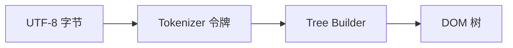
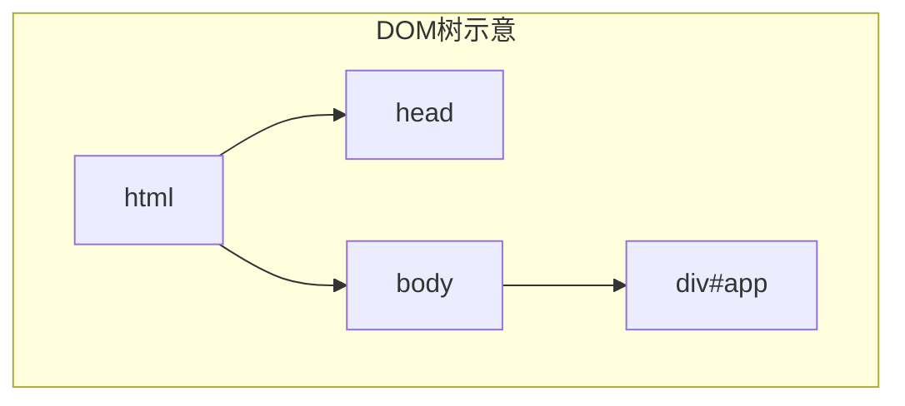
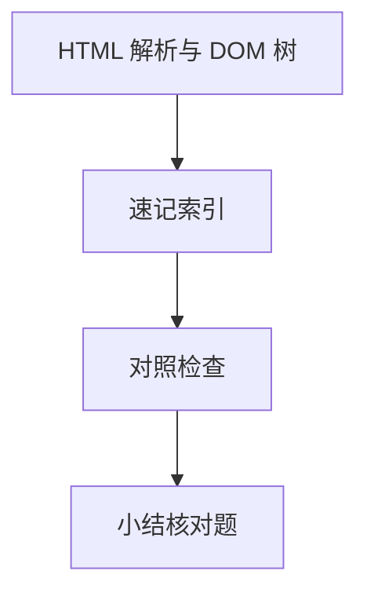

# HTML 解析与 DOM 树

HTML 字节流进入 Renderer 后，**HTML 解析器**按 WHATWG 规范增量构建 **DOM 树**。遇到同步 `<script>` 会暂停解析去执行 JS；样式表则影响后续渲染但不必然挡解析。React/Vue 最终在主线程 patch 的，就是这份真实 DOM — 理解解析阻塞，才能解释「脚本放哪、module 入口为何适合 Vite」。

---

## 解析流水线

解析分词（Tokenizer）与建树（Tree Builder）交错进行：不必等整个文档下载完，边收边建 DOM。



| 组件 | 输出 |
|------|------|
| 分词 | 开始/结束标签、属性、文本、注释令牌 |
| 建树 | 父子兄弟指针、`nodeType`、命名空间 |
| 脚本节点 | 可能暂停建树，跳转 JS 引擎 |



---

## DOM 节点类型

| `nodeType` | 常量 | 例子 |
|------------|------|------|
| 1 | Element | `<div>` |
| 3 | Text | 文本节点 |
| 8 | Comment | `<!， ，>` |
| 9 | Document | `document` |
| 11 | DocumentFragment | `createDocumentFragment()` |

```javascript
document.documentElement; // <html>
document.body;            // 解析到 <body> 后才有
```

`document.body` 在 `<body>` 标签解析完成前为 `null` — 同步脚本若放在 head 里访问 body 会踩坑。

---

## 阻塞解析的因素

脚本默认**阻塞解析**：解析器遇到 `<script src>` 会停，下载并执行完 JS 再继续。CSS 在现代浏览器中通常**不阻塞解析**，但会**阻塞渲染**（避免 FOUC）。

```html
<link rel="stylesheet" href="a.css">  <!-- 阻塞首次渲染 -->
<script src="sync.js"></script>         <!-- 阻塞解析 + 执行 -->
<script defer src="app.js"></script>    <!-- 并行下载，DOM 就绪后按序执行 -->
<script type="module" src="m.js"></script> <!-- 默认 defer 语义 -->
```

| 属性 | 下载 | 解析 | 执行顺序 |
|------|------|------|----------|
| 同步 script | 阻塞解析 | 暂停 | 立即，顺序固定 |
| `defer` | 并行 | 不暂停 | DOMContentLoaded 前，顺序固定 |
| `async` | 并行 | 不暂停 | 下载完即执行，**乱序** |
| `type="module"` | 并行 | 不暂停 | defer + 严格模式 + import 图 |

Vite 入口 `<script type="module">` 利用 module 的 defer，不挡 HTML 解析；生产 build 仍宜控制首屏同步脚本数量。

---

## DOMContentLoaded 与 load

| 事件 | 时机 |
|------|------|
| `DOMContentLoaded` | HTML 解析完成，defer/module 脚本执行前后边界依实现 |
| `load` | 文档及子资源（图片、样式表等）加载完成 |

SPA 常只有一个 `<div id="app"></div>`：**LCP 元素往往在 JS 执行并插入节点之后**，不在初始 HTML 里。Streaming SSR 可让首屏 HTML 更早含可见内容，见下节。

---

## 解析错误与 HTML 的容错

HTML 不是 XML：遇到未闭合标签时规范要求**错误恢复**（自动补全），页面仍尽量渲染。`application/xhtml+xml` 严格模式下解析失败会直接报错。

`innerHTML`、`insertAdjacentHTML` 走同一套 HTML 解析规则；用户输入未转义写入会导致 XSS — 应转义或使用 `textContent`/`createElement` 构建 DOM。

---

## 与框架的关系

| 层 | 说明 |
|----|------|
| 浏览器 DOM | 真实树，改几何触发 Layout |
| React Fiber | JS 描述树，commit 阶段 patch DOM |
| Vue | 编译期标记静态节点，减 patch 范围 |

**Hydration**：SSR 已输出 HTML，客户端 JS **复用**已有 DOM 节点并绑定事件，而不是 `innerHTML` 整树重写。Hydration mismatch 时 React/Vue 会告警或强制客户端重渲染。

---

## 流式与 SSR 解析

| 模式 | 行为 |
|------|------|
| 传统 SSR | 整页 HTML 一次 flush |
| Streaming SSR | 分块 flush，浏览器边收边解析 |
| Suspense SSR | 占位 HTML 先出，就绪片段流式替换 |

React 18 / Nuxt 3 Streaming 让 FCP 早于完整 JS bundle 执行；解析器仍增量建树，早到的 `<link rel="stylesheet">` 可提前参与 CSSOM 构建。

---

## 预扫描与资源提示

主解析器阻塞在 script 时，**预扫描器（preload scanner）** 仍向下扫描 HTML，提前发起 `<link rel="preload">`、``、`<script src>` 的下载，缩短关键路径。

| 提示 | 作用 |
|------|------|
| `rel=preload` | 高优先级提前下载 |
| `rel=modulepreload` | 预加载 ESM 模块图 |
| `rel=prefetch` | 低优先级，下一导航可能用 |
| `fetchpriority=high` | 调整 LCP 图片优先级 |

```html
<link rel="modulepreload" href="/assets/vendor.js">
```

预扫描与导航优先级队列协同：关键 script/CSS 仍优先于图片；滥用 `preload` 会挤占带宽，宜只标 LCP/关键 chunk。

---

## 自定义元素与 Shadow DOM

| 机制 | 解析结果 |
|------|----------|
| **Custom Elements** | 升级已知标签名，连上 JS 类 |
| **Shadow DOM** | 子树挂在 shadow root，与 light DOM 分离 |
| **slot** | 投影 light 子节点进 shadow |

框架组件最终也落成真实 DOM 节点；Web Components 标准下浏览器原生理解标签名与 shadow 边界。DevTools 里可切换查看 `#shadow-root`。

---

## `document.write` 与流式文档

同步 `document.write` 在解析阶段插入 markup，可能**重写**整个文档流 — 现代 SPA 几乎不用。`document.open/close` 配合 write 会替换文档，破坏已执行脚本状态；仅遗留广告/同步文档场景偶见。

---

## `template` 与 DocumentFragment

`<template>` 内容解析进 **DocumentFragment**，不触发 img/script 加载，也不出现在 DOM 树主文档中。`cloneNode(true)` 后再插入 body 才实例化 — 适合列表项原型、SSR 注水前的客户端模板缓存。

---

## 解析器与 `createElement` 的分工

| 操作 | 是否走 HTML 解析器 |
|------|-------------------|
| 首屏 HTML 字节流 | 是 |
| `innerHTML = '<div>'` | 是 |
| `createElement('div')` | 否，直接建节点 |
| `insertAdjacentHTML` | 是 |

框架 Virtual DOM diff 最终调用 `appendChild`/`setAttribute`，不重新解析整页 — patch 粒度影响 Layout 范围。

---

## 字符编码与 BOM

解析前根据 `<meta charset>`、HTTP `Content-Type` 或 BOM 确定编码；`<meta charset>` 须在 head 前 1024 字节内，否则可能二次解码。乱码首屏常是服务端未声明 charset 或代理改写了响应头。

---

## `noscript` 与渐进增强

`<noscript>` 在脚本禁用或尚未执行时渲染替代内容；Crawler 不执行 JS 时只能看到静态 HTML — SSR/预渲染让首屏不依赖客户端 bundle，对 SEO 与弱网首屏都重要。

---

## `link rel=preload` 与模块图

Vite 生产构建会为入口 chunk 注入 `modulepreload`，浏览器在解析到 `<script type=module>` 前即可并行下载依赖图 — 减 ESM 瀑布深度。开发模式因按需编译，模块图形态与生产不同。

---

## 表单与交互元素的解析时机

`<input>`、`<select>`、`<textarea>` 在标签闭合后即进入 DOM，但**默认值**与**选中项**在解析阶段确定；后续 JS 改 `value` 不影响「解析完成」边界。

| 元素 | 解析期行为 |
|------|------------|
| `<input value="x">` | 创建时带默认 value |
| `<option selected>` | 选中态在建树时写入 |
| `<textarea>` 子文本 | 作为纯文本节点，非 value 属性 |
| `<details open>` | `open` 属性影响初始展开 |

```html
<form>
  <input name="q" value="默认">
  <button type="submit">搜</button>
</form>
```

表单控件在 `DOMContentLoaded` 前即可被同步脚本访问 — 但若 script 在 `<head>` 且无 defer，可能在 `<form>` 解析前执行而拿不到节点。autofocus 属性在元素插入后由浏览器触发 focus，仍占主线程。

`<label for>` 与控件 id 的关联在解析期建立；动态 `createElement` 插入的控件需手动保证 id 唯一，否则关联失效。

---

## 解析器状态与 `document.readyState`

| 值 | 含义 |
|----|------|
| `loading` | 仍在解析 HTML |
| `interactive` | 解析完成，资源可能仍加载 |
| `complete` | 文档与资源加载完成 |

`readystatechange` 在 `interactive` 与 `complete` 各触发一次；与 `DOMContentLoaded`、`load` 的先后关系固定，监听时机错会漏掉事件。

---

## 实体引用与命名空间

HTML 解析器内置**命名实体**（`&lt;`、`&amp;`）与**字符引用**（`&#60;`、`&#x3C;`）；未声明的 `&foo;` 可能按规范降级为字面量或替换字符。

| 类型 | 例子 |
|------|------|
| 命名实体 | `&nbsp;` → 不换行空格 |
| 十进制 | `&#169;` → © |
| 十六进制 | `&#xA9;` → © |

SVG/MathML 子树使用不同命名空间；`createElementNS` 创建时才带正确 namespace URI，HTML 解析器遇到 `<svg>` 会自动切换 namespace 再还原。

---

## 速记索引

| 小节 | 复习方式 |
|------|----------|
| `noscript` 与渐进增强 | 复述定义 + 举一个前端相关例子 |
| `link rel=preload` 与模块图 | 复述定义 + 举一个前端相关例子 |
| 解析阻塞 | 复述定义 + 举一个前端相关例子 |
| 自定义元素 | 复述定义 + 举一个前端相关例子 |

## 对照检查

| 维度 | 自检 |
|------|------|
| `noscript` 与渐进增强 易错 | 对照上文「易混点」或表格中的对比项 |
| `link rel=preload` 与模块图 易错 | 对照上文「易混点」或表格中的对比项 |
| 解析阻塞 易错 | 对照上文「易混点」或表格中的对比项 |
| 自定义元素 易错 | 对照上文「易混点」或表格中的对比项 |



本节目标：离开文档仍能解释 **HTML 解析与 DOM 树** 的核心机制，并能在浏览器、Node 或工程排障中指认对应现象。
## 小结

HTML 解析增量构建 DOM；同步 script 阻塞最狠，module/defer 适合现代打包入口。优化从减少 head 内同步脚本、提前关键 CSS、SSR 流式出可见 HTML 入手。

**易混点**：阻塞解析 ≠ 阻塞渲染；`async` 脚本执行顺序不可依赖；空 `#app` 时 LCP 在 JS 之后。

核对：`defer` 与 `type=module` 默认行为有何异同？历史上为何建议 script 放 `</body>` 前？
