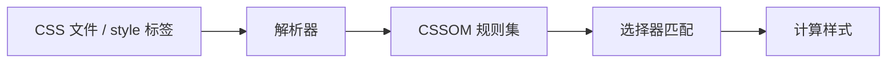
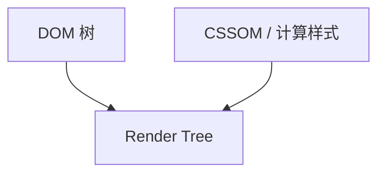

# CSS 解析与渲染树

CSS 从字节流变成 **CSSOM**（CSS 对象模型），再与 DOM 按选择器匹配、级联、继承，合并出 **Render Tree**（渲染树）。渲染树只含**需要绘制**的节点及**计算后的样式** — 因此 `display: none` 不进树，`visibility: hidden` 仍占位。布局/绘制阶段的输入就是 Render Tree，不是 raw DOM。

---

## 从样式表到 CSSOM

每条 CSS 规则包含选择器 + 声明块。解析器建 CSSOM 树（按规则列表组织），再对 DOM 做匹配，得到每个元素的**计算样式**（computed style）。



| 步骤 | 说明 |
|------|------|
| 解析 | `@media`、`@layer`、选择器、声明块 |
| 级联 | 来源（UA/用户/作者）、`!important`、特异性、顺序 |
| 继承 | `color`、`font-family` 等向子节点传递 |
| 计算值 | `em`→`px`，百分比相对父级可计算维度 |

DevTools **Styles** 看规则链，**Computed** 看最终生效值及被哪条规则覆盖。

---

## 特异性（优先级）

冲突时按级联算法决出赢家；特异性可粗算为 `(inline, id, class/attr/pseudo-class, type/pseudo-element)`。

| 来源 | 权重示意 |
|------|----------|
| `!important` | 同来源内最高 |
| 内联 `style=""` | 高于外部类选择器 |
| `#id` | 100 级 |
| `.class`、`[attr]` | 10 级 |
| 元素、`::before` | 1 级 |
| 后写覆盖先写 | 特异性相同时 |

```css
/* 特异性 0,1,0,1 → div.header 胜 */
div { color: red; }
.header { color: blue; }
```

框架 scoped（Vue `data-v-xxx`）本质是增加属性选择器，提高特异性以隔离组件样式，最终仍汇入同一 CSSOM。

---

## Render Tree 构建

Render Tree = DOM 中可见节点 + 每个节点对应的 computed style + 伪元素节点。



| DOM 情况 | 是否进入 Render Tree |
|----------|----------------------|
| `display: none` | 否（子树通常一并跳过） |
| `visibility: hidden` | 是，占布局，不绘制可见像素 |
| `head`、`script` | 否 |
| `::before` 且 `content` 非 none | 是，作为子节点 |

```
DOM:  div.card > span.title
         │              │
Render: [card 盒] ── [title 盒]   ← display:none 的兄弟不出现
```

---

## 阻塞行为

| 资源 | 典型影响 |
|------|----------|
| CSS | **阻塞渲染**（Render Tree 未就绪不绘制，防 FOUC） |
| JS 读布局属性 | 可能强制等待未加载完的 CSS（防用错样式算布局） |

关键 CSS 内联、`media="print"` 拆非首屏、`preload` 关键样式表，可缩短首次有意义绘制。

---

## 选择器与匹配成本

引擎对规则建索引（按 id/class/tag 等），不是逐条扫全表；但极端深层嵌套、通配符、`:not()` 复杂组合仍增匹配成本。

| 建议 | 原因 |
|------|------|
| 类选择器为主 | 特异性稳定、易缓存 |
| 避免超长后代链 | 减回溯 |
| 动态大量改 class | 可能触发全树重匹配 |

Vue 编译会把静态节点标记为「永不更新」，减运行时 patch；Tailwind 构建时扫描类名，产出静态 CSS 文件，运行时无 CSS-in-JS 注入开销。

---

## 与框架样式方案

| 方案 | 汇入路径 |
|------|----------|
| CSS Modules | 构建时 hash 类名 → 普通规则 |
| Vue scoped | 属性选择器 `[data-v-hash]` |
| CSS-in-JS | 运行时/构建注入 `<style>` |
| Tailwind | 预生成 utility 类 |

无论哪条路径，浏览器侧都是 **CSSOM + Cascade → Render Tree**，没有单独的「框架渲染树」。

---

## `@layer` 与级联层

```css
@layer base, components, utilities;
@layer base {
  h1 { font-size: 2rem; }
}
@layer utilities {
  .text-sm { font-size: 0.875rem; }
}
```

| 规则 | 说明 |
|------|------|
| 层顺序 | 后声明的层优先于先声明的层 |
| 层内 | 仍按特异性 + 顺序 |
| Tailwind v3+ | 常用 layer 组织 base/components/utilities |

`!important` 在层内比较时，**层**先于特异性 — 可用来可控地覆盖第三方组件库样式，而不无限堆 `!important`。

---

## 容器查询与 `content-visibility`

| 特性 | 影响 |
|------|------|
| `@container` | 按祖先容器尺寸而非 viewport 应用样式 |
| `content-visibility: auto` | 跳过屏幕外子树布局/绘制，进树但延迟几何 |

```css
.card { container-type: inline-size; }
@container (min-width: 400px) {
  .title { font-size: 1.5rem; }
}
```

容器查询改变「匹配时机」：resize 容器会触发样式重算，可能连带 Layout。`content-visibility` 优化长列表首屏，但注意与 `find`/`scrollIntoView` 交互。

---

## 继承与 `all` / `revert`

| 关键字 | 行为 |
|--------|------|
| `inherit` | 强制继承父级 |
| `initial` | 规范初始值 |
| `unset` | 继承属性继承，否则初始 |
| `revert` | 回退到 UA 样式 |

重置样式（如 `@tailwind base`）依赖级联来源顺序；组件库要控制特异性，避免全局 reset 意外盖掉业务样式。

---

## `contain` 与渲染隔离

```css
.card {
  contain: layout paint; /* 限制 Layout/Paint 影响范围 */
}
```

| 值 | 效果 |
|----|------|
| `layout` | 内部布局不影响外部 |
| `paint` | 绘制裁剪在盒内 |
| `strict` | layout + paint + size |

与 `content-visibility: auto` 配合可优化长列表：屏外子树跳过 Layout/Paint，滚动进入视口再补算几何。

---

## 媒体查询与 `@import` 成本

`@import` 串行加载子表，阻塞后续规则解析 — 生产环境宜合并为单文件或用 `<link>` 并行。`@media (prefers-color-scheme: dark)` 在匹配变化时触发全树重算，暗色模式切换可能连带 Layout。

---

## 伪元素与 Shadow DOM 样式

| 选择器 | 匹配对象 |
|--------|----------|
| `::before` / `::after` | 生成盒，需 `content` 非 `none` 才进 Render Tree |
| `::placeholder` | 输入框占位符 |
| `::slotted()` | Shadow DOM 内投影的 light DOM 子节点 |

Shadow DOM 内样式默认**不泄漏**到 light DOM；`:host` 选择 host 元素本身。Web Components 与 Vue scoped 都影响匹配范围，但机制不同 — 前者是 DOM 边界，后者是属性选择器提特异性。

---

## `@property` 与动画插值

```css
@property --angle {
  syntax: '<angle>';
  inherits: false;
  initial-value: 0deg;
}
```

注册自定义属性后，浏览器知悉类型，CSS 动画可在 `--angle` 上平滑插值 — 未注册时自定义属性按字符串处理，动画可能跳变。

---

## DevTools 排查样式

| 面板 | 用途 |
|------|------|
| **Styles** | 规则链、被划掉的失效声明 |
| **Computed** | 最终值、盒模型 |
| **Coverage** | 未使用的 CSS 比例 |

「Computed 里有的值在 Styles 里找不到」常来自继承或 UA 样式 — 点击 Computed 项可跳转到来源规则。

强制同步布局（读 `offsetWidth` 等）前若 DOM 刚改 class，浏览器可能先完成样式匹配与 Layout — 在循环中交替读写会触发 layout thrashing，宜批量读再批量写。

| 读取 API | 是否强制 Layout |
|----------|-----------------|
| `offsetWidth` / `offsetHeight` | 是 |
| `getComputedStyle` | 通常触发 |
| `getBoundingClientRect` | 是 |
| `clientWidth` | 是（含 padding，不含 border） |

Paint 阶段使用的颜色、字体来自 Computed Style；改 `class` 后若只触发了重绘未触发布局，Geometry 不变。

`transform` 动画多数仅触发 Composite，与改 `width` 触发的 Layout 路径代价不同。

排查 FOUC 时先确认阻塞 CSS 是否已解析进 CSSOM，再查 JS 是否在 CSS 就绪前读取布局属性。

---

## 小结

CSS 解析建 CSSOM，级联得计算样式，再与 DOM 合渲染树。`display` 与 `visibility` 对树与绘制的分工，是排查「元素在哪、占不占位」的基本功。

**易混点**：CSSOM 结构 ≠ DOM 树；`opacity: 0` 仍占布局且可接收事件（除非 `pointer-events: none`）；异步加载的 CSS 仍可能挡首次绘制；`visibility: collapse` 在表格行上与 `hidden` 行为不同。

核对：JS 在 CSS 加载前读 `offsetWidth` 为何会卡住？Vue scoped 用什么机制做隔离而不改 HTML 语义？`@layer` 与特异性冲突时谁先赢？
