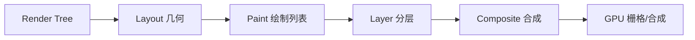
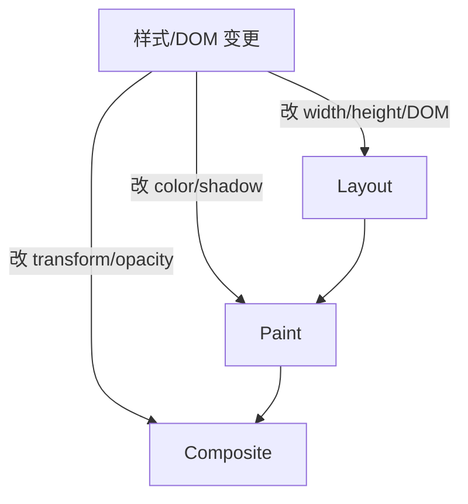
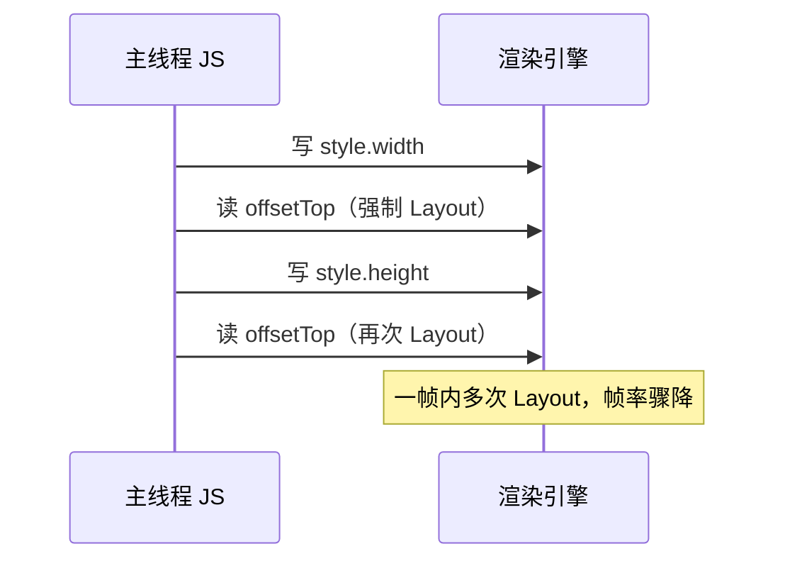
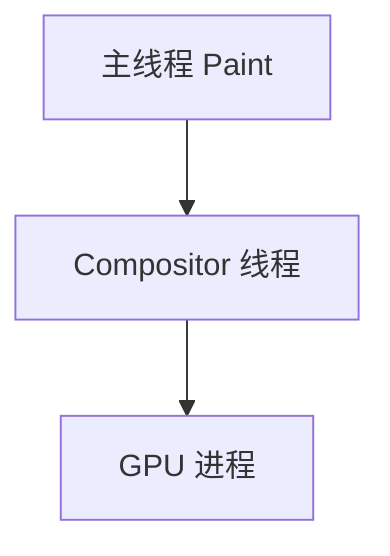

# 布局、绘制、合成与 GPU

Render Tree 建好之后，浏览器要把节点变成屏幕上的像素。这条路径依次经过 **Layout（布局/回流）→ Paint（绘制）→ Composite（合成）**；GPU 进程负责把各层位图拼成最终帧。改 `width` 会牵动几何重算，改 `color` 只重画外观，改 `transform`/`opacity` 往往只动合成层 — 性能优化就建立在这三层代价差异上。

---

## 渲染管线总览

可以把一帧想象成工厂流水线：先量尺寸（Layout），再刷漆（Paint），最后把透明胶片叠在一起（Composite）。



| 阶段 | 产出 | 典型触发 |
|------|------|----------|
| Layout | 每个盒子的 x/y/宽高 | 改 `width`、`font-size`、插入 DOM |
| Paint | 绘制指令（填色、边框、阴影） | `color`、`box-shadow`、`background` |
| Composite | 各层位图按 z 序混合 | `transform`、`opacity`、独立合成层 |

Layout 最贵：一个祖先尺寸变了，子孙可能全部重算。Paint 次之：几何不变时只重画受影响区域。Composite 相对便宜，但层太多会吃显存。

---

## 从盒子到像素：Layout 在算什么

Layout 阶段读取 Render Tree 上每个可见节点的**计算样式**，结合父级约束，算出最终几何框（border box）。Flex/Grid 要先解主轴/交叉轴，浮动和 BFC 也会在这一步定稿。

```
┌───────────────────────────── viewport ─────────────────────────────┐
│  ┌─ body ─────────────────────────────────────────────────────┐   │
│  │  ┌─ .card (300×200) ──┐  ┌─ .card ──┐                       │   │
│  │  │  text line box      │  │          │  ← 兄弟横向排列       │   │
│  │  └─────────────────────┘  └──────────┘                       │   │
│  └──────────────────────────────────────────────────────────────┘   │
└────────────────────────────────────────────────────────────────────┘
```

读 `offsetTop`、`getBoundingClientRect()` 会**强制同步 Layout**：若上一行 JS 刚改了样式，浏览器必须先算完几何才能返回值。这就是排障里常说的「强制回流」。

---

## 回流、重绘与仅合成

| 术语 | 英文 | 影响范围 |
|------|------|----------|
| 回流 | Reflow / Layout | 几何变化，常连带子树重算 |
| 重绘 | Repaint | 外观变、几何不变 |
| 仅合成 | Composite only | 只改合成层属性，跳过 Layout/Paint |



**动画选型对照**：

| 属性 | 每帧代价 | 说明 |
|------|----------|------|
| `left` / `top` | Layout + Paint + Composite | 主线程易掉帧 |
| `transform` | 多数仅 Composite | 位移/缩放/旋转优先 |
| `opacity` | 多数仅 Composite | 淡入淡出友好 |

```css
.box {
  will-change: transform; /* 提示浏览器预留合成层；层过多反而占内存 */
}
.animate {
  transform: translateX(100px); /* 不触发布局，GPU 可参与 */
}
```

---

## Layout Thrashing：读写交替的陷阱

在循环里交替「写样式 → 读几何 → 再写」会迫使浏览器反复 Layout，同一帧内可能执行数十次完整布局。

```javascript
// ❌ 典型 thrashing：每次读 offsetTop 都强制同步 Layout
const items = document.querySelectorAll('.item');
for (const el of items) {
  el.style.width = el.offsetTop + 'px'; // 读-写-读-写…
}

// ✅ 先批量读，再批量写
const tops = [...items].map(el => el.offsetTop);
items.forEach((el, i) => { el.style.width = tops[i] + 'px'; });
```



FastDOM、虚拟列表、DocumentFragment 批量插入，都是为减少这类同步 Layout 次数。

---

## 合成层与 GPU 分工

Paint 在主线程生成**绘制列表**（display list）；Compositor 线程把部分层提交 GPU **栅格化**（矢量→位图 tile），再按 z 序合成。



| 概念 | 说明 |
|------|------|
| 层提升 | `transform`、`opacity`、`<video>`、`canvas`、`will-change` 等可能单独成层 |
| 栅格化 | 把矢量绘制指令切成 tile 位图，便于 GPU 纹理上传 |
| 过度分层 | 每层占显存；移动端易 OOM 或 GPU 进程崩溃 |

Chrome **Layers** 面板可查看层边界与提升原因（如 `Has 3D transform`、`Video`）。`fixed`/`sticky` 元素常单独成层以便滚动时复用。

---

## 与 V8 主线程共享

Layout、Paint 与 **JS 执行默认占同一条主线程**（Compositor 线程可并行部分工作）。长任务 JS（>50ms）会占满主线程，即使动画属性只走 Composite，帧调度仍可能被推迟。

Web Worker 不能操作 DOM：重计算放 Worker，DOM 更新仍在主线程用 `requestAnimationFrame` 批处理。`requestAnimationFrame` 回调排在微任务清空之后、下一帧绘制之前，适合视觉更新。

---

## 常见优化对照

| 手段 | 作用层级 | 适用场景 |
|------|----------|----------|
| 虚拟列表 | 减 DOM → 减 Layout | 长表格、聊天列表 |
| `content-visibility: auto` | 跳过屏外 Layout | 超长文档 |
| CSS `contain: layout paint` | 限制 Layout/Paint 范围 | 独立卡片、组件岛 |
| `transform` 动画 | 合成层 | 位移、缩放过渡 |
| `{ passive: true }` 滚动监听 | 不阻塞合成滚动 | `touchstart`/`wheel` |

---

## 3D 与 WebGL

WebGL / WebGPU 在独立 GL 上下文里跑着色器，由 GPU 进程重度参与；最终帧仍与 2D DOM 合成结果一起呈现。Canvas 2D 默认走 CPU 或 GPU 加速路径，视浏览器与尺寸而定。

---

## Chrome DevTools 对照

| 面板 | 看什么 |
|------|--------|
| Performance | Main 线程紫色 Layout、绿色 Paint 条 |
| Rendering → Layer borders | 合成层轮廓 |
| Layers | 层原因、内存占用 |

录制交互时 Main 满屏 **Layout**：优先减 DOM 改动、合并读写。若只有 **Composite** 仍卡，检查合成层是否过多导致显存压力。

---

## 小结

改几何引 Layout，改外观引 Paint，改 `transform`/`opacity` 多走 Composite。优化先用 Performance 定位 Main 线程瓶颈，再决定减节点、批读写，还是谨慎提升合成层。

**易混点**：`will-change` 不是越多越好；合成层不跳过主线程上的 JS 耗时；`visibility:hidden` 仍占位参与 Layout，与 `display:none` 不同。

核对：为何 `left` 动画比 `transform` 更易卡？layout thrashing 的典型循环写法是什么？`will-change` 应在动画前还是动画中一直开着？
