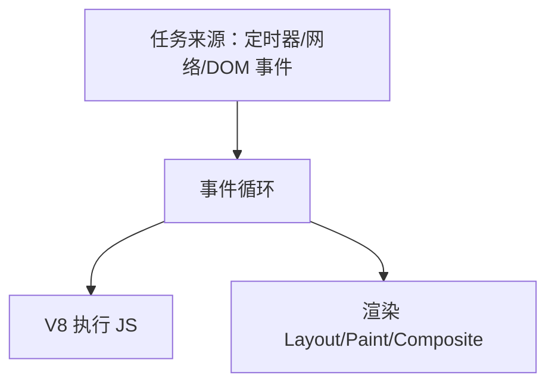
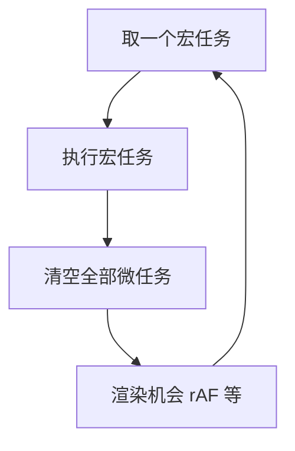
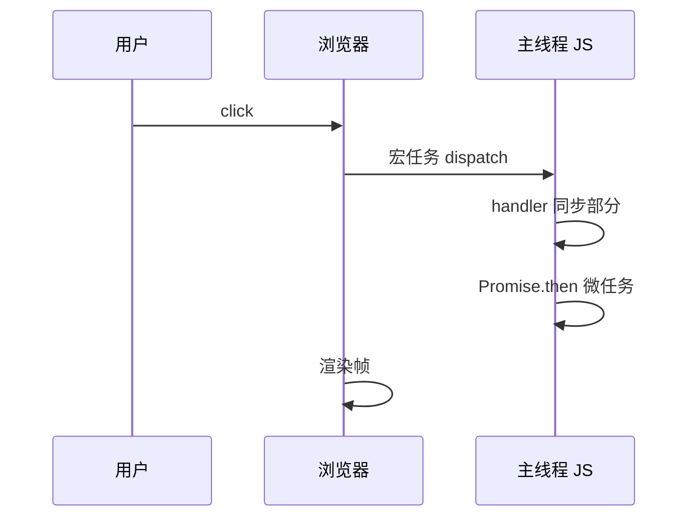

# JS 引擎与事件循环

Renderer **主线程**上，V8 执行 JavaScript 与 HTML/CSS 的布局绘制**互斥排队** — 同一时刻主线程要么在跑 JS，要么在跑渲染步骤（简化模型）。异步 I/O 靠浏览器宿主把完成回调排进任务队列；**宏任务 / 微任务 / 渲染帧** 的先后顺序，决定 `Promise.then` 与 `setTimeout` 谁先打印，也决定 `await` 之后 DOM 更新能否赶上下一帧。

---

## 主线程一轨多职



| 工作 | 所在线程 |
|------|----------|
| JS、DOM API、多数 Layout/Paint | 主线程 |
| 合成、部分栅格 | Compositor / Raster |
| 网络完成 | 回调入队主线程 |

`while (true) {}` 占满主线程时，不仅 JS 停住 — 用户输入、滚动绘制、定时器触发都会拖延，页面表现为「卡死」。

---

## 浏览器事件循环（简化模型）

每一轮循环大致：**取一个宏任务 → 执行 → 清空微任务队列 →（可能）渲染 → 下一宏任务**。



| 队列 | 例子 |
|------|------|
| 宏任务 | `setTimeout`/`setInterval`、I/O、`message`、UI `click` |
| 微任务 | `Promise.then`、`queueMicrotask`、`MutationObserver` |

```javascript
console.log(1);
setTimeout(() => console.log(2));
Promise.resolve().then(() => console.log(3));
console.log(4);
// 输出：1 4 3 2
```

微任务在当前宏任务**之后、下一宏任务之前**全部跑完；若微任务里再链微任务，会连续清空直到队列空，可能饿死宏任务与渲染。

---

## 与 Node 事件循环的差异

Node 没有「渲染帧」步骤；微任务清空时机按 **libuv 阶段** 划分，与浏览器不完全相同。

| 维度 | 浏览器 | Node |
|------|--------|------|
| 微任务 | 每个宏任务后清空 | 各阶段之间清空 |
| 渲染 | 有 rAF、样式/layout 时机 | 无 |
| `setImmediate` | 无 | 有，与 `setTimeout(0)` 顺序因版本/阶段而异 |

同一段 `Promise` + `setTimeout` 代码在两端打印顺序可能不同 — 同构库写调度逻辑时要分环境测试。

---

## requestAnimationFrame 与视觉更新

| API | 对齐对象 |
|-----|----------|
| `requestAnimationFrame` | 下一帧绘制前，通常 ~60Hz |
| `setTimeout(fn, 0)` | 宏任务，不保证与刷新率对齐 |

动画位移、逐帧读布局宜放 `rAF`；与 DOM 无关的重逻辑勿塞进 `rAF`，否则会占满帧预算。`rAF` 回调本身算宏任务的一种（在 HTML 规范里与渲染挂钩）。

---

## 长任务与主线程分流

Chrome 把 **>50ms** 的 JS 标为 Long Task，直接影响 INP（交互到下一帧延迟）。

| API | 用途 |
|-----|------|
| `scheduler.postTask` | 带优先级的任务调度（渐进支持） |
| `requestIdleCallback` | 空闲时做低优工作（兼容性有限） |
| Web Worker | CPU 密集计算移出主线程 |

Worker 不能碰 DOM：Worker 算完通过 `postMessage` 把结果交给主线程，再用 `rAF` 或微任务批量改 DOM。

---

## V8 与 async/await

`await` 之后的代码编译为 `Promise.then` 微任务。async 函数里未 catch 的 rejection 走 `unhandledrejection` 事件。

```javascript
async function demo() {
  console.log('A');
  await null;
  console.log('B'); // 微任务
}
demo();
console.log('C');
// A C B
```

V8 采用 Ignition 解释字节码 + TurboFan JIT 优化热点；`await` 挂起函数状态机，恢复时以微任务继续。Node 侧无渲染帧，事件循环按 libuv 阶段推进，微任务清空时机与浏览器略有差异。

---

## `MessageChannel` 与 `queueMicrotask`

除 `Promise` 外，`MessageChannel` 的 `port.postMessage` 也会排入微任务，用于 `React 18` 部分调度实现与跨上下文通信。

```javascript
const ch = new MessageChannel();
ch.port1.onmessage = () => console.log('microtask via port');
ch.port2.postMessage(null);
```

`queueMicrotask(fn)` 显式入队微任务，适合在同步代码末尾、下一宏任务前执行清理逻辑。

---

## `scheduler.yield` 与协作式调度

长循环可周期性 `await scheduler.yield()`（渐进支持）把主线程让给渲染与用户输入，避免整段同步计算饿死宏任务。不支持时可用 `setTimeout(0)` 分片，但粒度粗于 yield。

---

## Performance API 观测事件循环

| API | 用途 |
|-----|------|
| `performance.now()` | 高精度单调时钟 |
| `Long Animation Frames` | 长帧归因（新 API） |
| `PerformanceObserver` `longtask` | >50ms 任务 |

```javascript
new PerformanceObserver((list) => {
  for (const e of list.getEntries()) console.warn('long task', e.duration);
}).observe({ entryTypes: ['longtask'] });
```

---

## `visibilitychange` 与定时器节流

后台 tab 中 `setTimeout`/`setInterval` 最小间隔被节流（常 ≥1000ms），`requestAnimationFrame` 暂停 — 计时逻辑应监听 `visibilitychange` 校正，避免后台累积延迟后一次性爆发。

---

## 交互到渲染的完整链路

一次点击会经历：浏览器捕获事件 → 排入宏任务 → 执行监听器 → 可能触发微任务（Promise）→ 下一帧渲染。INP 度量的是**交互到下一帧绘制**的延迟，长同步监听器会直接拉高 INP。



`preventDefault` 在 passive 监听器里无效；滚动相关监听宜 `{ passive: true }`，避免阻塞 Compositor 已开始的滚动。

---

## 经典面试题：完整输出顺序

```javascript
console.log('script start');
setTimeout(() => console.log('setTimeout'), 0);
Promise.resolve()
  .then(() => console.log('promise1'))
  .then(() => console.log('promise2'));
console.log('script end');
// script start → script end → promise1 → promise2 → setTimeout
```

若在第一层 `.then` 里再 `Promise.resolve().then(...)`，仍在本轮微任务队列清空阶段执行，不会等到下一个宏任务。

---

## V8 执行管线与隐藏类

V8 把 JS 编译为字节码（Ignition），热点函数再由 TurboFan JIT 优化为机器码。对象属性访问依赖 **Hidden Class（Map）** — 动态增删属性会导致 Map 迁移，优化退化为慢路径。

| 阶段 | 说明 |
|------|------|
| Parse | 源码 → AST |
| Ignition | AST → 字节码，快速启动 |
| TurboFan | 热点函数 → 优化机器码 |
| Deopt | 类型假设失败时回退字节码 |

```javascript
// 稳定形状利于优化
function Point(x, y) {
  this.x = x;
  this.y = y;
}
// 避免：delete p.x 或随意增删属性
```

`eval`、with、某些 `try/catch` 模式会阻碍优化；生产 bundle 应减少动态属性名写入。

---

## 垃圾回收与主线程停顿

V8 采用分代 GC：**新生代** Scavenge 快、**老生代** Mark-Sweep / Mark-Compact 可能产生 **GC 长停顿**，与 Long Task 一样拖慢 INP。

| 信号 | 含义 |
|------|------|
| 堆持续增长 | 闭包/全局 Map 泄漏 |
| 周期性卡顿 | 老生代 GC |
| DevTools Memory 锯齿 | 正常分配/回收 |

减少 GC 压力：复用对象池、避免在热路径创建大量临时字符串/数组、大列表虚拟滚动减 DOM 节点。`WeakMap` 适合挂 metadata 而不阻止键对象被回收。

---

## `AbortSignal` 与可取消异步

`fetch(..., { signal })` 与 `addEventListener('abort')` 把 I/O 完成回调与宏任务关联；abort 后 Promise reject，不再入队后续微任务链 — 组件卸载时应 abort 未决请求，避免 setState on unmounted。

```javascript
const ctrl = new AbortController();
fetch('/api', { signal: ctrl.signal });
// 路由离开时：ctrl.abort();
```

---

## `IntersectionObserver` 与宏任务

`IntersectionObserver` 回调在**宏任务**中触发，晚于同帧微任务 — 懒加载图片时勿假设 `then` 与 IO 回调同一轮执行。

| API | 队列 |
|-----|------|
| `Promise.then` | 微任务 |
| `MutationObserver` | 微任务 |
| `setTimeout` | 宏任务 |
| `IntersectionObserver` | 宏任务 |

INP 优化中，click handler 里应用 `startTransition` 或拆分长同步段，让浏览器在下一帧前有机会处理绘制。

---

## 小结

浏览器在主线程用事件循环调度宏/微任务，并在轮次间插入渲染机会；V8 与 DOM 共享该线程。保持 60fps 与低 INP 靠减长任务、正确用微任务、Worker 分流计算。

**易混点**：微任务过多会推迟宏任务与绘制；`Promise` 构造函数里同步部分立即执行；`click` 处理器里 `await` 之后的代码可能让出到下一事件循环；GC 停顿与 Long Task 在 Performance 面板表现类似但成因不同。

核对：`async/await` 与 `.then` 在微任务顺序上是否等价？Node 为何没有 `requestAnimationFrame`？V8 隐藏类迁移由什么操作触发？
