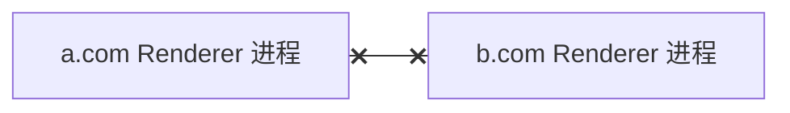
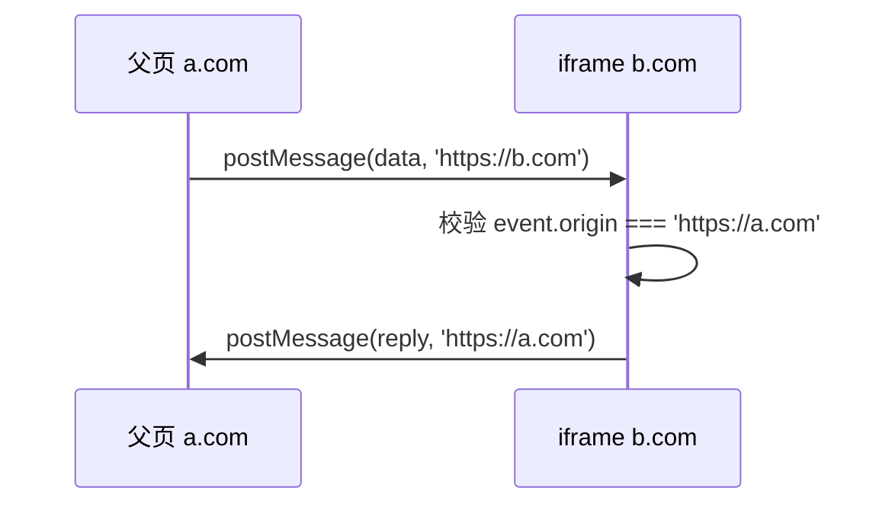
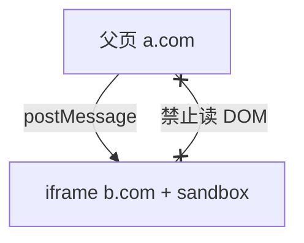

# 安全模型

Web 安全的第一道闸是**同源策略（SOP）**：限制不同源文档之间的 DOM、存储、部分 API 的互读。之上还有 **Site Isolation**（进程级隔离）、**CORS**（受控放宽读响应）、**CSP**（限制脚本来源）、权限策略等。先弄清浏览器**默认拒绝什么**，再在应用层补输入校验与响应头配置。

---

## 同源策略（SOP）

**源（origin）** = 协议 + 主机 + 端口。同源页面共享 `localStorage`、可互访 DOM；跨源则默认隔离。

```javascript
// 在 https://a.com 页面中
fetch('https://b.com/api');       // 请求能发，读 body 受 CORS 约束
iframe.contentDocument;           // 跨源 iframe → null
localStorage.getItem('k');        // 仅 a.com 的数据
```

| 项 | 同源要求 |
|----|----------|
| 协议 | `https` 与 `http` 不同源 |
| 主机 | `a.com` 与 `b.com` 不同源 |
| 端口 | `:443` 与 `:8080` 不同源（显式端口参与比较） |

SOP 主要防**读**：恶意页嵌入银行 iframe 后读不到里面 DOM。发请求通常允许，能否**读响应**由 CORS 或服务端决定。

---

## 站点（Site）与 eTLD+1

| 概念 | 例子 |
|------|------|
| Origin | `https://app.example.com:443` |
| Site (eTLD+1) | `example.com` |
| 子域 Cookie | `Domain=.example.com` 被子域共享，扩大攻击面 |

`SameSite` Cookie 属性限制跨站请求是否附带 Cookie：`Strict` 最严，`Lax` 允许顶级导航 GET，`None` 需 `Secure` — 影响 OAuth 回调与深链。

---

## Site Isolation 与进程边界

Chromium 尽量让不同**站点**跑在不同 Renderer 进程，即使 iframe 嵌套也拆分，降低 Spectre 等侧信道读他站内存的风险。



| 机制 | 作用 |
|------|------|
| 跨进程 iframe | 地址空间隔离 |
| COOP / COEP | 交叉源隔离，解锁 `SharedArrayBuffer` 等 |
| CSP | 限制脚本/样式/连接来源 |

Site Isolation 是物理进程边界，同源策略是逻辑 API 边界，二者互补。

---

## 权限与特性策略

敏感能力默认拒绝，需用户手势或持久权限。

| API | 典型门槛 |
|-----|----------|
| 地理位置、摄像头、麦克风 | 权限提示 |
| 剪贴板读写 | 手势或 Permissions API |
| 自动播放音视频 | 常需用户交互后 |

`Permissions-Policy`（HTTP 头）可禁止 iframe 内使用全屏、USB 等特性，即使子页面 JS 调用也会被拒。

---

## 与 XSS 的分层

| 层次 | 浏览器机制 | 应用层实践 |
|------|------------|------------|
| 威胁模型 | 跨源不能读对方 DOM | 同源下注入脚本为害 |
| 手段 | SOP、Site Isolation | 转义、CSP、DOMPurify |
| 失效场景 | 误配 CORS 过宽 | 未过滤的 `innerHTML` |

XSS 让攻击者脚本在**受害站点源**下执行 — 同源策略挡不住，因为脚本已被视为「本站代码」。要靠输入消毒与 CSP `script-src`。

---

## CORS 与 CSRF（机制视角）

| | CORS | CSRF |
|---|------|------|
| 攻击目标 | 恶意页**读**跨站 API 响应 | 恶意页**触发**受害者已登录的请求 |
| 浏览器行为 | 预检、`Access-Control-*` | Cookie 可能自动附带 |
| 防御方向 | 服务端精确配置 ACAO | `SameSite`、CSRF Token、校验 `Origin` |

CORS 是服务端**允许**哪些跨源读响应；不设 CORS 时浏览器挡的是 JS 读 body，不是挡请求发出。

---

## 混合内容与 HTTPS

| 类型 | 行为 |
|------|------|
| 主动混合 | HTTPS 页加载 HTTP 脚本 — 常被阻止 |
| 被动混合 | HTTP 图片/音视频 — 警告或阻止 |

HSTS（`Strict-Transport-Security`）强制后续访问走 HTTPS，减 sslstrip 降级攻击。

---

## 交叉源隔离扩展头

| 头 | 作用 |
|----|------|
| `Cross-Origin-Opener-Policy: same-origin` | 隔离 `window.opener`，防 tab 间引用 |
| `Cross-Origin-Embedder-Policy: require-corp` | 要求嵌入资源带 CORP 或同源 |
| `Cross-Origin-Resource-Policy` | 声明谁可嵌入此资源 |

需要 `SharedArrayBuffer` 或高精度计时器时，常同时配 COOP + COEP。本地 `http://localhost` 调试与生产 HTTPS 行为可能有别，以实际浏览器策略为准。

---

## postMessage 跨源通信

跨源 iframe 不能读 DOM，但可用 `window.postMessage` 传结构化克隆数据；接收方必须校验 `event.origin`，勿把未过滤的数据写进 `innerHTML`。



| 要点 | 说明 |
|------|------|
| targetOrigin | 发送时指定目标源，`*` 慎用 |
| 校验 origin | 接收时白名单比对 |
| 与 CORS | postMessage 不走 CORS，是独立通道 |

OAuth 弹窗、第三方登录 widget、微前端子应用常用此 API；配合 CSP `frame-ancestors` 限制谁能嵌入页面。

---

## CSP 内容安全策略

CSP 通过 HTTP 头或 `<meta http-equiv>` 声明白名单，限制脚本、样式、连接、框架嵌入等来源。

```http
Content-Security-Policy: default-src 'self'; script-src 'self' https://cdn.example.com; object-src 'none'
```

| 指令 | 作用 |
|------|------|
| `script-src` | 限制 JS 来源，可禁 `eval` |
| `style-src` | 限制 CSS，inline 需 nonce/hash |
| `connect-src` | 限制 `fetch`/XHR/WebSocket |
| `frame-ancestors` | 谁可 iframe 本页（替代部分 X-Frame-Options） |

违规时浏览器上报 `report-uri` / `report-to`。开发环境 Vite HMR 常需放宽 `connect-src` 到 `ws://localhost`。

---

## 存储分区（Storage Partitioning）

第三方 iframe 嵌入时，`localStorage`、IndexedDB、Cache API 按**顶级站点**分区 — `https://tracker.com` 在 `a.com` 与 `b.com` 下各有一份隔离存储，减跨站追踪。

| API | 分区键（概念） |
|-----|----------------|
| Cookie | 已有 `SameSite` + 逐步 CHIPS 分区 |
| localStorage | top-level site |
| Service Worker | 注册域 + 分区策略 |

---

## Trusted Types

```javascript
// 策略要求 DOM XSS sink 只接受 TrustedHTML
const policy = trustedTypes.createPolicy('default', {
  createHTML: (s) => DOMPurify.sanitize(s),
});
el.innerHTML = policy.createHTML(userInput);
```

启用 `require-trusted-types-for 'script'` 后，直接把字符串赋给 `innerHTML` 会抛错 — 强制经策略函数消毒，与 CSP 叠加使用。

---

## `Referrer-Policy` 与信息泄露

```http
Referrer-Policy: strict-origin-when-cross-origin
```

控制跨站请求是否携带完整 URL 路径 — 避免把带 token 的 query 泄露给第三方 CDN。与 `noopener noreferrer` 打开新窗口配合使用。

---

## `X-Content-Type-Options: nosniff`

阻止浏览器把 `text/plain` 响应当脚本执行（MIME 嗅探攻击），上传文件服务应配合正确 `Content-Type`。

---

## iframe sandbox 与跨源嵌入

`sandbox` 属性在不改源的情况下进一步限制 iframe 内文档能力；与 SOP 叠加使用。

```html
<iframe src="https://partner.example/embed"
  sandbox="allow-scripts allow-same-origin"></iframe>
```

| 令牌 | 效果 |
|------|------|
| （空 sandbox） | 最严：禁脚本、表单、弹窗、同源 |
| `allow-scripts` | 允许 JS |
| `allow-same-origin` | 保留同源 API（与空 sandbox 组合时仍受限） |
| `allow-popups` | 允许 `window.open` |
| `allow-top-navigation` | 允许改 top.location |

未加 `allow-same-origin` 时 iframe 内文档处于**唯一源（opaque origin）**，无法读写父页 Cookie/localStorage。支付、广告、第三方 widget 常用 sandbox 减攻击面。

`X-Frame-Options: DENY` 与 CSP `frame-ancestors 'none'` 从**被嵌页面**侧拒绝被 iframe — 与 sandbox 方向相反，二者配合可防点击劫持。



---

## 子资源完整性（SRI）与 CSP 联动

跨域 `<script src>` 若带 `integrity`，浏览器在 execute 前校验哈希；与 CSP `script-src` 白名单互补 — CSP 限域名，SRI 限**内容**未被 CDN 篡改。

| 配置 | 防什么 |
|------|--------|
| CSP `script-src 'self'` | 非白名单域脚本 |
| SRI sha384 | 同域 CDN 文件被替换 |
| 两者同时 | 域名 + 内容双保险 |

开发环境 HMR 脚本 hash 常变，SRI 仅适合生产静态资源。

---

## `Cross-Origin-Opener-Policy` 实战

COOP 把打开者与 `window.opener` 隔离，防止跨站页面通过 `opener` 引用导航受害 tab。

```http
Cross-Origin-Opener-Policy: same-origin
Cross-Origin-Embedder-Policy: require-corp
```

| 组合 | 效果 |
|------|------|
| 仅 COOP | 新窗口无 `opener` 引用 |
| COOP + COEP | 交叉源隔离，可启用 `SharedArrayBuffer` |
| 第三方弹窗 OAuth | 需 `rel=noopener` 或 COOP 策略配合 |

`window.open(url, '_blank')` 默认在新浏览上下文；未加 `noopener` 时子页仍可能持有 `opener` — 宜显式 `noopener,noreferrer`。

---

## 小结

同源策略隔离文档与存储；Site Isolation 把边界推到进程；CORS、权限、CSP 分别放宽读、开放能力、收紧脚本。先弄清浏览器默认拒绝什么，再在应用层补输入校验与头配置。

**易混点**：SOP 不禁止跨域**发送**请求；CORS 管的是 JS **读**响应；`postMessage` 可跨源但必须校验 `event.origin`。

核对：`SameSite=Lax` 在什么导航场景仍会带 Cookie？Site Isolation 与同源策略解决的是否同一类威胁？
