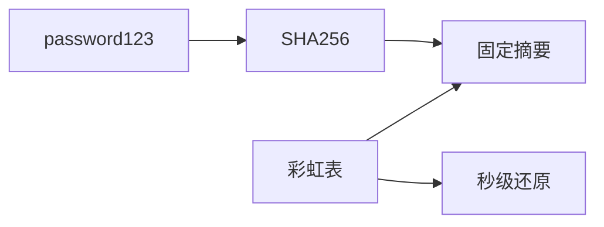
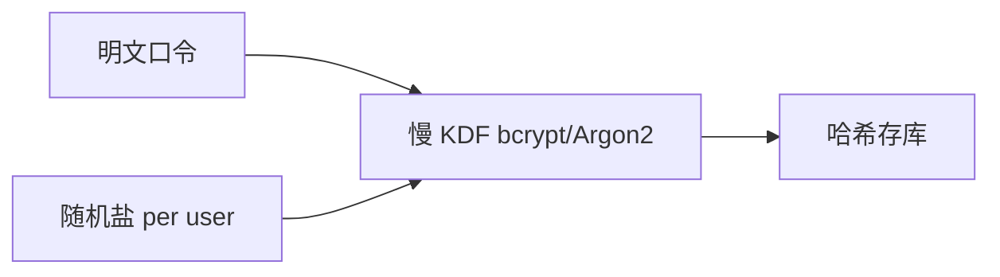
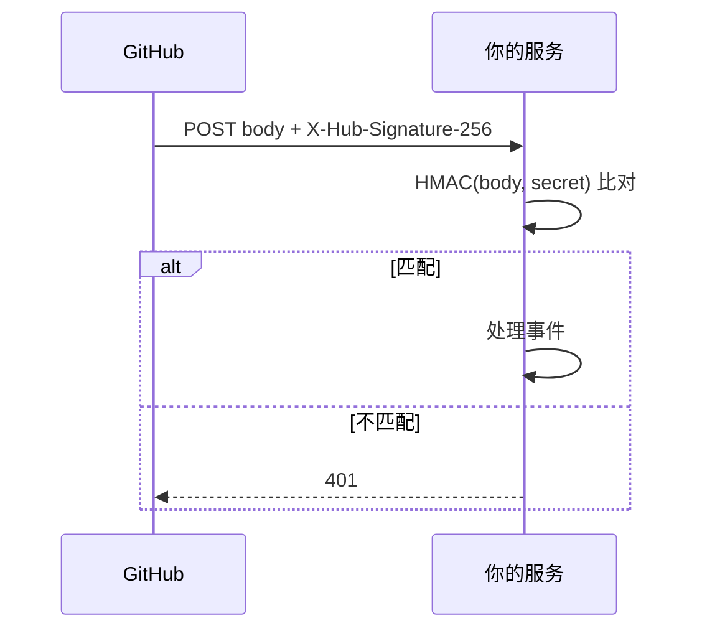
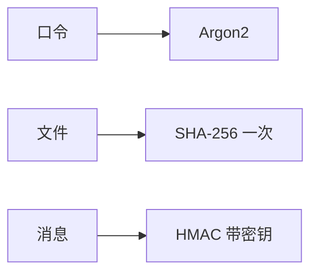

# 哈希、盐与 HMAC

**哈希**把任意长度输入映射为固定长度摘要，单向且抗碰撞；**盐**与 **HMAC** 分别解决「相同口令相同摘要」与「摘要被伪造」两类问题。理解三者，才能正确设计口令存储、签名 Cookie 与 API 鉴权。

---

## 哈希函数性质

| 性质 | 含义 | 违反后果 |
|------|------|----------|
| **单向性** | 难从摘要反推原文 | 口令库可被彩虹表还原 |
| **抗碰撞** | 难找两不同输入同摘要 | 伪造文件/证书 |
| **雪崩效应** | 输入微变输出大变 | 可预测性泄露结构 |

常见算法：

| 算法 | 状态 | 典型用途 |
|------|------|----------|
| **SHA-256** | 推荐 | 文件校验、区块链、KDF 输入 |
| **SHA-3** | 推荐 | 新标准场景 |
| **MD5 / SHA-1** | 已破 | 仅遗留系统，勿用于安全 |

```javascript
// Node crypto — 文件完整性（非口令存储）
import { createHash } from 'node:crypto';
const digest = createHash('sha256').update(buffer).digest('hex');
```

**易混点**：哈希 ≠ 加密 — 哈希不可逆、无密钥；加密可解密。

---

## 彩虹表与盐

裸哈希口令时，攻击者预计算「常见密码 → 摘要」表，拖库后批量反查：



| 做法 | 评价 |
|------|------|
| 裸 SHA256(密码) | ❌ 彩虹表秒破 |
| 固定盐 + SHA256 | ❌ 仍可批量预计算 |
| **bcrypt / scrypt / Argon2** + **每用户随机盐** | ✅ 业界标准 |



```plaintext
存储字段示例：{ algorithm: 'argon2id', salt, hash, params }
```

**pepper**（服务端全局秘密 + 盐）可再加一层：即使拖库无 pepper 仍难离线破解 — pepper 放 KMS/环境变量，不入库。

前端职责：HTTPS 传输、不在 localStorage 存明文口令；**哈希发生在服务端**。OAuth 场景口令可能不存在于业务库。

---

## HMAC：带密钥的消息认证

**HMAC** = Hash( (key ⊕ opad) || Hash( (key ⊕ ipad) || message ) ) — 用密钥参与哈希，防篡改且可验证来源。

| 对比 | 裸哈希 | HMAC |
|------|--------|------|
| 密钥 | 无 | 共享密钥 |
| 防篡改 | 任何人可重算 | 仅持钥方可验证 |
| 典型 | 文件 checksum | JWT HS256、Webhook 签名 |

```javascript
import { createHmac, timingSafeEqual } from 'node:crypto';

function sign(body, secret) {
  return createHmac('sha256', secret).update(body).digest('hex');
}

function verify(body, secret, sig) {
  const expected = Buffer.from(sign(body, secret), 'hex');
  const actual = Buffer.from(sig, 'hex');
  return expected.length === actual.length
    && timingSafeEqual(expected, actual);
}
```

**Webhook 场景**（GitHub/Stripe）：服务端用 `X-Signature` + HMAC 验请求体；比较摘要用 **timing-safe** 比较，避免时序侧信道。



---

## 与前端/全栈的衔接

| 场景 | 机制 |
|------|------|
| 登录口令 | 服务端 Argon2 + 盐 |
| Session ID / CSRF token | 随机 + HMAC 或加密存储 |
| 文件上传 ETag | 常基于内容哈希 |
| `Subresource Integrity` | 脚本 `integrity="sha384-..."` |
| API 签名 | HMAC-SHA256（云厂商 OpenAPI） |

```html
<!-- SRI：CDN 被篡改时浏览器拒绝执行 -->
<script src="https://cdn.example/app.js"
  integrity="sha384-..." crossorigin="anonymous"></script>
```

| 前端常见误区 | 正确做法 |
|--------------|----------|
| 客户端 `bcrypt` 后上传 | 仍须 HTTPS；哈希不能替代传输加密 |
| 用 MD5 做文件去重键 | 去重可用；安全校验用 SHA-256 |
| 把 HMAC secret 写进 bundle | secret 仅服务端；前端只做公开 hash 展示 |

---

## HMAC vs 数字签名（选型）

| | HMAC | 数字签名（RSA/ECDSA） |
|---|------|----------------------|
| 密钥 | 对称共享 | 非对称公私钥 |
| 验证方 | 需同一 secret | 只需公钥 |
| 适合 | 内部 Webhook、JWT HS256 | 跨服务 JWT RS256、对外 API |

多服务验签时 HS256 的 secret 分发是负担 — RS256 用 JWKS 公开公钥，各服务独立验签无需共享对称密钥。

---

## PBKDF2 与迭代成本

| KDF | 特点 |
|-----|------|
| PBKDF2 | 标准广泛，迭代次数可配 |
| bcrypt | 内置盐，成本因子 2^n |
| Argon2 | 内存硬，抗 GPU/ASIC |

```javascript
import { scrypt, randomBytes } from 'node:crypto';
const salt = randomBytes(16);
scrypt('password', salt, 64, { N: 16384 }, (err, key) => { /* ... */ });
```

口令策略还应配合速率限制、MFA，单靠哈希无法防在线撞库。

---

## 长度扩展攻击与 HMAC 选型

**MD5/SHA-256 裸哈希**在知道 `Hash(secret||message)` 结构时，可能被**长度扩展**伪造新消息摘要 — 因此「API Key + SHA256」拼接签名不安全。

| 构造 | 长度扩展风险 |
|------|--------------|
| `SHA256(secret + body)` | ❌ 可被扩展 |
| **HMAC-SHA256** | ✅ 设计免疫 |
| SHA-256 直接签文件 | 无 secret 前缀时无关 |

Webhook 与 OpenAPI 签名应使用 HMAC 或 RSA 签名，勿自造 `hash(key + data)`。

---

## 碰撞与用途边界

| 威胁 | 目标 | SHA-256 现状 |
|------|------|--------------|
| 原像攻击 | 给定摘要找输入 | 安全 |
| 碰撞攻击 | 找两输入同摘要 | 安全 |
| MD5 碰撞 | 伪造同摘要不同文件 | 已实用 |

文件去重、Git object id 用 SHA-256 足够；**数字签名**应对摘要做签名而非裸存哈希。口令存储关注的是**慢 KDF**，与文件 checksum 威胁模型不同。



---

## 迭代次数与成本因子配置

Argon2 / bcrypt 的**成本参数**应随硬件算力上调 — OWASP 建议 Argon2id 按内存与迭代平衡，bcrypt cost factor 常用 10–12（约 2^cost 轮）。

| 参数 | 作用 |
|------|------|
| Argon2 `memoryCost` | 增 GPU 并行破解成本 |
| bcrypt `rounds` | 指数增加单次验证时间 |
| PBKDF2 `iterations` | 线性增时，无内存硬 |

验证口令时恒定时间比较 digest，失败路径与成功路径耗时应接近，减时序侧信道。在线登录另加 CAPTCHA、账户锁定，与 KDF 互补。

---

## 文件指纹与内容寻址

Git object、npm integrity、Docker layer 均用**内容哈希**作 id — 改一字节 id 即变，便于去重与校验。

```javascript
import { createHash } from 'node:crypto';
const id = createHash('sha1').update(content).digest('hex'); // Git 仍用 sha1 对象 id
```

内容寻址不保证**真实性**（攻击者可构造碰撞对 MD5/sha1）— 安全场景用 SHA-256 并配合签名。前端上传前算 hash 可做客户端秒传 dedup，但服务端仍须独立校验。

`Subresource Integrity` 属性值是 **base64 编码的 digest**，算法前缀须与 CDN 文件一致（`sha384-` / `sha512-`）。构建流水线可在发布时自动注入 integrity，避免手工维护 hash 过期。

Webhook 验签失败应返回 **401** 且日志记录 body 长度与来源 IP，勿在错误响应里回显期望签名 — 避免帮攻击者调试。密钥轮换时保留旧 secret 短暂双验，防止部署窗口丢事件。

| 存储口令字段 | 应含内容 |
|--------------|----------|
| 推荐 | algorithm + salt + hash + params |
| 禁止 | 明文、裸 MD5、无盐 SHA256 |

拖库后攻击者离线尝试口令 — 慢 KDF 把单次验证从纳秒拉到毫秒级，使大规模暴力不可行。pepper 丢失则整库口令需强制重置，因其不入库无法逐用户恢复。

---

## 小结

哈希提供单向摘要；口令必须 **慢 KDF + per-user 盐**；HMAC 在哈希上加入密钥，用于消息认证与 Webhook 验签。MD5/SHA-1 勿用于新安全设计。

**易混点**：哈希不能「解密」；HMAC 需要密钥，与 SHA256(file) 校验和不同；bcrypt 输出已含盐，勿二次裸哈希。

pepper 与盐分工不同：盐 per-user 入库，pepper 全局仅存 KMS，二者叠加可增离线破解成本。

核对：为何相同密码两次 bcrypt 结果不同仍能通过登录？HMAC 与数字签名各适合什么场景？长度扩展攻击为何 `SHA256(secret+body)` 不安全而 HMAC 安全？
