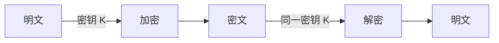
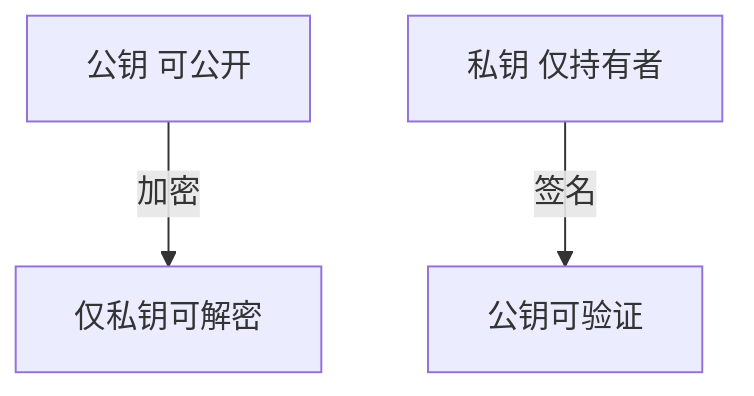
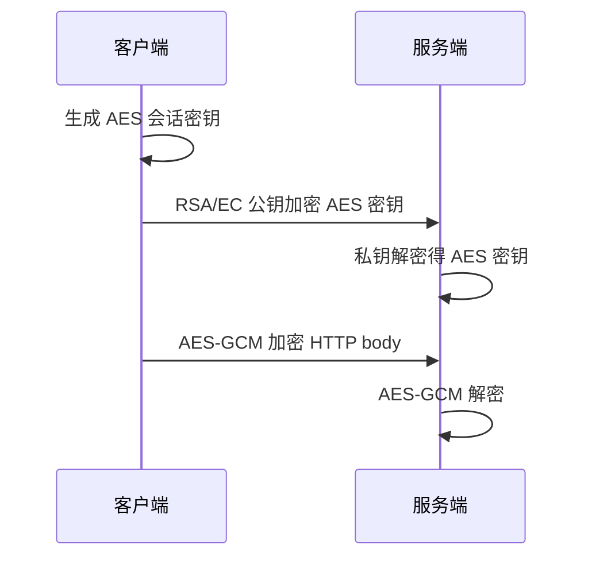

# 对称与非对称加密

**对称加密**用同一密钥加解密，速度快，适合 bulk 数据；**非对称加密**用公钥/私钥对，解决密钥分发与身份绑定，但计算贵。TLS、JWT、HTTPS 都是「非对称协商 + 对称传输」的组合。

---

## 对称加密



| 算法 | 模式 | 说明 |
|------|------|------|
| **AES-128/256** | **GCM**（AEAD） | TLS、磁盘加密首选 |
| ChaCha20-Poly1305 | AEAD | 移动端、无 AES 硬件时 |
| AES-CBC | 需独立 MAC | 遗留，新设计优先 GCM |

**AEAD**（Authenticated Encryption with Associated Data）同时提供机密性与完整性 — 篡改密文解密失败。

```javascript
import { randomBytes, createCipheriv, createDecipheriv } from 'node:crypto';

const key = randomBytes(32); // AES-256
const iv = randomBytes(12);  // GCM 推荐 12 字节

function encrypt(plaintext) {
  const cipher = createCipheriv('aes-256-gcm', key, iv);
  const enc = Buffer.concat([cipher.update(plaintext, 'utf8'), cipher.final()]);
  const tag = cipher.getAuthTag();
  return { iv, enc, tag };
}
```

**密钥管理难点**：N 方通信需 O(N²) 密钥或中心化 KMS；故 bulk 层几乎总在对称密钥已协商后使用。

---

## 非对称加密



| 体系 | 典型算法 | 用途 |
|------|----------|------|
| **RSA** | 2048+ bit | 证书、遗留 JWT RS256 |
| **ECC** | P-256, Curve25519 | TLS、现代 JWT ES256 |
| **ElGamal** | — | 教学；实践少见 |

| 操作 | 谁持有 | 效果 |
|------|--------|------|
| 公钥加密 | 发送方用接收方公钥 | 仅接收方私钥可读 |
| 私钥签名 | 发送方用自己私钥 | 任何人用公钥验身份 |

RSA 加密慢、密文膨胀 — **几乎不**用 RSA 直接加密大 JSON；常见模式：**RSA/ECDH 包裹对称密钥**，再用 AES 传数据。

---

## 组合模式（Hybrid）



```plaintext
1. 客户端生成随机 AES 密钥（或 ECDHE 协商）
2. 用服务器 RSA/EC 公钥加密 AES 密钥（或 DH 交换）
3. 双方用 AES-GCM 传 HTTP body
```

这正是 TLS 记录层思路：握手阶段协商对称密钥，记录层用 AEAD 加密 HTTP 载荷。

---

## 前端/全栈选型

| 场景 | 推荐 |
|------|------|
| 本地敏感字段（小） | Web Crypto `subtle.encrypt` AES-GCM |
| 服务端存储 PII | 信封加密：DEK 加密数据，KEK 在 KMS 包 DEK |
| JWT 签名 | RS256/ES256（公钥验签）优于 HS256（共享密钥泄露=伪造） |
| 浏览器 ↔ 服务端 | **HTTPS/TLS**，勿自造 RSA+AES 协议 |

```javascript
// Web Crypto — 浏览器侧小 payload 加密
async function encryptAesGcm(key, plaintext) {
  const iv = crypto.getRandomValues(new Uint8Array(12));
  const enc = await crypto.subtle.encrypt(
    { name: 'AES-GCM', iv },
    key,
    new TextEncoder().encode(plaintext)
  );
  return { iv, ciphertext: enc };
}
```

**反模式**：前端硬编码 AES 密钥；用 RSA 加密整段 upload；ECB 模式；无认证的 CBC。

---

## 密钥长度与性能（选型参考）

| 算法 | 推荐参数 | 相对速度 |
|------|----------|----------|
| AES-256-GCM | 32 字节 key | 极快（硬件 AES-NI） |
| ChaCha20-Poly1305 | 32 字节 key | 无 AES 指令时更快 |
| RSA-2048 | 模长 2048 bit | 签名/验签 ms 级 |
| ECDSA P-256 | 256 bit 曲线 | 比 RSA 短密钥同安全 |

```plaintext
1 MB 文件：AES-GCM 加密 ≈ 毫秒级（CPU）
同文件 RSA 公钥加密：不可行（长度限制 + 慢数百倍）
```

Web Crypto API 在浏览器侧同样仅适合**小 payload** 或密钥封装；大文件走 TLS 通道传输，勿在 JS 里逐块 RSA。

---

## 「加密+CBC+HMAC」vs AEAD

| 组合 | 风险 |
|------|------|
| AES-CBC + HMAC | 顺序错（先 MAC 后解密 vs 反之）→  padding oracle 类漏洞 |
| **AES-GCM** | 单 API 同时机密性+完整性，TLS 1.3 强制 AEAD |

旧系统维护 CBC 时须严格遵循 **Encrypt-then-MAC**；新设计直接 GCM/ChaCha20-Poly1305。

---

## ECDHE 与前向安全

静态 RSA 密钥交换若长期私钥日后泄露，历史密文可被解密。**ECDHE** 每次握手生成临时密钥对，会话密钥不依赖用 RSA 直接加密传递 — 实现**前向安全（PFS）**。

| 模式 | PFS |
|------|-----|
| RSA key transport | 否 |
| ECDHE | 是 |

---

## JWE 与 JWS

| 格式 | 作用 |
|------|------|
| JWS | 签名，防篡改，payload 可读 |
| JWE | 加密，防窃听 |

多数 REST API 在 HTTPS 之上只做 JWS；敏感 claim 或离线存储才考虑 JWE。

---

## IV、Nonce 与密钥生命周期

AES-GCM 要求 **IV/nonce 在同一密钥下永不重复** — 重复会导致密文可被伪造（GCM 灾难性失败）。

| 规则 | 说明 |
|------|------|
| 随机 IV | 每次加密 `randomBytes(12)` |
| 计数器 IV | 设备内单调递增，防碰撞 |
| 密钥轮换 | 泄露或超量使用后换新 key |

```javascript
// 解密时必须校验 auth tag
function decrypt({ iv, enc, tag }) {
  const decipher = createDecipheriv('aes-256-gcm', key, iv);
  decipher.setAuthTag(tag);
  return Buffer.concat([decipher.update(enc), decipher.final()]);
}
```

信封加密：数据用随机 **DEK**（数据密钥）加密，DEK 再用 KMS 中的 **KEK** 包裹 — 轮换 KEK 时只需重包 DEK，不必重加密全部用户数据。

---

## RSA 填充与「加密 vs 签名」

| 操作 | 填充 | 用途 |
|------|------|------|
| RSA 加密 | OAEP | 小 payload 密钥封装 |
| RSA 签名 | PSS | 摘要签名 |
| 裸 RSA PKCS#1 v1.5 加密 | 遗留 | 新设计避免 |

公钥加密解决「只有持有私钥者能读」；私钥签名解决「验证者确认签发者身份」— API 设计勿混用语义。

---

## Web Crypto 密钥导入导出

浏览器侧常用 **SPKI/PKCS8** 格式导入公钥/私钥，配合 `subtle.sign` / `subtle.verify` — 私钥不应硬编码在前端 bundle。

```javascript
const key = await crypto.subtle.importKey(
  'spki',
  spkiBuffer,
  { name: 'RSA-PSS', hash: 'SHA-256' },
  false,
  ['verify']
);
```

| 场景 | 密钥位置 |
|------|----------|
| 客户端验签公开 JWS | 公钥可内嵌或拉 JWKS |
| 客户端加密小字段 | 仅公钥，私钥在服务端 |
| 端到端聊天 | 各端持长期密钥对，不在服务器存明文 |

---

## 随机数与密钥生成

密码学安全随机数须用 **CSPRNG**（`crypto.randomBytes` / `getRandomValues`），勿用 `Math.random()` 生成密钥、IV、session id。

| 用途 | 推荐长度 |
|------|----------|
| AES-256 key | 32 字节 |
| GCM IV | 12 字节随机 |
| session token | ≥128 bit 随机 |

```javascript
const sessionId = randomBytes(32).toString('base64url');
```

密钥派生（HKDF、PBKDF2）把短口令或共享秘密拉伸为定长密钥 — TLS 与 JWE 均依赖 KDF，勿重复发明「多次 SHA256」。

---

## 小结

对称加密（AES-GCM）负责大量数据的机密性与完整性；非对称（RSA/ECC）解决密钥分发与签名。生产环境用成熟库与 TLS，勿手写混合加密协议。

**易混点**：公钥加密 ≠ 签名（数学相关但语义不同）；AES 密钥长度（128/256）与 RSA 模长（2048）不是同一量级概念；JWT 「加密」常指 JWE，多数 API 只做 JWS 签名。

核对：为何 TLS 握手用 ECDHE 而非 RSA 直接加密 HTTP body？AEAD 相对「加密+CBC+HMAC」少哪类错误？
