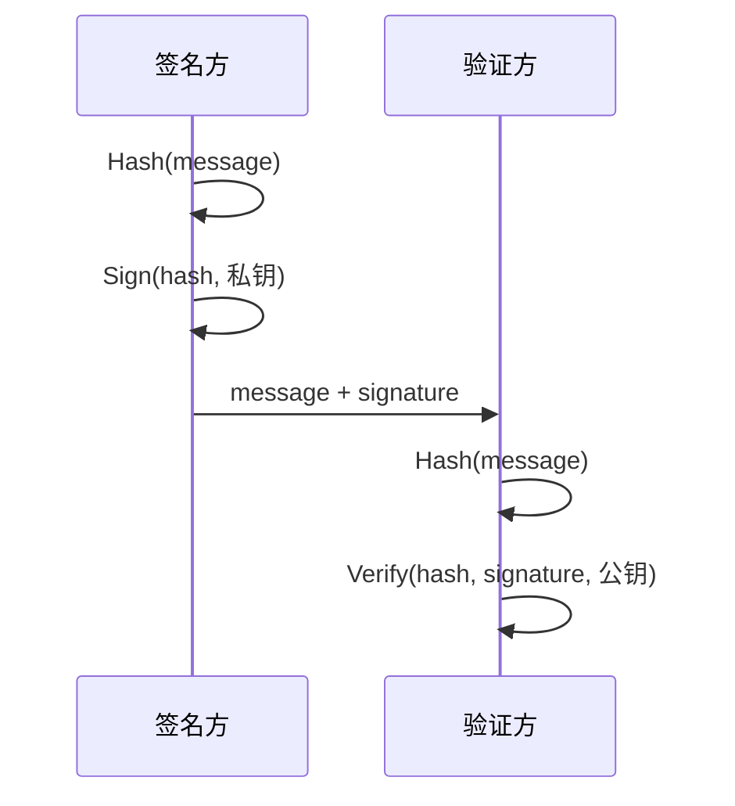
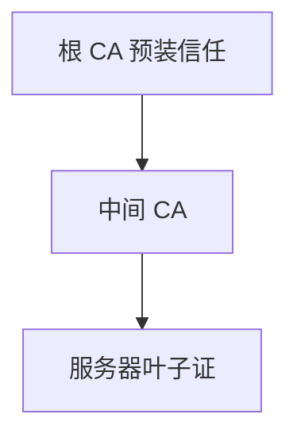
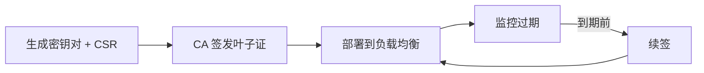

# 数字签名与证书链

**数字签名**用私钥对消息摘要签名、公钥验证 — 证明「谁签的」且「内容未被改」。**证书**把「公钥 ↔ 身份（域名/组织）」绑定并由 **CA** 背书，形成**信任链**到浏览器内置根。HTTPS 证书错误、JWT RS256 验签，都建立在此模型上。

---

## 数字签名流程



| 步骤 | 说明 |
|------|------|
| 摘要 | 对消息做 SHA-256（再签名），长消息可签 |
| 签名 | RSA-PSS / ECDSA 等对摘要运算 |
| 验证 | 公钥恢复或比对，失败即篡改或密钥错 |

与 HMAC 对比：

| | HMAC | 数字签名 |
|---|------|----------|
| 密钥 | 对称共享 | 非对称公私钥 |
| 验证方 | 需同一 secret | 只需公钥 |
| 不可否认 | 弱（双方知 secret） | 强（仅私钥持有者） |

```javascript
import { createSign, createVerify } from 'node:crypto';

const sign = createSign('RSA-SHA256');
sign.update('payload');
const signature = sign.sign(privateKey, 'base64');

const verify = createVerify('RSA-SHA256');
verify.update('payload');
verify.verify(publicKey, signature, 'base64'); // true/false
```

---

## X.509 证书内容

| 字段 | 含义 |
|------|------|
| **Subject** | CN/SAN 域名或组织 |
| **Subject Public Key Info** | 绑定的公钥 |
| **Issuer** | 签发 CA |
| **Validity** | 起止时间 |
| **Signature** | CA 对以上字段的签名 |

```plaintext
浏览器校验链：
叶子证(服务器) → 中间 CA → 根 CA（信任库）
+ 域名匹配 + 未过期 + 未吊销(OCSP/CRL)
```

---

## 证书链与信任模型



| 类型 | 验证深度 | 例子 |
|------|----------|------|
| **DV** | 域名控制权 | Let's Encrypt |
| **OV** | + 组织信息 | 企业站 |
| **EV** | 更严审核 | 地址栏曾显名（现弱化） |

**自签证书**：根即自己 — 开发用 `mkcert` 注入本地信任；生产客户端会报 `ERR_CERT_AUTHORITY_INVALID`。

```bash
# 本地开发 — mkcert 生成本地受信证书
mkcert -install
mkcert localhost 127.0.0.1 ::1
```

---

## JWT 验签：同一公钥体系

```mermaid
flowchart LR
  IdP[授权服务器 私钥签]
  JWKS[/.well-known/jwks.json 公钥]
  API[资源服务器 验签]
  IdP -->|id_token JWT| Client[前端/客户端]
  Client -->|Bearer token| API
  API --> JWKS
```

| 算法 | 密钥 | 分发 |
|------|------|------|
| **HS256** | 对称 secret | 所有验签方须持 secret |
| **RS256/ES256** | 私钥签 / 公钥验 | JWKS 公开，资源服务无需 secret |

```plaintext
OIDC 常见：IdP 用私钥签 id_token
API Gateway：拉取 /.well-known/jwks.json 缓存公钥
```

证书透明度（CT）、OCSP Stapling 减少吊销检查延迟 — 运维/DevOps 侧配置，前端需知「过期/链不全」的用户可见错误。

---

## 与前端/全栈实践

| 场景 | 机制 |
|------|------|
| HTTPS | 服务器叶子证 + 链 |
| **mTLS** | 客户端也持证书，双向验 |
| **JWT RS256/ES256** | 授权服务器私钥签，资源服务器 JWKS 公钥验 |
| **代码签名** | npm package、macOS 公证 |
| **PDF/合同** | 同签名模型 |

| DevTools 现象 | 可能原因 |
|---------------|----------|
| `NET::ERR_CERT_DATE_INVALID` | 证书过期或本机时钟错 |
| `ERR_CERT_COMMON_NAME_INVALID` | 域名与 SAN 不匹配 |
| `ERR_CERT_AUTHORITY_INVALID` | 自签或链不完整 |

---

## OCSP 与证书吊销

| 机制 | 说明 |
|------|------|
| CRL | 吊销列表，体积大 |
| OCSP | 在线查询单证状态 |
| OCSP Stapling | 服务器在 TLS 握手附带 OCSP 响应 |

私钥泄露后须吊销叶子证并重新签发 — Let's Encrypt 等短有效期（90 天）减暴露窗口。

---

## 中间 CA 的意义

根 CA 私钥离线保存，日常签发由**中间 CA** 完成 — 中间证泄露时吊销中间证即可，不必动浏览器内置根信任库。

---

## SAN 与域名匹配规则

现代浏览器以 **Subject Alternative Name（SAN）** 为准校验 HTTPS 域名；Common Name 仅作兼容。

| 证书 SAN | 访问 URL | 结果 |
|----------|----------|------|
| `api.example.com` | `https://api.example.com` | ✅ |
| `*.example.com` | `https://a.example.com` | ✅ |
| `*.example.com` | `https://example.com` | ❌ 根域不匹配 |
| 多 SAN 条目 | 任一匹配即可 | ✅ |

通配符只覆盖**一级**子域：`*.a.example.com` 不匹配 `b.a.example.com`。本地开发证书宜把 `localhost`、`127.0.0.1` 都写入 SAN。

---

## 证书生命周期与轮换



| 实践 | 原因 |
|------|------|
| 90 天短证（Let's Encrypt） | 减泄露窗口 |
| 自动化 ACME | 避免人工漏续 |
| 私钥不落盘仓库 | 泄露即伪造身份 |

续签时若密钥对不变，旧证吊销前仍有效 — 紧急吊销走 OCSP/CRL。多实例部署须同步新证，否则部分节点 SAN 过期导致间歇性 `ERR_CERT_DATE_INVALID`。

---

## 签名算法与摘要绑定

RSA-PSS / ECDSA 签名对象是**消息的哈希**而非全文 — 选错哈希（如 SHA-1）会削弱整体强度，即使签名算法本身仍新。

| 组合 | 状态 |
|------|------|
| RSA-SHA256 / ECDSA-SHA256 | 推荐 |
| RSA-SHA1 | 遗留，勿用于新证 |

JWT `alg` 头必须校验 — 禁止 `none` 算法与密钥混淆攻击（HS256 secret 被当作 RSA 公钥验签等）。

---

## 证书透明度（CT）与信任增强

**Certificate Transparency** 要求 CA 将签发记录写入公开日志，浏览器可检测「未公示的恶意证」。

| 机制 | 作用 |
|------|------|
| SCT（Signed Certificate Timestamp） | 证书记录已入 CT 日志 |
| 浏览器 CT 策略 | 缺 SCT 可能拒绝或警告 |
| 监控 CT 日志 | 发现冒名申请域名证 |

CT 不替代本地链校验 — 仍须验证 Issuer 签名与 SAN。短周期自动续签 + CT 可快速发现 mis-issuance。

---

## 私钥保护与 HSM

服务器私钥泄露等于可冒充域名或签发任意 JWT — 生产环境私钥宜放 **HSM / KMS**，应用只持临时会话密钥。

| 存储 | 风险 |
|------|------|
| 明文 PEM 在磁盘 | 拖库即伪造 |
| 环境变量 | 进程 dump 可读 |
| KMS 信封 | 审计 + 轮换 |

证书续签时**轮换密钥对**（而不仅是续期）可缩泄露窗口；客户端 JWKS 需缓存 `kid` 以支持多公钥并存过渡。

双向 TLS 场景下，客户端证书私钥同样不得进前端 bundle — 仅 mTLS 网关或 sidecar 持有。浏览器用户证书由 OS 证书库管理，与服务器叶子证校验链是不同方向的身份证明。

CRL 体积随吊销证数量增长，移动端首连可能跳过完整 CRL 而依赖 OCSP Stapling — 运维应监控 Stapling 配置是否过期，否则部分客户端回退在线 OCSP 增加握手延迟。

| 校验步骤 | 失败表现 |
|----------|----------|
| 链到信任根 | AUTHORITY_INVALID |
| SAN 匹配 | COMMON_NAME_INVALID |
| 未过期 | DATE_INVALID |

---

## 小结

数字签名绑定身份与完整性；X.509 证书由 CA 对「公钥+身份」签名；浏览器沿链校验到信任根。JWT 非对称验签是同一公钥体系的 API 层应用。

**易混点**：证书加密不加密 HTTP — 证书只证明身份并携带公钥；签名是对摘要而非全文直接 RSA；通配符 `*.a.com` 不匹配 `a.com` 根域（除非 SAN 显式包含）。

核对：中间 CA 存在的意义？JWT HS256 与 RS256 在「公钥分发」上有何差别？TLS 握手如何用证书绑定服务器身份？
