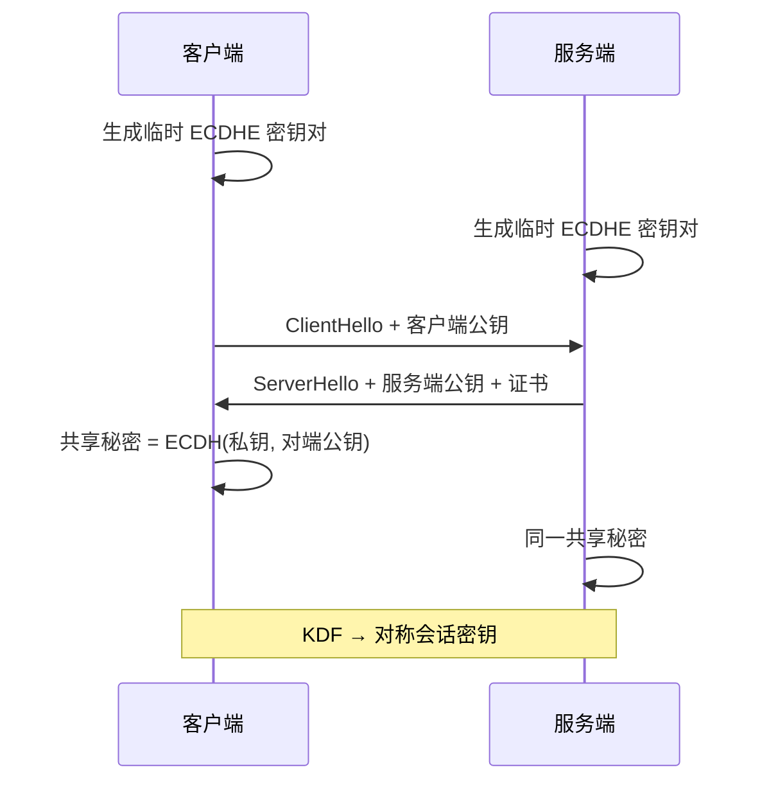
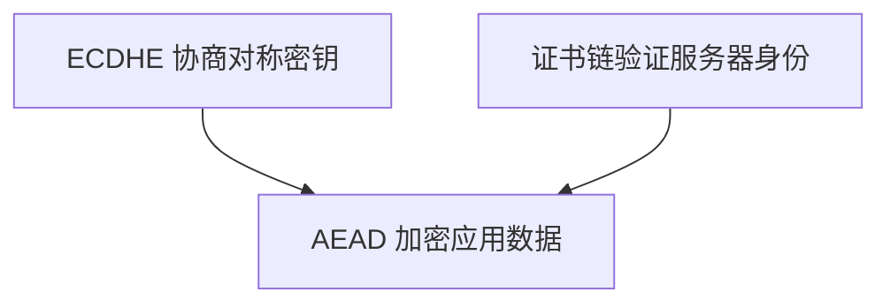
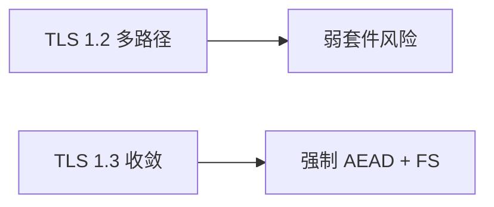
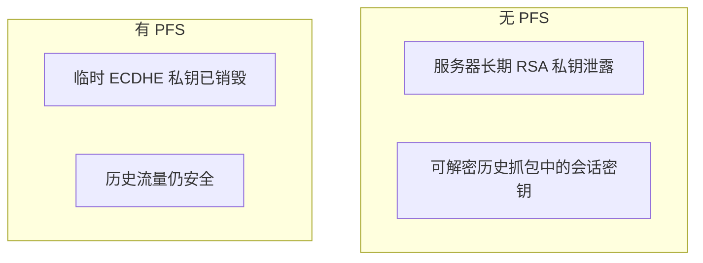
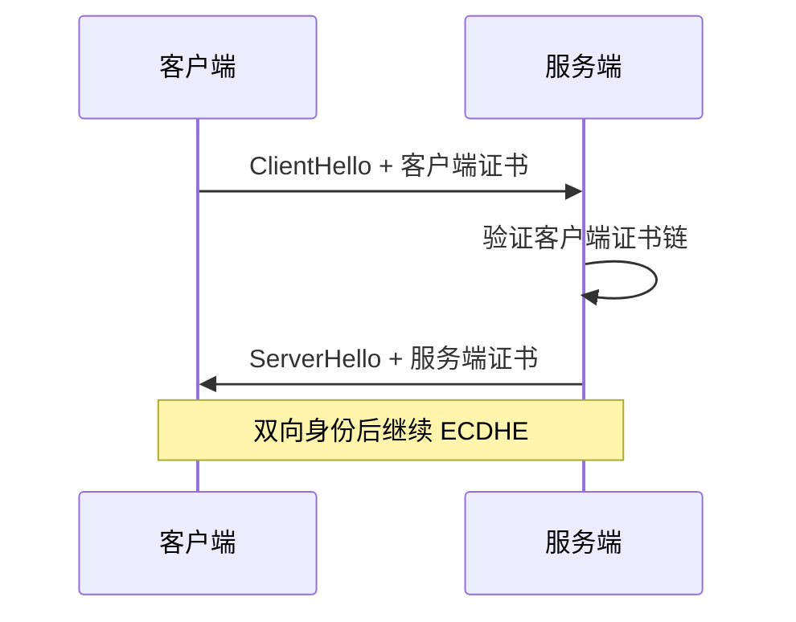

# 密钥交换与 TLS 原理层

TLS 在密码学层要完成三件事：**协商会话密钥**、**验证对端身份**、**用 AEAD 保护记录层**。ECDHE 提供**前向安全**；证书绑定服务器身份 — 本篇讲握手各阶段的密码学职责与选型依据。

---

## 密钥交换：为何不用 RSA 传 bulk 密钥



| 方式 | 前向安全 | 说明 |
|------|----------|------|
| RSA key transport（TLS1.2 旧） | ❌ 私钥泄露可解密历史抓包 | 已不推荐 |
| **ECDHE / DHE** | ✅ 临时密钥丢弃后无法还原 | TLS 1.3 主流 |
| PSK 复用 | 视模式 | 0-RTT 有重放讨论 |

**前向安全（PFS）**：即使日后服务器长期私钥泄露，过去会话仍不可解密 — 因会话密钥来自 **ephemeral** DH，不持久化。

---

## 从共享秘密到会话密钥

```plaintext
shared_secret = ECDH(client_ephemeral_priv, server_ephemeral_pub)
session_keys  = HKDF(shared_secret, client_random, server_random, ...)
→ client_write_key, server_write_key, IVs (TLS 1.3 简化)
```

| 组件 | 作用 |
|------|------|
| **HKDF** | 从短秘密扩展为多把密钥 |
| **Random** | 防重放、绑定握手上下文 |
| **Cipher suite** | 如 TLS_AES_128_GCM_SHA256 |

记录层之后 HTTP body 走 **AEAD**（AES-GCM / ChaCha20-Poly1305），同时提供机密性与完整性。

---

## 身份认证在握手中的位置



| TLS 版本 | 握手 RTT | 变化 |
|----------|----------|------|
| 1.2 | ~2 RTT | 多种密钥交换并存 |
| 1.3 | **1 RTT** | 加密更多握手消息；弱套件移除 |

客户端验证：

1. 证书链到信任根
2. 域名与 SNI 匹配
3. （可选）证书固定、CT 日志

**mTLS**：客户端也提交证书，服务端验证 — 服务网格、内部 API 常见。

---

## 与前端/Node 相关点

| 话题 | 原理层要点 |
|------|------------|
| `fetch` / axios | 底层 OS TLS 栈；`rejectUnauthorized: false` 关校验 = 放弃身份认证 |
| **SNI** | 虚拟主机选证；无 SNI 可能拿到默认错证 |
| **ALPN** | 握手中协商 h2 / http/1.1 |
| **Session ticket** | 复用 PSK，减后续握手 RTT |
| **0-RTT** | 早期数据；幂等 GET 可受益，POST 需防重放 |

```javascript
// Node — 勿在生产关闭校验
import https from 'node:https';
https.get('https://api.example.com', { rejectUnauthorized: true }, res => { /* ... */ });
```

企业代理 MITM：安装企业根 CA — 与恶意 MITM 不同，属于组织策略下的合法解密，用户设备须信任企业根。

---

## QUIC 中的 TLS 1.3

HTTP/3 把 TLS 1.3 集成进 QUIC 传输层，握手与连接建立合并，逻辑仍是 ECDHE + 证书 + AEAD — 报文封装与 TCP+TLS 不同，密码学目标一致。

---

## TLS 1.2 vs 1.3 密码学差异

| 项目 | TLS 1.2 | TLS 1.3 |
|------|---------|---------|
| 密钥交换 | RSA、DHE、ECDHE 并存 | 仅 (EC)DHE / PSK |
| 套件 | 含 CBC、RC4 等历史 | 仅 AEAD |
| 握手加密 | 证书明文 | EncryptedExtensions 等 |
| 0-RTT | 无 | 可选 PSK 早期数据 |



运维应禁用 SSLv3/TLS1.0/1.1 与 `RSA key exchange` 套件；Node `minVersion: 'TLSv1.2'` 并优先 1.3。

---

## 无前向安全时泄露哪把密钥？



| 泄露对象 | 无 PFS | 有 PFS |
|----------|--------|--------|
| 长期私钥 | 历史可解密 | 历史仍安全 |
| 临时 ECDHE 私钥 | — | 仅当前会话受影响 |

---

## SNI 与虚拟主机

```plaintext
ClientHello 含 SNI: api.example.com
→ 服务器选对应叶子证书（多域同 IP）
无 SNI：可能返回默认证 → ERR_CERT_COMMON_NAME_INVALID
```

Node 发请求时 SNI 通常自动；自签多域本地测时须显式指定 host。

---

## 会话恢复与 0-RTT 风险

**Session ticket** 或 **PSK** 让重复访客跳过完整握手，减 RTT。TLS 1.3 **0-RTT** 可在握手完成前发送应用数据 — 攻击者可**重放**早期请求，故非幂等写操作（POST 下单）应禁用 0-RTT 或做应用层防重放。

| 机制 | 收益 | 风险 |
|------|------|------|
| Session ticket | 复用会话密钥 | ticket 泄露可解密会话 |
| 0-RTT | 极低延迟 | 重放早期数据 |

---

## 证书固定（Pinning）

移动端 App 可内置预期公钥或 SPKI 哈希，拒绝非预期证书 — 防企业外恶意 MITM，但证书轮换时需同步发版。浏览器 Web 已弱化 HPKP，更多依赖 CT 与短证书周期。

---

## 握手失败排障清单

| 现象 | 检查项 |
|------|--------|
| `UNABLE_TO_VERIFY_LEAF_SIGNATURE` | 中间证未配置完整链 |
| `hostname mismatch` | SNI 与 SAN 不一致 |
| `ERR_SSL_VERSION_OR_CIPHER_MISMATCH` | 客户端/服务端协议版本不交集 |
| Node `DEPTH_ZERO_SELF_SIGNED` | 自签未加入信任库 |

```javascript
// 调试时可临时打开（勿上生产）
process.env.NODE_DEBUG = 'tls';
```

---

## 记录层分片与 AEAD nonce

TLS 记录层把应用数据切成 ≤16KB 片段，每片独立 AEAD 加密。**nonce 不可复用** — TLS 1.3 用序列号派生 per-record nonce，复用会导致密文可伪造。

| TLS 版本 | 记录保护 |
|----------|----------|
| 1.2 | 部分 CBC 历史套件 |
| 1.3 | 仅 AEAD |

---

## 客户端认证（mTLS）流程要点



服务网格 sidecar 常自动轮换客户端证书 — 前端浏览器场景少见，内部 BFF 调 API 网关常见。

---

## TLS 与应用层职责边界

| 层 | 保护什么 | 不保护什么 |
|----|----------|------------|
| TLS | 传输机密性、服务器身份 | 登录态伪造、业务越权 |
| HTTP | 语义、缓存 | 端到端业务加密 |
| 应用 | 鉴权、审计 | 物理窃听（无 TLS 时） |

`fetch` 看到 HTTPS 只说明**链路**安全；JWT 在 Authorization 头里仍是明文 JSON（仅 Base64），敏感 claim 需额外加密或放 HttpOnly Cookie。

---

## 降级攻击与协议指纹

攻击者若能篡改 ClientHello，可能强迫客户端与服务端协商 **TLS 1.0 / 弱套件 / RSA key transport** — 现代栈通过最低版本与 cipher 黑名单缓解。

| 防御 | 作用 |
|------|------|
| `minVersion: TLSv1.2` | 拒绝 SSLv3/TLS1.0/1.1 |
| 禁用 `TLS_RSA_*` 套件 | 强制 (EC)DHE |
| HSTS preload | 首次访问也走 HTTPS |

```plaintext
错误配置示例：服务器仍开启 TLS1.0 + CBC 套件
→ 中间人可强迫降级并尝试 BEAST/POODLE 类历史攻击
```

TLS 1.3 **EncryptedExtensions** 减少握手明文指纹，但 SNI 仍可见 — 敏感站点可用 ECH（Encrypted Client Hello，渐进部署）隐藏目标域名。

---

## 抓包与密钥材料边界

Wireshark 在持有**会话密钥 log**（浏览器 SSLKEYLOGFILE 或服务器 key log）时可解密 TLS 流量 — 这属于调试能力，不是协议缺陷。生产环境禁止开启 key log；泄露 log 等于泄露应用层 HTTP 明文。

| 材料 | 泄露后果 |
|------|----------|
| 会话 ticket | 可恢复部分会话 |
| 长期 RSA 私钥（无 PFS） | 历史密文可解密 |
| 临时 ECDHE 私钥 | 仅当前会话 |

---

## 小结

TLS 用 ECDHE 等达成带前向安全的共享秘密，经 KDF 派生 AEAD 会话密钥；证书链在握手阶段完成服务器身份绑定。理解分层后，HTTPS 排障可区分「DNS/TCP」「证书」「套件/协议版本」。

**易混点**：TLS 加密的是传输通道，不替代应用层 JWT/会话鉴权；ECDHE 的 E = ephemeral（临时），与证书里的长期 EC 公钥不是同一对；QUIC 把 TLS 1.3 集成进传输层，逻辑相同、报文不同。

核对：无前向安全时，泄露哪把密钥会危及历史流量？HKDF 输入除 shared_secret 外通常还有什么？握手完成后 HTTP 头是否仍明文？（TLS 1.3 起更多握手字段也加密。）
