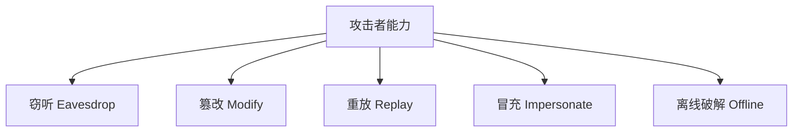
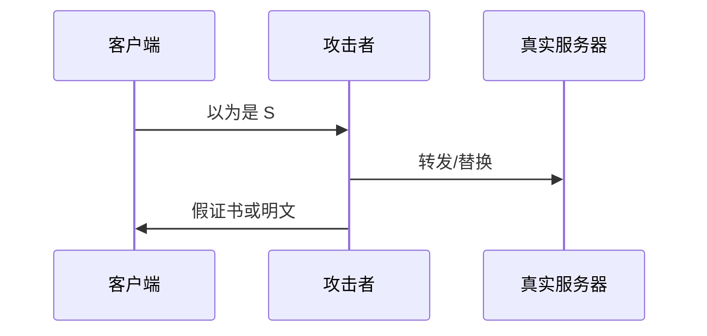
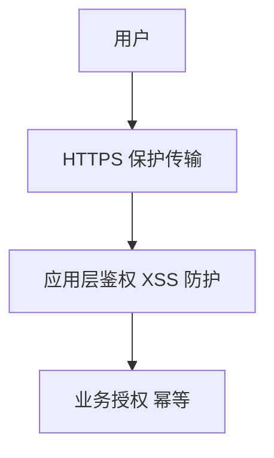
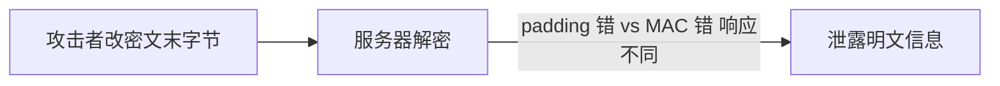
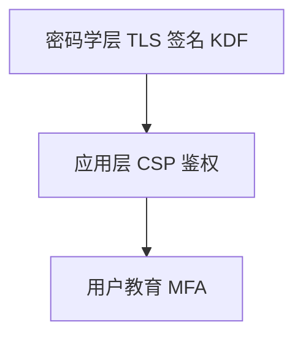

# 常见攻击模型

安全设计先选**威胁模型**：攻击者能看信道、改报文、还是运行恶意脚本？**密码学层**攻击（MITM、重放、降级）与**应用层**攻击（XSS、CSRF）解法不同 — 本篇建立通用攻击坐标，便于对照 TLS、签名与协议设计。

---

## 攻击者能力模型



| 能力 | 例子 | 典型防御 |
|------|------|----------|
| **窃听** | 同一 WiFi 抓包 | TLS、E2E 加密 |
| **篡改** | 改 HTTP body | MAC/AEAD、签名 |
| **重放** | 重发合法请求 | nonce、timestamp、幂等键 |
| **冒充** | 假服务器、假 JWT | 证书链、公钥验签 |
| **离线** | 拖库后暴力猜口令 | 慢 KDF + 盐 |

---

## 中间人（MITM）



| 场景 | 说明 |
|------|------|
| 无 TLS | 全明文，MITM 易 |
| 自签/错域证书 | 用户点「继续访问」则失败 |
| 企业代理 | 合法 MITM + 企业根 CA |
| **SSL stripping** | 降级 http，需 HSTS |

防御：**HTTPS + 证书校验 + HSTS**；敏感操作 **证书固定**（App 常见）。TLS 侧依赖 ECDHE 前向安全与 AEAD 记录层。

```plaintext
HSTS 响应头：Strict-Transport-Security: max-age=31536000; includeSubDomains
→ 浏览器强制 https，防 sslstrip 首次 http 劫持
```

---

## 重放与降级

| 攻击 | 机制 | 防御 |
|------|------|------|
| **重放** | 重复提交有效报文 | nonce、序列号、短期 token、幂等 ID |
| **降级** | 强迫旧协议/弱套件 | TLS 最低版本、客户端拒绝弱 cipher |
| **0-RTT 重放** | TLS1.3 早期数据 | 非幂等写操作禁用 0-RTT |

```javascript
// API 防重放示意 — 服务端校验
// headers: X-Timestamp, X-Nonce, X-Signature(HMAC)
// 拒绝 |now - ts| > 5min 或 nonce 已见
async function signedFetch(url, body, secret) {
  const ts = Date.now();
  const nonce = crypto.randomUUID();
  const sig = hmac(`${ts}.${nonce}.${body}`, secret);
  return fetch(url, {
    method: 'POST',
    headers: { 'X-Timestamp': ts, 'X-Nonce': nonce, 'X-Signature': sig },
    body,
  });
}
```

---

## 离线攻击与密钥泄露

| 资产泄露 | 影响 | 缓解 |
|----------|------|------|
| 口令哈希库 | 彩虹表/暴力 | Argon2、pepper、MFA |
| HMAC/JWT secret | 伪造 token | RS256、轮换 secret、短 TTL |
| TLS 长期私钥（无 PFS） | 解密历史 | ECDHE 前向安全 |
| 客户端硬编码密钥 | 逆向即得 | 密钥放服务端/KMS |

HMAC 验签时使用 **timing-safe** 比较防**在线**侧信道，不防离线拖库 — 口令须慢 KDF。

---

## 应用层 vs 密码学层（边界）

| 层 | 典型威胁 | 防御方向 |
|----|----------|----------|
| 密码学/传输 | MITM、重放、弱算法 | TLS、AEAD、证书 |
| 浏览器/应用 | XSS、CSRF、CSP | 转义、HttpOnly、SameSite |
| 业务逻辑 | 越权、刷单 | 授权模型、风控 |



```plaintext
HTTPS 只保护「路上」—  XSS 可在浏览器内读 DOM/LocalStorage
→ 敏感 token 优先 HttpOnly Cookie + SameSite
```

---

## Dolev-Yao 与实用模型

**Dolev-Yao 模型**：攻击者完全控制网络 — 可读、改、删、注入、重排报文。TLS 设计目标即在此模型下仍保证机密性与认证。

| 假设 | 设计含义 |
|------|----------|
| 攻击者不能破长期私钥（在 PFS 下历史仍安全） | 用 ECDHE |
| 攻击者不能伪造 CA 签名 | 证书链 + 信任根 |
| 攻击者不能猜出弱口令 | 慢 KDF，非协议层 |

真实世界还有：**供应链**（恶意 npm）、**内部人**、**物理接触** — 超出经典 Dolev-Yao，需代码签名、审计、HSM 等补充。

---

## STRIDE 速览（应用层补充）

| 威胁 | 例 | 前端相关防御 |
|------|-----|--------------|
| **S** 伪造 | 假 JWT | 验签、短 TTL |
| **T** 篡改 | 改请求体 | HTTPS + 签名 |
| **R** 否认 | 抵赖下单 | 服务端日志、审计 |
| **I** 信息泄露 | XSS 读 token | HttpOnly、CSP |
| **D** 拒绝服务 | 刷接口 | 限流、验证码 |
| **E** 权限提升 | 越权 IDOR | 服务端鉴权 |

密码学层不覆盖 **I/E** 的 XSS/越权 — 必须应用层补齐。

---

## 生日攻击与哈希输出长度

对 n 位哈希，生日攻击约需 2^(n/2) 次尝试找碰撞 — SHA-256 仍足够；MD5 128 位已不安全。选算法要看威胁是碰撞还是原像攻击。

---

## 供应链与依赖完整性

| 威胁 | 防御 |
|------|------|
| 恶意 npm 包 | lockfile、审计、最小依赖 |
| 篡改 CDN 脚本 | SRI `integrity` |
| 中间人替换下载 | HTTPS + 签名校验 |

---

## 时序侧信道与在线攻击

**时序攻击**：通过比较响应时间推断秘密（如 MAC 逐字节比对提前返回）。在线登录撞库也可利用「错误消息快慢」区分用户是否存在 — 应统一错误文案与恒定时间比较。

| 场景 | 缓解 |
|------|------|
| HMAC / MAC 比较 | `timingSafeEqual` |
| 口令验证 | 固定时间路径 + 速率限制 |
| 用户枚举 | 统一「用户名或密码错误」 |

```javascript
import { timingSafeEqual } from 'node:crypto';
function safeEq(a, b) {
  if (a.length !== b.length) return false;
  return timingSafeEqual(a, b);
}
```

时序攻击属于**在线**能力，与拖库后离线暴力破解不同 — 防御栈需分层。

---

## Padding Oracle 与 CBC 历史坑

TLS 1.2 时代部分 **AES-CBC + MAC-then-Encrypt** 实现若对 padding 错误与 MAC 错误返回不同状态，攻击者可逐字节解密 — 称 **Padding Oracle**。TLS 1.3 仅 AEAD，从协议层移除该类组合；维护遗留系统须禁用 CBC 或严格统一错误响应。



新设计统一使用 **AES-GCM / ChaCha20-Poly1305**，勿在新 API 中手写「AES-CBC + HMAC」除非完全理解 EtM/MtE 顺序。

---

## 会话固定与令牌窃取

| 攻击 | 机制 | 防御 |
|------|------|------|
| **会话固定** | 诱受害者使用攻击者已知 session id | 登录后轮换 session |
| **Token 窃取（XSS）** | 脚本读 localStorage | HttpOnly Cookie |
| **Token 重放** | 截获 Bearer 重复使用 | 短 TTL + 绑定设备指纹（弱） |

HTTPS 保护传输，但不防浏览器内恶意脚本 — 敏感凭证存储位置与 CSP 同等重要。

---

## 暴力破解与速率限制

| 攻击面 | 在线 | 离线 |
|--------|------|------|
| 登录口令 | 撞库 + 速率限制 | 拖库 + Argon2 |
| API Key | 扫描 + WAF | 源码泄露 |
| JWT | 暴力猜 secret（HS256） | 无 |

```plaintext
防御组合：慢 KDF + MFA + IP/账户速率限制 + 异常登录告警
```

离线场景无法依赖「封 IP」— 必须在存储层使用足够成本的 KDF 与唯一盐。

---

## 社会工程与威胁模型外沿

| 威胁 | 密码学能否防 |
|------|--------------|
| 钓鱼站诱导输入口令 | ❌ 用户主动提交 |
| 恶意浏览器扩展 | ❌ 可读 DOM/剪贴板 |
| 供应链投毒 | 部分（SRI/签名） |

威胁模型须写清**信任边界**：TLS 保护传输信道，不保护用户被诱骗或端点被控 — 高价值操作加 MFA、设备绑定、风控规则。



---

## 小结

威胁模型决定防御深度：信道层靠 TLS 与证书；消息层靠 AEAD/HMAC/签名；业务层靠鉴权、幂等与风控。MITM、重放、降级、离线破解是面试与架构评审的高频坐标。

**易混点**：加密 ≠ 认证（需证书或签名）；HTTPS 不防 XSS；CORS 不是安全边界；「混淆前端代码」不防逆向。

核对：HSTS 主要防哪类攻击？ECDHE 泄露后历史会话为何仍安全？XSS 与 MITM 防御栈各在哪一层？
