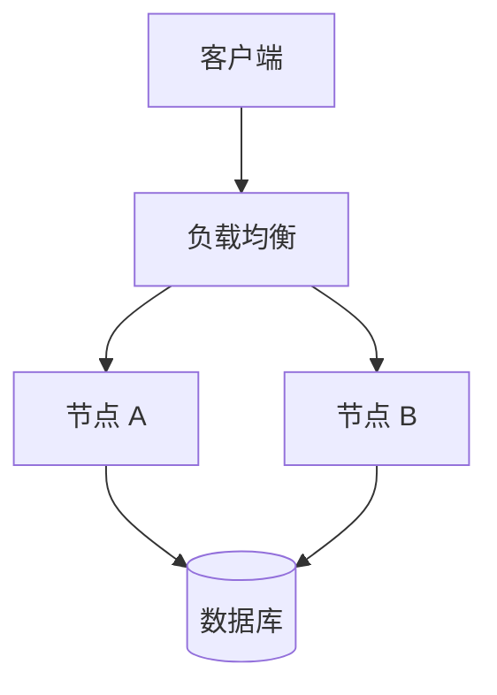
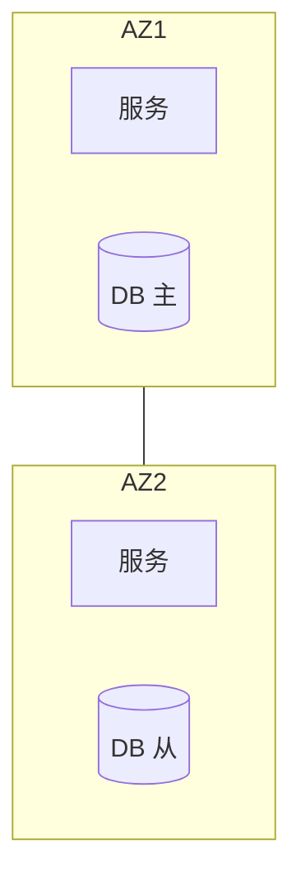
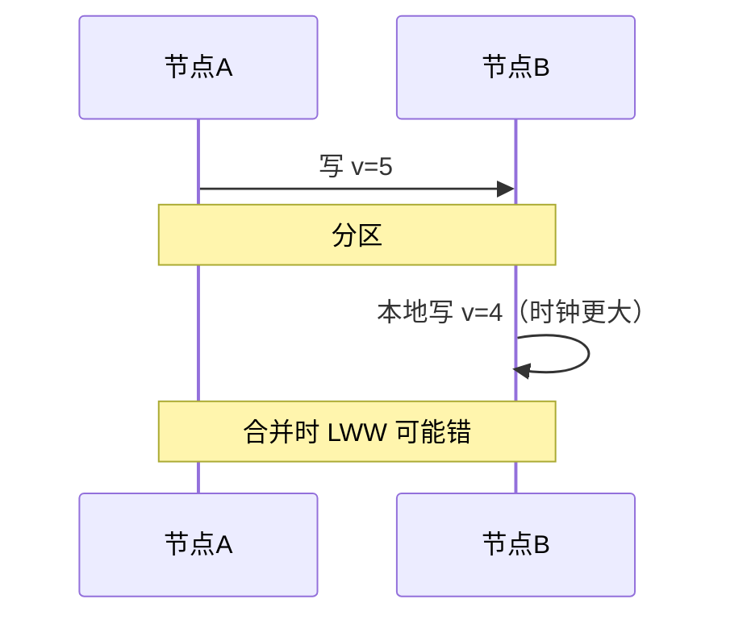
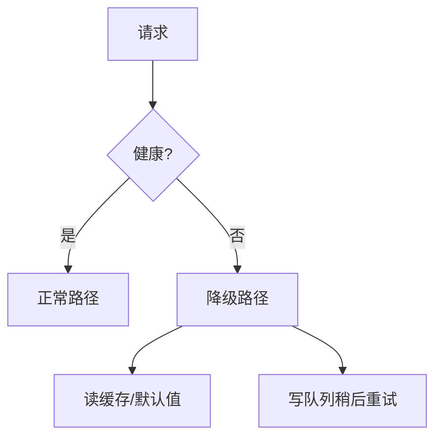

# 分布式挑战与 CAP

单机到多节点，**网络分区**、**时钟不同步**、**部分失败**成为常态；**CAP** 说明在分区发生时只能在**一致性**与**可用性**间取舍（分区容忍 P 为分布式前提）。前端感知的「接口偶发 500」「读到旧数据」，往往根因在此 — 而非单纯「前端没写好」。

---

## 为何单机假设失效



| 挑战 | 表现 | 全栈例子 |
|------|------|----------|
| **部分失败** | 一节点挂、另一正常 | 轮询打到健康实例仍失败若会话粘滞错 |
| **网络延迟** | RTT 不可忽略 | 跨区 API P99 飙升 |
| **无全局时钟** | 各节点时间漂移 | 分布式 trace 靠逻辑时钟 |
| **并发写** | Lost update | 两人同时改同一配置 |

---

## CAP 定理（实用读法）

```plaintext
C = Consistency  — 读总能见到最新写（线性一致性的强形式之一）
A = Availability — 每个请求都收到非错响应（非 guaranteed 正确）
P = Partition tolerance — 网络分区时系统仍运行
```

分区发生时：**CP** 或 **AP**，不能同时要 C 与 A。

| 选型 | 行为 | 例子 |
|------|------|------|
| **CP** | 分区时拒写/只读旧 | 强一致 etcd、ZooKeeper 选举 |
| **AP** | 分区时各分区可写，后合并 | Dynamo 系、Cassandra 可调 |
| **CA** | 仅「无分区」单机思维 | 非真正分布式 |

**注意**：CAP 常被误读为「三选二日常配置」— 实际是无分区时 C/A 可兼得；**分区是 rare 但必设计**。

---

## 与 BASE、PACELC

| 概念 | 含义 |
|------|------|
| **BASE** | Basically Available, Soft state, Eventually consistent |
| **PACELC** | 无分区选 Latency vs Consistency；有分区即 CAP |

前端协作：

- **最终一致**：提交后列表未立刻出现 → 需 UI「处理中」或轮询/WebSocket
- **读己之写**：登录后立即读 profile 走主库或 sticky session
- **多活**：CDN/边缘 AP；核心订单 CP


---

## 故障与观测

```javascript
// 客户端应区分可重试 vs 不可重试
async function fetchWithRetry(url, { max = 3 } = {}) {
  for (let i = 0; i < max; i++) {
    try {
      const res = await fetch(url);
      if (res.status >= 500 && res.status < 600) throw new Error('retry');
      return res;
    } catch (e) {
      if (i === max - 1) throw e;
      await new Promise(r => setTimeout(r, 2 ** i * 100));
    }
  }
}
```

| 指标 | 说明 |
|------|------|
| **SLA/SLO** | 可用性 99.9% ≈ 8.76h/年 downtime |
| **错误预算** | 可用性与发布频率权衡 |

排障时把「偶发 500」与 traceId 对齐：同一请求在网关、BFF、下游是否都失败，还是仅某一跳超时。Metrics 看 P99 与错误率是否同 AZ 聚集；Logs 查 `timeout`、`connection reset`。SLO  burn rate 告警比单次 500 更能反映用户真实受损面。

```plaintext
traceId: abc123
  ingress: 200, 45ms
  order-svc: 503, 3002ms  ← 根因
  inventory-svc: (未调用)
```

---

## 典型拓扑与故障域



| 概念 | 说明 |
|------|------|
| **可用区 AZ** | 独立供电网络；跨 AZ 防机架级故障 |
| **Region** | 地理区域；跨 Region 延迟与合规 |
| **故障域** | 尽量让副本不在同一故障域 |

全栈发布：单 AZ 部署遇分区可能全挂；多 AZ + 无单点 LB 是云原生基线。前端静态资源多 Region CDN 与 API Region 不一致时，注意**数据 residency** 与 CORS。

---

## 分区时用户可见现象

| 选型 | AP 系统可能现象 | CP 系统可能现象 |
|------|-----------------|-----------------|
| 写 | 两边都能提交，后合并冲突 | 一侧拒写或超时 |
| 读 | 各分区数据暂时不一致 | 为保一致可能只读旧或拒绝 |
| UI | 需冲突提示、合并策略 | 需明确错误态、重试引导 |

「强制读主库」牺牲的是**读扩展与延迟**，不是 CAP 里的 A（仍可能有响应，只是慢或走主节点）。

---

## 时钟、顺序与「最新」

分布式里没有可靠的「全局现在」。各节点 NTP 漂移、虚拟机暂停、闰秒调整，都会让 **LWW（Last-Write-Wins）** 选错胜者。工程上更常用 **逻辑时钟**（Lamport / Vector Clock）或 **单调递增版本号**（DB row version、etcd revision），而不是裸 `Date.now()`。

| 手段 | 解决什么 | 前端可感知 |
|------|----------|------------|
| **版本号 / ETag** | 并发写冲突 | 409 + 合并 UI |
| **服务端时间戳** | 排序、审计 | 列表「刚刚」可能不准 |
| **Trace 中 span 顺序** | 排障因果 | 瀑布图先后 ≠ 业务先后 |



产品文案避免承诺「实时同步到所有设备」— 除非后端明确线性一致或读主策略。

---

## 部分失败与超时预算

调用链 `A → B → C`，任一环节慢或挂，用户只看到一个 spinner。**超时**不是越小越好：过短误杀慢请求，过长占满连接池拖垮上游。

| 层级 | 建议 |
|------|------|
| **客户端** | 总 deadline + 单次 fetch 超时 |
| **网关** | 略大于最慢合法路径 |
| **服务间** | 小于网关，留余量给 BFF 聚合 |

```javascript
// AbortController — 页面卸载或用户取消时释放资源
const ctrl = new AbortController();
const t = setTimeout(() => ctrl.abort(), 8000);
try {
  return await fetch(url, { signal: ctrl.signal });
} finally {
  clearTimeout(t);
}
```

**舱壁（Bulkhead）**：线程池/连接池分池，避免一个慢下游拖死全部 API。**熔断**在错误率超阈时快速失败，把 CAP 里「保可用」落到「降级响应」而非无限等待。

---

## 降级与体验契约

分区或 overload 时，CP 系统可能拒写；AP 系统可能返回旧数据。前端应事先与产品定 **降级契约**：

| 场景 | 降级策略 | UI |
|------|----------|-----|
| 推荐不可用 | 展示默认/缓存列表 | 角标「推荐暂不可用」 |
| 写路径不可用 | 只读模式 | 禁用提交 + 说明 |
| 跨区只读 | 读本地副本 | 提示数据可能滞后 |



降级不是静默失败 — 用户需要知道「功能受限」而非误以为操作成功。

---

## 设计自检清单

上线前可对照：

| 问题 | 期望答案 |
|------|----------|
| 分区时写会怎样？ | 拒写 / 排队 / 冲突合并，已文档化 |
| 读能否 stale？ | stale 窗口 + 是否提供强读参数 |
| 超时与重试边界？ | POST 幂等键、GET 可重试 |
| 多 AZ 故障域？ | 副本不在同一 AZ |
| 观测能否定位单跳？ | traceId 贯穿网关到 DB |

---

## 小结

分布式系统的默认事实是部分失败与分区；CAP 指导分区下的 C/A 权衡；BASE/PACELC 补充延迟与最终一致。产品体验需与一致性强弱对齐。

**易混点**：CAP 的 C 不是 ACID 的 C；可用性指「有响应」非「正确」；多副本≠分布式（同机房主从仍怕分区）。

核对：分区时 AP 系统可能出现什么用户可见现象？为何「强制读主库」牺牲的是延迟还是可用性？LWW 依赖 wall clock 有什么风险？
