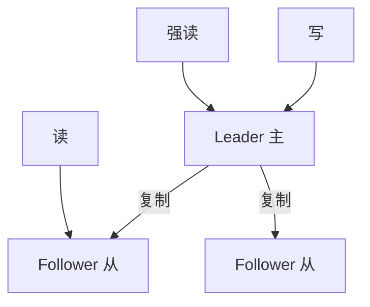
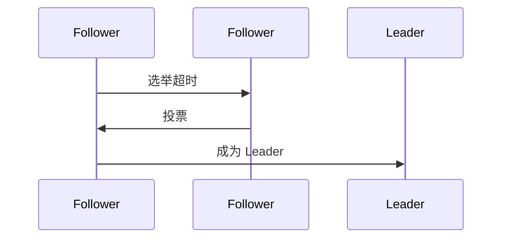
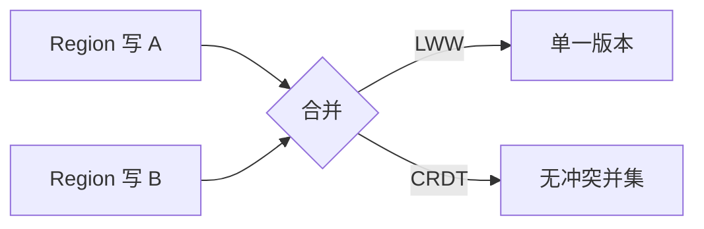

# 一致性与副本

多副本提升**可用**与**读扩展**，代价是**一致性强弱**的选择：从强线性一致到最终一致，读写路径、Quorum、Leader 选举各不相同。BFF 缓存、React Query staleTime、读主/读从 API 设计，都应对应后端副本策略。

---

## 一致性谱系


| 级别 | 用户可见 | 典型系统 |
|------|----------|----------|
| **线性一致** | 像单机 | etcd、Spanner |
| **顺序一致** | 全体见相同顺序，未必最新 | Kafka 分区内 |
| **因果一致** | 有 happens-before 的见前序 | 部分 CRDT |
| **最终一致** | 暂时分歧，收敛 | DNS、Cassandra 默认 |

---

## 副本角色与读写



| 模式 | 写 | 读 | 权衡 |
|------|----|----|------|
| 主从 | 仅主 | 从（滞后） | 读扩展，可能 stale |
| 多主 | 多节点 | 多节点 | 冲突解决复杂 |
| Quorum | W 节点 ack | R 节点 | R+W > N 可线性读 |

```plaintext
N=3, W=2, R=2 → 读写交集至少 1 节点含最新（简化 Quorum 直觉）
```

---

## 复制方式

| 方式 | 说明 | 延迟 |
|------|------|------|
| **同步复制** | 从确认才返回写 | 高可靠，写慢 |
| **异步复制** | 主成功即返回 | 主宕可能丢最近写 |
| **半同步** | 至少 k 个从 ack | 折中 |

**复制滞后（replication lag）**：从库读不到刚写入 — 前端「创建后立即详情 404」常因此。解法：读主、`?consistent=true`、或客户端携带版本号轮询。

---

## 冲突与版本

| 策略 | 场景 |
|------|------|
| **LWW** Last-Write-Wins | 时间戳大者胜（时钟风险） |
| **向量时钟 / 版本向量** | 检测并发写冲突 |
| **CRDT** | 无中心合并（协作编辑） |
| **应用层 merge** | 购物车、评论树 |

```javascript
// 乐观锁 — 前端 If-Match / version 字段
await fetch(`/api/item/${id}`, {
  method: 'PUT',
  headers: { 'If-Match': etag },
  body: JSON.stringify({ ...data, version: 3 }),
});
// 409 Conflict → 提示用户合并
```

---

## 与前端衔接

| 现象 | 副本层原因 |
|------|------------|
| 列表刷新慢半拍 | 读从 + 最终一致 |
| 登录态多 tab 不一致 | 会话存本地 vs 服务端 |
| CDN 旧静态资源 | 边缘副本 + TTL |

React Query：`staleTime` 短 = 更频繁验证新鲜度；`invalidateQueries` 在写成功后触发 — 对齐「读己之写」体验。

```typescript
// 写成功后强制刷新 — 对齐读己之写
const mutation = useMutation({
  mutationFn: createPost,
  onSuccess: () => queryClient.invalidateQueries({ queryKey: ['posts'] }),
});
```

---

## RPO / RTO 与副本

| 指标 | 含义 | 副本关系 |
|------|------|----------|
| **RPO** Recovery Point Objective | 可接受丢多少数据 | 异步复制 lag 上限 |
| **RTO** Recovery Time Objective | 可接受停多久 | failover 自动化速度 |

```plaintext
同步复制：RPO≈0，RTO 取决于选举
异步跨 Region：RPO>0（可能丢最后几秒写），RTO 分钟级
```

业务选 **CP** 支付单库同步；**AP** 日志/行为埋点可异步多副本。分区下 CP 拒写保正确，AP 可写但需合并 — 副本策略与 CAP 取舍应写在 ADR 里，避免前后端各自假设。

---

## Quorum 速算

| N | W | R | R+W>N? | 能否线性读（简化） |
|---|---|---|--------|-------------------|
| 3 | 2 | 2 | ✅ | 是 |
| 3 | 1 | 1 | ❌ | 否，可能读旧 |
| 5 | 3 | 3 | ✅ | 是 |

W=1 R=1 N=3 **不能**保证读到最新写 — 读写可能各打不同节点且无交集保证。

---

## Leader 选举（简记）



Raft/etcd：Follower 超时发起选举 → 多数派投票 → Leader 处理写并复制。主从 DB 的「主」常由运维或中间件指定，语义类似但实现不同。

---

## 会话级与单调读

并非所有场景都需要全局线性一致。**会话一致性（Session Consistency）**：同一会话内读己之写；**单调读（Monotonic Reads）**：用户不会看到时间倒流（先新后旧）。

| 策略 | 实现 | 前端配合 |
|------|------|----------|
| **读己之写** | 写后读主 / sticky 到写节点 | 写成功后 invalidate 或 refetch |
| **单调读** | sticky 读同一副本 | 同 tab 会话保持 |
| **单调写** | 同用户写路由同 shard | 较少在前端显式处理 |

```javascript
// 写后强制读主 — query 参数或专用 header
await api.post('/posts', body);
const fresh = await api.get('/posts/me', { params: { consistent: true } });
```

BFF 若默认读从库，应在「刚修改过的资源」路径上切主或带 `read-your-writes` 路由规则。

---

## Read Repair 与反熵

副本长期异步复制时，除 **replication lag** 外还有 **副本间永久分歧**（某从库丢更新）。**Read repair**：Quorum 读发现版本不一致时，后台修复旧副本。**Anti-entropy（反熵）**：定期 Merkle tree 比对，后台同步差异。

| 机制 | 触发 | 对读延迟 |
|------|------|----------|
| **Read repair** | 读路径 | 可能略增 P99 |
| **Anti-entropy** | 后台定时 | 读路径无感 |

前端仍可能短暂 stale — repair 是收敛手段，不是「零窗口强一致」。

---

## 多主与冲突解决深入

多主（Multi-Primary）地理分布降低写延迟，但同一 key 并发写必然冲突。



| 策略 | 优点 | 风险 |
|------|------|------|
| **LWW** | 简单 | 时钟漂移丢更新 |
| **应用 merge** | 语义可控 | 需产品设计 |
| **CRDT** | 无锁合并 | 状态膨胀、非所有域适用 |

协作编辑（OT/CRDT）与购物车「加购合并」是典型 **应用层 merge** — API 返回冲突结构 `{ base, yours, theirs }`，前端展示 diff UI。

---

## 副本拓扑选型

| 拓扑 | 写 | 读扩展 | 跨 Region |
|------|-----|--------|-----------|
| 单主多从 | 单点写 | 从库读 | 异步复制 lag |
| 主主 | 多写 | 高 | 冲突成本高 |
| Quorum (Dynamo) | 可调 W | 可调 R | 常 AP |

**同步跨 Region 主从**：RPO≈0 但写 RTT 受限于最慢链路 — 支付核心常单 Region 强一致，边缘只读副本服务静态与缓存。

---

## 前端 stale 窗口估算

| 因素 | 典型量级 |
|------|----------|
| 异步复制 lag | 毫秒～秒 |
| CDN/API 缓存 TTL | 秒～分钟 |
| React Query staleTime | 由你设定 |

若 `staleTime: 60_000` 而后端 lag < 1s，列表「慢半拍」多半来自客户端缓存而非副本。应用 **写后 invalidate** 比盲目缩短 staleTime 更省请求。

**Hinted handoff**：部分系统在读从时若发现 lag 过大，自动转发到主 — 对客户端透明，BFF 可封装为 `?preferPrimary=true`。

Etcd/Zookeeper 的 **watch** 机制可在主从切换时通知 BFF 刷新路由 — 减少打到旧主的窗口。

```typescript
// 乐观更新 + 回滚 — 体验即时，失败再对齐服务端
queryClient.setQueryData(['posts'], old => [newPost, ...old]);
try {
  await createPost(newPost);
} catch {
  queryClient.invalidateQueries({ queryKey: ['posts'] });
}
```

---

## 小结

副本带来可用与扩展，一致性强弱决定读写语义；主从+异步复制最常见，需处理复制滞后与冲突。API 应暴露版本/ETag，前端处理 409 与短暂 stale。

**易混点**：主从≠主主；Quorum 的 R/W 与副本数 N 需一起记；线性一致比「数据库 ACID」更严（含并发下全局顺序）。

核对：W=1 R=1 N=3 能否保证读到最新写？异步复制主宕未同步数据会怎样？读己之写与单调读分别解决什么问题？
