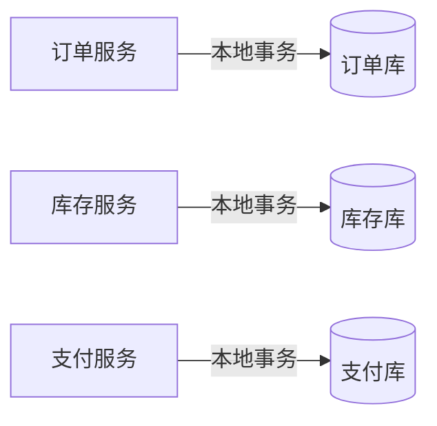
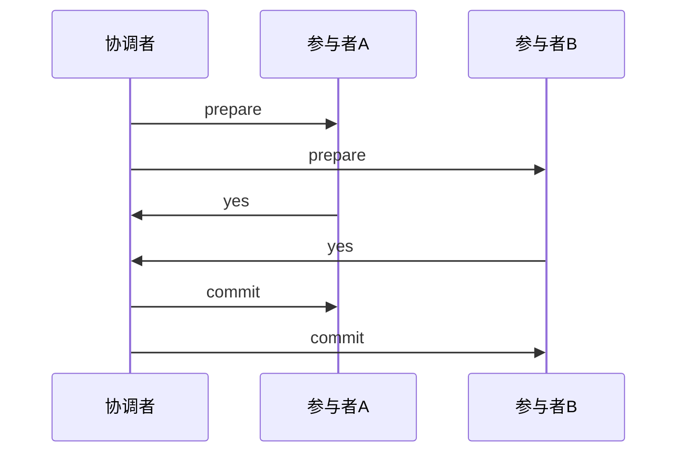
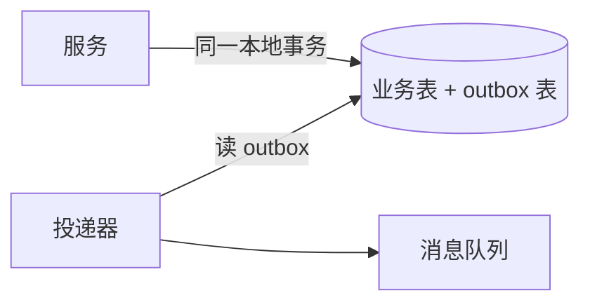
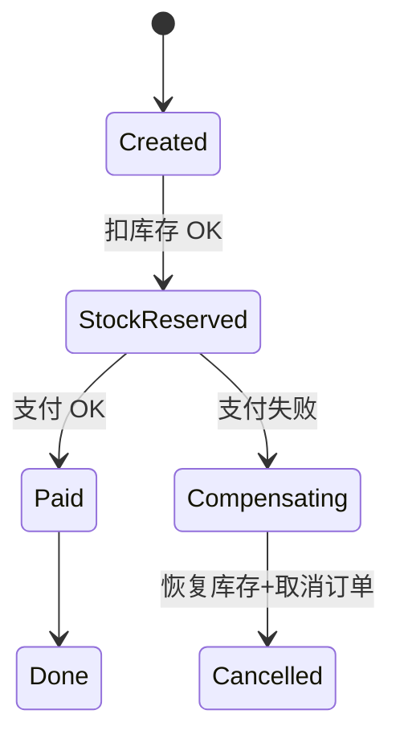

# 分布式事务

跨库、跨服务、跨消息的一次业务动作要**全体成功或全体撤销** — 单机 ACID 不再成立，需 **2PC**、**TCC**、**Saga** 等模式在**一致性与可用性**间折中。下单扣库存+支付+发券，前端「订单处理中」状态机往往映射后端 Saga 步骤。

---

## 问题定义



| 单机 | 分布式 |
|------|--------|
| 同一 DB 事务 | 无全局锁，网络可能失败 |
| commit/rollback 原子 | 部分 commit = 不一致 |

ACID 的 **C（Consistency）** 指约束不被破坏；分布式讨论的 **Consistency** 指多副本可见性 — 同名不同义，混谈易错。

---

## 两阶段提交（2PC）



| 阶段 | 行为 |
|------|------|
| **Prepare** | 各参与者预留资源、写 undo/redo |
| **Commit** | 协调者全 yes 则 commit，否则 abort |

**缺点**：协调者单点；阻塞（参与者 prepare 后等协调者）；同步开销大。**生产**常用 XA 较少，更多 TCC/Saga + 消息。

协调者宕在 commit 前：参与者可能**长期阻塞** — 需超时与人工介入，这是 2PC 落地难的原因之一。

---

## TCC（Try-Confirm-Cancel）

| 阶段 | 含义 | 例：扣库存 |
|------|------|------------|
| **Try** | 预留资源 | 冻结库存 1 |
| **Confirm** | 确认提交 | 扣减冻结 |
| **Cancel** | 释放预留 | 解冻 |

```plaintext
业务需为每个服务实现三个接口 — 侵入性强，但可控、无长锁
```

适合：金融、库存强一致路径；秒杀 **预扣库存**（Try 冻结 → Confirm 扣减）是 TCC 的典型形态。

---

## Saga

长事务拆为**本地事务链** + **补偿**：


| 类型 | 协调 | 特点 |
|------|------|------|
| **编排 Orchestration** | 中心 Saga 引擎发命令 | 易观测、单点逻辑 |
| **编舞 Choreography** | 各服务听事件自行下一步 | 解耦、流程分散 |

```javascript
// 前端 — 订单状态反映 Saga 进度
const statusMap = {
  PENDING_PAY: '待支付',
  PAYING: '支付中',
  COMPENSATING: '取消中', // 补偿中勿重复提交
  FAILED: '失败',
  DONE: '完成',
};
```

**补偿**非 rollback：可能语义不同（支付退款 T+1）。需**幂等**与**可重入**。

---

## 模式对比

| | 2PC | TCC | Saga |
|---|-----|-----|------|
| 一致性 | 强（阻塞） | 较强 | 最终一致 |
| 性能 | 低 | 中 | 高 |
| 侵入性 | 中 | 高 | 中 |
| 典型 | 遗留 XA | 核心交易 | 微服务长流程 |

**Outbox / 事务消息**：本地写业务+发消息同一事务，异步投递 — 避免跨库 2PC，用最终一致换吞吐。



---

## 前端防重复与中间态

| 实践 | 原因 |
|------|------|
| 提交按钮 loading + disabled | 防双点 |
| `Idempotency-Key` | 网络重试不重复下单 |
| 展示 COMPENSATING | 用户勿以为失败可再提交 |
| 轮询/WebSocket 跟状态 | Saga 步骤异步 |

支付成功但发券失败：通常**重试发券**（幂等）或 Saga **补偿支付** — 看业务哪边更贵、可否人工补券。

---

## 本地消息表（Outbox）

| 步骤 | 说明 |
|------|------|
| 1 | 同一 DB 事务写业务表 + outbox 表 |
| 2 | 投递器读 outbox 发 MQ |
| 3 | 成功后标记 outbox 已发送 |

解决「DB commit 了但 MQ 没发」— 与跨服务 2PC 不同，是**单库内**一致性。前端无感，但依赖最终一致 UI。

---

## 幂等与去重

分布式事务链路上**任意一步都可能重试** — 网络超时、消费者 rebalance、网关重放。业务键去重是 Saga/TCC 落地前提。

| 层级 | 手段 |
|------|------|
| **HTTP** | `Idempotency-Key` header |
| **DB** | 唯一索引 `(order_id, step)` |
| **消息** | `messageId` + 消费表 |

```javascript
// 幂等创建 — 相同 key 返回同一结果
async function createOrder(idempotencyKey, payload) {
  const existing = await db.orders.findByKey(idempotencyKey);
  if (existing) return existing;
  return db.orders.create({ ...payload, idempotencyKey });
}
```

前端：同一表单提交期间固定 idempotencyKey（UUID），重试时复用，避免双单。

---

## Saga 状态机与可观测

编排型 Saga 引擎维护 **全局状态机** — 每步 local tx + 记录进度，失败触发补偿链。



| 状态 | 用户文案 | 禁止操作 |
|------|----------|----------|
| PAYING | 支付处理中 | 重复支付 |
| COMPENSATING | 订单取消中 | 再次下单同 SKU |
| FAILED | 失败可重试 | 视业务 |

链路追踪应在 span 上标注 `sagaId`、`step` — 排障「卡在哪一步」比只看 500 有用。

---

## XA 与 Seata 类方案（简记）

**XA** 是两阶段在 DB 驱动层的标准接口 — 多库同一协调者 prepare/commit。问题仍是阻塞、协调者单点、长事务锁资源。

**Seata AT 模式**（代表一类）：拦截 SQL 写 undo log，一阶段本地提交，二阶段异步删 undo — 对业务侵入低，但隔离级别与脏读需评估，不适合所有金融场景。

| 方案 | 侵入 | 一致性 | 适用 |
|------|------|--------|------|
| XA/2PC | 低（驱动） | 强 | 遗留、短事务 |
| TCC | 高 | 较强 | 库存、账户 |
| Saga | 中 | 最终 | 长流程订单 |
| Outbox | 中 | 最终 | 事件驱动 |

选型问：**能否接受补偿语义？最长事务持锁多久？** — 答不了就用 Saga + 清晰中间态。

---

## 失败场景决策表

| 失败点 | 典型处理 |
|--------|----------|
| Try 失败 | 直接 Cancel，无需 Confirm |
| Confirm 部分成功 | 重试 Confirm（幂等） |
| 补偿失败 | 告警 + 人工工单 |
| 消息重复 | 消费幂等 |

支付成功发券失败：**优先幂等重试发券**（成本低）；若券系统长期不可用且券为强承诺，再触发 Saga 补偿退款 — 取决于哪边对用户/legal 更不可接受。

**空回滚（Empty Rollback）**：补偿步骤本身也应幂等 — 重复执行 Cancel 不应多解冻或多退款。

---

## 超时与悬挂事务

Saga 某步长时间无响应时，协调器需 **超时推进** — 触发补偿或人工介入，避免订单永久停在 PAYING。

| 状态 | 超时动作 |
|------|----------|
| PAYING > 15min | 查询支付渠道 + 补偿或确认 |
| COMPENSATING 卡住 | 告警，禁止用户重复下单 |

前端倒计时关单与 Saga 超时应对齐同一业务规则，避免「前端显示可付、后端已关单」。

---

## 小结

分布式事务无银弹：2PC 强但阻塞；TCC 三阶段预留；Saga 用补偿换可用。前端应对应中间态、防重复提交、展示可恢复的失败。

**易混点**：Saga 补偿≠数据库 rollback；TCC Try 失败不必 Confirm；本地消息表解决的是「DB 与 MQ 双写一致」非跨服务 2PC。

核对：支付成功但发券失败，Saga 应补偿支付还是重试发券？2PC 协调者宕在 commit 前参与者状态？Idempotency-Key 应何时生成、何时复用？
