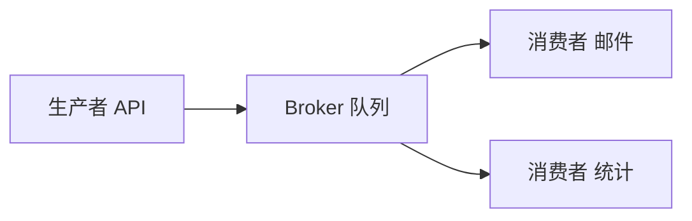
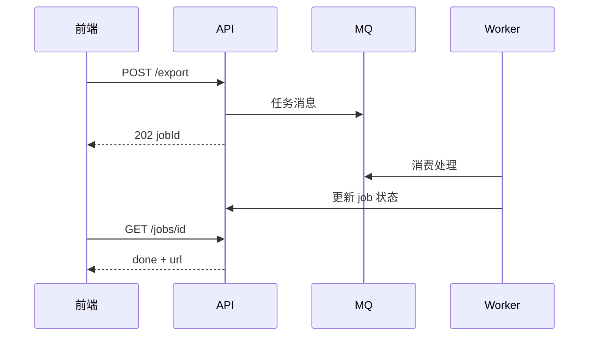
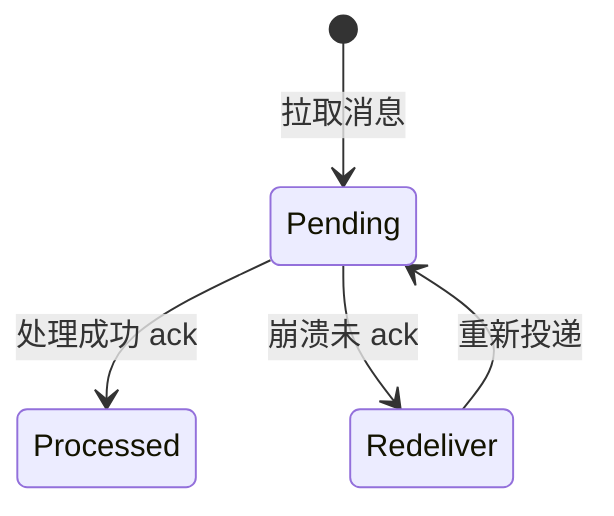
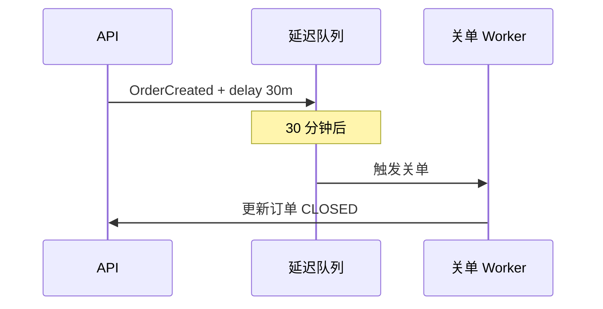

# 消息队列与异步通信

**异步**解耦生产者与消费者、削峰填谷、支撑最终一致 — **消息队列**（Kafka、RabbitMQ、RocketMQ）是分布式系统的「神经系统」。前端 WebSocket/SSE、轮询任务状态，常是 MQ 消费结果的最后一公里。

---

## 为何引入 MQ



| 收益 | 说明 |
|------|------|
| **解耦** | 下单不直连 10 个下游 |
| **削峰** | 秒杀请求先入队，Worker 匀速处理 |
| **异步** | API 快速 202，后台慢慢做 |
| **可靠** | 持久化 + 重试 |

---

## 交付语义

| 语义 | 含义 | 实现代价 |
|------|------|----------|
| **At most once** | 可能丢 | fire-and-forget |
| **At least once** | 可能重复 | ack 前处理完 + 重试 |
| **Exactly once** | 不丢不重 | 幂等 + 事务/outbox（端到端难） |

```javascript
// 消费者必须幂等 — 业务唯一键
async function handlePayment(msg) {
  const { orderId, paymentId } = msg;
  const exists = await db.payment.findUnique({ where: { paymentId } });
  if (exists) return; // 重复投递安全退出
  await db.payment.create({ data: { orderId, paymentId, ... } });
}
```

**易混点**：MQ 说 exactly-once 常指 broker 侧；**业务仍要幂等**。

---

## 顺序、分区与延迟

| 概念 | 说明 |
|------|------|
| **Partition** | Kafka 分区内有序；选 key=orderId 保同单顺序 |
| **Consumer Group** | 组内分区负载均衡 |
| **延迟队列** | TTL / 死信 + 定时重投 |
| **死信 DLQ** | 多次失败进 DLQ 人工介入 |

```plaintext
热点 key → 单分区瓶颈 — 需拆分或本地聚合
```

同订单消息应用 **orderId** 作 partition key — 保证同一订单事件顺序处理；DLQ 消息应**修 bug 后重发**，勿盲目 requeue（会再次失败堆积）。

---

## 与前端/全栈模式

| 模式 | 前端体验 |
|------|----------|
| **202 + 轮询** | `GET /jobs/:id` 查进度 |
| **WebSocket 推送** | 网关订阅 MQ 事件推浏览器 |
| **SSE** | 单向流，ChatGPT 式输出 |
| **Outbox → CDC** | 后端发事件，前端无感 |



Celery/BullMQ 是进程内 MQ 抽象 — 原理同 broker，规模不同。

---

## 选型简表

| | Kafka | RabbitMQ | Redis Stream |
|---|-------|----------|--------------|
| 吞吐 | 极高 | 中 | 中 |
| 顺序 | 分区内 | 队列级 | 流 |
| 场景 | 日志、事件流 | 任务、路由 | 轻量队列 |

MQ 常与 **限流** 配合：秒杀请求先入队，Worker 按固定 QPS 消费 — 保护 DB 不被打穿。

---

## offset 与 unacked



| 提交时机 | 效果 |
|----------|------|
| 处理前 commit offset | at-most-once，可能丢 |
| 处理后 commit | at-least-once，可能重复 |
| 事务性 consume | 与 DB 同事务，仍要幂等 |

队列空 ≠ 消费完 — 可能有大量 unacked 在处理中。

---

## 事件驱动 vs 命令

| | 事件 Event | 命令 Command |
|---|------------|--------------|
| 语义 | 「发生了某事」 | 「请做某事」 |
| 订阅 | 多消费者各自处理 | 通常单消费者 |
| 例 | `OrderCreated` | `SendEmail(to)` |

编舞 Saga 常用事件；编排 Saga 常用命令 — 选型看流程是否需中心编排。

```plaintext
事件：OrderCreated → 库存服务、积分服务各自订阅
命令：ReserveStock(orderId) → 仅库存服务执行
```

---

## 背压与 Consumer Lag

生产速度 > 消费速度时，队列深度增长 — **Consumer Lag** 是核心健康指标。无背压时 broker 磁盘打满或 OOM。

| 手段 | 说明 |
|------|------|
| **限速生产** | API 202 后拒绝新任务 |
| **扩消费者** | 分区数 ≥ 并行度才有用 |
| **批量拉取** | 提高吞吐，增大单次失败 blast radius |
| **暂停分区** | 极端过载保护下游 |

```plaintext
lag = latestOffset - consumerOffset
告警：lag > 10min 或 增长率持续为正
```

前端长任务 UI 应展示 **队列位置/预计等待** — 纯 spinner 在 lag 小时用户会重复提交。

---

## 重试、退避与 DLQ 运维

| 参数 | 建议 |
|------|------|
| **maxRetries** | 有限次，非无限 requeue |
| **退避** | 指数 + jitter，避免 thundering herd |
| **DLQ** |  poison message 隔离，修 bug 后 **replay** |

```javascript
// 消费失败 — 区分可重试与 poison
async function onMessage(msg) {
  try {
    await process(msg);
    await ack(msg);
  } catch (e) {
    if (isPermanentError(e)) {
      await sendToDlq(msg, e); // 参数错误、schema 不兼容
      await ack(msg);
    } else {
      await nack(msg); // 下游超时，可重试
    }
  }
}
```

**勿**把 DLQ 当垃圾桶无限堆积 — 需 dashboard + 人工 replay 流程。

---

## Schema 演进与兼容性

事件流长期存在，**Producer/Consumer 独立部署** — 字段增删需兼容策略。

| 策略 | 说明 |
|------|------|
| **向后兼容** | 新字段 optional，旧消费者忽略 |
| **Schema Registry** | Avro/Protobuf 版本校验 |
| **双写过渡** | 新旧 topic 并行一段窗口 |

破坏性变更（删必填字段、改类型）应 **新 topic 或新版本事件名** `OrderCreatedV2`，避免 silent corruption。

---

## 延迟队列与定时任务

| 实现 | 机制 |
|------|------|
| **RabbitMQ TTL+DLX** | 过期进死信队列再消费 |
| **RocketMQ 延迟级别** | 固定档位 |
| **Kafka 时间轮** | 自建或 KIP 延迟 |

订单「30 分钟未支付自动关单」：延迟消息触发关单服务 — 前端倒计时与 server 关单时间可能差几秒，以服务端状态为准。



---

## 小结

MQ 解耦与削峰，默认 at-least-once — 消费者幂等必备。分区键决定顺序边界；前端用 jobId + 推送/轮询承接异步结果。

**易混点**：队列空≠消费完（可能在 unacked）；Kafka offset 提交时机决定丢/重；RPC 同步调用不是 MQ。

核对：同订单消息为何应用 orderId 作 partition key？DLQ 里消息应直接 requeue 还是修 bug 后重发？Consumer Lag 升高时扩消费者为何可能无效？
