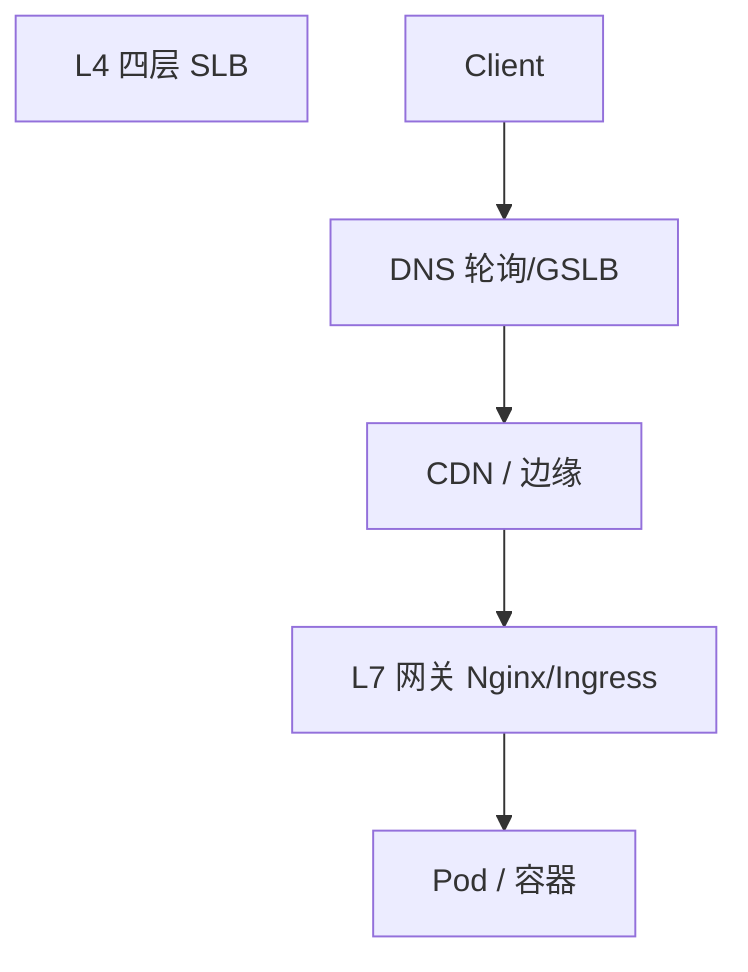
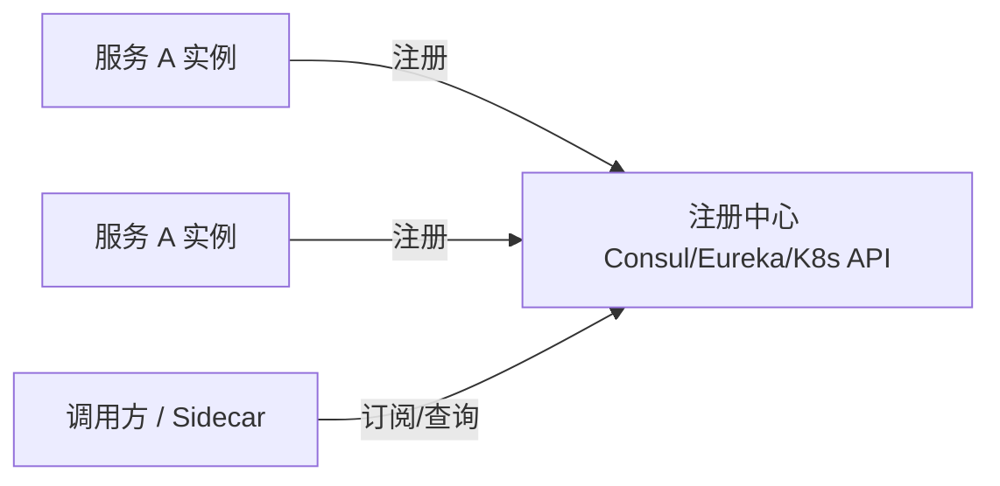
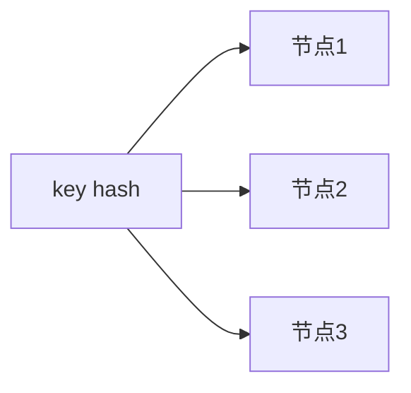

# 负载均衡与服务发现

流量经**负载均衡**分到多实例；实例地址动态变化时靠**服务发现**解析 — 用户只访问 `api.example.com`，背后 Pod 扩缩、故障转移对前端透明，但影响**长连接**、**会话**与**超时重试**策略。

---

## 负载均衡层次



| 层 | 算法 | 特点 |
|----|------|------|
| **DNS** | 轮询、地理 | 缓存 TTL 导致切换慢 |
| **L4** | 连接级 | 快，不知 HTTP 路径 |
| **L7** | 路径/Header/ Cookie | 路由 `/api` vs `/static` |
| **客户端 LB** | gRPC pick_first | 服务网格 sidecar |

常见算法：

| 算法 | 说明 |
|------|------|
| **Round Robin** | 依次 |
| **Weighted RR** | 按权重 |
| **Least Connections** | 少连接优先 |
| **Consistent Hash** | 同 key 同节点 — 缓存亲和 |
| **Random + 重试** | 简单有效 |

---

## 健康检查与摘除

```plaintext
LB 探活：HTTP /health → 200 才转发
失败阈值 N 次 → 摘除 → 冷却后再试
```

| 类型 | 说明 |
|------|------|
| **主动** | LB 定时探 |
| **被动** | 请求失败率触发 |

前端：`fetch` 遇 502/503 可指数退避换节点（无 sticky 时）；**勿**无限重试 POST。

---

## 服务发现



| 模式 | 说明 |
|------|------|
| **客户端发现** | 客户端拉列表自选 LB |
| **服务端发现** | 经单一 LB/Ingress |
| **K8s Service** | ClusterIP + kube-proxy |
| **DNS SRV** | 传统 |

**配置中心**（Apollo/Nacos）与注册中心常并存 — 前者偏静态配置，后者偏实例列表。

---

## 与前端相关

| 话题 | 实践 |
|------|------|
| **Sticky Session** | Cookie `SERVERID` — WebSocket 必须 |
| **多区域** | Geo DNS + 就近 API |
| **灰度** | Header `X-Canary: 1` 或权重 |
| **BFF 聚合** | 对浏览器一个域名，内网发现微服务 |

```javascript
// 开发环境 Vite proxy — 生产由 Ingress 承担 L7
// vite.config: proxy { '/api': 'http://backend:3000' }
```

Serverless / Edge Function：冷启动 + Regional 部署 — LB 在平台侧。

---

## 会话与无状态 API

| 模式 | LB 要求 | 前端 |
|------|---------|------|
| **JWT 无状态** | 任意节点 | Authorization header |
| **服务端 Session** | Sticky 或 Redis 集中 session | Cookie |
| **WebSocket** | 必须 sticky 或统一连接网关 | 单连接多 multiplex |

```javascript
// axios 默认无 sticky — WebSocket 需单独建连
const ws = new WebSocket(`wss://${location.host}/ws?token=...`);
// 重连策略：指数退避 + 心跳检测半开连接
```

BFF 层聚合下游微服务时，**outward** 对浏览器一个域名，**inward** 用 K8s DNS `service.namespace.svc` — 服务发现主要在集群内，浏览器不参与。

---

## 一致性哈希与扩缩



节点数变化时，朴素 hash 大量 key 迁移 — **虚拟节点** 把抖动摊薄。无 sticky 时 WebSocket 连到 A 节点，扩缩后可能连 B，旧连接断 — 需 sticky 或集中式连接网关。

| 场景 | 建议 |
|------|------|
| 缓存亲和 | 一致性哈希 + 虚拟节点 |
| WebSocket | Sticky cookie 或专用 WS 网关 |
| REST 无状态 | 轮询/随机即可 |

---

## 灰度与金丝雀

| 方式 | 说明 |
|------|------|
| **权重** | 90% v1 / 10% v2 |
| **Header** | `X-Canary: 1` 路由到新版本 |
| **Cookie** | 内测用户 sticky 到新集群 |

```javascript
// 前端配合 — 灰度标识由网关注入或登录后下发
fetch('/api/feature', {
  headers: { 'X-Canary': canaryFlag ? '1' : '0' },
});
```

灰度常与 **Feature Flag** 并存：Flag 控制逻辑分支，金丝雀控制流量比例 — 先 Flag 内测，再 1% 流量验证，最后全量。

---

## DNS 与 failover 局限

DNS 解析结果会被 **TTL** 缓存（浏览器、ISP、本地 resolver）。某实例挂掉后，DNS 切到新 IP 仍可能有 **分钟级** 旧缓存 — 不是即时 failover。

| 层 | failover 速度 | 粒度 |
|----|---------------|------|
| **DNS** | 慢（TTL） | 域名级 |
| **L4/L7 LB** | 秒级（健康检查） | 连接/请求级 |
| **客户端重试** | 即时 | 单次请求 |

```plaintext
用户 resolver 缓存 api.example.com → 旧 IP (TTL 300s)
LB 已摘除故障节点，但部分用户仍打旧 IP
```

关键写路径应依赖 **L7 健康检查 + 多实例**，而非指望 DNS  alone。

---

## 连接池与 keep-alive

LB 到后端、BFF 到微服务常 **HTTP keep-alive** 复用 TCP。实例缩容时，LB 上已有长连接可能仍打到已下线 Pod — 需 **graceful shutdown**（drain 连接）+ 客户端连接池刷新。

| 实践 | 作用 |
|------|------|
| **preStop hook** | K8s 摘流量前等待 in-flight |
| **max connection age** | 定期重建连接分布 |
| **retry on 502/503** | 换连接/换节点（GET 安全） |

WebSocket 长连接不受 HTTP 连接池轮换影响 — 更依赖 sticky 或集中网关。

---

## 服务网格与服务间 LB

**Service Mesh**（Istio/Linkerd）在 sidecar 做 mTLS、重试、超时、指标 — 对业务代码透明。


| 能力 | 网格侧 | 前端侧 |
|------|--------|--------|
| mTLS | 服务间加密 | 浏览器仍 TLS 到网关 |
| 重试 | 可配置 idempotent GET | fetch 重试策略对齐 |
| 熔断 | 保护下游 | 502 降级页 |

浏览器只面对 **Ingress/Gateway** — 网格是集群内服务发现与 LB 的演进形态。

---

## 多活与 Global Load Balancing

**GSLB** 按地理、延迟、健康把用户导到最近 Region。与 **多活** 结合时，写路径需 **冲突解决或单 Region 写** — 否则 AP 分区各写各的。

| 模式 | 读 | 写 |
|------|----|----|
| **单活多从** | 就近读从 | 回主 Region |
| **多活** | 本地 | 本地 + 同步/冲突合并 |

前端静态走 CDN 多 PoP；API 多 Region 时注意 **数据 residency**（GDPR）与 CORS 允许源列表。

---

## 注册中心缓存与脑裂

客户端发现服务列表后常 **本地缓存** — 注册中心短暂不可用时仍用旧列表，可能打到已下线实例。需 **短 TTL + 失败重拉** 与健康检查配合。

| 组件 | 风险 | 缓解 |
|------|------|------|
| **Eureka 自我保护** | 网络分区误保留实例 | 理解阈值再调 |
| **Consul quorum** | 少数派不可写 | 多 AZ 部署 |
| **K8s Endpoints** | Pod 就绪前被转发 | readiness probe |

Sidecar 模式把发现与 LB 下沉到数据面 — 应用代码只连 `localhost:15001`。

---

## 四层 vs 七层选型

| 需求 | 倾向 |
|------|------|
| TLS 终结、路径路由、JWT 校验 | L7 Ingress |
| 超高吞吐、协议无关 | L4 |
| gRPC over HTTP/2 | L7 或 mesh |
| 游戏 UDP | 专用 L4/DNS |

**Anycast IP** 把同一 IP 广播到多 PoP — 用户就近接入，背后仍是健康检查与流量调度，不是 magic 零延迟。

开发环境 Vite `proxy` 模拟 L7 路由；生产同等职责由 Ingress 与网关承担，勿在浏览器硬编码内网服务名。

---

## 小结

LB 在 DNS/L4/L7/客户端多层分发流量；健康检查与一致哈希影响会话与缓存。服务发现让调用方找到动态实例 — K8s Service 是云原生默认。

**易混点**：L7 才能按 URL 路由；DNS LB 不是即时 failover；WebSocket 需 sticky 或共享 session 存储。

核对：无 sticky 时 WebSocket 为何会断？一致性哈希节点数变化会怎样（虚拟节点）？DNS TTL 为何不能当作即时 failover？
