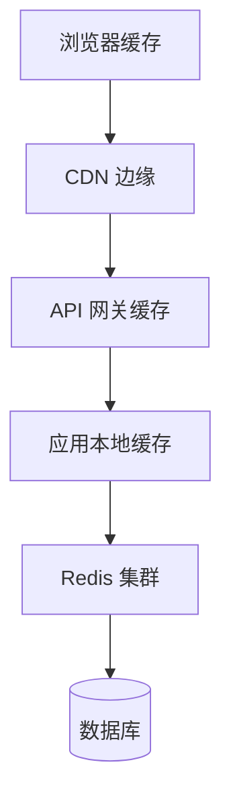
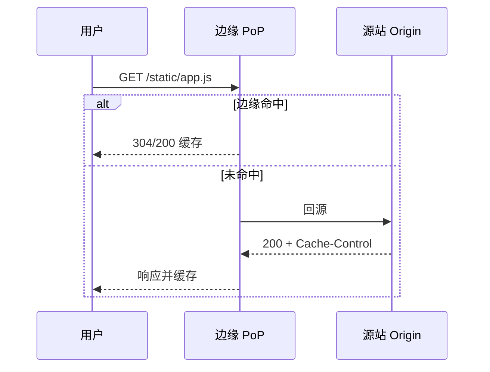
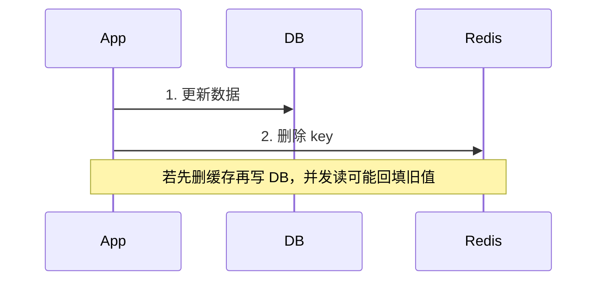
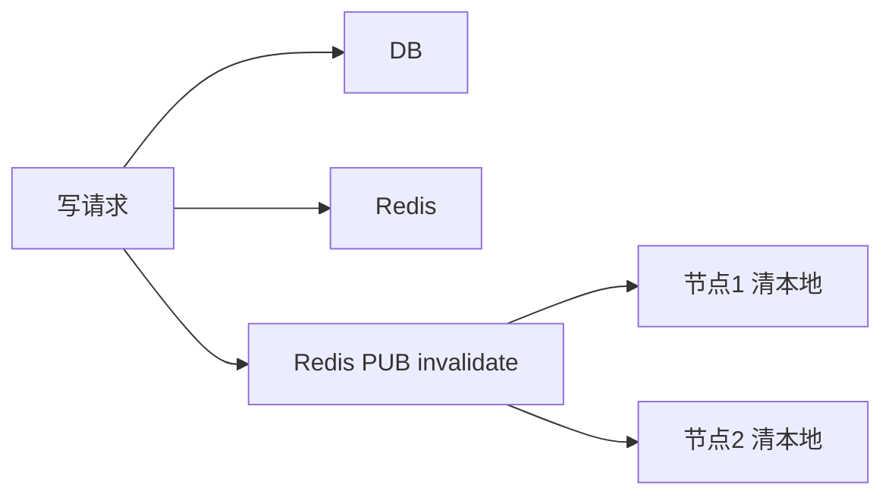

# 分布式缓存与 CDN 原理

**缓存**用空间换时间：本地 → 分布式 KV（Redis）→ **CDN 边缘**，逐层离用户更近。命中率、失效策略、一致性哈希决定性能与正确性 — 浏览器 `Cache-Control` 是同一思想的最外层。

---

## 缓存层次



| 层 | TTL 典型 | 失效 |
|----|----------|------|
| 浏览器 | 秒～年 | 响应头 / 硬刷新 |
| CDN | 分～天 | purge API |
| Redis | 分～时 | TTL / 主动删 |
| 本地 LRU | 秒～分 | 进程内 |

---

## 分布式缓存（Redis 系）

```plaintext
Key → 一致性哈希 → 某分片节点
副本：主从 + 哨兵 / Cluster 槽位
```

| 模式 | 用途 |
|------|------|
| **Cache-Aside** | 读 miss 查 DB 回填；写先更 DB 再删缓存 |
| **Read-Through** | 缓存层代查 DB |
| **Write-Behind** | 异步写回 — 丢数据风险 |

```javascript
// Cache-Aside 伪代码
async function getUser(id) {
  let u = await redis.get(`user:${id}`);
  if (u) return JSON.parse(u);
  u = await db.users.find(id);
  await redis.setex(`user:${id}`, 3600, JSON.stringify(u));
  return u;
}
async function updateUser(id, data) {
  await db.users.update(id, data);
  await redis.del(`user:${id}`); // 先 DB 后删缓存
}
```

---

## 穿透、击穿与雪崩

| 问题 | 原因 | 解法 |
|------|------|------|
| **穿透** | 查不存在 key，每次都打 DB | 布隆过滤器、空值短 TTL |
| **击穿** | 热点 key 过期瞬间并发打 DB | 互斥锁、逻辑过期（异步刷新） |
| **雪崩** | 大量 key 同时过期 | TTL 加 jitter、多级缓存、限流 |

```javascript
// 空值缓存 — 防穿透
async function getProduct(id) {
  const cached = await redis.get(`p:${id}`);
  if (cached === 'NULL') return null;
  if (cached) return JSON.parse(cached);
  const p = await db.products.find(id);
  if (!p) {
    await redis.setex(`p:${id}`, 60, 'NULL');
    return null;
  }
  await redis.setex(`p:${id}`, 3600, JSON.stringify(p));
  return p;
}
```

秒杀热点：库存 key 用 **逻辑过期** — 值带 `expireAt`，后台线程提前刷新，读路径不阻塞。

---

## CDN 原理



| 概念 | 说明 |
|------|------|
| **PoP** | 边缘节点 |
| **回源** | 边缘无缓存向源拉 |
| **Purge** | 发布时清 URL/目录 |
| **动态加速** | 优化路由，非缓存 HTML |

静态资源：`filename.[hash].js` + `immutable` 长缓存；HTML 短缓存或 no-cache。

---

## 一致性与前端

| 问题 | 层 | 解法 |
|------|-----|------|
| 读到旧配置 | CDN | 版本号 query 或 purge |
| 多 tab 数据旧 | Redis+DB | WebSocket 推送 invalidate |
| ETag 协商 | 浏览器 | `If-None-Match` 304 |

**SSR**：CDN 缓存 HTML 需考虑个性化 Cookie — 通常 HTML 不缓存或按 Vary。

```javascript
// 构建产物 — 内容 hash 文件名
// app.a1b2c3.js → Cache-Control: max-age=31536000, immutable
// index.html → Cache-Control: no-cache（每次协商）
```

---

## 浏览器 private vs shared cache

| 类型 | 存储 | 典型 |
|------|------|------|
| **private** | 用户浏览器 | `Cache-Control: private` |
| **shared** | CDN/代理 | `public, s-maxage=3600` |

CDN 缓存≠DNS 解析 — DNS 只决定连哪；CDN 在 HTTP 层缓存响应体。

---

## Cache-Aside 写顺序



先 DB 后删缓存：删后下次读 miss 从 DB 拉新值。Redis 作 DB 持久化需另议 RDB/AOF — 与纯缓存角色不同。

---

## CDN 成本与回源

| 项 | 谁承担 |
|----|--------|
| 边缘命中流量 | CDN 计费（常低于源站带宽） |
| **回源**流量 | 源站出口 + CDN 回源费 |
| 发布未 purge | 旧缓存 + 回源峰值 |

`immutable` + hash 文件名 → 极高命中率，回源接近零 — 前端构建配置直接影 CDN 账单。

---

## Cache-Control 与协商缓存

| 指令 | 行为 |
|------|------|
| `max-age=3600` | 3600s 内直接用本地 |
| `no-cache` | 可缓存但每次需验证 |
| `no-store` | 不存响应体 |
| `immutable` | 内容永不变，配合 hash 文件名 |
| `stale-while-revalidate` | 过期仍可先返旧，后台刷新 |

```http
Cache-Control: public, max-age=31536000, immutable
ETag: "a1b2c3"
```

浏览器发 `If-None-Match` → 304 无 body，省带宽。API JSON 常用短 `max-age` 或 `no-store`（含个人信息时）。

---

## Vary、Cache Key 与 SSR

CDN **Cache Key** 默认常仅 URL — 若响应随 `Accept-Language` 或 `Authorization` 变化，须 **`Vary`** 或 **禁止缓存**，否则 A 用户缓存泄漏给 B。

| 场景 | 策略 |
|------|------|
| 静态 JS/CSS | hash 文件名 + immutable |
| 个性化 HTML | `private, no-store` 或边缘不缓存 |
| 多语言 API | `Vary: Accept-Language` 或 path 前缀 `/en/` |

SSR 页面带 Cookie 时，CDN 默认不应缓存 HTML — 仅静态资源上 CDN。

---

## 多级失效与广播

单实例 **本地 LRU** + **Redis** 时，写路径删 Redis 后其他节点本地仍 stale — 需 **Pub/Sub 广播失效** 或接受秒级不一致。



前端 WebSocket 推送「配置已更新」可触发 `queryClient.invalidateQueries` — 与后端失效广播对齐，缩短多 tab stale 窗口。

---

## Redis 集群与槽位

Redis Cluster **16384 slot** 映射 key；扩缩容时 slot 迁移 — 迁移期间部分 key 不可用或 MOVED 重定向。客户端需 **cluster-aware** 驱动。

| 拓扑 | 特点 |
|------|------|
| **主从 + 哨兵** | 故障自动 failover |
| **Cluster** | 水平分片 |
| **Proxy**（Codis 等） | 对客户端透明 |

缓存不是 DB — 默认 **可丢**；持久化 RDB/AOF 用于恢复，不替代 DB 的 ACID。

---

## 小结

缓存贯穿浏览器、CDN、Redis、本地；Cache-Aside 最常用。CDN 边缘命中降延迟减源站压力；发布依赖 hash 文件名 + purge 策略。

**易混点**：CDN 缓存≠DNS 解析；Redis 作 DB 持久化需另议 RDB/AOF；浏览器 private cache 与 shared cache 行为不同。

核对：Cache-Aside 写顺序为何「先 DB 后删缓存」？CDN 回源带宽谁在付费？缓存穿透与击穿有何区别？Vary 头解决什么问题？
