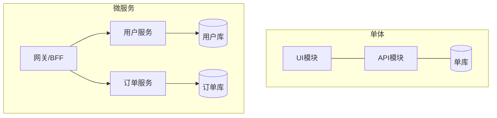
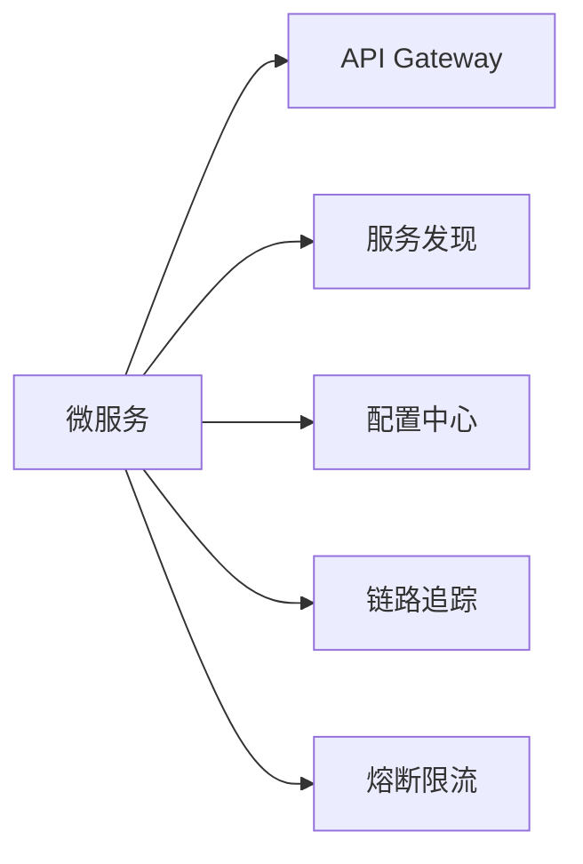
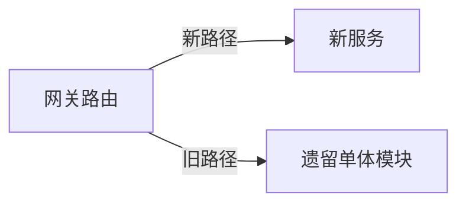
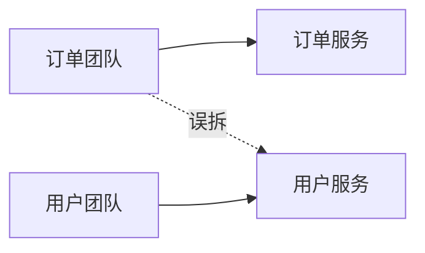
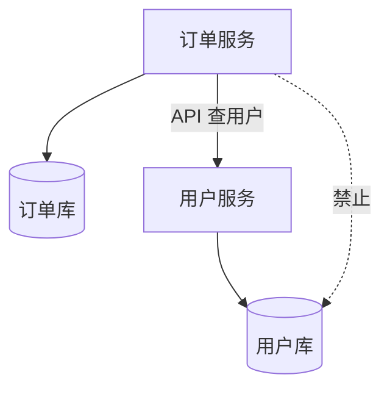

# 微服务 vs 单体

**单体**一个部署单元包含全部模块；**微服务**按业务能力拆成独立服务、独立部署 — 权衡在**复杂度、一致性、运维与团队边界**，而非「微服务更先进」。浏览器侧也可用 Module Federation 等做**前端分解**；本篇聚焦后端与服务拓扑。

---

## 架构对比



| 维度 | 单体 | 微服务 |
|------|------|--------|
| 部署 | 一次发布全站 | 服务独立发布 |
| 数据 | 单库 ACID 易 | 库隔离，分布式事务 |
| 扩展 | 整体扩副本 | 热点服务单独扩 |
| 故障 | 一挂全挂 | 隔离（若依赖管理好） |
| 团队 | 小团队友好 | Conway 定律，按域分队 |
| 复杂度 | 代码腐化风险 | 网络、观测、治理 |

---

## 何时仍选单体

| 条件 | 理由 |
|------|------|
| 产品早期 | 迭代速度 > 拆分收益 |
| 团队 < ~10 人 | 运维与治理成本 |
| 强一致核心域 | 单库事务简单 |
| 流量可预测 | 垂直扩容够用 |

**模块化单体**：代码分模块、单进程 — 许多「后来微服务化」公司的中间态。

---

## 微服务配套能力



| 能力 | 作用 |
|------|------|
| **BFF** | 面向 Web/Mobile 聚合 API |
| **Gateway** | 鉴权、路由、限流 |
| **Service Mesh** | mTLS、重试、指标 sidecar |
| **Saga/TCC** | 跨服务事务 |

前端通常只调 **BFF 或 Gateway** 一个入口 — 减少客户端感知服务数量。

---

## 与「微前端」的类比

| 后端微服务 | 前端微前端 |
|------------|------------|
| 服务边界 | 应用/团队边界 |
| API 契约 | Module Federation / npm 包 |
| 独立部署 | 独立构建部署子应用 |
| 分布式追踪 | 统一错误监控、RUM |

**不同步拆分**：后端 20 个服务 + 前端单体 BFF 常见；前端 Module Federation 而后端单体也常见 — 按瓶颈拆。

---

## 演进路径

```plaintext
单体 → 模块化单体 → 抽出热点服务 → 全面微服务（可选）
 strangler fig：新功能新服务，旧模块渐退
```

| 信号该拆 | 信号别急着拆 |
|----------|--------------|
| 某模块独立扩缩 | 仅为「技术时髦」 |
| 发布互相阻塞 | 无 DevOps/观测基建 |
| 团队 ownership 清晰 | 核心事务强一致难 Saga |



---

## 分布式 monolith（最糟形态）

服务很多，但**同步链式调用**、共享数据库、紧耦合 — 有微服务运维成本，无隔离收益。订单与支付必须同事务成功时，拆两服务后常用 **Saga/TCC**，而非幻想跨服务本地事务。

微前端 Module Federation 解决的是**前端独立部署**，不解决后端数据一致 — 两边拆分决策独立。

---

## 团队与 Conway 定律



| 原则 | 说明 |
|------|------|
| **Conway** | 系统结构≈沟通结构 |
| **逆 Conway** | 先定边界再调团队（难但理想） |
| **BFF 归属** | 常归体验最接近的前端/fullstack 小队 |

拆分后 API 契约变更需**版本化** — 前端不宜同时追 10 个服务的 breaking change。

---

## API 版本与契约

| 策略 | 说明 | 前端影响 |
|------|------|----------|
| **URL 版本** | `/v1/users` | 并行多版本路由 |
| **Header** | `Accept: application/vnd.api+json; version=2` | 同 URL 不同契约 |
| **字段扩展** | 新字段 optional | 向后兼容优先 |

```plaintext
deprecation: Sunset header + 文档 deadline
breaking change → 新 major 版本，旧版维护窗口
```

**Consumer-driven contract test**（Pact 等）：前端/BFF 期望与 provider 快照比对 — CI 阻止 silent breaking。

---

## 数据所有权（Database per Service）

每个服务 **独占其数据库** — 其他服务不得直连 foreign DB，只能通过 API 或事件。



违反 ownership 会导致 **分布式 monolith**：表在 A 库却被 B 服务 JOIN — 拆服务后无法独立部署。

前端需要的「用户昵称」应由 BFF 聚合订单 API + 用户 API，而非假设后端一个 SQL JOIN。

---

## 平台团队与产品团队

| 角色 | 职责 |
|------|------|
| **平台/SRE** | K8s、网格、CI、可观测基座 |
| **产品小队** | 域内服务 + BFF |
| **架构治理** | 标准、模板、ADR 评审 |

微服务成功依赖 **自助式平台** — 若每个小队自建 K8s，运维成本会压过拆分收益。Conway 定律：组织结构与 service boundary 对齐，否则出现「组织拆成两队仍改同一 repo」。

---

## 拆分粒度启发式

| 问 | 若「是」 |
|----|----------|
| 能否一句话说清 bounded context？ | 边界候选 |
| 能否独立扩缩该模块？ | 值得拆 |
| 发布是否被无关模块阻塞？ | 考虑拆 |
| 强一致跨模块事务是否每日发生？ | 先别拆或 Saga |

**Strangler Fig** 实操：网关把 `/api/v2/orders/*` 路由到新服务，旧单体仍处理其余路径 — 前端可逐步切 API base path，无需大爆炸重写。

```javascript
// 渐进迁移 — 环境变量切换 BFF 上游
const ORDER_API = import.meta.env.VITE_ORDER_SERVICE_URL ?? '/api/legacy/orders';
```

---

## 可观测与故障隔离

微服务 **故障隔离** 仅在依赖治理到位时成立：超时、熔断、bulkhead。否则一个慢用户服务拖垮整个 BFF 线程池。

| 信号 | 用途 |
|------|------|
| **RED** Rate Errors Duration | 服务健康 |
| **USE** Utilization Saturation Errors | 资源 |
| **Trace** | 跨服务 latency |

前端 RUM（真实用户监控）补后端 blind spot — 某 Region CDN 到 API 慢，后端 metrics 仍「全绿」。

---

## 组织与发布节奏

| 单体 | 微服务 |
|------|--------|
| 统一发布列车 | 各队独立 release |
| 全量回归 | 契约测试 + 金丝雀 |
| 单仓库 PR | 多仓库 + 依赖版本 |

**Release train** 在微服务环境常改为 **按域发布** — 订单服务周三发、用户服务周五发，BFF 需兼容两版 API 直至 consumer 升级完毕。

共享 **内部 SDK**（鉴权、日志、trace 注入）可降低 20 个服务各自 copy-paste 的 drift — 平台团队维护，产品团队消费。

**Anti-corruption layer**（防腐层）：BFF 把下游多个服务的 DTO 转成前端稳定契约 — 后端内部重构不迫使 SPA 每周改类型。

| 层级 | 职责 |
|------|------|
| **Gateway** | 鉴权、限流、路由 |
| **BFF** | 聚合、裁剪字段、适配 UI |
| **域服务** | 业务规则与持久化 |

前端 TypeScript 类型应以 BFF 契约为准，而非直接 mirror 各微服务内部模型。

---

## 小结

单体简单、事务易；微服务独立扩展与发布，代价是分布式复杂度。选型看团队规模、一致性与发布频率，非教条。BFF 是前端与微服务之间的惯用缓冲。

**易混点**：微服务≠容器（单体也可 Docker）；拆服务不自动解决代码质量；分布式 monolith（紧耦合调用链）最糟。

核对：订单与支付必须同事务成功，拆两服务后用什么模式？微前端 Module Federation 解决的是部署还是后端一致性问题？Database per Service 为何禁止跨库 JOIN？
