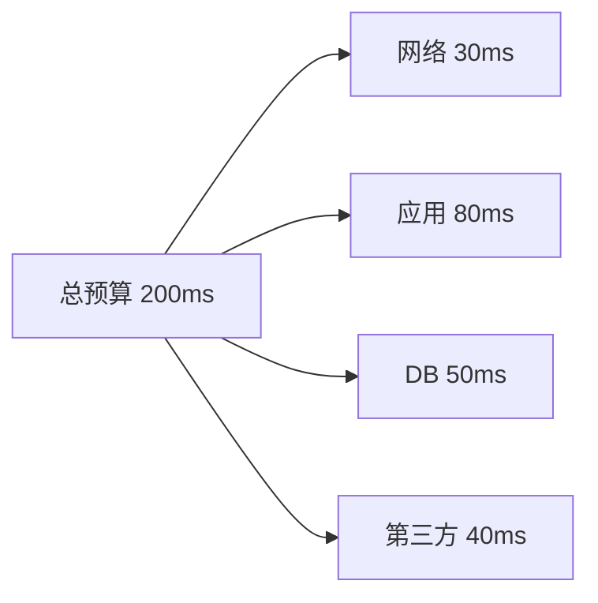
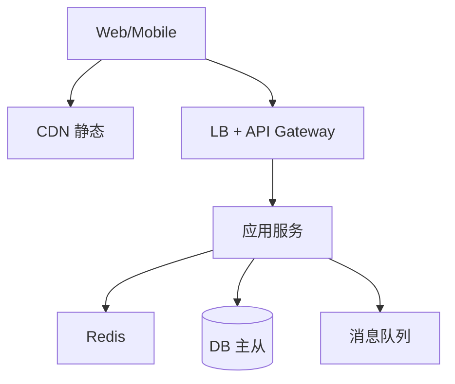
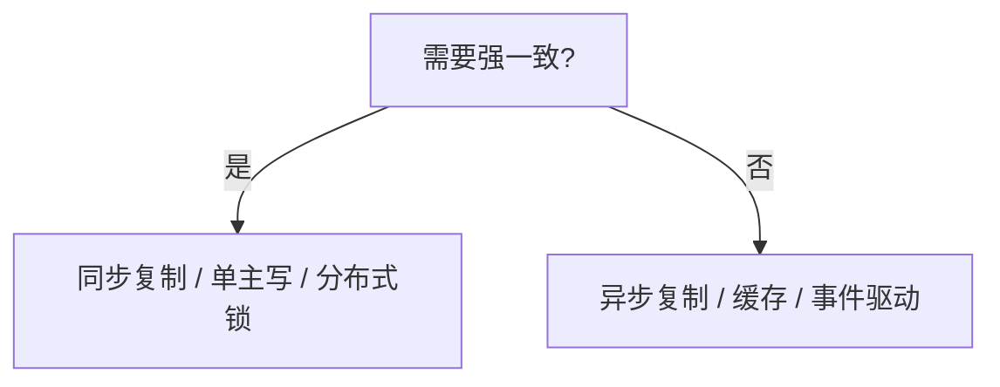

# 系统设计方法论与估算

系统设计面试与真实立项共用一套流程：**澄清需求 → 估算规模 → 画高层架构 → 深潜瓶颈 → 权衡取舍**。全栈工程师不必背「百万 QPS 标准答案」，但要能数量级估算 storage/QPS/带宽，并把方案与 CAP、一致性、分区容错等分布式概念对齐。

---

## 设计流程


| 步骤 | 要问 |
|------|------|
| **功能** | 核心用例、读写比 |
| **非功能** | QPS、延迟、可用性、一致性 |
| **约束** | 预算、团队、合规 |
| **范围** | MVP 砍什么 |

---

## 容量估算（Back-of-envelope）

```plaintext
日活 DAU → 峰值 QPS ≈ DAU × 人均请求 / 86400 × 峰值系数(2~10)
存储 ≈ 记录数 × 单条大小 × 副本系数
带宽 ≈ QPS × 平均响应体大小
```

**例**：1000 万 DAU，每人每天 20 次读 API，峰值 5×：

```plaintext
平均 QPS ≈ 10^7 × 20 / 86400 ≈ 2315
峰值 QPS ≈ 1.2 万
```

| 资源 | 粗算 |
|------|------|
| **1 台现代 API** | 1k~10k 简单 JSON QPS（视逻辑） |
| **Redis** | 10 万+ ops/s 单实例量级 |
| **HDD 顺序写** | ~100 MB/s；SSD 更高 |

估算只为**选对数量级**（要不要分库、要不要 MQ），非精确采购。

---

## 存储与带宽速算

| 题目 | 算法 |
|------|------|
| 100 万条 × 2KB | ≈ 2 GB 裸数据（+索引约 ×1.5~3） |
| 峰值 1 万 QPS × 5KB 响应 | ≈ 50 MB/s 出口带宽 |
| 3 年日志留存 | 日增量 × 365 × 3 × 副本 |

读:写 = 10:1 时通常**先优化读路径**（缓存、CDN、读副本），写瓶颈再考虑分片与 MQ 异步化。

---

## 非功能需求拆解

| 维度 | 典型指标 | 设计影响 |
|------|----------|----------|
| **延迟** | P50/P99 API <200ms | 缓存、就近部署、异步化 |
| **可用性** | 99.9% ≈ 月宕 43 min | 多 AZ、无单点、熔断 |
| **一致性** | 强一致 vs 最终一致 | 主从 lag、MQ 顺序 |
| **耐久性** | RPO/RTO | 备份频率、多副本 |
| **成本** | 单请求成本 | 冷热分层、归档 |

```plaintext
SLO 示例：订单创建 P99 < 500ms，可用性 99.95%
SLI：网关 + 应用 + DB 分段打点，定位哪段拖 P99
```

面试与立项都应把「成功标准」写成**可度量**的 SLO，而非「要快、要稳」。

---

## 延迟预算分解

| 环节 | 典型预算 | 超标时手段 |
|------|----------|------------|
| 客户端 RTT | 20~100ms | CDN、边缘、HTTP/2 |
| 网关 + LB | 1~5ms | 连接复用、少 hop |
| 应用逻辑 | 10~50ms | 缓存、并行 RPC |
| DB 查询 | 5~30ms | 索引、读写分离 |
| 外部依赖 | 视 SLA | 超时、熔断、异步 |



P99 由**最慢一段**主导 — 优化应先看 trace 瀑布图，而非均匀加机器。

---

## 高层架构模板



| 组件 | 何时上 |
|------|--------|
| CDN | 静态资源、可缓存 API |
| 缓存 | 读多写少、可接受 stale |
| MQ | 异步、削峰、解耦 |
| 分库 | 单库 TB 级或写瓶颈 |

---

## 深潜与权衡

| 瓶颈类型 | 典型症状 | 优先手段 |
|----------|----------|----------|
| **读放大** | DB CPU 高、慢查询多 | 缓存、读副本、CDN |
| **写放大** | 主库连接打满 | 分片、MQ 异步、批量写 |
| **热点** | 单 key/单行竞争 | 分桶、本地缓存、排队 |
| **级联故障** | 下游超时拖垮线程池 | 限流、熔断、超时 |
| **跨域查询** | 分片后 JOIN 失败 | 宽表、搜索索引、CQRS |

权衡文档应写清：**选了什么、放弃了什么、何时 revisit**。例如「读路径走缓存，接受 10min stale，写后删缓存保证最终一致」。

```plaintext
决策矩阵（简）
         │ 延迟 │ 一致 │ 复杂度 │ 成本
缓存     │ 优   │ 中   │ 低     │ 低
读副本   │ 优   │ 弱   │ 中     │ 中
分片     │ 中   │ 中   │ 高     │ 高
```

---

## 分区与一致性初判

| 场景 | 倾向 | 理由 |
|------|------|------|
| 库存扣减 | CP，强一致 | 超卖不可接受 |
| 点赞计数 | AP，最终一致 | 数字略差可接受 |
| 用户 profile | 读己之写 | 刚改头像需立即可见 |
| 搜索列表 | 最终一致 | CDC 延迟可容忍 |



CAP 不是三选一，而是**在分区发生时**在 C 与 A 间取舍；正常网络下两者可兼得。

---

## 前端视角的参与点

| 参与 | 内容 |
|------|------|
| **接口契约** | 分页、幂等键、错误码 |
| **体验与一致** | 乐观 UI vs 服务端确认 |
| **静态与 SSR** | CDN、边缘渲染边界 |
| **监控** | 核心 Web Vitals 与 API 关联 trace |

```javascript
// 前端可协助定义 SLO 可观测点
performance.mark('api-checkout-start');
await checkout();
performance.mark('api-checkout-end');
performance.measure('checkout', 'api-checkout-start', 'api-checkout-end');
```

BFF 层可聚合多 RPC 为一次 RTT — 估算时把「移动端首屏请求数」纳入 QPS 与延迟预算。

---

## 面试白板节奏（15～45 min）

```plaintext
0-5 min   澄清功能 + 非功能 + 规模假设
5-10 min  粗算 QPS/存储
10-20 min 画 Client → LB → Svc → DB/Cache/MQ
20-35 min 深潜 1～2 瓶颈（缓存/分片/热点）
35-45 min 权衡 + 监控 + 扩展路线
```

面试官常在中途改需求（「DAU 翻 10 倍」）— 保持架构**可演进**，指出哪一层先成为瓶颈。

---

## 常见估算陷阱

| 陷阱 | 修正 |
|------|------|
| 只算 DAU 不算峰值系数 | 秒杀/晚高峰 ×5~×10 |
| 忽略索引与副本 | 存储 ×1.5~3 |
| QPS 当连接数 | 长连接 WebSocket 另算 |
| 忘记日志/埋点体积 | 行为日志常超业务表 |
| 只算 happy path | 重试、轮询、定时任务乘系数 |

```plaintext
练习：日 100 万条 1KB 日志，保留 90 天，3 副本
≈ 10^6 × 1KB × 90 × 3 ≈ 270 GB 量级
```

---

## MVP 与演进路线

| 阶段 | 目标 | 典型架构 |
|------|------|----------|
| **0→1** | 验证需求 | 单体 + 单库 + 垂直扩容 |
| **1→10** | 稳定与观测 | 主从、缓存、基础监控 |
| **10→100** | 吞吐与可用 | 分片、MQ、多 AZ |
| **100+** | 成本与治理 | 冷热分层、平台化、SRE |

```plaintext
演进原则：先让系统跑通，再在真实流量下用 metrics 证明瓶颈，再引入复杂度
过早分片 = 运维税 + 跨片查询债
```

---

## 小结

系统设计 = 需求 + 估算 + 分层架构 + 针对瓶颈深潜。数量级估算避免 over/under-engineering；文档化权衡便于团队对齐。

**易混点**：QPS 与并发连接数不同；存储估算勿忘索引与日志；峰值系数因产品而异（秒杀 vs 办公 SaaS）；P99 优化应看分段延迟而非平均 QPS。

核对：100 万条 2KB 记录大约多大？读:写=10:1 时先优化读还是写路径？库存扣减应倾向 CP 还是 AP？延迟预算 200ms 时 DB 段通常留多少？
