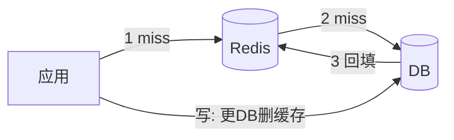
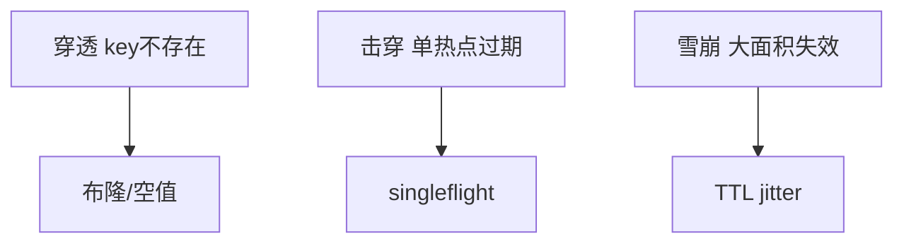
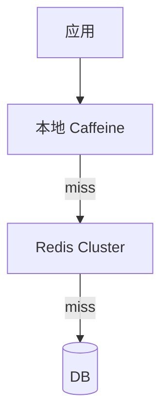

# 缓存设计

读多写少场景，**缓存**是性价比最高的加速层 — 设计需同时回答：放哪一层、TTL 多长、如何失效、以及**穿透/击穿/雪崩**三类经典故障。本篇聚焦工程决策：模式选型、一致性边界与可观测性。

---

## 缓存模式回顾



| 模式 | 写路径 |
|------|--------|
| **Cache-Aside** | 先更新 DB，再删缓存（推荐默认） |
| **Read-Through** | 缓存层封装读，miss 时缓存代查 DB |
| **Write-Through** | 写缓存，缓存同步写 DB |
| **Write-Behind** | 写缓存异步刷 DB — 慎用 |

Cache-Aside 应用最熟、故障域最小；Write-Behind 适合写 burst 但丢数据风险高，需 WAL 与对账。

---

## 三大问题

### 缓存穿透

**查询不存在的数据**，缓存与 DB 均无 → 每次打 DB。

| 防御 | 说明 |
|------|------|
| **布隆过滤器** | 大概率拦截不存在 key |
| **空值缓存** | `null` 短 TTL（如 60s） |
| **参数校验** | 非法 id 直接拒 |

```javascript
async function getProduct(id) {
  if (!isValidId(id)) return null;
  const key = `product:${id}`;
  const cached = await redis.get(key);
  if (cached === 'NULL') return null;
  if (cached) return JSON.parse(cached);
  const row = await db.products.find(id);
  if (!row) {
    await redis.setex(key, 60, 'NULL');
    return null;
  }
  await redis.setex(key, 3600, JSON.stringify(row));
  return row;
}
```

### 缓存击穿

**热点 key 过期瞬间**，并发全打 DB。

| 防御 | 说明 |
|------|------|
| **互斥锁** | 单飞（singleflight）重建 |
| **逻辑过期** | 值带过期时间，异步刷新不过期 key |
| **热点永不过期** | 后台定时更新 |

### 缓存雪崩

**大量 key 同时过期**或 **Redis 集群宕机**。

| 防御 | 说明 |
|------|------|
| **TTL 加随机 jitter** | `base + random(0, 300)` |
| **多级缓存** | 本地 Caffeine + Redis |
| **限流降级** | DB 保护，熔断回退 |
| **高可用** | Redis Cluster / 多 AZ |

---

## 对比表

| 问题 | 根因 | 典型手段 |
|------|------|----------|
| **穿透** | 恶意/脏 key | 布隆、空缓存 |
| **击穿** | 单热点过期 | 互斥、逻辑过期 |
| **雪崩** | 集体失效/宕机 | jitter、多级、熔断 |



---

## TTL 与一致性分级

| 数据类型 | TTL 策略 | 一致性 |
|----------|----------|--------|
| 商品详情 | 5~30 min + jitter | 写后删缓存 |
| 用户 session | 与登录态绑定 | 登出主动删 |
| 配置/字典 | 长 TTL + 推送失效 | 变更广播 |
| 计数/榜单 | 短 TTL 或逻辑过期 | 可接受近似 |

```plaintext
原则：越热的数据 TTL 越长 + 主动刷新；越敏感的数据 TTL 越短 + 写路径失效
```

**逻辑过期**结构示例：`{ value, expireAt }` — key 永不过期，过期后仍返回旧值并异步刷新，用户无 miss 尖刺。

---

## 多级缓存架构



| 层级 | 容量 | 延迟 | 注意 |
|------|------|------|------|
| **L1 本地** | MB 级 | μs | 多实例不一致，短 TTL |
| **L2 分布式** | GB 级 | ms | 热点、共享 |
| **L3 DB** | TB 级 | ms~s | 权威数据源 |

本地缓存适合**读极多、变更少、可接受秒级 stale** 的配置与字典；商品库存等强一致数据不宜只放 L1。

---

## 写顺序与并发

| 顺序 | 风险 |
|------|------|
| **先删缓存再写 DB** | 并发读在写完成前回填旧值 → 脏读 |
| **先写 DB 再删缓存** | 删失败短暂 stale，可接受或重试删 |
| **延迟双删** | 写 DB → 删缓存 → sleep → 再删，降低脏读窗口 |

更新缓存 vs 删缓存：并发写时**删更安全** — 避免两写交错留下不一致值。

布隆过滤器**假阳性**：不存在误判为存在 → 仍查 DB，只是略多一次查询，不会错数据。

---

## 预热、淘汰与容量

| 场景 | 做法 |
|------|------|
| **大促前** | 脚本批量加载热 SKU 到 Redis |
| **冷启动** | 灰度放量 + 逐步预热，避免集体 miss |
| **内存满** | Redis LRU/LFU；本地缓存 Caffeine maximumSize |
| **大 key** | 拆分 hash、压缩 JSON、避免整表塞一个 key |

```javascript
// 预热示意
async function warmUp(skuIds) {
  const rows = await db.products.findMany(skuIds);
  const pipe = redis.pipeline();
  for (const row of rows) {
    pipe.setex(`product:${row.id}`, 3600, JSON.stringify(row));
  }
  await pipe.exec();
}
```

---

## 监控指标

| 指标 | 含义 | 告警 |
|------|------|------|
| **hit rate** | 命中 / (命中+miss) | 突降 → 穿透或 TTL 异常 |
| **miss latency** | miss 回源耗时 | 升高 → DB 或网络问题 |
| **evicted keys** | 内存淘汰数 | 持续高 → 容量不足 |
| **connected clients** | 连接数 | 泄漏或实例过多 |
| **slowlog** | 慢命令 | 大 key、全量 scan |

```plaintext
目标：hit rate > 90%（视业务）；P99 miss 路径 < 50ms
```

---

## 与前端

| 实践 | 说明 |
|------|------|
| **SWR / staleTime** | 客户端缓存类比击穿 — 后台 revalidate |
| **ETag** | 减少无效 body |
| **静态 hash** | 永不过期文件名 |

列表页缓存：注意**分页深度**与**排序变更**导致 stale 列表 — 写后 `invalidate` 相关 query key。

HTTP `Cache-Control: max-age` 与 CDN 边缘缓存是**最外层缓存** — 与 Redis 配合时注意 `private` vs `public` 及 purge 策略。

---

## singleflight 示意

```javascript
const inflight = new Map();

async function getWithSingleFlight(key, loader) {
  if (inflight.has(key)) return inflight.get(key);
  const p = loader().finally(() => inflight.delete(key));
  inflight.set(key, p);
  return p;
}
// 热点 key 过期瞬间，仅一个请求回源 DB
```

分布式场景可用 Redis `SET key NX EX` 作**分布式锁**，持锁方回源，其余等待或短暂读 stale。

| 锁策略 | 优点 | 缺点 |
|--------|------|------|
| **进程内 singleflight** | 零依赖 | 多实例仍击穿 |
| **Redis 分布式锁** | 集群级互斥 | 需防死锁、设 TTL |
| **逻辑过期 + 异步刷新** | 无 miss 尖刺 | 短暂 stale |

---

## 小结

默认 Cache-Aside + 写后删缓存；穿透防不存在、击穿防热点过期、雪崩防集体失效与单点。TTL jitter 与 singleflight 是低成本标配；多级缓存与逻辑过期应对极端热点。

**易混点**：击穿是单 key；雪崩是大面积；穿透 key 根本不存在；删缓存 vs 更新缓存（并发写时删更安全）；L1 本地缓存多实例间不一致。

核对：为何「先删缓存再写 DB」可能脏读？布隆过滤器假阳性会怎样？逻辑过期与物理 TTL 过期有何区别？hit rate 突降应排查哪些方向？
