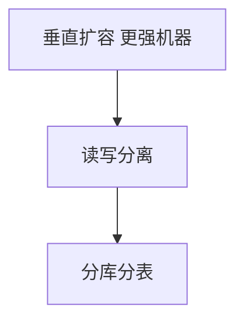
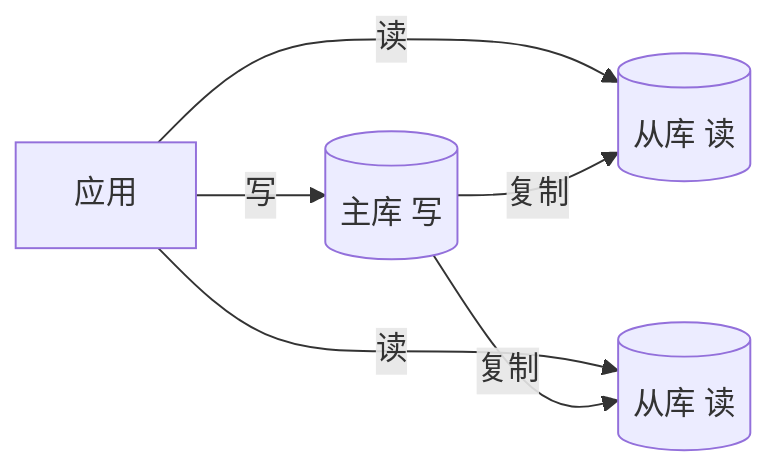

# 数据库扩展

单库触及**连接数、磁盘、写 QPS** 上限时，扩展路径为：**垂直扩容 → 读写分离 → 分库分表 → NewSQL/Sharding**。索引与慢查询优化仍优先 — 未治理 SQL 就分片，只会把慢查询分散到更多机器。

---

## 扩展路线



| 阶段 | 适用 | 限制 |
|------|------|------|
| **垂直** | 早期 | 单机天花板 |
| **读副本** | 读 >> 写 | 复制滞后 |
| **分片** | 写与数据量 | 跨片查询难 |

---

## 读写分离



| 策略 | 说明 |
|------|------|
| **写主读从** | 默认 |
| **写后读主** | 登录/profile 等读己之写 |
| **中间件** | MyCat、ProxySQL 路由 |

前端：创建资源后跳转详情 API 应走**强一致读**或带 `?master=1`（若暴露）。

---

## 复制 lag 与读己之写

| 复制模式 | lag 量级 | 适用 |
|----------|----------|------|
| **异步** | ms~s | 一般读多写少 |
| **半同步** | 至少一从确认 | 降低丢数据窗口 |
| **同步** | 写延迟高 | 金融强一致 |

```plaintext
用户刚下单 → 详情页读从库 → 空订单（lag 窗口内）
修复：写后 N 秒内读主 / session sticky / 版本号校验
```

| 手段 | 说明 |
|------|------|
| **写后读主** | 同一请求上下文路由到主 |
| **会话 stickiness** | 用户 session 绑定主库一段时间 |
| **版本号** | 客户端带 `version`，从库版本落后则重试主 |

---

## 分库分表

```plaintext
垂直分库：用户库 | 订单库 — 按业务域
水平分表：orders_0 … orders_15 — 按 user_id % 16
```

| 选型 | 说明 |
|------|------|
| **分片键** | 高基数、查询常带 — user_id、tenant_id |
| **全局 ID** | 雪花、UUID、号段服务 |
| **跨片** | 尽量避免；必要时 ES 宽表、汇总表 |

```javascript
// 路由示意 — 同用户订单同片
function shardId(userId) {
  return userId % 16;
}
// SELECT * FROM orders_${shardId(userId)} WHERE user_id = ?
```

**二次分片**：倍数扩容（16→32）需数据迁移 — 双写或一致性哈希过渡；不能简单把 `mod 16` 改 `mod 32`。

---

## 分片迁移策略


| 阶段 | 操作 |
|------|------|
| **1. 双写** | 新数据按新规则写，旧数据仍可读 |
| **2. 回填** | 后台 job 迁移历史数据 |
| **3. 校验** | 新旧路由结果对账 |
| **4. 切读** | 读切到新片 |
| **5. 停旧写** | 下线旧路由 |

一致性哈希可在扩容时减少迁移量 — 仅相邻节点承担部分 key 迁移。

---

## 按 order_id 分片时查用户全部订单

| 方案 | 说明 |
|------|------|
| **冗余 user_id 索引表** | `(user_id → order_id 列表)` 或 ES |
| **分片键改 user_id** | 同用户同片，按 order_id 查需二级索引 |
| **CQRS 读模型** | OLTP 按 order 分片，查询走 ES 宽表 |

---

## 全局二级索引

| 类型 | 实现 | 代价 |
|------|------|------|
| **冗余表** | `(email → user_id)` 独立小表 | 双写一致 |
| **ES/搜索引擎** | 异步同步宽表 | 最终一致 |
| **Scatter-Gather** | 广播所有分片再合并 | 延迟随分片数升 |

```plaintext
反模式：分片后仍期望 SELECT * FROM orders WHERE status='pending' 全表扫
正解：按分片键查，或维护按 status 的汇总/索引表
```

---

## 替代与补充

| 方案 | 场景 |
|------|------|
| **CQRS** | 写模型 OLTP，读模型 ES/宽表 |
| **TiDB/Cockroach** | 透明分片 NewSQL |
| **归档** | 冷数据迁对象存储 |
| **连接池** | PgBouncer — 连接数≠ QPS |

---

## 与全栈

| API 设计 | 原因 |
|----------|------|
| 分页 cursor 优于 offset 深页 | 大表 offset 慢 |
| 批量接口 | 减 N+1 |
| 避免跨用户 JOIN | 分片后无法 |

Prisma/ORM 多数据源：读写分离在 driver 或 middleware 层配置。

---

## 连接与慢查询（扩展前必做）

| 优化 | 说明 |
|------|------|
| **索引** | 覆盖 WHERE/ORDER；避免函数包列 |
| **连接池** | `max_connections` 不是越大越好 |
| **慢查询日志** | >1s 优先治理 |
| **N+1** | ORM include/join 或 DataLoader |

```sql
-- 深分页反模式
SELECT * FROM orders ORDER BY id LIMIT 1000000, 20;
-- 改 cursor
SELECT * FROM orders WHERE id > :lastId ORDER BY id LIMIT 20;
```

扩展路线始终是：**先优化单库 → 读写分离 → 再分片**。

---

## 容量规划

| 信号 | 阈值（经验） | 动作 |
|------|--------------|------|
| 磁盘 | >70% | 归档、扩容、分片 |
| CPU | 持续 >60% | 索引、读写分离 |
| 连接 | 接近 max | 连接池、短连接 |
| 写 QPS | 主库瓶颈 | 分片、异步化 |
| 单表行数 | 亿级 | 水平分表 |

```plaintext
3 年存储 ≈ 日增量 × 365 × 3 × (1 + 索引系数) × 副本数
提前 6~12 个月规划分片，避免线上紧急迁移
```

---

## 雪花 ID 注意点

| 字段 | 说明 |
|------|------|
| **timestamp** | 时钟回拨需等待或抛错 |
| **workerId** | 多实例不可重复 |
| **sequence** | 同毫秒内自增 |

```plaintext
前端可见：ID 大致按时间递增 — 适合 cursor 分页
不可见：workerId 分配 — 运维/发号服务职责
```

UUID v4 随机 — 索引局部性不如雪花，但无协调；按场景选。

---

## 号段发号服务

| 模式 | 说明 |
|------|------|
| **DB 号段** | `UPDATE segment SET max=max+step`，内存发号 |
| **Redis INCR** | 简单，需持久化策略 |
| **Snowflake** | 趋势递增，依赖时钟 |

```plaintext
号段模式：每次从 DB 取 [1000, 2000)，进程内递增，用完再取
优点：DB 压力小；缺点：进程 crash 可能浪费号段
```

发号服务本身应**高可用** — 单点挂掉会导致全站无法创建订单。

分片环境下全局 ID 必须**跨片唯一** — 不可用数据库自增（每片各自递增会冲突）。
选号方案时同时评估：趋势递增（利于 cursor）、协调成本、时钟依赖。

---

## 小结

先垂直与索引，再读写分离，最后分片；分片键与全局 ID 是一等公民。CQRS/搜索索引解决跨片聚合读；迁移需双写与对账，不可直接改 mod。

**易混点**：分库≠分表；从库 lag 导致「刚写入查不到」；雪花 ID 依赖时钟与 workerId 分配；全局二级索引有双写或最终一致代价。

核对：按 order_id 分片时查「某用户全部订单」怎么办？16 片扩 32 片为何不能简单 mod 改 mod？写后读主有哪些实现方式？
