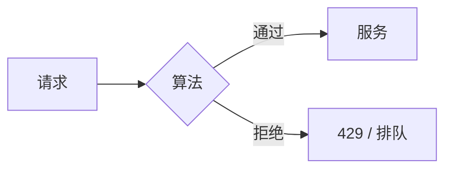
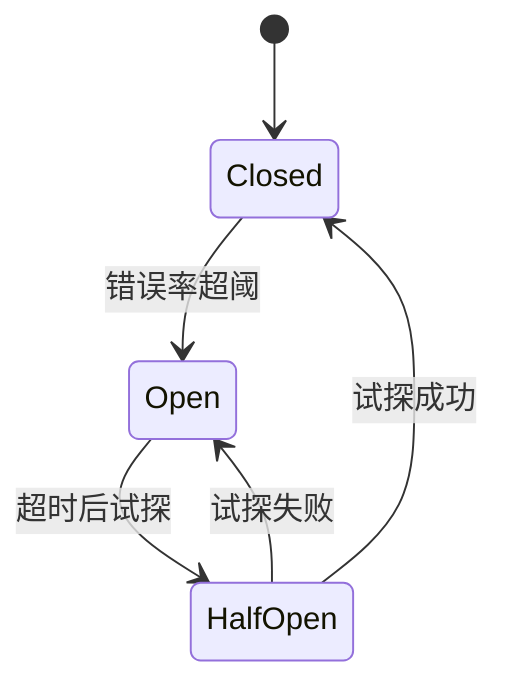
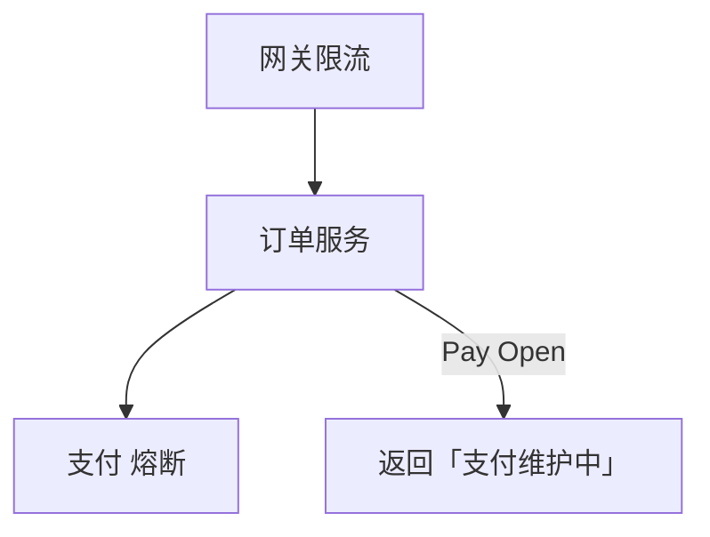
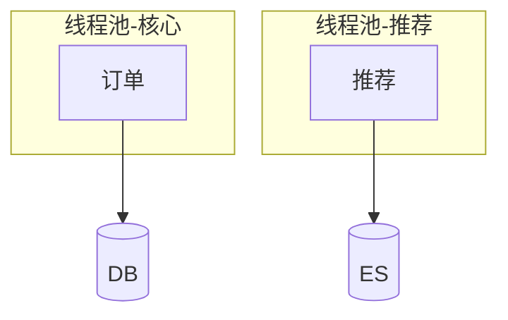

# 限流、熔断与降级

流量过载时，系统需在**拒绝、排队、简化**之间主动选择 — **限流**控入口速率，**熔断**防故障扩散，**降级**保核心路径。与 13-04 消息队列 削峰配合，是秒杀与高并发设计的 resilience 三件套。

---

## 限流（Rate Limiting）



| 算法 | 特点 |
|------|------|
| **固定窗口** | 实现简单，边界突发 |
| **滑动窗口** | 更平滑 |
| **令牌桶** | 允许可控突发 |
| **漏桶** | 恒定出口速率 |

| 粒度 | 例子 |
|------|------|
| 全局限流 | 网关 10k QPS |
| 用户/IP | 防刷 |
| 接口 | 登录 5/min |

```javascript
// 令牌桶示意（单进程）
class TokenBucket {
  constructor(rate, burst) {
    this.tokens = burst;
    this.rate = rate;
    this.last = Date.now();
  }
  tryTake() {
    const now = Date.now();
    this.tokens = Math.min(this.burst,
      this.tokens + (now - this.last) / 1000 * this.rate);
    this.last = now;
    if (this.tokens >= 1) { this.tokens--; return true; }
    return false;
  }
}
```

分布式限流：Redis + Lua 或专用组件（Sentinel、Envoy）。

**前端**：收到 429 应退避重试；展示「操作太频繁」。

---

## 令牌桶 vs 漏桶

| | 令牌桶 | 漏桶 |
|---|--------|------|
| **突发** | 允许 burst（桶内有令牌） | 出口恒定，突发排队 |
| **典型** | API 限流允许短 burst | 平滑下游恒定速率 |

---

## 熔断（Circuit Breaker）



| 状态 | 行为 |
|------|------|
| **Closed** | 正常调用 |
| **Open** | 快速失败，不调下游 |
| **Half-Open** | 放少量请求探测恢复 |

**目的**：下游 Payment 挂掉时，Order 服务不要线程池堵死等超时。

Half-Open **必要**：否则 Open 后永不去探测，下游恢复也无法自动恢复。

库：Resilience4j、opossum（Node）、Istio 出站策略。

---

## 降级（Degradation）

| 类型 | 例子 |
|------|------|
| **功能降级** | 关推荐位，保下单 |
| **读降级** | 返回默认头像/缓存旧数据 |
| **写降级** | 异步队列接单 |
| **体验降级** | 关动画、减图片分辨率 |

```plaintext
优先级：支付 > 库存 > 评论 > 推荐算法
```

与产品约定 **降级开关**（配置中心），演练「关非核心依赖仍可下单」。

---

## 组合场景



| 秒杀 | 手段 |
|------|------|
| 入口 | CDN + 网关限流 + 验证码 |
| 服务 | MQ 异步下单 |
| 依赖 | 熔断非核心（积分、推荐） |

秒杀场景常配合令牌桶限流、熔断兜底与静态化页面，避免热点打穿 DB。

---

## HTTP 状态码区分

| 码 | 常见含义 |
|----|----------|
| **429** | 限流，客户端应退避 |
| **503** | 服务不可用/过载，可重试 |
| **502** | 网关上游错误 |

熔断 Open 时对外常表现为快速 503/业务错误，而非长时间 hang。

---

## 舱壁隔离（Bulkhead）



推荐超时拖死订单线程池 — **舱壁**把线程池分开，与熔断互补。Node 单线程更靠**超时 + 熔断 + 独立 Worker**。

---

## 小结

限流保护自身；熔断保护调用链；降级保核心业务可完成。三者互补，需可观测（拒绝率、熔断状态）与演练。

**易混点**：熔断≠重试（Open 时应 fail fast）；429 是限流，503 可能是过载；降级数据需标注 stale 避免法律/合规问题。

核对：令牌桶与漏桶对「突发流量」态度有何不同？Half-Open 为何必要？SLA 与错误预算如何与熔断阈值联动？
