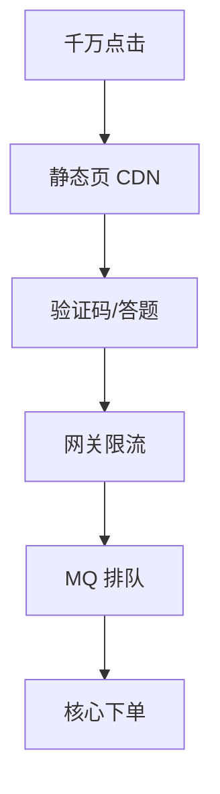
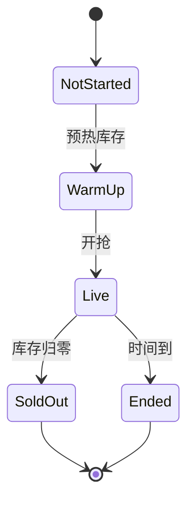
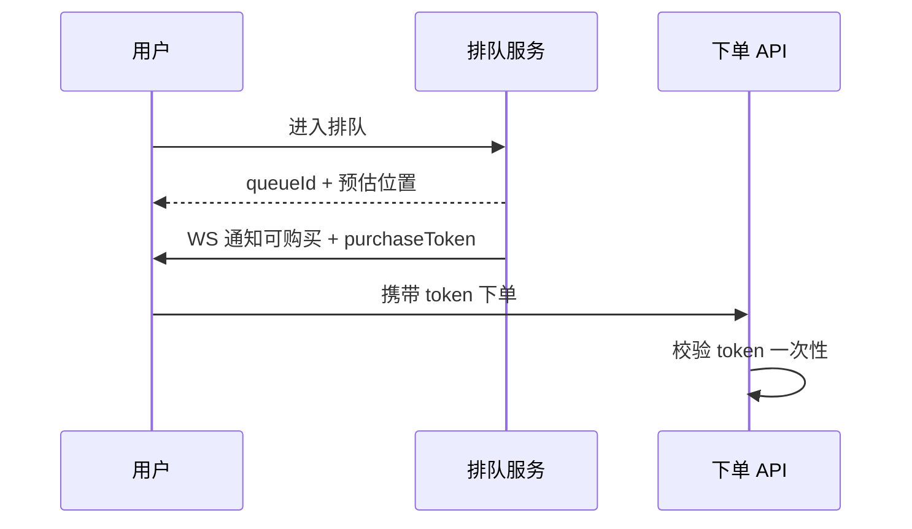

# 秒杀热点与高并发

**秒杀**把「瞬时超高并发写」压到极短时间 — 典型热点：库存扣减、防超卖、防刷。解法组合：**流量层层过滤、异步化、缓存与队列、数据层原子操作**，而非单靠前端按钮 `disabled`。

---

## 流量漏斗



| 层 | 作用 |
|----|------|
| **静态化** | 活动页纯静态，抗读 |
| **答题/验证码** | 人机筛选 |
| **排队页** | 令牌或 WS 通知可购买 |
| **MQ** | 写请求异步入队 |

前端：按钮防抖、服务端时间同步；**库存以服务端为准**，勿信本地 countdown 结果。

---

## 为何秒杀页尽量静态化

| 静态化 | 效果 |
|--------|------|
| HTML/JS 走 CDN | 源站不扛千万 QPS 读 |
| 库存/状态独立 API | 静态壳 + 小接口 |
| 活动数据预热 Redis | 开抢前加载，减少 DB |

动态 SSR 每个请求打源 — 秒杀峰值易拖垮应用层。

---

## 库存与超卖

| 方案 | 说明 |
|------|------|
| **DB 行锁** | `UPDATE stock SET n=n-1 WHERE id=? AND n>0` |
| **Redis 预减** | `DECR` + 异步落库；需对账 |
| **Lua 原子** | 判断+扣减一次完成 |

```lua
-- Redis Lua 原子扣减
local stock = tonumber(redis.call('get', KEYS[1]))
if stock <= 0 then return 0 end
redis.call('decr', KEYS[1])
return 1
```

| 模式 | 一致性 |
|------|--------|
| 纯 DB | 强，瓶颈在 DB |
| Redis 预减 + MQ | 高吞吐，最终一致 |
| TCC Try 冻结 | 分布式事务，复杂度高 |

Redis 预减成功但 DB 写入失败：MQ 消费失败进 DLQ + **补偿回滚 Redis** 或定时对账修正。

---

## 热点 key

同一商品库存 key 打满单 Redis 节点 — 典型缓存击穿场景。

| 手段 | 说明 |
|------|------|
| **本地缓存** | 秒杀开始前预热到各节点 |
| **分桶库存** | `stock:item:1:bucket{0..7}` 分散 |
| **请求合并** | 单飞扣减 |

分桶扣减：各桶独立 DECR，总库存 = 各桶之和；下单时随机选桶或按 userId 哈希，降低单 key QPS。

---

## 防刷与公平

| 手段 | 说明 |
|------|------|
| **用户/id 限购** | DB 唯一约束 (user, sku) |
| **Token** | 排队成功后发一次性 purchase token |
| **风控** | 设备指纹、行为序列 |
| **幂等** | `Idempotency-Key` 防重复下单 |

```javascript
await fetch('/api/seckill/order', {
  method: 'POST',
  headers: {
    'Idempotency-Key': `${userId}-${activityId}-${slot}`,
  },
  body: JSON.stringify({ skuId, token }),
});
```

前端限流**不能**防直接调 API — 必须网关 + 服务端校验 token。

---

## 活动状态机



| 状态 | 前端展示 | 后端 |
|------|----------|------|
| **NotStarted** | 倒计时 | 拒绝下单 |
| **WarmUp** | 排队入口 | 预加载 Redis |
| **Live** | 可抢 | 扣库存 + 入 MQ |
| **SoldOut** | 售罄 | 快速失败 |

状态以**服务端时钟 + Redis/DB 权威库存**为准，避免客户端改系统时间提前开抢。

---

## 排队与令牌



| 组件 | 作用 |
|------|------|
| **排队页** | 削峰到可接受 QPS |
| **purchaseToken** | 防脚本直连 API |
| **服务端时间** | 开抢时刻以 NTP 为准，前端仅展示 |

---

## 对账与补偿

| 场景 | 处理 |
|------|------|
| Redis 扣减成功，MQ 丢失 | 定时 Redis vs DB 库存对账 |
| MQ 消费失败 | 重试 + DLQ + 人工/自动补偿 |
| 重复消费 | 幂等表 `(order_id)` 唯一 |
| 超卖发现 | 关活动 + 退款 + 审计 |

```plaintext
对账 job（每 5 min）：
  redisStock = SUM(buckets)
  dbStock = SELECT stock FROM ...
  diff != 0 → 告警 + 以 DB 为准回写 Redis（或人工）
```

---

## 兜底与降级

| 层级 | 降级策略 |
|------|----------|
| **CDN** | 静态页始终可用 |
| **网关** | 429 + 友好排队页 |
| **下单 API** | 关闭非核心字段、异步通知 |
| **MQ 堆积** | 暂停新入队 + 扩容消费者 |
| **DB** | 只读模式展示历史订单 |

```javascript
// 降级开关示意 — 配置中心热更新
if (flags.seckill_degraded) {
  return { ok: false, code: 'QUEUE_FULL', retryAfter: 30 };
}
```

大促前必须演练：**Redis 宕机、MQ 延迟、DB 主从切换** 三条路径。

---

## 观测与压测

| 指标 | 说明 |
|------|------|
| 队列堆积 | 消费跟不上 |
| 超卖对账 | Redis vs DB 库存 |
| P99 下单延迟 | 含 MQ 消费 |
| 令牌校验失败率 | 刷接口信号 |
| 分桶热点 | 单 bucket QPS 倾斜 |

| 压测项 | 目标 |
|--------|------|
| 静态页 | CDN 命中率 >95% |
| 扣库存 | 零超卖、P99 <200ms |
| 全链路 | 峰值 2× 预估流量 |

全链路压测前：**隔离环境**、**限流兜底**、**降级开关** 就绪。

---

## 前端协作清单

| 项 | 要求 |
|----|------|
| **倒计时** | 展示服务端时间，非 `Date.now()` 独断 |
| **按钮态** | loading/disabled 由 API 响应驱动 |
| **错误码** | `SOLD_OUT` / `QUEUE_FULL` / `INVALID_TOKEN` 分态展示 |
| **重试** | 429 指数退避，勿疯狂连点 |
| **埋点** | 漏斗各层转化率，定位掉在哪一层 |

```javascript
// 开抢前同步服务端时间偏移
const { serverTime } = await fetch('/api/time').then(r => r.json());
const offset = serverTime - Date.now();
// 展示：Date.now() + offset
```

---

## 小结

秒杀 = 漏斗过滤 + 异步 + 原子扣库存 + 幂等防刷。Redis 预减换吞吐，DB 条件更新保正确；热点 key 需分桶与本地缓存；对账与 DLQ 是最终一致的最后防线。

**易混点**：前端限流不能防直接调 API；DECR 后 MQ 失败需补偿；「显示剩余 0」与「还能点」是体验 bug 非安全；分桶总库存需初始化与各桶之和一致。

核对：为何秒杀页尽量静态化？Redis 预减成功但 DB 写入失败如何处理？purchaseToken 为何要一次性？活动状态应以谁为准？
