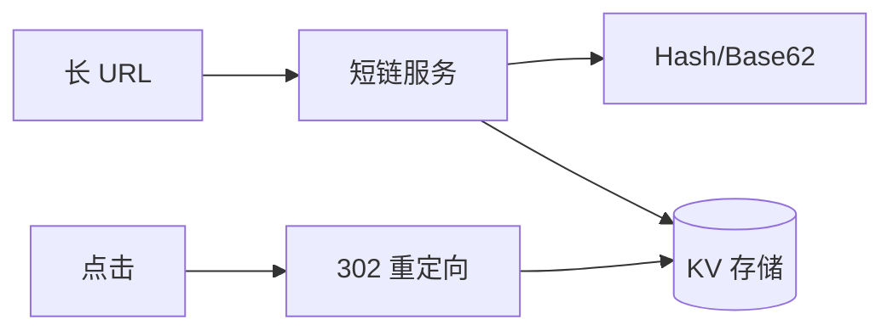
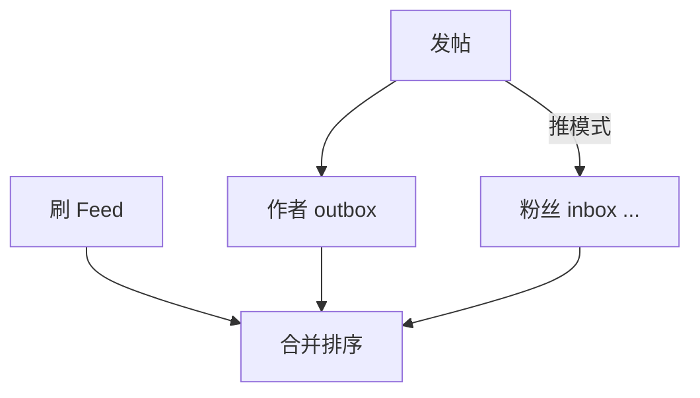
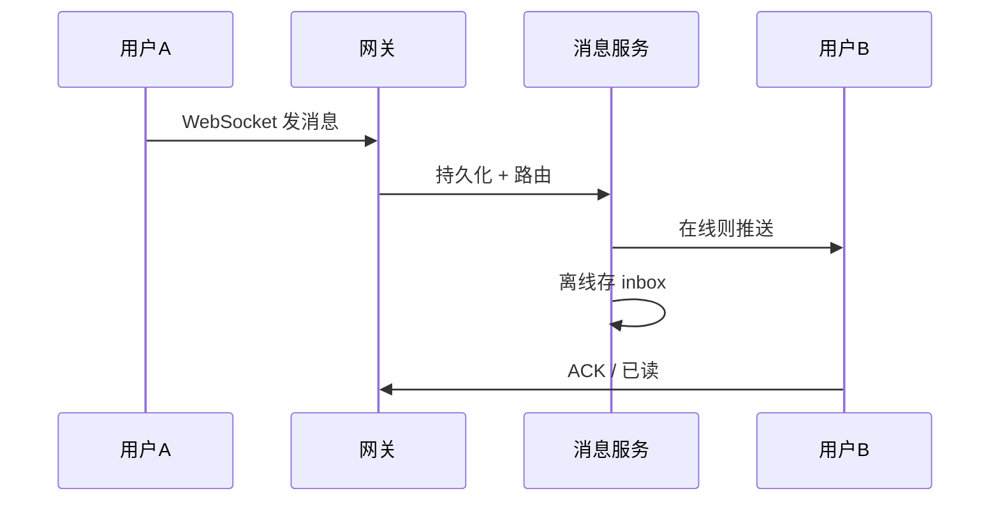

# 经典题型

面试与架构练手常出现**短链、Feed 时间线、IM** — 覆盖哈希、缓存、推拉结合、WebSocket 与分区。本篇给出高层方案与估算锚点，细节分别链到缓存、MQ、网络篇。

---

## 短 URL 服务



| 需求 | 设计 |
|------|------|
| 缩短 | 62 进制 id 或 MurmurHash + 冲突重试 |
| 跳转 | 301 永久 vs 302 临时（统计用 302） |
| 存储 | `short → long`；反查可选 |
| QPS | 读 >> 写 — Redis 缓存热链 |

```plaintext
62^7 ≈ 3.5×10^12 个 7 位码 — 够用
全局 ID：雪花发号 → Base62 编码
```

| 扩展 | 手段 |
|------|------|
| 分析 | 异步 log → ClickHouse |
| 过期 | TTL + 定时删 |
| 自定义短码 | 唯一约束 + 敏感词过滤 |

---

## Feed 时间线（Twitter/朋友圈）

| 模式 | 写 | 读 | 适用 |
|------|----|----|------|
| **推（Fan-out on write）** | 发推写所有粉丝 inbox | O(1) 读 | 粉丝少 |
| **拉（Fan-out on read）** | 只写作者 outbox | 读时聚合关注 | 大 V 粉丝百万 |
| **混合** | 普通用户推，大 V 拉 | 工业常见 |



| 组件 | 作用 |
|------|------|
| **分页** | cursor（post_id + time）非 offset |
| **缓存** | 用户 inbox 前几页 Redis |
| **媒体** | CDN + 异步转码 |

**100 万粉丝大 V 发帖用拉** — 推模式写放大 100 万次不可行。

前端：下拉刷新 = 拉新 cursor；上拉 = 旧 cursor；**未读数** WebSocket 或轮询。

---

## 即时通讯（IM）



| topic | 设计 |
|--------|------|
| **连接** | WebSocket + sticky LB 13-05 |
| **协议** | 心跳、重连、消息 id 去重 |
| **存储** | 会话分片；热会话缓存 |
| **顺序** | 会话内 seq 单调 |
| **群聊** | 写扩散 vs 读扩散 — 类似 Feed |

```javascript
const seen = new Set();
ws.onmessage = (e) => {
  const msg = JSON.parse(e.data);
  if (seen.has(msg.id)) return;
  seen.add(msg.id);
  appendMessage(msg);
};
```

离线推送：APNs/FCM；在线走 WebSocket 长连接。

---

## 三题对比

| | 短链 | Feed | IM |
|---|------|------|-----|
| 读:写 | 极高:低 | 高:中 | 中:中 |
| 核心难 | 缓存跳转 | fan-out | 连接+顺序 |
| 存储 | KV | 时间线多表 | 消息+会话 |

---

## 估算锚点（白板用）

| 题型 | 先算 |
|------|------|
| 短链 | 日创建量 → 存储；点击 QPS → Redis |
| Feed | 发帖 QPS × 粉丝数 → 写放大 |
| 题型 | 先算 |
|------|------|
| 短链 | 日创建量 → 存储；点击 QPS → Redis |
| Feed | 发帖 QPS × 粉丝数 → 写放大 |
| IM | 在线连接数 → 网关内存；消息 QPS → 分片 |

---

## 短链 302 与统计

```javascript
// 服务端记录点击 — 302 每次经过短链域
app.get('/:code', async (req, res) => {
  const long = await resolve(req.params.code);
  logClick(req.params.code, req.ip); // 异步，勿阻塞跳转
  res.redirect(302, long);
});
```

301 浏览器会缓存跳转，统计漏计 — 分析场景用 302。

---

## 小结

短链：Base62 + KV + 读缓存；Feed：推拉混合 + cursor 分页；IM：WS 长连接 + 持久化 + 幂等 msgId。三题都需估算 QPS 与存储。

**易混点**：302 才便统计点击；Feed 推模式大 V 是反例；IM 已读回执与消息投递语义不同。

核对：100 万粉丝大 V 发帖用推还是拉？短链 7 位 Base62 大概多少空间？
