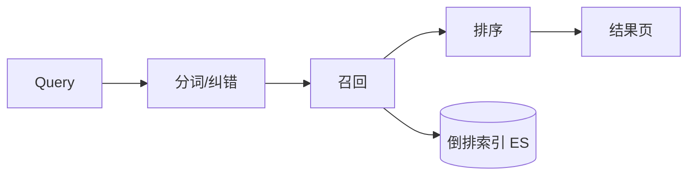
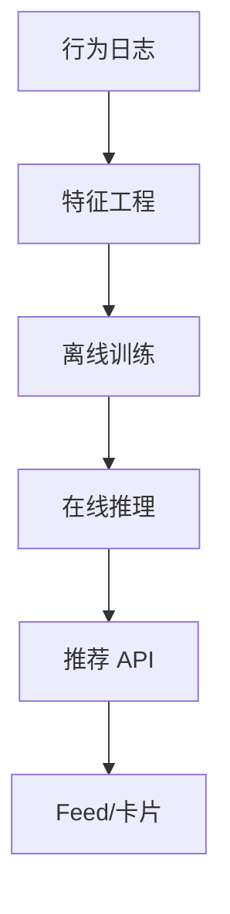

# 搜索与推荐概览

**搜索**解决「用户主动表达意图」；**推荐**解决「用户未表达时的发现」 — 工程上常共用**倒排索引、向量检索、特征与排序** pipeline，与 OLTP 库分工。前端负责 query 体验、debounce、高亮与埋点回传，核心算力在检索与模型服务。

---

## 搜索架构



| 阶段 | 说明 |
|------|------|
| **索引** | 文档 → 分词 → posting list |
| **召回** | BM25、布尔、过滤 |
| **排序** | 相关度 + 业务权重 + LTR |
| **聚合** | facet 筛选（品牌、价区） |

**Elasticsearch/OpenSearch**：全文 + 聚合；CDC 管道（Canal/Debezium）同步 MySQL → ES，OLTP 与检索分离。

```javascript
let ctrl;
function onSearchInput(q) {
  clearTimeout(timer);
  timer = setTimeout(async () => {
    ctrl?.abort();
    ctrl = new AbortController();
    const res = await fetch(`/api/search?q=${encodeURIComponent(q)}`, {
      signal: ctrl.signal,
    });
    render(await res.json());
  }, 300);
}
```

---

## 索引设计与 Mapping

| 字段类型 | 用途 | 注意 |
|----------|------|------|
| **text + analyzer** | 全文检索 | 中文需 ik 等分词 |
| **keyword** | 精确过滤、聚合 | 不分词 |
| **nested** | 嵌套对象 | 独立索引单元 |
| **date / long** | 范围、排序 | 格式统一 |

```json
{
  "mappings": {
    "properties": {
      "title": { "type": "text", "analyzer": "ik_max_word" },
      "brand": { "type": "keyword" },
      "price": { "type": "long" },
      "tags": { "type": "keyword" }
    }
  }
}
```

| 实践 | 说明 |
|------|------|
| **冷热索引** | 按时间 rollover，旧索引只读 |
| **副本数** | 读多可提高 replica |
| **refresh_interval** | 默认 1s，大促可放宽减写入压力 |

---

## 推荐架构



| 类型 | 例子 |
|------|------|
| **协同过滤** | 相似用户/物品 |
| **内容** | 标签、Embedding 相似 |
| **排序模型** | CTR 预估 DeepFM 等 |
| **冷启动** | 热门、注册问卷 |

**召回 + 粗排 + 精排** 漏斗 — 每级减候选量，控延迟（常 <100ms）。

---

## 排序与特征

| 阶段 | 输入 | 输出规模 |
|------|------|----------|
| **召回** | 用户/上下文 | 千~万级候选 |
| **粗排** | 轻量特征 | 百级 |
| **精排** | 全量特征 + 模型 | 十~几十 |

| 特征类型 | 例子 |
|----------|------|
| **用户** | 历史点击、地域、会员等级 |
| **物品** | 类目、价格带、CTR 统计 |
| **交叉** | 用户×类目偏好 |
| **上下文** | 时段、设备、页面位置 |

```plaintext
延迟预算 80ms 示例：
  召回 20ms + 粗排 15ms + 精排 35ms + 组装 10ms
精排超预算 → 减特征、蒸馏模型、GPU 批推理
```

---

## 向量检索（语义搜索/RAG）

| 组件 | 作用 |
|------|------|
| **Embedding** | 文本/图 → 向量 |
| **ANN** | HNSW、IVF 近似最近邻 |
| **混合检索** | BM25 + 向量 RRF 融合 |

| 融合方式 | 说明 |
|----------|------|
| **RRF** | 多路排名倒数加权，无需分数归一 |
| **加权分** | `α·BM25 + (1-α)·cosine` |
| **重排** | 向量召回 topK → 交叉编码器重排 |

前端 AI 搜索：流式 SSE 返回答案 + 引用 chunk — 与经典 ES 列表 UI 不同。

---

## 瓶颈通常在哪个阶段

| 阶段 | 瓶颈表现 |
|------|----------|
| **召回** | 候选集过大、索引慢 |
| **排序** | 精排模型 CPU/GPU、特征拉取 |
| **同步** | MySQL→ES 延迟，大促变更搜索慢半拍 |
| **特征存储** | Redis/特征平台 P99 升高 |

大促商品变更搜索延迟可见 — 因 **CDC 最终一致**，非 ES 作事务主库。

---

## 个性化与隐私

| 需求 | 实现 |
|------|------|
| **登录个性化** | userId 特征 + 历史行为 |
| **匿名** | 热门 + 上下文，不用 PII |
| **opt-out** | 关闭个性化开关，走非个性化排序 |
| **GDPR 删除** | 删用户特征 + 行为日志 |

```javascript
// A/B 实验桶
headers: { 'X-Experiment-Bucket': 'rec_v2' }
```

埋点需**最小必要**：曝光/点击/停留足够训练，避免上传敏感明文。

---

## 与全栈协作

| 点 | 实践 |
|----|------|
| **埋点** | 曝光、点击、停留 → 训练 |
| **A/B** | 实验桶 header / cookie |
| **降级** | ES 超时 → 仅 DB like 或热门 |
| **隐私** | 个性化与 GDPR — opt-out |

| 存储 | 适合 |
|------|------|
| MySQL | 交易、精确 |
| ES | 全文、筛选 |
| Redis | 热榜、session 特征 |
| 向量库 | Milvus/pgvector |

BFF 可聚合「搜索 + 用户权限过滤 + 埋点」— 浏览器不直连 ES，避免暴露集群与 DSL。

---

## 前端搜索体验要点

| 点 | 实践 |
|----|------|
| **debounce** | 300ms 常见，避免每键打 ES |
| **AbortController** | 取消陈旧请求，防结果乱序 |
| **高亮** | 后端返 offset 或前端 split 关键词 |
| **空态/骨架** | 首屏与无结果区分 |
| **facet** | 筛选变更重置 cursor 分页 |

```javascript
// 高亮示意 — 后端返 highlights 更稳
function highlight(text, query) {
  const re = new RegExp(`(${escapeReg(query)})`, 'gi');
  return text.replace(re, '<mark>$1</mark>');
}
```

搜索建议（SUG）通常走**独立轻量接口**或前缀 trie — 与完整搜索分离，P99 目标 <50ms。

| SUG 数据源 | 特点 |
|------------|------|
| **热词统计** | 离线 job 写 Redis ZSET |
| **前缀索引** | ES completion suggester |
| **个性化** | 用户历史 + 全局热词融合 |

---

## 小结

搜索靠倒排索引与排序；推荐靠日志、特征与多级漏斗；语义场景加向量 ANN。OLTP 与检索分离，同步管道保最终一致；mapping 与分词决定召回质量。

**易混点**：ES 非事务主库；推荐「实时」多指近线非毫秒级重训；BM25 与向量检索解决不同语义 gap；text 与 keyword 字段用途不可混用。

核对：为何大促商品变更搜索延迟可见？召回与排序瓶颈通常在哪个阶段？混合检索 RRF 与加权分有何区别？个性化关闭后排序应如何降级？
