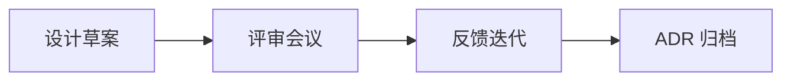
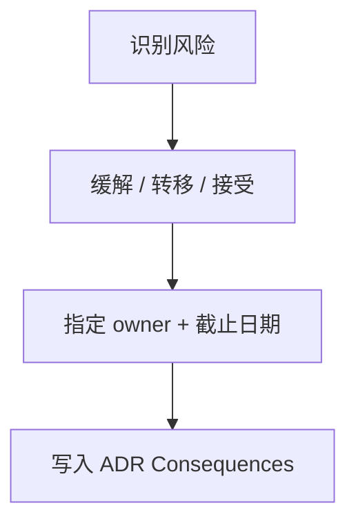
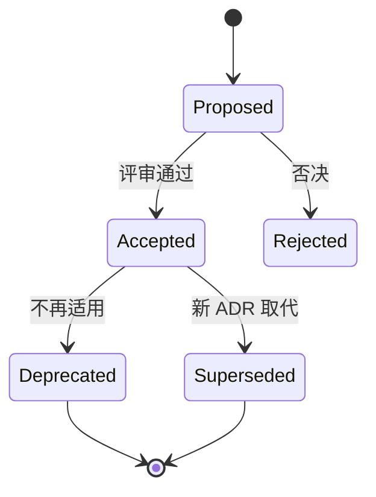

# 设计评审与 ADR 写作

架构决策若只留在口头，后续迭代必然**重复争论** — **设计评审**结构化讨论方案，**ADR（Architecture Decision Record）** 留下背景、选项与后果。全栈团队在前端 BFF、缓存、接口契约变更时同样适用，而非仅「后端文档」。

---

## 设计评审流程



| 阶段 | 产出 |
|------|------|
| **事前** | 1～2 页设计 doc：目标、非目标、方案、风险 |
| **评审** | 主审 + 相关方（FE/BE/SRE/安全） |
| **事后** | ADR 合并；任务拆分 Jira/Linear |

**评审焦点**：需求是否清楚、估算是否量级合理、单点与回滚、观测与降级。

---

## 设计文档结构

| 章节 | 内容 |
|------|------|
| **背景** | 现状痛点、触发原因 |
| **目标 / 非目标** | 做什么、明确不做什么 |
| **方案** | 架构图、数据流、接口变更 |
| **估算** | QPS、存储、成本量级 |
| **风险与缓解** | 单点、迁移、兼容性 |
| ** rollout** | 灰度、flag、回滚步骤 |
| **开放问题** | 待 Spike 或下次评审 |

```plaintext
篇幅：1~2 页正文 + 附录详设；评审前 24h 分发，会议不念稿
```

非目标同样重要 — 避免 scope creep（「顺便把推荐也做了」）。

---

## 评审清单（精简）

| 类别 | 问题 |
|------|------|
| **需求** | 成功标准？不做什么？ |
| **规模** | QPS、存储 3 年？ |
| **数据** | 一致性、迁移、备份 |
| **API** | breaking change？版本策略 |
| **安全** | 鉴权、PII、加密与审计 |
| **运维** | 部署、feature flag、回滚 |
| **前端** | 加载、错误态、幂等 UI |

避免：**方案对比缺失**、**只有 happy path**、**未 assign owner**。

---

## 风险评估矩阵

| 影响 \ 概率 | 低 | 中 | 高 |
|-------------|----|----|-----|
| **高** | 监控 | 缓解计划 | 阻塞或 Spike |
| **中** | 接受 | 监控 | 缓解 |
| **低** | 接受 | 接受 | 监控 |



评审结论应标注：**Accepted with conditions**（附 action items）而非模糊「再看看」。

---

## ADR 模板

```markdown
# ADR-00012: 订单读路径走 Redis 缓存

## 状态
Accepted | Superseded by ADR-0015

## 背景
订单详情 QPS 8k，MySQL P99 120ms，需降至 30ms 内。

## 决策
采用 Cache-Aside，TTL 10min，写后删缓存。

## 备选
- 只读从库：lag 导致刚下单详情空
- Write-Through：写路径复杂

## 后果
- 正：读延迟降，DB 压力减
- 负：极端 lag 需读主；缓存穿透需布隆（另立 ADR-0013）
```

| 字段 | 说明 |
|------|------|
| **Status** | Proposed / Accepted / Deprecated |
| **Context** | 为何现在要决 |
| **Decision** | 选了什么 |
| **Consequences** | 正负后果，含技术债 |

存放：`docs/adr/` 或 `architecture/decisions/`，与代码同 repo 版本化。

---

## ADR 索引与检索

| 实践 | 说明 |
|------|------|
| **编号** | ADR-0001 递增，标题含关键词 |
| **index.md** | 表格：编号、标题、状态、日期 |
| **标签** | `#cache` `#api` `#security` 便于搜 |
| **Supersedes 链** | 新 ADR 头部链接旧 ADR |

```plaintext
docs/adr/
  README.md      ← 索引与写作指南
  0012-order-cache.md
  0013-bloom-filter.md
  0020-profile-v2-api.md
```

新成员 onboarding：**先读 Accepted ADR 索引 → 再 dive 相关模块代码**。

---

## 与敏捷/PR 的关系

```plaintext
小改：PR description 含「动机 + 权衡」微 ADR
大改：先 ADR Accepted 再开工
推翻旧 ADR：新 ADR Supersedes，保留历史
```

| 实践 | 说明 |
|------|------|
| **RFC** | 更大范围、评论期（多团队、跨季度） |
| **Spike** | 时间盒验证后写 ADR |
| **Retro** | 决策错因回填 ADR |

**何时 RFC 而非 ADR**：影响多团队、需公开评论期、方案未定时 — ADR 记录**已决**；RFC 讨论**待决**。

前端例：选 TanStack Query vs SWR — 可 ADR 记录 stale 策略与 SSR 兼容。

---

## 技术债登记

| 来源 | 写入 ADR |
|------|----------|
| **已知妥协** | 「负：未做布隆，Q4 补」 |
| **临时方案** | 「Deprecated by ADR-00xx」 |
| **监控缺口** | Consequences 中列 SLI 待补 |

```markdown
## 技术债
- [ ] TD-42: 缓存穿透布隆过滤器 — owner @alice — due Q4
- [ ] TD-43: 读主路由仅覆盖下单 30s — 需配置化
```

技术债与 ADR **Consequences** 联动 — 避免债只存在于 issue 而决策文档无记录。

---

## 反模式

| 反模式 | 修复 |
|--------|------|
| ADR 写结果无备选 | 补 considered options |
| 永不更新 status | Supersede 链 |
| 评审=批准走过场 | 预读 doc，带问题 |
| 巨型 Word | 短 Markdown + 附录详设 |
| 决策与实现脱节 | 代码注释链 ADR 编号 |

Superseded ADR **不删除** — 保留历史与决策演进链。

---

## 示例：跨端 API 变更 ADR 片段

```markdown
# ADR-0020: 用户 profile 接口合并为 /v2/users/me

## 背景
/v1/profile 与 /v1/settings 双请求导致移动端首屏 2 RTT。

## 决策
BFF 提供聚合 `/v2/users/me`；v1 保留 6 个月 sunset。

## 后果
- 正：首屏少一次往返
- 负：FE/小程序需同步改；缓存 key 变更
- 迁移：Feature flag `use_v2_profile`，监控 404 与字段缺失
```

评审时 FE 确认：**字段 nullable**、**错误码**、**回滚是否仅切 flag**；缓存 key 变更需同步失效策略。

---

## 评审会议结构（30 min 模板）

| 时间 | 内容 |
|------|------|
| 0-5 min | 作者讲背景与目标 |
| 5-15 min | 方案 walkthrough + 估算 |
| 15-25 min | 提问：单点、回滚、观测 |
| 25-30 min | Action items + 是否写 ADR |

```plaintext
参与者：作者、FE/BE 各 1、SRE 或运维（可选）、安全（涉 PII 时必到）
事前：doc 提前 24h 发，评审时不再念 PPT
```

**Accepted ADR** 仍须 feature flag 与上线观测 — 评审通过≠无风险。

---

## ADR 状态流转



Rejected ADR 也可保留 — 记录「为何不选 B」避免后人重提。

---

## 异步评审与记录

| 场景 | 做法 |
|------|------|
| **跨时区** | 书面评论 + 48h 窗口，会议只决开放问题 |
| **小团队** | PR 内嵌微 ADR，weekly 批量 Accepted |
| **紧急 hotfix** | 事后补 ADR，标注 retroactive |
| **外部依赖** | 供应商 SLA 写入 Context，便于审计 |

文档与 ADR 使用**同一 repo** — PR 合并即版本化，避免 Wiki 与代码分叉。

---

## 小结

设计评审对齐风险与假设；ADR 记录决策与后果，避免后人重复踩坑。模板宜短，状态可演进，与代码仓库同步；技术债写入 Consequences 便于追踪。

**易混点**：ADR 非 API 文档；Accepted 仍可被 Supersede；评审通过≠上线无风险，需 flag 与观测；RFC 讨论待决、ADR 记录已决。

核对：何时用 RFC 而非 ADR？Superseded ADR 是否删除？新成员 onboarding 应先读 ADR 还是代码？技术债应写在 ADR 还是仅开 issue？
