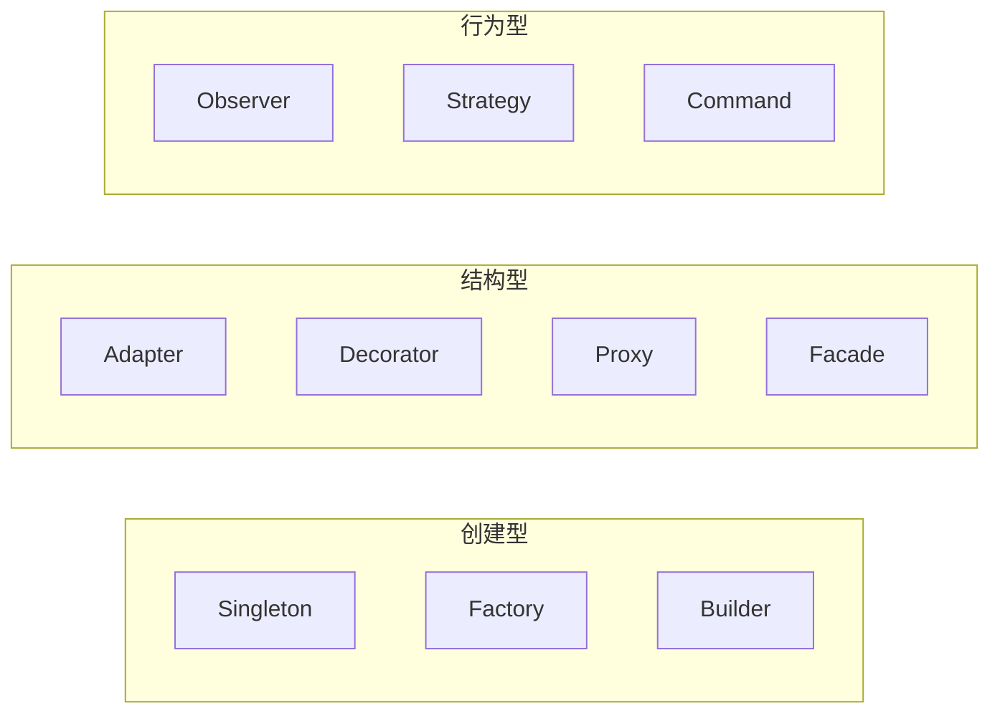
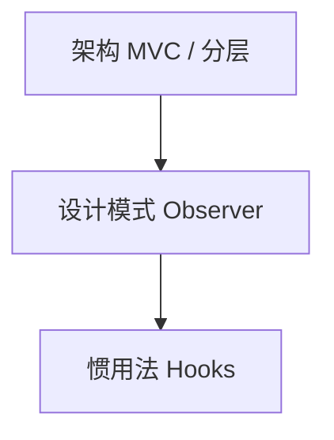
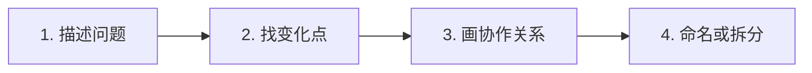

# 设计模式总览

**设计模式**是对反复出现的对象协作结构的命名与模板；GoF 23 种按创建、结构、行为分类，**SOLID** 则给出可维护设计的原则边界。前端工程里模式常体现为 Hooks、组合式 API、中间件 — 先认结构再谈套用，避免「为模式而模式」。

---

## GoF 分类一览



| 类型 | 关键问题 | 前端常见落点 |
|------|----------|--------------|
| **创建型** | 谁创建对象、如何隐藏构造细节 | 单例 Store、工厂创建图表实例 |
| **结构型** | 如何组装类/模块而不改核心 | 适配器封装旧 API、Proxy 做请求缓存 |
| **行为型** | 对象如何分工与通信 | 订阅发布、策略切换校验规则 |

GoF 原书面向 OOP；JS/TS 中「类」可换为函数、对象字面量、Hooks，**意图**不变。

---

## SOLID 原则

| 原则 | 含义 | 违反时的气味 |
|------|------|--------------|
| **S** 单一职责 | 一个模块只因一种变化而改 | 巨型 `utils.ts`、上帝组件 |
| **O** 开闭 | 对扩展开放、对修改关闭 | 每加一种支付方式改 `if/else` |
| **L** 里氏替换 | 子类型可替换父类型 | 子类抛「不支持」异常 |
| **I** 接口隔离 | 客户端不依赖无用方法 | 组件被迫实现空回调 |
| **D** 依赖倒置 | 依赖抽象而非具体实现 | 页面直接 `fetch` 硬编码 URL |

```typescript
interface UserRepo {
  getById(id: string): Promise<User>;
}
function UserProfile({ repo }: { repo: UserRepo }) {
  // 测试可注入 mock repo — 依赖倒置
}
```

**开闭**在前端常通过**策略表 + 注册**实现，而非继承树。

---

## 模式 vs 架构 vs 惯用法

| 概念 | 粒度 | 例子 |
|------|------|------|
| **惯用法** | 语言/框架约定 | React `useState`、Vue `ref` |
| **设计模式** | 类/模块间结构 | Observer、Decorator |
| **架构风格** | 系统级划分 | MVC、微前端、BFF |



面试答「用过什么模式」时，应说清**问题 → 结构 → 权衡**，而非背类图。

---

## 前端何时值得认模式

| 场景 | 可借鉴模式 | 注意 |
|------|------------|------|
| 全局状态一份 | Singleton（模块单例） | 与 React Context 职责区分 |
| 多图表库统一接口 | Adapter + Facade | 别过度抽象一层套一层 |
| 表单校验规则多变 | Strategy | 规则表优于继承 |
| 撤销/重做 | Command | 需 immutable 或快照 |
| 权限/日志横切 | Decorator / 中间件 | Vue 可用组合式函数 |

```javascript
// 模块单例 — ES Module 天然单次求值
export const store = createStore(reducer);
```

---

## 违反单一职责的前端例子

```tsx
// 气味：一个组件同时管路由、请求、表单、图表
function DashboardPage() {
  const [data, setData] = useState([]);
  useEffect(() => { fetch('/api/stats').then(r => r.json()).then(setData); }, []);
  const [form, setForm] = useState({});
  // ... 200 行 ECharts 配置 ...
  return (/* ... */);
}
// 拆：useStats() + StatsChart + SettingsForm
```

---

## 识别模式的四步流程

遇到重复结构时，按下面顺序走一遍，比直接套模式名更稳：



| 步骤 | 要问的问题 | 产出 |
|------|------------|------|
| 描述问题 | 哪段代码因什么需求反复改？ | 一句话问题陈述 |
| 找变化点 | 是创建方式变、结构组装变，还是行为策略变？ | 变化轴标签 |
| 画协作关系 | 谁依赖谁、谁通知谁？ | 简图或模块边界 |
| 命名或拆分 | 现有结构是否已够用？ | 抽取函数 / 命名模式 |

**例**：支付渠道从 1 种增到 4 种 — 变化点在「算法可替换」→ Strategy 或策略表；若只是多一个 `if` 分支且半年不变，函数内分支即可。

---

## 变化点与抽象边界

抽象应卡在**真正会变的轴**上，而非「将来也许」的轴：

| 变化类型 | 典型信号 | 常见模式 | 不必抽象的信号 |
|----------|----------|----------|----------------|
| 实例数量 | 全局只能一份连接/配置 | Singleton / 模块单例 | 组件内 `useRef` 够用 |
| 创建细节 | 调用方不应知道具体类名 | Factory | 只有一种图表且不换库 |
| 接口形状 | 新旧 API 字段不一致 | Adapter | 一次性迁移脚本 |
| 算法替换 | 规则/渠道/主题可插拔 | Strategy | 规则写死且产品确认不变 |
| 多对象通知 | 多处 UI 听同一事件源 | Observer | 父子两层 props 即可 |

```typescript
// 变化轴明确：校验规则随业务增删
type Rule = (v: string) => string | null;
const rules: Record<string, Rule> = {
  email: (v) => (/@/.test(v) ? null : '邮箱格式错误'),
  phone: (v) => (/^1\d{10}$/.test(v) ? null : '手机号错误'),
};
// 新增规则 = 新增表项，不改 validate() 主流程 — 开闭在表驱动处体现
```

边界过深时，调用方要跳转五六个文件才能改一行业务 — 这是**过度抽象**，不是模式本身的问题。

---

## 依赖倒置与可测试性

「依赖倒置」在前端最常体现为：**组件与 hook 不直接绑死 `fetch('/api/...')`，而是接受注入的数据源或 repository**。

| 写法 | 单测难度 | 说明 |
|------|----------|------|
| 组件内直接 `fetch` | 高 | 需 mock 全局网络 |
| props 传入 `loadUser` | 低 | 测试传 `() => Promise.resolve(mockUser)` |
| Context 提供 `UserRepo` | 中 | 测试包一层 Provider 即可 |

```tsx
function UserCard({ userId, repo }: { userId: string; repo: UserRepo }) {
  const [user, setUser] = useState<User | null>(null);
  useEffect(() => {
    repo.getById(userId).then(setUser);
  }, [userId, repo]);
  return user ? <span>{user.name}</span> : null;
}
```

集成测试仍可对真实 API 跑一遍；单测用 mock repo 覆盖空态、错误态、边界 ID — 倒置换的是**替换成本**，不是「永远不连真后端」。

---

## 面试答题：问题 → 结构 → 权衡

背类图得分低；按下面骨架答更完整：

1. **场景**：什么业务、哪段代码在痛（重复、难扩展、难测）。
2. **结构**：谁创建、谁组合、谁通知 — 对应创建/结构/行为哪一类。
3. **实现**：在前端用 hook、模块单例、策略表还是 store，一句话带过。
4. **权衡**：引入的复杂度、放弃的方案（例如 EventBus vs store）、何时会过度。

```plaintext
例：「表单校验规则经常增删」
→ 变化在算法 → Strategy / 规则表
→ 用 Record<ruleName, validator>，页面只调 validate(field, rule)
→ 权衡：比 if/else 多一层表，但新增规则不改核心函数；若永远只有两种规则则 YAGNI
```

---

## 23 种 GoF 速查（备查）

| 创建型 | 结构型 | 行为型 |
|--------|--------|--------|
| Singleton | Adapter | Observer |
| Factory Method | Bridge | Strategy |
| Abstract Factory | Composite | Command |
| Builder | Decorator | State |
| Prototype | Facade | Template Method |
| | Flyweight | Iterator |
| | Proxy | Chain of Responsibility |
| | | Mediator |
| | | Memento |
| | | Visitor |
| | | Interpreter |

前端日常高频约 **10 种** — 不必背全表，按「变化点 → 协作关系」现场推导即可。

---

## 小结

GoF 按创建/结构/行为组织常见协作结构；SOLID 约束可演进性。模式是**词汇**不是**目标** — 先识别重复结构与变化点，再命名与抽取。

**易混点**：单例 ≠ 全局变量（可封装访问）；开闭 ≠ 永不改旧代码（常通过新增策略/插件扩展）；模式名与框架特性（如 Vue `provide/inject`）不必强行一一对应。

核对：为何「依赖倒置」有利于单测？创建型与结构型分别解决哪类问题？举一个违反单一职责的前端组件例子。
