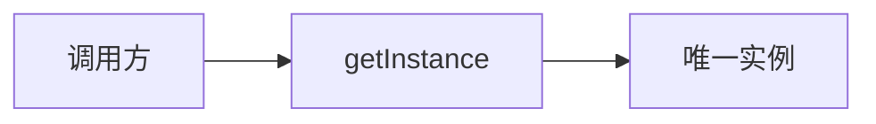
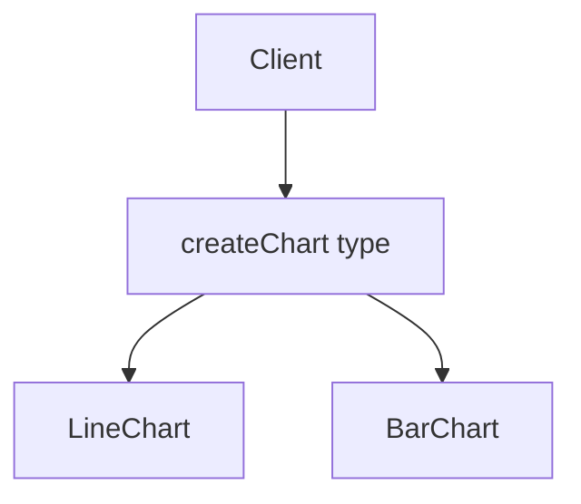
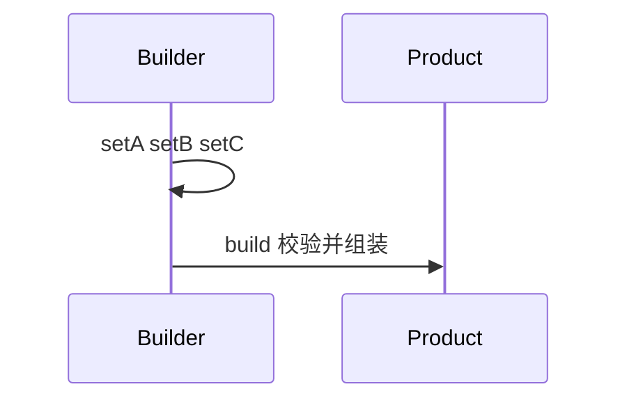

# 创建型模式

创建型模式解决**对象由谁创建、创建过程如何与使用方解耦**。Singleton 保证唯一实例，Factory 按条件产出不同产品，Builder 分步组装复杂对象 — 在前端对应全局 Store、组件/图表工厂、DSL 式配置构建。

---

## Singleton（单例）

**意图**：全局仅一个实例，并提供统一访问点。



| 实现方式 | JS/TS | 注意 |
|----------|-------|------|
| 模块单例 | `export const db = ...` | 最常用，天然懒加载 |
| 闭包 | IIFE 持有实例 | 测试需重置钩子 |
| class + 静态字段 | `private static instance` | 需防多窗口/Worker 各一份 |

```typescript
class Logger {
  private static instance: Logger;
  private constructor() {}
  static getInstance() {
    if (!Logger.instance) Logger.instance = new Logger();
    return Logger.instance;
  }
}
```

**React**：`createContext` + Provider 常替代传统单例，避免 HMR 下旧实例残留。**反模式**：把一切塞单例 → 难测、难 tree-shake。

---

## Factory / Factory Method（工厂）

**意图**：把「具体类名」从调用方隐藏，用统一接口创建产品。



```typescript
type Chart = { render(el: HTMLElement): void };

function createChart(type: 'line' | 'bar', data: number[]): Chart {
  switch (type) {
    case 'line': return new LineChart(data);
    case 'bar': return new BarChart(data);
    default: throw new Error(`unknown: ${type}`);
  }
}
```

| 变体 | 区别 |
|------|------|
| **简单工厂** | 一个函数 `switch` |
| **工厂方法** | 子类决定实例化哪个产品 |
| **抽象工厂** | 一族相关产品（主题 Dark/Light 全套组件） |

Vue 动态组件 `<component :is="type" />` 本质是**工厂 + 策略**。

---

## Builder（建造者）

**意图**：分步设置可选参数，最终 `build()` 产出不可变或校验后的对象。

```typescript
const request = new RequestBuilder()
  .url('/api/users')
  .method('POST')
  .header('Authorization', token)
  .body({ name: 'a' })
  .build();
```



| 对比 | Factory | Builder |
|------|---------|---------|
| 焦点 | 选哪种产品 | 同一产品多种配置 |
| 步骤 | 通常一步 | 多步链式 |
| 前端例 | `createChart(type)` | Query 参数、表单分步向导 |

**React Hook Form** / **Zod** `.parse()` 链可视为 Builder + 校验门面。

---

## 原型（Prototype）简记

通过**克隆**复制已有对象，少调构造器。JS 原生：`Object.create`、`structuredClone`、展开拷贝配置对象。

```javascript
const defaultOpts = { theme: 'light', locale: 'zh' };
function createWidget(overrides) {
  return { ...defaultOpts, ...overrides };
}
```

适合**默认配置 + 覆盖**；深嵌套需明确浅/深拷贝策略。

---

## 选型速查

| 需求 | 倾向 |
|------|------|
| 全局唯一连接/配置 | Singleton（优先模块导出） |
| 类型多、构造分散 | Factory |
| 参数多、可选多、要校验 | Builder |
| 复制模板对象 | Prototype / 展开 |

| 场景 | 选 |
|------|-----|
| 分步表单配置 | Builder |
| 按 type 创建图表 | Factory |
| `export const store` | 模块单例 |

| 按 type 创建图表 | Factory |
| `export const store` | 模块单例 |

创建型选型可沿「是否需要全局唯一实例 → 是否隐藏子类 → 是否隔离复杂构造」三条分支决策，避免为简单 `new` 套 Singleton。

---

## 抽象工厂（主题切换）

```typescript
type ThemeUI = { Button: React.FC; Input: React.FC };

const light: ThemeUI = { Button: LightBtn, Input: LightInput };
const dark: ThemeUI = { Button: DarkBtn, Input: DarkInput };

function App({ theme }: { theme: ThemeUI }) {
  const { Button, Input } = theme;
  return <><Button /><Input /></>;
}
```

一族组件成套替换 — 比逐个 Factory 更内聚；Design Token + CSS 变量是更轻的现代替代。

---

## 小结

Singleton 管唯一性，Factory 管类型选择，Builder 管复杂组装步骤。前端优先**模块单例 + 纯函数工厂**，避免过度 class 层次。

**易混点**：单例与「全局状态库」不等价；简单工厂 `switch` 增长时用注册表开闭扩展；Builder 的 `build()` 应集中校验，避免半成品流出。

核对：`export const store` 属于哪类单例实现？Builder 与 Factory 各适合「分步表单配置」还是「按 type 创建图表」？
