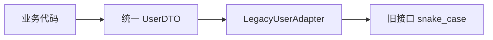
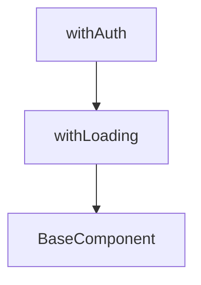
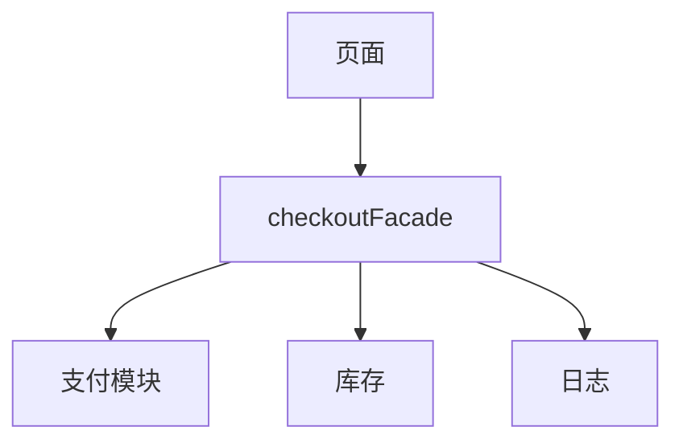
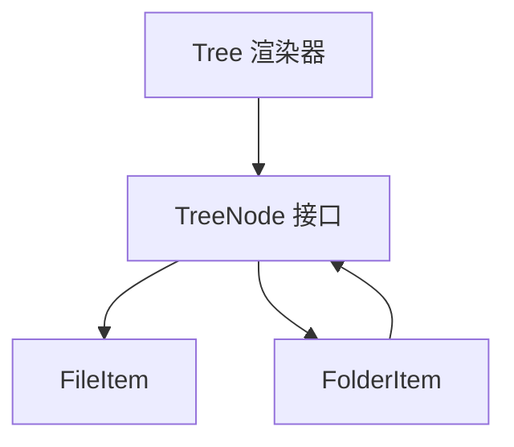
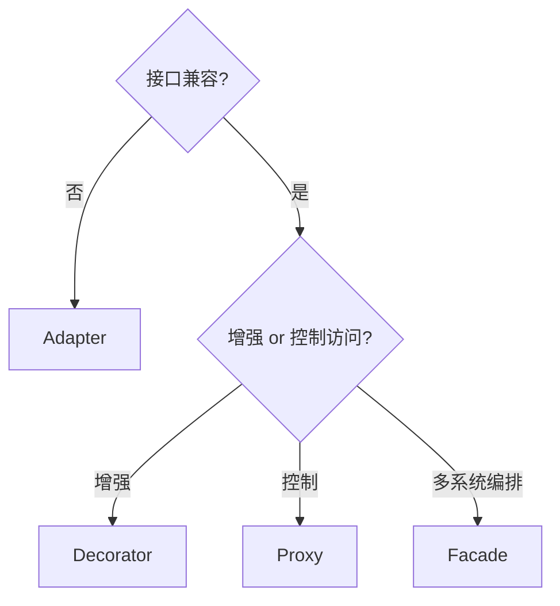

# 结构型模式

结构型模式处理**类与模块如何拼装**，在不破坏原有核心的前提下扩展能力。Adapter 抹平接口差异，Decorator 动态叠加职责，Proxy 控制访问，Facade 简化子系统 — 对应前端 SDK 封装、高阶组件、请求代理与 API 门面。

---

## Adapter（适配器）

**意图**：将不兼容接口转换为客户端期望的形状。



```typescript
type LegacyUser = { user_name: string; user_id: number };
type User = { name: string; id: string };

function adaptLegacy(u: LegacyUser): User {
  return { name: u.user_name, id: String(u.user_id) };
}
```

| 类型 | 说明 | 前端例 |
|------|------|--------|
| **对象适配器** | 包装实例转调 | 封装 `axios` 为 `fetch` 风格 |
| **类适配器** | 多继承（TS 少用） | — |

**Vue 2 → 3 迁移**、**REST → GraphQL** 客户端层常见 Adapter 层。

---

## Decorator（装饰器）

**意图**：运行时给对象**叠加**职责，比子类更灵活。



```tsx
function withLoading<P>(Wrapped: React.ComponentType<P>) {
  return function WithLoading(props: P & { loading?: boolean }) {
    if (props.loading) return <Spinner />;
    return <Wrapped {...props} />;
  };
}
```

| 对比 | Decorator | 继承 |
|------|-----------|------|
| 组合 | 多层包装 | 单链子类爆炸 |
| 运行时 | 可动态套 | 编译期固定 |

**TypeScript 装饰器**（实验特性）与 GoF Decorator 同名不同义；业务里多用 **HOC / 组合式函数** 实现同样意图。

---

## Proxy（代理）

**意图**：为对象提供替身，在访问前后插入控制（懒加载、缓存、权限、埋点）。

```typescript
const handler: ProxyHandler<UserService> = {
  get(target, prop, receiver) {
    if (prop === 'getUser') {
      return async (id: string) => {
        console.log('metric', prop);
        return Reflect.get(target, prop, receiver).call(target, id);
      };
    }
    return Reflect.get(target, prop, receiver);
  },
};
```

| Proxy 场景 | 前端例 |
|------------|--------|
| 懒加载 | 首屏不拉取详情直到访问 |
| 缓存 | memoize GET |
| 不可变 | Vue 3 `reactive` 依赖 Proxy |
| 虚拟代理 | 大列表占位图 |

**易混**：ES `Proxy` 是语言特性；设计模式 Proxy 是角色。Vue `reactive` 是**拦截器式代理**，不是远程代理。

---

## Facade（外观）

**意图**：为复杂子系统提供**单一简化入口**。



```typescript
export async function checkout(cartId: string) {
  const cart = await cartApi.load(cartId);
  await inventoryApi.reserve(cart.items);
  const order = await orderApi.create(cart);
  await paymentApi.charge(order.id);
  return order;
}
```

| Facade vs Adapter | |
|-------------------|---|
| Facade | 简化**多个**子系统协作 |
| Adapter | 让**一个**旧接口变新 |

**React Query** 的 `useMutation` 封装可视为数据层面的 Facade。

---

## Adapter vs Facade 速辨

| 问题 | 更接近 |
|------|--------|
| 把 `fetch` 包装成项目统一 `apiClient`（统一错误/鉴权） | **Facade** — 编排多关注点 |
| 把旧 REST snake_case 转成 camelCase DTO | **Adapter** — 接口形状对齐 |
| 两者可同时存在 | 先 Adapter 再 Facade |

---

## 组合（Composite）简记

**意图**：树形结构里，叶子节点与容器节点对外暴露一致接口，客户端无需区分「文件」还是「文件夹」。



```typescript
interface TreeNode {
  id: string;
  label: string;
  children?: TreeNode[];
  render(): ReactNode;
}

function renderTree(nodes: TreeNode[]) {
  return nodes.map((n) =>
    n.children?.length ? (
      <Folder key={n.id} label={n.label}>{renderTree(n.children)}</Folder>
    ) : (
      <File key={n.id} label={n.label} />
    )
  );
}
```

菜单、组织架构、权限树、文件浏览器 — 凡是「递归同一套 API」的 UI，Composite 思想都在；Compound Components 解决的是**子组件族 API**，Composite 解决的是**数据结构的统一遍历**。

---

## Bridge（桥接）简记

**意图**：把「抽象」（对外 API）与「实现」（底层驱动）拆开，各自独立演进。

| 维度 | 说明 | 前端例 |
|------|------|--------|
| 抽象侧 | 业务调用的稳定接口 | `StorageService.save(key, val)` |
| 实现侧 | 可替换的后端 | `localStorage` / `IndexedDB` / 内存 Map |
| 收益 | 换实现不改调用方 | 单测注入内存实现 |

```typescript
interface StorageDriver {
  get(key: string): string | null;
  set(key: string, value: string): void;
}

class LocalStorageDriver implements StorageDriver {
  get(key: string) { return localStorage.getItem(key); }
  set(key: string, value: string) { localStorage.setItem(key, value); }
}

class StorageService {
  constructor(private driver: StorageDriver) {}
  savePrefs(data: object) {
    this.driver.set('prefs', JSON.stringify(data));
  }
}
```

与 Adapter 不同：Bridge **主动设计**两套层次；Adapter **事后**把旧接口掰成新形状。

---

## Flyweight（享元）简记

**意图**：大量细粒度对象共享不变部分，把差异压到外部 context。

| 场景 | 共享部分 | 外部 context |
|------|----------|--------------|
| 虚拟列表单元格 | 样式类、图标 SVG | 行 index、数据项 |
| 地图海量标记 | 标记组件模板 | 经纬度、业务 id |
| 富文本相同样式 run | 样式对象引用 | 文本片段 |

```typescript
const iconCache = new Map<string, IconDefinition>();
function getIcon(name: string): IconDefinition {
  if (!iconCache.has(name)) iconCache.set(name, loadIcon(name));
  return iconCache.get(name)!;
}
// 1000 行表格复用同一 icon 对象 — 减内存与创建开销
```

React 里 `memo` + 稳定 props、图标/font 子集化、Canvas 精灵图 — 都是享元思想；不必强行建 `FlyweightFactory` 类。

---

## Proxy 与 Decorator 深入对比

两者都「包一层」，决策看**目的**而非包装层数：

| 维度 | Proxy | Decorator |
|------|-------|-----------|
| 目的 | 控制访问（懒加载、权限、缓存、埋点） | 叠加新职责（loading、错误边界、样式） |
| 对核心认知 | 客户端可能不知道代理存在 | 客户端知道能力被增强 |
| 典型顺序 | 一层代理横切 | 多层装饰可叠加 |
| 前端例 | memoize GET、懒加载模块 | `withAuth(withLoading(Button))` |

```typescript
// Proxy：同一接口，访问时才加载
const lazyChart = new Proxy({} as ChartModule, {
  get(_, prop) {
    return (...args: unknown[]) => import('./chart').then((m) => m[prop](...args));
  },
});

// Decorator：显式增强 UI
function withErrorBoundary<P>(C: ComponentType<P>) {
  return (props: P) => (
    <ErrorBoundary><C {...props} /></ErrorBoundary>
  );
}
```

若包装层只做「第一次访问才初始化」→ Proxy；若每层加不同 UI 能力 → Decorator。实践中常合并为一个 composable，不必强行贴标签。

---

## 结构型模式选型表

| 你的问题 | 首选 | 次选 / 组合 |
|----------|------|-------------|
| 旧 API 字段名对不上 | Adapter | DTO 映射函数 |
| 按钮要多层 UI 能力 | Decorator / HOC | 单个 layout composable |
| 请求要缓存/懒加载/打点 | Proxy | 拦截器 + memo |
| 结账要调支付+库存+日志 | Facade | 编排 composable |
| 树形菜单统一渲染 | Composite | 递归组件 |
| 存储要换 localStorage / IDB | Bridge | 注入 driver |



---

## 前端落地检查清单

改 SDK 封装或 HOC 前，快速自检：

| 检查项 | 通过标准 |
|--------|----------|
| Adapter 是否只做形状转换 | 不含业务编排 |
| Facade 是否隐藏「步骤顺序」 | 调用方一行完成用例 |
| HOC 是否超过 3 层 | 合并或改 hook |
| Proxy 缓存是否有失效策略 | TTL / 版本号 / mutation 后清 |
| 子系统仍可直接调用 | Facade 不强制垄断底层 |

---

## 小结

Adapter 对齐接口，Decorator 叠加行为，Proxy 控制访问路径，Facade 收敛子系统调用。前端多用函数组合与 HOC，而非深层继承。

**易混点**：Decorator 与 Proxy 都可「包一层」— Decorator 侧重**增强职责**，Proxy 侧重**访问控制**；Facade 不隐藏子系统仍可被高级调用方直接使用。

核对：把 `fetch` 包装成项目统一 `apiClient` 更接近 Adapter 还是 Facade？Vue `reactive` 属于哪类结构模式思想？
