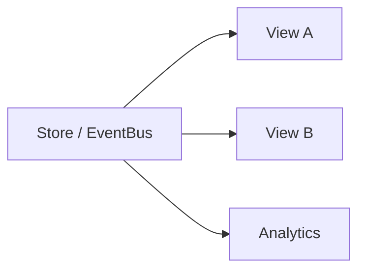
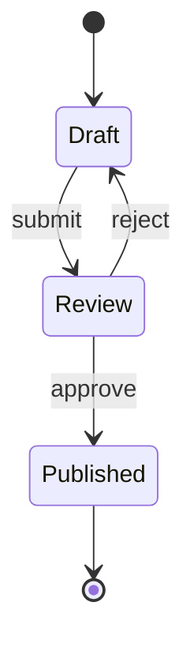

# 行为型模式

行为型模式描述**对象如何分工、通信与封装变化**。Observer 解耦发布订阅，Strategy 封装可替换算法，State 用对象替代分支状态机，Command 把请求参数化为可排队、可撤销的对象 — 直接对应事件总线、校验策略、UI 状态机与操作历史。

---

## Observer（观察者）

**意图**：一对多依赖，主题变更时自动通知订阅者。



```typescript
const bus = {
  map: new Map<string, Set<Function>>(),
  on(e: string, fn: Function) {
    if (!this.map.has(e)) this.map.set(e, new Set());
    this.map.get(e)!.add(fn);
    return () => this.map.get(e)?.delete(fn);
  },
  emit(e: string, payload: unknown) {
    this.map.get(e)?.forEach((fn) => fn(payload));
  },
};
```

| 实现 | 前端例 |
|------|--------|
| 推模型 | Redux dispatch、mitt |
| 拉模型 | 组件自行 `useSelector` 取快照 |

**内存泄漏**：订阅未 `off`、React `useEffect` 清理遗漏 — 属于常见反模式，需在卸载时取消订阅。

---

## Strategy（策略）

**意图**：一族算法可互换，调用方依赖抽象策略接口。

```typescript
type PayStrategy = (amount: number) => Promise<void>;

const strategies: Record<string, PayStrategy> = {
  wechat: (n) => wechatPay(n),
  alipay: (n) => aliPay(n),
};

async function checkout(method: string, amount: number) {
  const strategy = strategies[method];
  if (!strategy) throw new Error('unsupported');
  await strategy(amount);
}
```

| 对比 | Strategy | if/else |
|------|----------|---------|
| 新增方式 | 注册表加一项 | 改核心函数 |
| 测试 | 单测各策略 | 分支组合爆炸 |

Vue：**组合式函数** `useValidation(rules)` 注入不同规则表即策略模式。

---

## State（状态）

**意图**：对象行为随内部状态改变；用**状态类/对象**替代巨型 `switch`。



```typescript
type OrderState = {
  name: string;
  submit(): void;
  cancel(): void;
};

const draft: OrderState = {
  name: 'draft',
  submit() { /* transition to review */ },
  cancel() { /* discard */ },
};
```

**React**：`useReducer` + `switch(action)` 是状态模式的函数式写法；复杂流程可用 **XState** 显式状态图。

| State vs Strategy | |
|-------------------|---|
| State | 对象**知道自己**如何迁移到下一状态 |
| Strategy | 上下文**选择**算法，策略间通常无迁移 |

订单「草稿→审核→发布」用 **State** — 有固定迁移；支付方式切换用 **Strategy**。

---

## Command（命令）

**意图**：把操作封装为对象，支持队列、日志、撤销。

```typescript
type Command = { execute(): void; undo(): void };

const history: Command[] = [];

function run(cmd: Command) {
  cmd.execute();
  history.push(cmd);
}

function undo() {
  const cmd = history.pop();
  cmd?.undo();
}
```

| 前端场景 | 实现要点 |
|----------|----------|
| 富文本撤销 | 命令栈 + 反向操作 |
| 批量 API | 命令队列串行执行 |
| Redux action | `{ type, payload }` 即命令 DTO |

Redux `action` 更像 **Command**（可 dispatch、可 log）；`store.subscribe` 是 **Observer**。

---

## 其他行为模式简表

| 模式 | 一句话 | 前端触点 |
|------|--------|----------|
| **Template Method** | 骨架固定、步骤可覆写 | 基类组件定义流程 |
| **Chain of Responsibility** | 请求沿链传递 | 中间件 `next()` |
| **Iterator** | 统一遍历 | `for..of`、生成器 |
| **Mediator** | 多组件经中介通信 | 事件总线、状态机 |

中间件链在 Express/Koa 与 Redux 中均为「洋葱模型」：请求自外向内穿过 handler，再原路返回。

---

## 小结

Observer 管通知，Strategy 管算法替换，State 管生命周期行为，Command 管可记录的操作。Hooks 与组合式 API 常把这些模式写成**函数 + 数据结构**，而非 class 层次。

**易混点**：Observer 与 Pub/Sub（常有 broker）混称；`useReducer` 偏 State 还是 Command 取决于 action 是否可逆；Strategy 表 key 应用常量枚举防拼写错误。

核对：Redux `action` 更像 Command 还是 Observer？订单「草稿→审核→发布」用 State 还是 Strategy 更合适？
