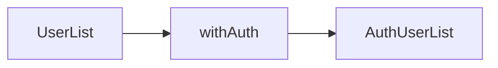
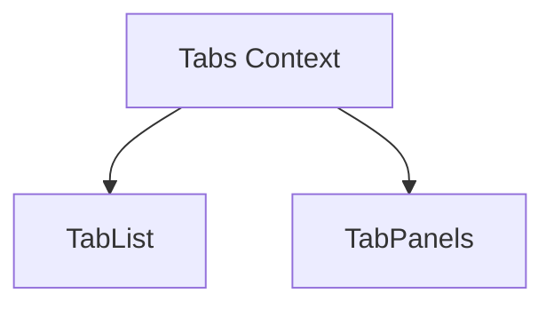

# 前端常用模式

React 与 Vue 生态在 GoF 之外沉淀了一批**组件层惯用法**：HOC 横切增强、Render Props 共享行为、Compound Components 组合子组件上下文。三者解决「逻辑复用」与「API 表达力」，选型取决于类型推导、组合深度与团队习惯。

---

## HOC（高阶组件）

**定义**：接收组件，返回增强后的新组件 — Decorator 在 UI 层的典型形态。



```tsx
function withAuth<P>(Component: React.ComponentType<P>) {
  return function Authenticated(props: P) {
    const user = useAuth();
    if (!user) return <Navigate to="/login" />;
    return <Component {...props} />;
  };
}

const ProtectedList = withAuth(UserList);
```

| 优点 | 缺点 |
|------|------|
| 横切关注点集中 | 嵌套地狱、DevTools 难读 |
| 与具体 UI 解耦 | `ref` 需 `forwardRef` 透传 |

**Vue**：无原生 HOC；可用 **包装组件** 或 **组合式函数** 替代。

```vue
<script setup>
import { useAuth } from './useAuth';
const user = useAuth();
</script>
<template>
  <slot v-if="user" :user="user" />
  <Login v-else />
</template>
```

---

## Render Props

**定义**：通过 props 传入**渲染函数**，由父组件把状态与 UI 委托给调用方决定。

```tsx
<DataFetcher url="/api/users">
  {({ data, loading }) => (
    loading ? <Spinner /> : <List items={data} />
  )}
</DataFetcher>
```

| 对比 HOC | Render Props |
|----------|--------------|
| 组件树层级 | 多一层匿名函数 | 显式嵌套 |
| 命名冲突 | 可能 props 覆盖 | render 单一入口 |
| 现状 | 渐少 | 多被 Hooks 取代 |

**Vue**：作用域插槽即 Render Props — Vue 作用域插槽对应 **Render Props**。

```vue
<DataFetcher v-slot="{ data, loading }">
  <Spinner v-if="loading" />
  <List v-else :items="data" />
</DataFetcher>
```

---

## Compound Components（复合组件）

**定义**：父组件提供 Context，子组件通过**隐式约定**协同，对外 API 像 DSL。



```tsx
const Ctx = createContext<TabsApi | null>(null);
function Tabs({ children, defaultKey }: Props) {
  const [active, setActive] = useState(defaultKey);
  return <Ctx.Provider value={{ active, setActive }}>{children}</Ctx.Provider>;
}
function Tab({ id, children }: TabProps) {
  const { active, setActive } = useContext(Ctx)!;
  return (
    <button aria-selected={active === id} onClick={() => setActive(id)}>
      {children}
    </button>
  );
}
Tabs.Tab = Tab;
```

| 库内例子 | |
|----------|---|
| React | Radix、Reach UI、`<select><option>` |
| Vue | 部分 UI 库 `ElForm` + `ElFormItem` |

**Vue 3**：`provide/inject` + 子组件注册实现同等结构。

Tabs 适合 **Compound** 而非纯 HOC — 子组件需共享 `activeKey` 且 API 像 `<Tabs><Tabs.Tab /></Tabs>`；HOC 难表达这种 DSL。

---

## Hooks / Composables 与三者关系

| 需求 | 现代首选 |
|------|----------|
| 共享有状态逻辑 | `useXxx` / `useXxx()` |
| 共享无状态工具 | 纯函数 |
| 固定 UI 骨架 + 可插槽 | Compound |
| 强约束横切（路由守卫） | HOC 或路由 meta |

数据拉取类场景优先 `useFetch` / `useQuery` composable，而非 Render Props 包装组件。

---

## 选型简表

| 模式 | 适合 | 不适合 |
|------|------|--------|
| HOC | 权限、主题、埋点包装 | 深层组合、需多个 render 分支 |
| Render Props | 单一数据流委托 UI | 大量并列消费者（嵌套乱） |
| Compound | 设计系统、Tabs/Menu | 子组件关系松散 |
| Composables | 逻辑复用默认解 | 强 UI 结构约束 |

Facade 收敛子系统入口；Provider 注入上下文；HOC 横切增强 — 在 React 中常对应组合组件、`createContext` 与 HOC/`use` 封装。

---

## 小结

HOC 包装组件做横切，Render Props / 作用域插槽用函数交还渲染权，Compound 用 Context 表达组件族。Hooks 与 Composables 承担大部分行为复用，但复合组件仍是设计系统表达力利器。

**易混点**：Render Props 与 children-as-function 同类；Compound 子组件必须在父 Context 内；HOC 在 React 18+ 与 Server Components 场景需额外注意客户端边界。

核对：Vue 作用域插槽对应哪种模式？为何 Tabs 适合 Compound 而非纯 HOC？
