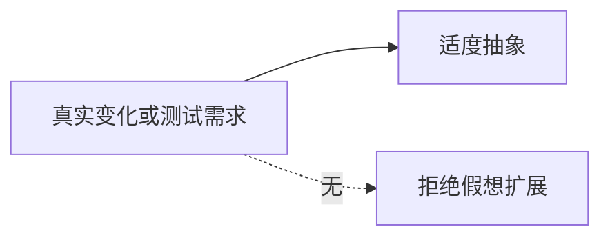
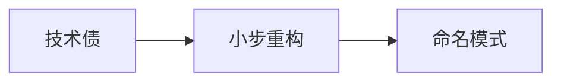

# 反模式与过度设计

能跑起来的代码不等于好结构；**反模式**是看似捷径、长期放大利弊的做法，**过度设计**则是为假想需求预埋抽象。前端常见症状包括：上帝组件、事件总线滥用、万能 `BaseService`、以及「先上微内核再说」。

---

## 常见反模式

```mermaid
flowchart TB
  God[上帝组件 5000 行]
  Bus[全局 EventBus 满天飞]
  Base[BaseClass 十层继承]
  Premature[过早抽象层]
  God --> 难测难拆
  Bus --> 难追踪
  Base --> 脆弱继承
  Premature --> YAGNI 违背
```

| 反模式 | 表现 | 后果 |
|--------|------|------|
| **上帝对象/组件** | 路由+请求+表单+图表全在一文件 | 改一处牵全身 |
| **魔法全局** | `window.$bus`、`getCurrentInstance` 滥用 | 隐式依赖、SSR 翻车 |
| **意大利面条式异步** | 回调嵌套、无错误边界 | 竞态、难复现 Bug |
| **拷贝粘贴工程** | 三处相同校验各写一遍 | 修 Bug 漏改 |
| **金锤子** | 凡事 Redux / 凡事 Pinia | 简单 `useState` 即可 |

```javascript
// 气味：用 EventBus 替代 props 穿透两层
eventBus.emit('cart-updated'); // 谁在听？顺序？测试？
```

---

## EventBus 替代 props 的风险

| 风险 | 说明 |
|------|------|
| **隐式依赖** | 读代码看不出谁订阅 |
| **顺序不确定** | 多 listener 执行顺序难控 |
| **测试困难** | 需 mock 全局 bus，单测隔离差 |

Rule of Three：第三次重复再抽象 — 避免第一次就抽「通用 EventBus 框架」。

---

## 过度设计信号

| 信号 | 健康做法 |
|------|----------|
| 接口只有一个实现却先写 `IUserService` | 等第二实现或测试需要再抽 |
| 为「可能换库」包五层 Adapter | 直接依赖 + 边界集成测 |
| 通用 `EntityManager<T>` | 按业务模块拆分 |
| 设计模式 PPT 架构无用户故事 | 从用例反推最小模块 |

```typescript
// 过度：仅一种支付方式
interface PaymentStrategy { pay(n: number): void }
class WechatOnly implements PaymentStrategy { /* ... */ }

// 足够：函数 + 后续扩展表
const pay = (method: 'wechat', amount: number) => wechatPay(amount);
```

---

## 模式误用

| 模式 | 误用 | 纠正 |
|------|------|------|
| **Singleton** | 所有模块 `import store` | 按域拆分 store，局部状态优先 |
| **Factory** | 一个工厂 40 个 `case` | 注册表 + 插件 |
| **Observer** | 组件间所有通信走 bus | props / context / 状态机 |
| **Decorator** | HOC 套 8 层 | 合并为 layout 或 hook |
| **Command** | 简单 `setState` 也做命令栈 | 仅撤销/审计场景 |

---

## 与 SOLID 的张力

过度**开闭** → 抽象爆炸；过度**单一职责** → 文件碎片化、跳转成本上升。平衡原则：

1. **变化轴**驱动拆分（支付方式变、主题变）
2. **测试痛点**驱动抽接口（难 mock 的 `fetch`）
3. **团队边界**驱动模块（feature folder）



---

## 重构出路（轻量）

| 气味 | 小步重构 |
|------|----------|
| 上帝组件 | 按「数据/交互/展示」拆子组件 + hooks |
| 重复逻辑 | 提取 composable，非继承 |
| 深层 props | Context 或状态提升到路由级 |
| 分支爆炸 | Strategy 表或 `useReducer` |

不追求「全库模式统一」；可读性与删代码能力优先。

---

## 代码审查气味清单

| 审查项 | 通过标准 |
|--------|----------|
| 新文件 >300 行 | 是否可拆 hooks/子组件 |
| 新增全局单例 | 是否真需跨路由共享 |
| 新增 `interface` 无第二实现 | 是否 YAGNI |
| PR 含「通用框架」无调用方 | 退回先做业务 |

```typescript
// 审查时可问：删掉这层抽象，调用方改几处？
// 若答案是 1 处且 5 行 — 抽象可能不值
```

---

## Props 钻取：另一种隐式反模式

不用 EventBus 也可能踩坑 — **五六层纯 props 传递**同样难维护：

| 表现 | 问题 | 更稳妥方向 |
|------|------|------------|
| 中间层组件只转发 props | 改字段名改全树 | Context / 状态提升到共同父级 |
| `user` 对象整包下传 | 无关子组件被迫重渲染 | 按需 context 或 selector |
| 「临时」钻取拖过三个 sprint | 变成永久架构 | 划 feature 边界 store |

```tsx
// 气味：Layout 完全不使用 theme，只为传给 DeepChild
function Layout({ theme, ...rest }) {
  return <Sidebar theme={theme} {...rest} />;
}
// 小步：ThemeProvider 或 CSS 变量，中间层删掉 theme prop
```

Rule of Three 同样适用：第二次钻取可忍，第三次重复路径再引入 Context — 而非第一次就全局 store。

---

## 过早优化 vs 合理抽象

| 类型 | 特征 | 例子 |
|------|------|------|
| **过早优化** | 为假想性能/规模预埋 | 列表 20 条就上虚拟滚动 + 享元池 |
| **合理抽象** | 已有第二次重复或测试痛点 | 三处相同校验抽 composable |
| **过度设计** | 为假想需求建框架 | 无插件需求先做插件内核 |

```javascript
// 过早：首屏 3 个图标却做 sprite + 享元 registry
const IconFlyweight = createIconPool(200);

// 足够：直接 import，Bundle 分析后再优化
import { SearchIcon } from './icons';
```

性能反模式常伴随**无度量**：DevTools 没证明瓶颈就先上 memo / Proxy 缓存。先写清晰结构，Profiler 红了再 targeted 优化。

---

## 意大利面条式异步的识别与收敛

| 气味 | 典型代码 | 收敛方向 |
|------|----------|----------|
| 回调嵌套 | `.then` 里再 `.then` 改同一 state | `async/await` + 单一 async 函数 |
| 竞态 | 快速切换 tab 旧请求后返回覆盖新数据 | `AbortController` / 请求序号 |
| 分散 loading | 三个 `useState` 各管 loading | `useReducer` 或数据层 status |
| 无错误边界 | catch 里 `console.log` | ErrorBoundary + 统一 onError |

```typescript
useEffect(() => {
  let cancelled = false;
  const ac = new AbortController();
  (async () => {
    try {
      const data = await fetchUser(id, { signal: ac.signal });
      if (!cancelled) setUser(data);
    } catch (e) {
      if (!cancelled && e.name !== 'AbortError') setError(e);
    }
  })();
  return () => { cancelled = true; ac.abort(); };
}, [id]);
```

这不叫「上 State 模式」— 叫把异步生命周期写对；模式名在结构清晰后自然对齐 Observer / Facade 等。

---

## 技术债与模式的关系

| 情况 | 是否该上模式 | 说明 |
|------|--------------|------|
| 赶工 copy-paste 三处 | 第三次再抽 | 先交付，留 TODO |
| 上帝组件已 800 行 | 拆 hook + 子组件 | 小步 PR，非重写框架 |
| 历史 EventBus 网 | 按域迁移 store | 绞杀者模式，非一刀切 |
| 「换框架」借口全重写 | 警惕 | 业务逻辑应框架无关 |



模式是重构**之后**对稳定结构的命名，不是还债的入场券。先让测试/类型/模块边界能跑，再讨论是否叫 Strategy。

---

## 团队层面的反模式

| 反模式 | 表现 | 对策 |
|--------|------|------|
| **架构 astronaut** | PR 只有抽象无业务调用 | 要求先有用例再抽层 |
| **模式 KPI** | Code Review 强制「必须用模式」 | 以可读性、删代码能力为准 |
| **复制大厂** | 百人行团队架构套十人项目 | 按变化频率选型 |
| **文档驱动无代码** | ADR 写 Factory，代码里 if/else | ADR 与实现同步更新 |

Review 时可加一问：**若回滚这层抽象，业务改动行数是否更少？** 若更少，抽象可能在帮倒忙。

---

## 停手信号（选型用）

出现下列情况时，优先**减抽象**而非加模式：

| 信号 | 建议动作 |
|------|----------|
| HOC / 包装 > 3 层 | 合并 layout 或单 hook |
| 全局 bus 事件 > 20 | 划分子域 store |
| `interface` 仅 1 实现且无测试需求 | 删 interface，YAGNI |
| 新文件 > 300 行且无第二调用方 | 拆业务，非加 Factory |
| PR 标题含「通用」「框架」无业务 | 退回先做垂直切片 |

---

## 何时「没有模式」反而是好设计

| 情况 | 说明 |
|------|------|
| 纯展示组件 | props in、JSX out |
| 一次性脚本 | 迁移、数据修复 |
| 框架约定已覆盖 | `useState`、Vue `ref` 不必称 Singleton |
| 50 行业务函数 | 清晰胜过抽象 |

删代码能力 > 模式数量 — 合并 PR 时优先删未使用的抽象层。

---

## 小结

反模式以短期省事换长期耦合；过度设计用假想灵活性换当下复杂度。模式应在**第二次痛**时出现，并有可述说的变化理由。

**易混点**：「没有模式」≠ 好设计；抽公共组件不等于过度设计；全局状态少不等于架构简单（可能 props 钻取更严重）。

核对：列举 EventBus 替代 props 的两个风险。Rule of Three 想解决什么问题？
