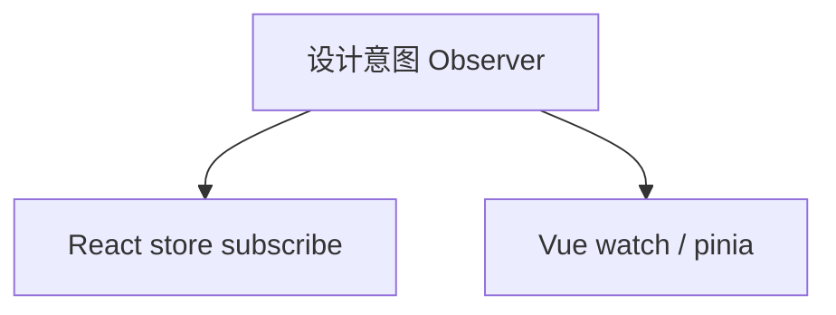

# 模式与 React / Vue 对照

同一设计意图在 React 与 Vue 中常落在不同语法糖上：Context 对 `provide/inject`，HOC 对组合式包装，Redux 对 Pinia。对照表帮助**认意图、选机制**，而非强行统一写法。

---

## 总对照表

| 设计意图 | React 常见机制 | Vue 3 常见机制 |
|----------|----------------|----------------|
| 观察者 | `useSyncExternalStore`、Redux | `watch`、`pinia.$subscribe` |
| 策略 | 对象表 + hooks | composable + 规则对象 |
| 状态机 | `useReducer`、XState | `ref` + composable、XState |
| 装饰/横切 | HOC、`forwardRef` | 包装组件、自定义指令（慎用） |
| 复合组件 | Context + 子组件静态属性 | `provide/inject` + 子组件 |
| 依赖倒置 | props 注入、DI context | `inject` 默认工厂 |
| 门面 | 自定义 hooks 封装多 API | composable `useCheckout` |
| 代理/拦截 | 无内置响应式（MobX/Proxy 自建） | `reactive`/`ref` Proxy |
| 命令 | Redux action | Pinia action、可撤销栈自建 |



---

## Observer：订阅 UI 更新

**React**

```tsx
function Counter() {
  const count = useSyncExternalStore(
    store.subscribe,
    () => store.getState().count
  );
  return <span>{count}</span>;
}
```

**Vue**

```vue
<script setup>
import { storeToRefs } from 'pinia';
import { useCounterStore } from './counter';
const { count } = storeToRefs(useCounterStore());
</script>
<template>{{ count }}</template>
```

| 点 | React | Vue |
|----|-------|-----|
| 粒度 | 常配合 selector 细订阅 | 自动依赖收集（组件级） |
| 泄漏 | `subscribe` 需在 effect 清理 | `watch` 停止句柄 |

`watch` 与 `useEffect` 订阅 store：`watch` 显式指定源；`useEffect` 在 mount/unmount 订阅 — 职责类似，API 不同。

---

## Strategy：可插拔算法

```typescript
const validators = {
  email: (v: string) => /@/.test(v),
  phone: (v: string) => /^1\d{10}$/.test(v),
} as const;

function useField(rule: keyof typeof validators) {
  return (value: string) => validators[rule](value);
}
```

Vue composable 同名导出即可 — 思路完全一致。

---

## Compound Components

**React**：Context + `Tabs.Tab` 静态挂载。

**Vue** — 依赖 **`provide/inject`** + 子组件：

```vue
<!-- Tabs.vue -->
<script setup>
import { provide, ref } from 'vue';
const active = ref('a');
provide('tabs', { active, setActive: (k: string) => (active.value = k) });
</script>
<template><div class="tabs"><slot /></div></template>
```

```vue
<!-- Tab.vue -->
<script setup>
import { inject } from 'vue';
const tabs = inject('tabs')!;
</script>
```

---

## 中间件链 ≈ Chain of Responsibility

```typescript
// Redux 风格
const logger = (store: any) => (next: any) => (action: any) => {
  console.log(action);
  return next(action);
};

// Pinia 插件
function loggerPlugin({ store }: PiniaPluginContext) {
  store.$subscribe((mutation, state) => {
    console.log(mutation.type, state);
  });
}
```

---

## 选型提示

| 场景 | React 倾向 | Vue 倾向 |
|------|------------|----------|
| 逻辑复用 | 自定义 Hook | Composable |
| 跨层注入 | Context（注意 rerender） | `provide/inject` |
| 性能细粒度 | `memo` + selector | `shallowRef`、按需 `computed` |
| 表单策略 | React Hook Form + zod | VeeValidate + zod |

对照时始终回到**意图**（谁通知谁、谁创建谁），语法糖会随版本变，意图相对稳定。

---

## Context 与 provide/inject 对照

两者都解决**跨层依赖**，但更新与渲染语义不同：

| 维度 | React Context | Vue provide/inject |
|------|---------------|---------------------|
| 更新传播 | value 变 → 所有 consumer 默认重渲染 | 注入 ref/reactive → 子组件按依赖更新 |
| 性能手段 | 拆 Context、`memo`、selector 库 | `shallowRef`、细粒度 `computed` |
| 类型 | 需自建泛型 Context | `InjectionKey<T>` 提供类型 |
| SSR | 每请求独立 Provider 树 | 每请求 `app` 实例 + provide |

```tsx
// React：value 变则所有 useContext(Theme) 组件重渲染（除非 memo 挡）
const ThemeContext = createContext('light');
function App() {
  const [theme, setTheme] = useState('light');
  return (
    <ThemeContext.Provider value={theme}>
      <DeepChild />
    </ThemeContext.Provider>
  );
}
```

```typescript
// Vue：provide reactive 对象，子组件 inject 后按属性追踪
const theme = ref('light');
provide('theme', { theme, setTheme: (t: string) => (theme.value = t) });
```

**Compound Components** 在 React 常把 Context 藏在 `Tabs` 内部；Vue 用 `provide/inject` 达到同样「子组件隐式共享状态」的 DSL 效果。

---

## 状态管理：Redux 与 Pinia 意图对照

| 意图 | Redux 典型形态 | Pinia 典型形态 |
|------|----------------|----------------|
| 单一数据源 | 一个 store tree | 多 store 模块 |
| 可预测更新 | reducer 纯函数 + action | action 内直接改 state（可组织） |
| 订阅 UI | `useSelector` / external store | `storeToRefs` + 自动追踪 |
| 中间件 | `applyMiddleware` | `$subscribe` / 插件 |
| 撤销/时间旅行 | redux-devtools | 需自建或第三方 |

```typescript
// Redux 思路：描述「发生了什么」
dispatch({ type: 'cart/add', payload: item });

// Pinia 思路：调用 store 方法
cartStore.addItem(item);
```

二者都服务 **Observer** 意图；Pinia 不是「Vue 版 Redux」，而是更贴近 OOP store 方法。选型看团队是否依赖 reducer 纯函数与时间旅行，而非框架 logo。

---

## Factory 与依赖注入在两栈的写法

**依赖倒置**在 React 用 props / Context 注入，Vue 用 `inject` + 默认值工厂：

```tsx
// React：测试时包 MockRepoProvider
function UserList({ repo = defaultRepo }: { repo?: UserRepo }) {
  const users = useUsers(repo);
  return users.map((u) => <Row key={u.id} user={u} />);
}
```

```typescript
// Vue：inject 第二参数为默认值，单测可 app.provide 覆盖
const repo = inject<UserRepo>('userRepo', () => defaultRepo, true);
```

不必引入 IoC 容器；**构造函数参数化**（函数参数、props、inject）即前端的 DI。

---

## SSR 与同构下的模式注意点

| 模式 / 机制 | React SSR | Vue SSR |
|-------------|-----------|---------|
| Singleton | 每请求新建 store，禁模块级可变单例 | 每请求 `createSSRApp` |
| Observer | `useSyncExternalStore` 需 server snapshot | Pinia 需 per-request pinia |
| window / bus | 禁止模块顶层访问 `window` | 同左 |
| Proxy reactive | 仅客户端 | `reactive` 在 SSR 数据序列化需注意 |

```typescript
// 反模式：模块顶层 let cache = {}
// 正模式：createStore(initialState) 在每请求入口调用
export function createAppStore(preloadedState?: State) {
  return configureStore({ reducer, preloadedState });
}
```

同构项目里，**模块单例 = 跨用户泄漏** — 这是 Singleton 反模式的高危区。

---

## 测试场景对照

| 设计意图 | React Testing Library | Vue Test Utils |
|----------|----------------------|----------------|
| 注入 repo | render 包 Provider | mount + global.provide |
| Strategy 规则 | 直接测纯函数表 | 同左，与框架无关 |
| Compound | 测子组件 API 是否改 context | 测 slot 子组件 + inject |
| Observer store | mock store.dispatch / selector | mock pinia 或 stub action |

```tsx
render(
  <RepoProvider value={mockRepo}>
    <UserCard userId="1" />
  </RepoProvider>
);
expect(await screen.findByText('Mock User')).toBeInTheDocument();
```

模式是否「正确」不如**能否用 mock 替换边界** — 两栈测试手段不同，意图都是依赖倒置。

---

## 逻辑复用：Hook vs Composable 对照表

| 能力 | React Hook | Vue Composable |
|------|------------|----------------|
| 命名 | `useXxx` 约定 | `useXxx` 社区惯例 |
| 生命周期 | `useEffect` 等 | `onMounted` / `watch` |
| 返回值 | 元组或对象 | 常返回 reactive 对象 |
| 与 UI 绑定 | JSX 中调用 | `<script setup>` 顶层调用 |
| 组合 | 自定义 hook 调 hook | composable 调 composable |

```typescript
// 同一 Strategy 意图：框架无关的 validators 表 + 薄封装
export function useFieldValidator(rule: keyof typeof validators) {
  return (value: string) => validators[rule](value);
}
```

业务规则表尽量**框架无关**；Hook/Composable 只做生命周期与响应式胶水。

---

## 小结

React 偏显式订阅与函数组合，Vue 偏响应式与 `provide/inject`；Observer、Strategy、Compound、中间件链在两栈均有直接映射。

**易混点**：Pinia 不是 Vue 版 Redux（无 reducer 纯函数强制）；React Context 变更会导致消费者重渲染，不等于 Vue 自动细粒度；`reactive` 是语言层 Proxy，React 默认无等价物。

核对：`watch` 与 `useEffect` 订阅 store 在职责上有何异同？Compound 在 Vue 中依赖哪两个 API？
