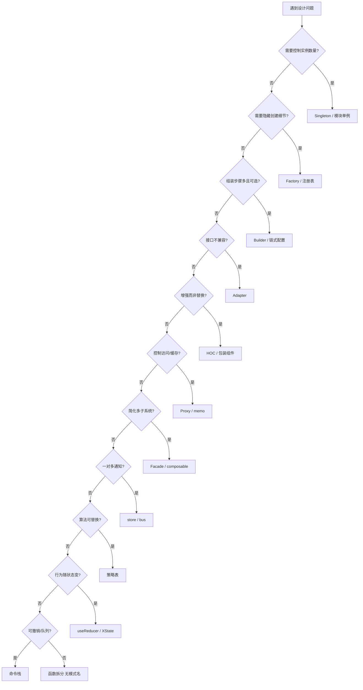
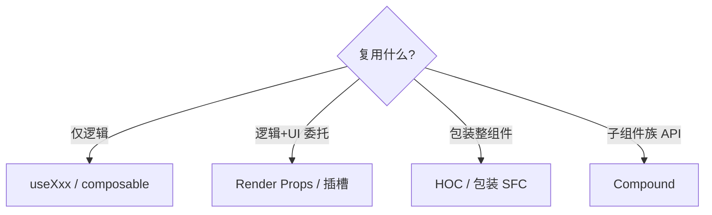
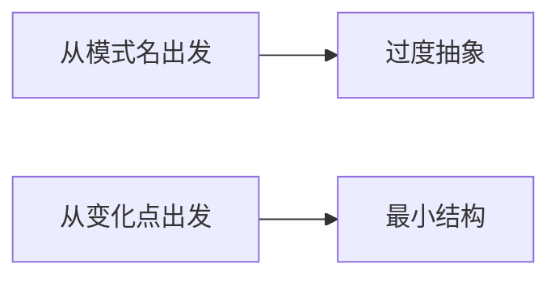

# 模式选型决策树

模式选型应回答三个问题：**变化点在哪、耦合要断在哪、生命周期要不要记录**。下列决策树把常见前端场景映射到创建/结构/行为型与组件惯用法，避免从模式名反推需求。

---

## 主决策流



---

## 按症状速查

| 症状 | 首选 | 次选 |
|------|------|------|
| 两个 REST 字段命名不一致 | Adapter | — |
| 按钮要 loading+权限+埋点 | Composable 合并 | Decorator HOC |
| 支付/物流渠道不断增加 | Strategy 注册表 | Factory |
| 向导 5 步表单项 | Builder / 分步 state | — |
| 子组件共享 Tabs 状态 | Compound + Context | — |
| 列表+详情都要听同一刷新 | Observer store | props 提升 |
| 富文本 undo | Command 栈 | — |
| 审核流固定迁移 | State 机 | switch 膨胀时升级 |

支付渠道月增 → **Strategy 注册表** 分支（Q9）；Tabs 组件 → **Compound**（子组件族 API，非 Strategy）。

---

## 前端组件层分支



| 若出现 | 停手信号 |
|--------|----------|
| HOC > 3 层 | 合并为 layout 或单 hook |
| 全局 bus 事件 > 20 | 划分子域 store |
| 抽象接口仅 1 实现 | 删除接口，YAGNI |

---

## 与质量属性

| 属性 | 有利模式 | 警惕 |
|------|----------|------|
| **可测** | DI、Strategy、Facade | Singleton 全局污染 |
| **可扩展** | Strategy、Factory 注册 | 抽象层过深 |
| **可追踪** | Command、显式 State | 隐式 Observer 网 |
| **性能** | Proxy 缓存、Selector | 粗粒度 Context |

---

## 决策记录模板（轻量 ADR）

```markdown
## 背景
支付渠道将按月新增。

## 决策
采用 Strategy 注册表 payStrategies[method]。

## 后果
+ 开闭扩展 - 需维护注册清单与类型联合
```

团队内 3 行即可，避免形式主义。

---

## 快速决策（30 秒）

```plaintext
1. 能用一个函数 + 参数解决？→ 不用模式名
2. 变化点是算法还是状态？→ Strategy vs State
3. 要通知多个订阅者？→ Observer（优先 store，非 bus）
4. 要包一层增强 UI？→ Composable 优先于 HOC
5. 子组件 API 像 DSL？→ Compound
```

仍不确定时查主决策流 mermaid — 从 Q1 顺序走，勿跳步。

---

## 按业务域速查

不同域的「默认第一选择」不同 — 先划域再走决策树：

| 业务域 | 高频变化点 | 首选模式 / 惯用法 | 慎用 |
|--------|------------|-------------------|------|
| 表单 | 校验规则、字段联动 | Strategy 表 + `useReducer` | 万能 FormClass |
| 列表/表格 | 列定义、筛选、排序 | Strategy + 配置驱动 | 每列一个子类 |
| 权限 | 角色、资源、动作 | Decorator / 路由守卫 composable | 全局 bus |
| 支付/物流 | 渠道增删 | Strategy 注册表 | 巨型 switch |
| 数据层 | API 形状不一 | Adapter + Facade | 五层包装 |
| 编辑器 | undo/redo | Command 栈 | 每个操作改全局变量 |
| 主题/国际化 | 皮肤、文案 | Strategy 或 Context | 硬编码 class |

```typescript
// 域：支付 — 注册表即 Strategy + 轻量 Factory
const payHandlers: Record<PayMethod, PayHandler> = {
  wechat: wechatPay,
  alipay: aliPay,
};
export function pay(method: PayMethod, amount: number) {
  const handler = payHandlers[method];
  if (!handler) throw new Error(`unsupported: ${method}`);
  return handler(amount);
}
```

---

## 常见误选与纠正

| 误选 | 为什么错 | 更合适 |
|------|----------|--------|
| Tabs 用 Strategy | 不是算法替换，是子组件共享状态 | Compound + Context |
| 简单 modal 用 Command | 无撤销需求 | `useState` 控制 open |
| 两个 API 用 Facade 却不做 Adapter | 字段仍不一致 | 先 DTO 映射再门面 |
| 一切通信用 Observer bus | 隐式依赖爆炸 | props / store 分域 |
| 单图表用 Abstract Factory | 创建种类为 1 | 直接 import 组件 |
| 50 行工具函数上 Builder | 无多步可选配置 | 普通函数参数 |



决策树是**正向**工具：从症状到模式；面试或 Review 里发现「为了 Observer 而 Observer」时，用本表**反向**纠正。

---

## 演进路径：何时从「无模式」升级

结构应随重复次数升级，而非一步到位：

| 阶段 | 条件 | 结构 |
|------|------|------|
| 0 | 第一次需求 | 内联函数 / 单组件 |
| 1 | 第二次复制粘贴 | 抽 util 或 composable |
| 2 | 变化轴清晰（≥3 变体） | Strategy 表 / 注册表 |
| 3 | 多模块协作 | Facade composable |
| 4 | 需审计/撤销 | Command 栈 |
| 5 | 状态组合爆炸 | State 机（XState 等） |

```plaintext
例：支付方式
  1 种 → 直接函数
  2 种 → if/else 或 switch 仍可接受
  3 种+ 或月增 → payHandlers 注册表（Strategy）
  需退款/撤销流水 → 再叠 Command 记录
```

每次升级应有**可述说的触发器**（「第三种支付上线」「undo 成刚需」），写进轻量 ADR 三行即可。

---

## 与框架惯用的优先级

组件层决策时，**框架惯用 > GoF 名**：

| 优先级 | 手段 | 何时升级到 GoF 名 |
|--------|------|-------------------|
| 1 | 函数拆分、props | 重复逻辑第三次出现 |
| 2 | `useXxx` / composable | 跨组件复用逻辑 |
| 3 | Context / provide | 跨层且非全局 |
| 4 | 模块 store | 多路由/多组件订阅 |
| 5 | 注册表 / 状态机 | 变化轴稳定且变体多 |

```tsx
// 优先：custom hook 解决 80%「复用」问题
function usePaginatedList(fetchPage: FetchPage) {
  const [page, setPage] = useState(1);
  const { data, isLoading } = useQuery(['list', page], () => fetchPage(page));
  return { data, isLoading, page, setPage };
}
```

只有 hook 无法表达「算法族可插拔」时，再显式引入 Strategy 词汇。

---

## 结对 Review 决策话术

Review 时可用来对齐认知的短问句：

| 问句 | 期望答案方向 |
|------|--------------|
| 这段代码会因什么需求而改？ | 指出变化轴 |
| 删掉这层抽象要改几处？ | ≤1 处则质疑抽象 |
| 订阅者能否从代码里一眼看出？ | 否 → 慎 Observer/bus |
| 新渠道/规则上线改几个文件？ | 理想：1 表项 + 类型 |
| 有无 undo/审计/权限横切？ | 有 → Command/Decorator |

---

## 小结

从**变化点与耦合点**出发走决策树，而非从模式名录反找场景；组件层优先 Hooks/Composables，结构层再用经典 GoF。

**易混点**：Facade 与 Adapter 可叠用（先适配再门面）；Observer 不是解决所有通信的默认答案；「无模式」往往是函数拆分已足够。

核对：支付渠道月增用哪条分支？Tabs 组件应走 Compound 还是 Strategy？
