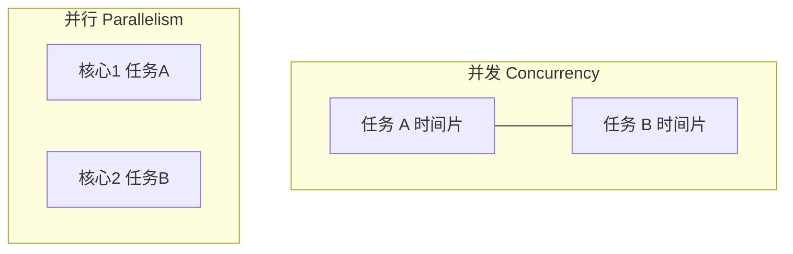

# 并发、并行与异步

**并发**是多个任务在时间上交替推进，**并行**是同一时刻多条执行流同时运行，**异步**是发起操作后不阻塞等待结果。前端主线程单道执行却需同时处理 UI、网络与计时器 — 理解三者区别，是读懂事件循环与 Worker 的前提。

---

## 概念对照



| 术语 | 含义 | 典型环境 |
|------|------|----------|
| **并发** | 逻辑上同时，物理可交替 | 单核 OS 多进程、JS 主线程 + 微任务 |
| **并行** | 物理同时执行 | 多核 CPU、Web Worker 池 |
| **异步** | 调用方不阻塞等完成 | `fetch`、`setTimeout`、Promise |

```javascript
// 异步 ≠ 多线程：仍在主线程回调
async function load() {
  const res = await fetch('/api'); // 等待期间可处理其他任务
  return res.json();
}
```

**易混**：`async/await` 语法像同步，但底层仍是事件驱动回调。

---

## 执行模型简图

| 模型 | 特点 | 前端 |
|------|------|------|
| **单线程 + 事件循环** | 无锁 UI，长任务卡顿 | 浏览器主线程 |
| **多线程** | 共享内存需同步 | Worker（隔离内存） |
| **多进程** | 隔离强、通信贵 | Chromium 多进程、Node cluster |
| **协程 / async** | 用户态切换轻量 | async 函数（仍单线程） |

**对照 OS**：多进程/多线程由内核调度时间片，属于抢占式并发；JS 主线程无用户态线程切换，靠事件循环协作式让出。Node 的 `worker_threads` 与浏览器 Worker 才是多线程并行，与主线程隔离。

---

## 为何前端强调异步而非并行

| 原因 | 说明 |
|------|------|
| DOM 非线程安全 | 多线程改 DOM 需复杂锁 |
| 响应性 | 主线程被占 → 掉帧 |
| I/O 密集 | 网络/磁盘等待占大头，异步即可 |

CPU 密集（图像处理、大 JSON）才考虑 **Worker 并行**；受 Amdahl 定律 约束。

```javascript
// CPU 密集：考虑 Worker
const worker = new Worker('/hash.worker.js');
worker.postMessage(largeBuffer);
worker.onmessage = (e) => console.log(e.data);
```

---

## 异步风格对比

| 风格 | 代码形态 | 错误处理 |
|------|----------|----------|
| 回调 | `cb(err, data)` | 回调地狱 |
| Promise | `.then/.catch` | 链式 |
| async/await | 同步外观 | try/catch |
| 响应式 | RxJS stream | 操作符 |

```typescript
// 并行等待多个异步 — Promise.all（并发非并行）
const [user, posts] = await Promise.all([
  fetchUser(id),
  fetchPosts(id),
]);
```

`Promise.all` 是**并发调度**多个 I/O，不占用多个 OS 线程。

**串行 vs 并发 vs 并行**（同一主线程内）：

```javascript
// 串行：总耗时 ≈ 各次 I/O 之和
const a = await fetch('/a');
const b = await fetch('/b');

// 并发：总耗时 ≈ max(各次 I/O)
const [a, b] = await Promise.all([fetch('/a'), fetch('/b')]);
```

---

## 与操作系统、浏览器衔接


- OS 在时间片上切换线程 → **并发**
- 多核各跑一线程 → **并行**
- JS 主线程一条 → 靠 **Event Loop** 交错执行宏/微任务

Chromium 把 Browser / Renderer / GPU 等拆成多进程：Renderer 内仍是单 JS 线程，网络与合成可在其它进程并行 — 所以「浏览器多进程」≠「JS 多线程写 DOM」。

---

## Node 与浏览器的差异（对照）

| 点 | 浏览器 | Node |
|----|--------|------|
| 主线程 | 渲染 + JS | 仅 JS（无 DOM） |
| I/O | fetch、XHR | fs、net、libuv 线程池 |
| 计时器 | 4ms 嵌套下限（历史） | 无 DOM 渲染插队 |
| CPU 密集 | Worker | worker_threads / child_process |

Node 里 `process.nextTick` 优先于 Promise 微任务；`setImmediate` 在 check 阶段，晚于本轮微任务 — 面试点到「阶段不同」即可，不必背全表。

---

## 协作式 vs 抢占式

| 模型 | 谁决定切换 | 前端例子 |
|------|------------|----------|
| **抢占式** | OS 时钟中断 | 后台 tab 的 Worker 线程 |
| **协作式** | 任务主动结束或 await | 主线程同步大循环卡死 UI |

`await` 把后续代码拆成微任务，相当于**主动让出**主线程 — 这是单线程里实现「并发 I/O」的关键，不是魔法多线程。

---

## 小结

并发讲交错，并行讲同时，异步讲不阻塞。前端默认单线程异步 I/O；CPU 密集用 Worker 补并行，并注意通信与序列化成本。

**易混点**：`Promise.all` 并发 I/O ≠ 多核并行；`setTimeout(0)` 不是立刻执行；Node 异步 I/O 与浏览器事件循环细节不同但概念相通。

核对：单核机器能否「并行」跑两个 OS 线程？`await fetch` 期间主线程能响应点击吗？
