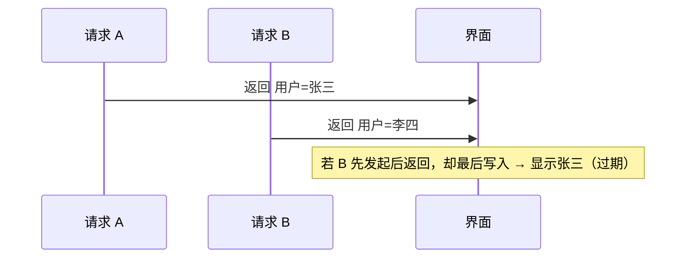
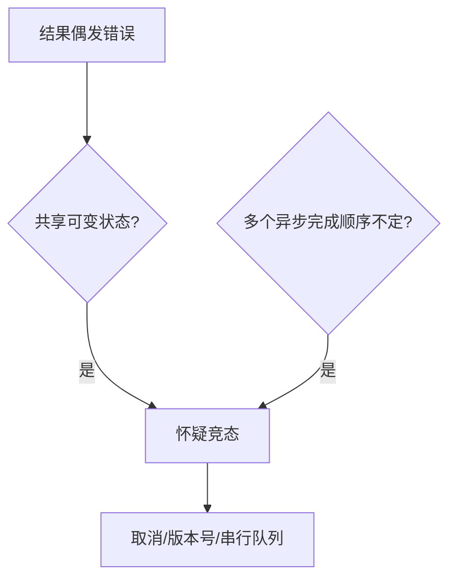

# 竞态条件与内存可见性

当多个执行流**共享可变状态**且缺少协调时，会出现**竞态**：结果依赖碰巧的交错顺序。**内存可见性**则是一个线程写入后，另一线程是否立刻看到 — 在 JS 主线程看似单线程，异步回调与 Worker 仍会踩坑。

---

## 竞态条件（Race Condition）



| 类型 | 前端例 |
|------|--------|
| **读-改-写** | `count++` 两次快速点击 |
| **检查-执行** | `if (!cancelled) setState` 与卸载竞态 |
| **后写覆盖** | 搜索框快速输入，旧响应覆盖新响应 |

```tsx
// 经典：搜索竞态
useEffect(() => {
  let cancelled = false;
  fetch(`/search?q=${q}`).then((r) => r.json()).then((data) => {
    if (!cancelled) setResults(data);
  });
  return () => { cancelled = true; };
}, [q]);
```

**Vue** 同等：`onScopeDispose` 或 `watch` 里 `abortController.abort()`。

---

## 内存可见性（跨线程视角）

多核 CPU 有 **Cache、编译器/CPU 重排序**；语言内存模型规定哪些写入对其它线程可见。

| 概念 | 说明 |
|------|------|
| **happens-before** | 若 A happens-before B，则 A 对 B 可见 |
| **数据竞争** | 无同步的并发读写同址 |
| **JS 主线程** | 单线程无数据竞争，但有**逻辑竞态** |

```javascript
// Worker + SharedArrayBuffer 才涉及真正内存可见性
const sab = new SharedArrayBuffer(4);
const view = new Int32Array(sab);
// 需 Atomics 保证可见性与有序性 — 见下文 Worker 小节
```

Worker 默认 `postMessage` **拷贝**（或 Transferable 转移所有权），不共享堆对象。

---

## 常见前端竞态场景

| 场景 | 对策 |
|------|------|
| 路由切换后旧请求返回 | AbortController、忽略 stale requestId |
| Strict Mode 双 mount | effect 清理函数 |
| 乐观更新 + 失败回滚 | 版本号 / 操作 id |
| 全局单例可变 | 减少共享；用 immutable 更新 |

```typescript
let reqId = 0;
async function search(q: string) {
  const id = ++reqId;
  const data = await api.search(q);
  if (id !== reqId) return; // 过期丢弃
  setResults(data);
}
```

**React 18** `useEffect` 清理 + **TanStack Query** `queryKey` 自动作废是工程化方案。

```typescript
// AbortController — 比 cancelled 布尔更彻底
useEffect(() => {
  const ac = new AbortController();
  fetch(`/api?q=${q}`, { signal: ac.signal })
    .then((r) => r.json())
    .then(setResults)
    .catch((e) => { if (e.name !== 'AbortError') throw e; });
  return () => ac.abort();
}, [q]);
```

---

## 与锁、无锁的关系

| 层级 | 机制 |
|------|------|
| OS / 多线程语言 | mutex、RWLock |
| JS Worker + SAB | `Atomics.wait` / `notify` |
| 主线程异步 | 无锁；用不可变、取消、队列串行化 |

逻辑竞态不靠 OS 锁，靠**串行化关键区**或**丢弃过期结果**；多 Worker 共享计数才需要 `Atomics` 或消息队列。

---

## happens-before 在前端的直觉

| 关系 | 保证 |
|------|------|
| 同一调用栈顺序 | 后语句看到前语句写入 |
| `postMessage` → `onmessage` | 发送先于接收处理（同 channel） |
| `await` 前后 | await 前的写入对 then 可见 |

跨 `setTimeout` 或两个独立 Promise 链**没有**自动 happens-before — 必须用 requestId、锁队列或 Atomics 协调。

---

## 检测思路

1. **复现**：网络节流 + 快速重复操作
2. **加日志**：requestId、时间戳、调用栈
3. **工具**：React DevTools、Performance 面板看长任务与重渲染



---

## 框架视角：为何仍会有竞态

| 框架 | 机制 | 仍可能竞态的原因 |
|------|------|------------------|
| React | 批处理 setState | 跨 effect 周期的异步 |
| Vue 3 | 响应式 track/trigger | 异步回调晚于路由切换 |
| Pinia | 同步 action | 组件外并发请求未协调 |

**原则**：凡「后发先至」能发生的异步写，都要么 **abort**，要么 **版本号丢弃**，要么 **队列串行** — 与是否用框架无关。

---

## 小结

竞态是交错执行下对共享状态的非预期依赖；JS 主线程无低层数据竞争，但异步仍会产生**后写覆盖**与**过期回调**。跨 Worker 共享内存需 Atomics 与内存模型意识。

**易混点**：`useState` 函数式更新解决的是同一事件批内合并，不自动解决跨请求竞态；`loading` 标志不能替代 requestId 去重。

核对：搜索框竞态为何 `if (!cancelled)` 有效？SharedArrayBuffer 为何需要 Atomics？
