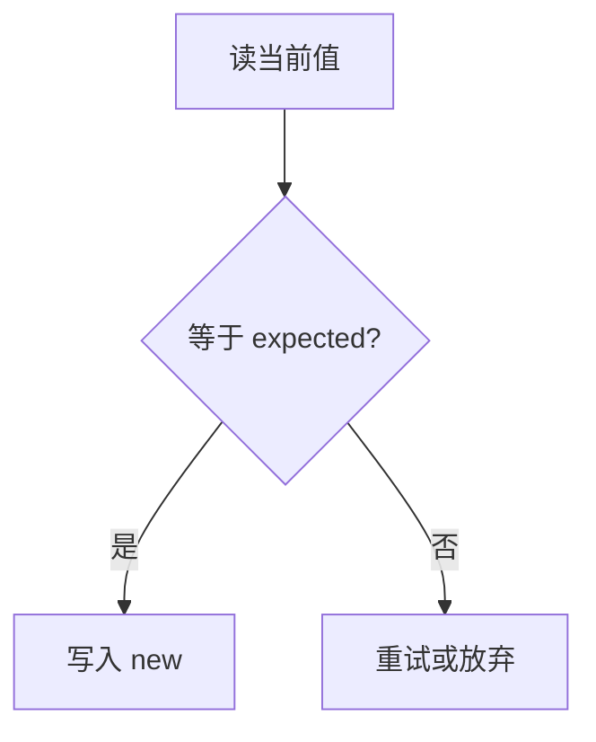

# 锁、无锁与 CAS

多线程共享数据时，**互斥锁**保证临界区独占，**读写锁**区分读/写，**无锁**结构用 **CAS（Compare-And-Swap）** 原子地「比较再交换」。前端主线程很少直接用锁，但 Worker、`Atomics`、以及状态更新语义都与这些思想同源。

---

## 互斥锁（Mutex）

**意图**：同一时刻只有一个执行流进入临界区。


| 概念 | 说明 |
|------|------|
| 临界区 | 读写共享变量的代码段 |
| 死锁 | 互相等待对方持有的锁 |
| 活锁 | 不断重试让步仍无进展 |

OS 层 mutex、信号量、读写锁用于多线程临界区；死锁四条件（互斥、占有等待、不可抢占、循环等待）在 Java/C++ 面试常考。**JS 主线程无用户态 mutex API**。

---

## 读写锁与自旋锁（简记）

| 锁类型 | 适用 |
|--------|------|
| **读写锁** | 读多写少 |
| **自旋锁** | 持锁时间极短、不愿上下文切换 |
| **可重入锁** | 同一线程可多次获取 |

前端映射：**单线程「锁」**常体现为 **队列串行化**（一次只处理一个 job）。

```typescript
class MutexQueue {
  private chain: Promise<void> = Promise.resolve();
  run<T>(fn: () => Promise<T>): Promise<T> {
    const next = this.chain.then(fn);
    this.chain = next.then(() => undefined, () => undefined);
    return next;
  }
}
```

---

## CAS（Compare-And-Swap）

原子指令：若内存值等于期望值，则更新为新值；否则失败重试。

```plaintext
CAS(addr, expected, new):
  if *addr == expected:
    *addr = new; return success
  else:
    return fail
```



| 优点 | 缺点 |
|------|------|
| 无阻塞锁开销 | ABA 问题（需版本戳） |
| 高并发计数 | 热点自旋浪费 CPU |

---

## JS：`Atomics` 与 SharedArrayBuffer

```javascript
const sab = new SharedArrayBuffer(4);
const int32 = new Int32Array(sab);

// 原子加 — 多 Worker 安全计数
Atomics.add(int32, 0, 1);

// 等待/通知 — 简易同步
Atomics.wait(int32, 0, 0);      // Worker 中阻塞
Atomics.notify(int32, 0, 1);    // 主线程唤醒
```

| API | 作用 |
|-----|------|
| `Atomics.load/store` | 原子读写 |
| `Atomics.compareExchange` | CAS |
| `Atomics.wait/notify` | 线程等待（仅 Worker） |

需 **跨域隔离头**（COOP/COEP）才能在多数浏览器启用 SAB — 生产使用门槛高。

---

## 无锁 vs 锁选型

| 场景 | 倾向 |
|------|------|
| 复杂不变式 | 锁或单线程 |
| 简单计数/栈顶 | CAS 无锁 |
| 前端业务状态 | 不可变 + 单线程 dispatch |
| Worker 协作 | `postMessage` 优先于 SAB |

**React 18 自动批处理**在事件处理器内合并 `setState`，可视为运行时对「连续更新」的优化，非多线程锁。

---

## 与 Vue / React 更新

| 框架 | 并发相关机制 |
|------|--------------|
| React 18 | Concurrent Features、`startTransition` 降低优先级 |
| Vue 3 | 单线程响应式队列刷 DOM |

二者均在**单线程**内调度，与 OS mutex 不同层。

---

## ABA 与版本戳

CAS 只比较值，不比较「是否被改过又改回」 — 栈顶 pop 时 A→B→A 可能误判为空。工业实现用 **带版本号的指针**（double-width CAS）或 Hazard Pointer 等回收策略；前端 SAB 场景少见，但理解 ABA 能解释为何 `compareExchange` 有时需循环重读。

| 场景 | 风险 |
|------|------|
| 无锁栈/队列 | ABA 导致丢节点 |
| 简单计数器 | 通常无 ABA |
| React 状态 | 不用 CAS，用不可变 |

---

## 自旋 vs 阻塞锁

自旋锁在临界区极短时避免线程切换；过长则浪费 CPU。浏览器 Worker 无标准自旋锁 API — 高争用计数应回退到 `postMessage` 串行或把热点留在主线程单道更新。

---

## COOP/COEP 与 SAB 启用

```http
Cross-Origin-Opener-Policy: same-origin
Cross-Origin-Embedder-Policy: require-corp
```

| 头 | 目的 |
|----|------|
| COOP | 隔离 browsing context，防跨窗攻击 |
| COEP | 要求跨源资源带 CORP/ CORS，才能进隔离环境 |

启用后 `SharedArrayBuffer` 与 `performance.measureUserAgentSpecificMemory` 可用，但第三方 iframe/脚本需配 `Cross-Origin-Resource-Policy`。多数业务站为 SAB 付出隔离成本不划算，优先 `postMessage` 传序列化数据。

---

## CAS 与 ABA

| 概念 | 说明 |
|------|------|
| CAS | 比较并交换，硬件原语 |
| ABA | 值变回旧值误判 |
| 无锁栈 | 需版本戳 |

JS 无共享内存 CAS 常规 API；`Atomics.compareExchange` 用于 SharedArrayBuffer。
## 内存序

C++ `memory_order`；JS 内存模型简化 — SharedArrayBuffer + Atomics 保证数据 race 定义。

Worker 传数据用 structured clone 或 Transferable，避免共享可变除非刻意 SAB。

---

## 例题：Worker 间消息 vs SAB

```javascript
// postMessage：结构化克隆，无共享
worker.postMessage({ buf: arrayBuffer }, [arrayBuffer]); // Transferable 零拷贝转移所有权

// SAB + Atomics（需 COOP/COEP）
const sab = new SharedArrayBuffer(4);
const view = new Int32Array(sab);
Atomics.store(view, 0, 42);
Atomics.notify(view, 0);
```

| 方式 | 共享 | 典型场景 |
|------|------|----------|
| postMessage | 否（克隆/转移） | 通用 Worker 通信 |
| SAB + Atomics | 是 | 高频计数、环形缓冲 |

主线程 `Atomics.wait` 在多数浏览器**不可用**，会抛错；等待用 `postMessage` 回调或 `Atomics.waitAsync`（较新）。

---

## 单线程「互斥」：Promise 链串行

浏览器无主线程 mutex API；争用异步资源时用队列：

```javascript
let chain = Promise.resolve();
function enqueue(task) {
  chain = chain.then(task).catch(console.error);
  return chain;
}
// 多个 fetch 写同一配置 — enqueue 保证顺序
```

与 Worker 里 `Atomics` 不同层 — 业务状态优先 **不可变 + 单 dispatch**（Redux reducer）。

## 小结

锁用互斥保护临界区，CAS 用原子比较交换实现无锁更新。浏览器 JS 以单线程为主，Worker 共享内存才触及 `Atomics`；业务层更常用队列串行与不可变数据避免竞态。

**易混点**：`async` 互斥需自建 Promise 链，非 `Atomics`；CAS 失败要重试策略；SAB 需安全上下文与容量规划。

核对：`Atomics.add` 解决的是哪类问题？主线程能否调用 `Atomics.wait`？
