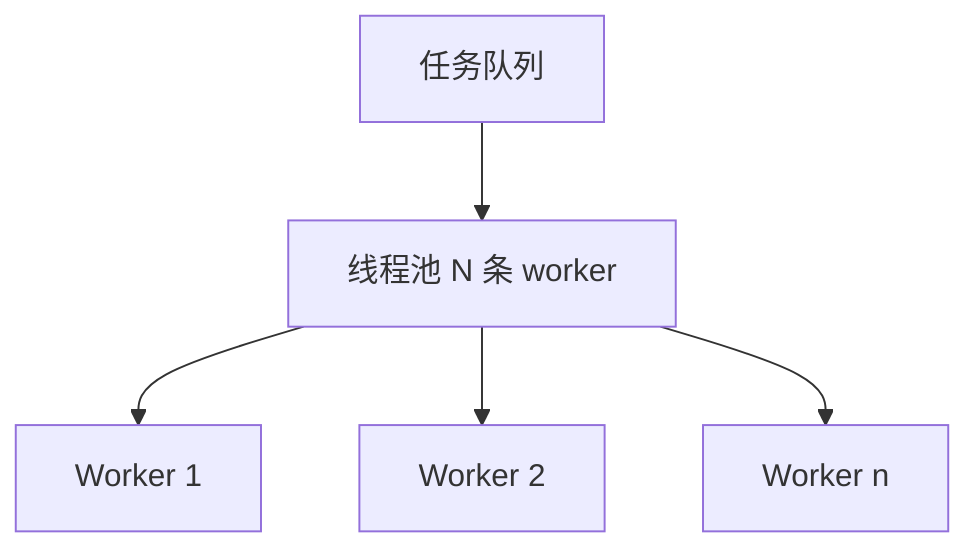
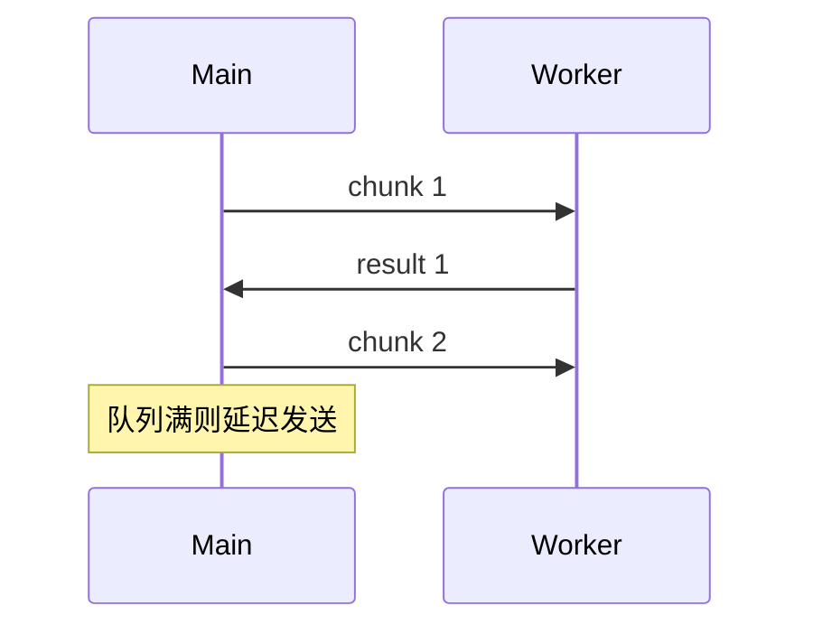

# 线程池与 Worker 模型

**线程池**复用固定数量的工作线程，避免「来一个任务建一个线程」的开销与抖动；浏览器侧对应 **Web Worker 池**、**Service Worker** 与 **Node Worker Threads**。池化解决调度与背压，不自动解决共享状态 — 消息协议与任务切片同样关键。

---

## 线程池核心参数



| 参数 | 含义 | 过大/过小 |
|------|------|-----------|
| **核心/最大线程数** | 并发上限 | 过大：上下文切换；过小：排队 |
| **队列长度** | 等待任务缓冲 | 无界 → 内存涨 |
| **拒绝策略** | 队列满时行为 | 抛错 / 调用方执行 / 丢弃 |

**经验**：CPU 密集池大小 ≈ **逻辑核数**；I/O 密集可更大（等待时不占 CPU）。前端 Worker 通常 **≤ navigator.hardwareConcurrency**。

---

## Web Worker 模型

```javascript
// main.js
const pool = Array.from({ length: 4 }, () => new Worker('/worker.js'));

function runTask(data) {
  return new Promise((resolve, reject) => {
    const w = pool[Math.floor(Math.random() * pool.length)];
    w.onmessage = (e) => resolve(e.data);
    w.onerror = reject;
    w.postMessage(data);
  });
}
```

| 类型 | 能力 | 限制 |
|------|------|------|
| **Dedicated Worker** | 后台计算 | 无 DOM、无多数 Web API |
| **Shared Worker** | 多页面共享 | 支持度有限 |
| **Service Worker** | 离线缓存、推送 | 非通用计算池 |

**Transferable**：`postMessage(buf, [buf])` 转移 ArrayBuffer 所有权，零拷贝。

---

## 任务切片与背压

长任务应分片，避免 Worker 长时间无响应：

```javascript
// worker.js — 分片处理大数组
self.onmessage = ({ data: { chunk, offset } }) => {
  const partial = heavyCompute(chunk);
  self.postMessage({ offset, partial });
};
```

主线程合并 partial；若生产快于消费，需 **背压**（暂停 post、限制队列）。



---

## Node Worker Threads（对照）

| | 浏览器 Worker | Node worker_threads |
|---|---------------|---------------------|
| 用途 | 解放主线程 UI | CPU 密集、不阻塞 event loop |
| 数据 | 结构化克隆 / Transfer | `SharedArrayBuffer`、MessageChannel |
| 池化 | 自建或 comlink | `piscina` 等库 |

Node **cluster** 是多**进程**，适合隔离；**worker_threads** 是线程，共享可行但需同步。

---

## React / Vue 工程实践

| 场景 | 方案 |
|------|------|
| 大文件 hash、加密 | Worker 池 |
| 语法高亮、Markdown 解析 | worker + `importScripts` 或 bundler worker 插件 |
| 图片压缩 | OffscreenCanvas 在 Worker 绘制 |

```typescript
// Vite: ?worker 导入
import MyWorker from './compute.worker?worker';
const worker = new MyWorker();
```

**Comlink** 等库把 `postMessage` 封装成 RPC，降低池化样板代码。

---

## 池调度策略

| 策略 | 做法 | 适用 |
|------|------|------|
| **轮询** | 依次派发到 Worker i | 任务同质、耗时接近 |
| **最少队列** | 选 pending 最少的 Worker | 耗时不均 |
| **单通道** | 一个 Worker 专职一类任务 | 避免状态共享 |

```javascript
// 轮询派发的简化池
let idx = 0;
function nextWorker() {
  const w = pool[idx++ % pool.length];
  return w;
}
```

Worker 崩溃需监听 `onerror` 并 **重建实例**，否则池容量永久缩水。

---

## 与 OS 线程池对照

OS 线程池（Java `ExecutorService`、Rust `rayon`）与 Web Worker 池同构：**队列 + 固定工作者 + 拒绝策略**。差异在浏览器无任意线程 API，Worker 启动成本仍高于函数调用，且每条 Worker 有独立堆与消息通道。

---

## 池大小估算

```plaintext
CPU 密集：poolSize ≈ navigator.hardwareConcurrency
I/O 密集（Node）：可 > 核数，因线程多在等 I/O
前端 Worker：通常 2～4 即可，过多反而消息调度开销大
```

**拒绝策略**在前端的等价物：队列满时丢弃最旧任务、合并同类型任务，或向用户提示「处理中请稍候」 — 避免无界 `postMessage` 撑爆内存。

| 信号 | 动作 |
|------|------|
| 队列长度持续涨 | 降采样、合并 chunk |
| Worker `onerror` | 重建实例并告警 |
| 主线程等结果超时 | 降级算法或取消 taskId |

---

## 小结

线程池用有限 Worker 复用执行槽，队列吸收突发；Web Worker 无 DOM，靠消息与 Transferable 传数据。池大小对齐 CPU 核数，长任务分片并设背压。

**易混点**：Service Worker 不是计算线程池；随机派发到 Worker 不考虑负载时需改轮询/最少队列；`postMessage` 大对象结构化克隆有成本。

核对：I/O 密集 Node 服务为何常不必开满 CPU 核数的 Worker？Transferable 解决了什么问题？
