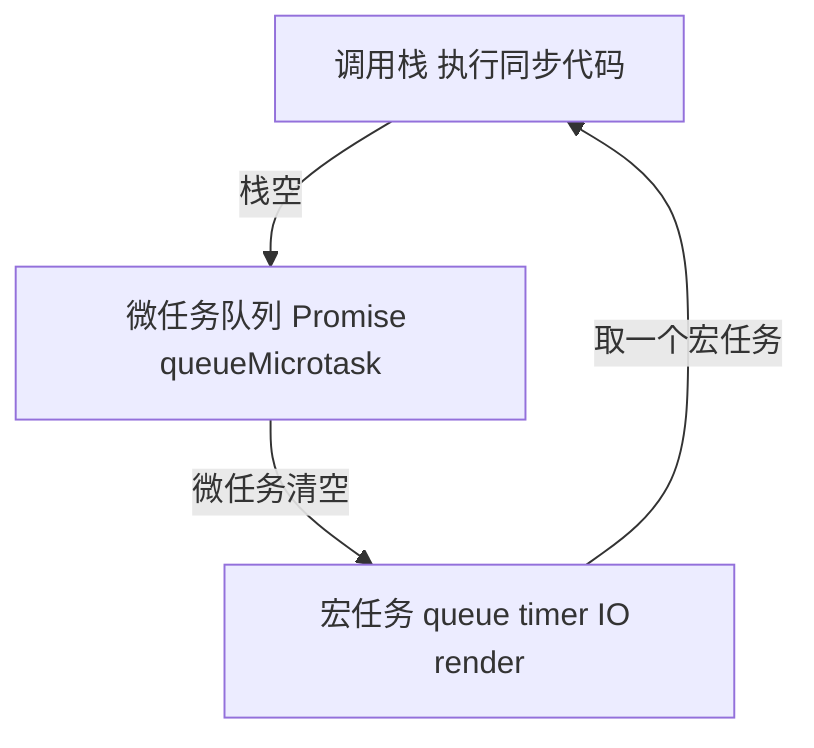

# JS 并发模型

JavaScript 运行时以**单线程事件循环**调度宏任务、微任务与渲染；**Web Worker** 提供隔离线程，**SharedArrayBuffer + Atomics** 在受限场景下共享内存。与 OS 的 I/O 多路复用、浏览器渲染插队对照，能解释「为何 `await` 后 UI 还能动」以及 Worker 的边界。

---

## 事件循环（Event Loop）



| 类型 | 例子 | 优先级 |
|------|------|--------|
| **同步** | 函数调用 | 立即 |
| **微任务** | Promise.then、queueMicrotask、MutationObserver | 宏任务之间清空 |
| **宏任务** | setTimeout、setInterval、I/O、UI 事件 | 每轮一个（浏览器还有渲染） |

```javascript
console.log('1');
setTimeout(() => console.log('2'), 0);
Promise.resolve().then(() => console.log('3'));
console.log('4');
// 1 4 3 2
```

**Node** 分 `timers`、`poll`、`check` 等阶段，与浏览器细节不同，但「微任务优先于下一阶段宏任务」一致。

---

## 与 OS I/O 多路复用

单线程仍能并发处理大量连接：内核 **select/epoll** 在 socket 就绪时回调，JS 在 **poll 阶段**执行回调，不阻塞在 `read` 上。


浏览器 `fetch` 完成 → 任务入队 → 主线程在合适时机执行 `then`。内核用 epoll/kqueue 等在 socket 就绪时唤醒，JS 层只看到「回调稍后执行」。

---

## 浏览器中的任务来源

| 来源 | 说明 |
|------|------|
| 用户输入 | click、input → 宏任务 |
| 网络 | fetch XHR 完成 |
| 计时器 | setTimeout |
| 渲染 | `requestAnimationFrame`（渲染前） |
| 微任务 | Promise、Vue `nextTick`（内部微任务） |

**长任务**（>50ms）阻塞输入与绘制 → INP 变差。`scheduler.postTask`、`requestIdleCallback` 用于让步。

---

## Web Worker

```javascript
// main
const w = new Worker(new URL('./worker.ts', import.meta.url), { type: 'module' });
w.postMessage({ nums: [1, 2, 3] });
w.onmessage = (e) => console.log(e.data);

// worker.ts
self.onmessage = (e) => {
  const sum = e.data.nums.reduce((a, b) => a + b, 0);
  self.postMessage(sum);
};
```

| 能力 | 限制 |
|------|------|
| 计算、部分 Web API | 无 `document`、`window` |
| `fetch`、`IndexedDB` | 与主线程隔离的全局 `self` |
| `importScripts` / ESM | 打包需 worker 插件 |

**Vue / React**：重计算放 Worker，结果经 `postMessage` 回传再 `setState`。

---

## Atomics 与 SharedArrayBuffer

```javascript
const sab = new SharedArrayBuffer(1024);
const view = new Int32Array(sab);

// 主线程
const worker = new Worker('/sync.worker.js');
worker.postMessage(sab);

// sync.worker.js
onmessage = (e) => {
  const v = new Int32Array(e.data);
  Atomics.add(v, 0, 1);
  Atomics.notify(v, 0);
};
```

| 场景 | 建议 |
|------|------|
| 计数、标志位 | `Atomics` |
| 复杂结构 | 优先 `postMessage` + 结构化数据 |
| 生产环境 SAB | 需 COOP/COEP，评估成本 |

`Atomics.wait` **仅 Worker** 内阻塞；主线程调用会抛错。

---

## Node 与框架调度（对照）

| 环境 | 机制 | 说明 |
|------|------|------|
| Node | libuv 线程池、worker_threads、cluster | 与浏览器 Event Loop 阶段不同 |
| React 18 | `startTransition` | 单线程内低优先级更新 |
| Vue 3 | `nextTick` | 微任务后刷 DOM |

Concurrent React 是**优先级调度**，非 OS 线程抢占。

---

## 浏览器一帧内的任务顺序（简化）

```plaintext
执行一个宏任务 → 清空微任务队列 → 可能渲染（rAF 前）→ 下一个宏任务
```

输入事件、网络回调、`setTimeout` 都是宏任务来源；连续多个 `Promise.then` 会在同一宏任务结束后**全部**执行完才进入下一宏任务 — 微任务过多同样阻塞渲染。

| 坑 | 表现 |
|----|------|
| 微任务里再链微任务 | 饿死宏任务与 paint |
| `await` 后紧接 DOM 读写 | 可能 forced sync layout |
| Worker 结果回传大对象 | 结构化克隆阻塞主线程 |

---

## 小结

JS 主线程靠 Event Loop 交错执行同步、微任务与宏任务；I/O 依赖 OS 多路复用回调。Worker 提供真并行但隔离内存；SAB + Atomics 是少数需懂内存模型的场景。

**易混点**：`setTimeout(fn, 0)` 晚于同轮微任务；`await` 后续代码是微任务；Worker 与主线程不共享闭包变量。

核对：输出顺序题 `Promise.then` vs `setTimeout`？为何 Worker 不能直接操作 DOM？
