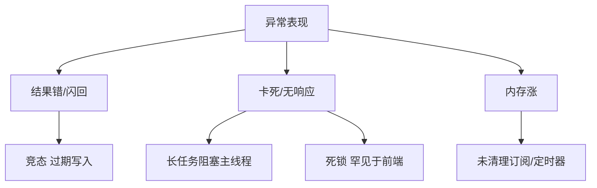

# 并发 Bug 排查思路

并发类缺陷往往**偶发、难复现**：表现是界面闪旧数据、计数不对、偶发白屏。排查需从**可观测性**入手，建立时间线，区分逻辑竞态、死锁（少见）、资源泄漏与框架双重执行 — 而非一上来加锁。

---

## 症状分类



| 症状 | 常见根因 |
|------|----------|
| 快速操作后数据回退 | 请求竞态、无 abort |
| 数字偶发少 1 | 非原子读改写（跨 Worker 无 Atomics） |
| 页面假死 | 主线程同步大循环 |
| 内存持续增长 | 监听器、闭包、Worker 未 terminate |
| 仅生产出现 | 节流/缓存掩盖本地竞态 |

---

## 排查流程


1. **复现**：Network Slow 3G、重复点击、并行 tab
2. **关联**：最后一次写入是否对应最新用户意图
3. **隔离**：去掉 Strict Mode、扩展、Mock 网络
4. **验证**：修复后压测 100 次操作

---

## 工具箱

| 工具 | 用途 |
|------|------|
| **Chrome Performance** | 长任务、主线程占用 |
| **Network** | 请求顺序、瀑布、是否取消 |
| **React DevTools** | 组件重渲染原因 |
| **Vue DevTools** | 依赖触发、Pinia 时间旅行 |
| **断点 + logpoint** | 不改动代码量 |

```javascript
// 临时诊断：包装 setState
const wrap = (fn, name) => (...args) => {
  console.log(name, performance.now(), args);
  return fn(...args);
};
```

---

## 典型修复模式

| 问题 | 修复 |
|------|------|
| 搜索竞态 | AbortController、`staleTime`、requestId |
| 卸载后 setState | effect cleanup、Vue `onScopeDispose` |
| 重复提交 | 按钮 `disabled` + 请求去重 |
| Worker 结果乱序 | 带 `taskId` 合并，丢弃旧 id |
| 全局事件重复绑定 | `once`、effect 依赖正确 |

```tsx
useEffect(() => {
  const ac = new AbortController();
  fetch(url, { signal: ac.signal })
    .then((r) => r.json())
    .then(setData)
    .catch((e) => {
      if (e.name !== 'AbortError') throw e;
    });
  return () => ac.abort();
}, [url]);
```

**TanStack Query / SWR**：`queryKey` 变化自动作废前次请求，降低手写竞态码。

---

## 与测试衔接

| 测试类型 | 抓什么 |
|----------|--------|
| **单元** | 纯函数无副作用 |
| **集成** | 快速连续 `fireEvent` + `waitFor` |
| **E2E** | Playwright 网络拦截、双请求顺序 |

```typescript
// Vitest + fake timers：测 debounce 与竞态
vi.useFakeTimers();
fireEvent.change(input, { target: { value: 'ab' } });
vi.advanceTimersByTime(300);
await waitFor(() => expect(screen.getByText('ab')).toBeInTheDocument());
```

---

## 反模式（排查时避免）

- 未复现就加 `setTimeout` 魔法延迟
- 全局 `mutex` 包所有 API（掩盖设计问题）
- 关闭 Strict Mode「骗自己」
- 仅加 `loading` 不处理过期响应

---

## 案例：搜索框快速输入

```plaintext
t=0   输入 "a" → 请求 A 发出
t=50  输入 "ab" → 请求 B 发出
t=120 A 返回 → 若无防护，界面显示 "a"（过期）
t=150 B 返回 → 应显示 "ab"
```

修复路径：AbortController 取消 A，或 requestId 丢弃 A 的回调。Network 面板应看到 A 为 canceled 或仍 200 但被忽略。

---

## 案例：Worker 乱序回传

主线程按 chunk 顺序 `postMessage`，Worker 处理耗时不均 → 结果 3 先于结果 2 到达。合并时必须带 `chunkId`，渲染层只应用 `id === expected` 的块，或按 id 排序后再拼接。

---

## 小结

并发 Bug 先分类（竞态、阻塞、泄漏），用 requestId 时间线与 Network/Performance 对齐异步交错，再用 abort、版本号、查询库作废等模式修复。

**易混点**：React Strict Mode 双调用是开发期探测副作用，不是生产竞态；`loading` 不能代替 stale 检测；Worker terminate 后仍回调需防 null。

核对：列出稳定复现搜索竞态的两种手段。AbortController 在 effect cleanup 中应做什么？
