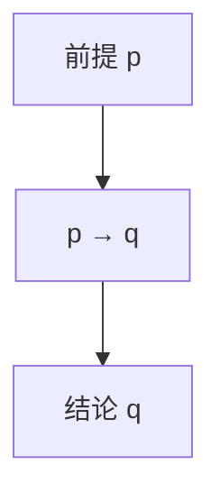

# 命题逻辑与证明

**命题**是可真可假的陈述；**逻辑联结词**组合出复合条件，**推理规则**保证从前提得到有效结论。读懂 TypeScript 条件类型、写清接口契约、面试中「证明算法正确」，都依赖同一套逻辑骨架。

---

## 命题与联结词

| 联结词 | 符号 | 真值要点 |
|--------|------|----------|
| 非 | `¬p` | 否定 |
| 与 | `p ∧ q` | 两者皆真才真 |
| 或 | `p ∨ q` | 至少一真（含异或扩展） |
| 蕴含 | `p → q` | **仅当 p 真且 q 假时为假** |
| 等价 | `p ↔ q` | 同真同假 |

```plaintext
p → q  等价于  ¬p ∨ q
```

**易混点**：日常「如果…就…」常混因果；逻辑蕴含只论真假，不论因果。`false → anything` 恒为 **真**（空真 vacuous truth）。

```javascript
// 短路求值 ≈ 逻辑与/或
const label = user && user.name;        // p ∧ q 的惰性版
const fallback = cached ?? fetchData(); // 缺省，非命题逻辑但常一起考
```

---

## 真值表与等价式

| 等价式 | 用途 |
|--------|------|
| 德摩根 | `¬(p∧q) ↔ (¬p∨¬q)` — 否定条件合并 |
| 分配律 | 化简复合布尔表达式 |
| 双重否定 | `¬¬p ↔ p` |



**三段论（示例）**：

```plaintext
所有人都会死（大前提）
苏格拉底是人（小前提）
∴ 苏格拉底会死
```

在代码审查中对应：「所有 API 必须校验 token」+「此路由未校验」→「违反规范」。

---

## 证明方法概览

| 方法 | 思路 | 算法/前端例子 |
|------|------|---------------|
| **直接证明** | 假设前提，推导结论 | 证明循环不变量 |
| **反证法** | 设结论假，推出矛盾 | 证明 √2 无理 → 二分边界 |
| **contrapositive（逆否）** | 证 `¬q → ¬p` 代替 `p → q` | 「无环 ⇒ 可拓扑序」的逆否 |
| **归纳法** | 基础步 + 归纳步 | 证明树高、递归终止性 |

**结构归纳**（JSON Schema）：若子节点满足 schema，则复合节点满足 — 对应 AST 遍历验证。

```javascript
// 归纳：列表长度 reverse 不变
function reverse(arr) {
  if (arr.length <= 1) return arr;           // 基础步
  return [...reverse(arr.slice(1)), arr[0]]; // 归纳步（示意）
}
```

---

## 谓词逻辑（入门）

命题逻辑原子不可再分；**谓词** `P(x)` 含变量与量词：

| 量词 | 含义 | 代码直觉 |
|------|------|----------|
| `∀x P(x)` | 对所有 x 成立 | `arr.every(pred)` |
| `∃x P(x)` | 存在 x 成立 | `arr.some(pred)` |

TypeScript：`readonly T[]` 上「每个元素非 null」≈ `∀x (x ≠ null)`。

---

## 与面试/工程的衔接

| 题型 | 逻辑工具 |
|------|----------|
| 「充分必要条件」 | `↔` 与 contrapositive |
| 权限「且/或」组合 | `∧` `∨` + 德摩根化简 |
| 单元测试「边界」 | 反例即 `¬(∀x P(x))` 的一个 x |

见下文不变量写法与循环证明。

---

## 真值表速练（蕴含）

| p | q | p→q |
|---|---|-----|
| T | T | T |
| T | F | **F** |
| F | T | T |
| F | F | T |

**逆否**：`p→q` 与 `¬q→¬p` 等价；**逆命题** `q→p` 与 **否命题** `¬p→¬q` 一般不等价 — 面试「充分必要」题先画表再答。

```javascript
// 卫语句 ≈ 蕴含链：if (!auth) return; // 前提假则跳过，后续不变量成立
function handle(req) {
  if (!req.token) return unauthorized();
  // ...
}
```

---

## 德摩根在条件分支中的应用

```javascript
// 原：if (!(isAdmin && isActive)) deny();
// 德摩根：if (!isAdmin || !isActive) deny();
function canAccess(user) {
  const p = user.isAdmin;
  const q = user.isActive;
  if (!(p && q)) return false; // ¬(p∧q) ↔ (¬p∨¬q)
  return true;
}
```

写复杂权限判断时，先画真值表或化简，比堆嵌套 `if` 更不易漏分支 — 与 07-软件工程/03-设计原则 中「表驱动」思想相通。

---

## 小结

命题逻辑用联结词组合条件；**蕴含**在前提假时恒真，是常见陷阱。证明方法（直接、反证、逆否、归纳）对应算法正确性与代码审查推理链。

**易混点**：`p → q` 不等价于 `q → p`（逆命题）；「或」在逻辑里是 inclusive OR；短路 `&&` 不总是计算右操作数。

核对：`p→q` 何时为假？用德摩根化简 `¬(a∧b∨c)` 的结果是什么？
