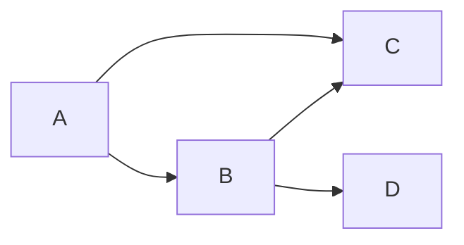
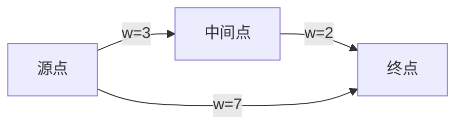

# 图论基础

**图** `G=(V,E)` 用顶点与边描述关联结构。路由表、依赖树、社交关系、最短路径，在离散数学与工程里共用同一套术语 — 先掌握定义与邻接表，再进入复杂度与实现优化。

---

## 基本概念

| 术语 | 含义 |
|------|------|
| **有向/无向** | 边是否带方向 |
| **度** | 无向：邻边数；有向：入度/出度 |
| **路径/环** | 顶点序列；首尾相同为环 |
| **连通** | 任意两点有路径（无向） |
| **DAG** | 有向无环图 — 任务依赖、模块拓扑 |



**表示法**（对照数据结构篇）：

| 结构 | 空间 | 适用 |
|------|------|------|
| 邻接矩阵 | O(V²) | 稠密图、O(1) 查边 |
| 邻接表 | O(V+E) | 稀疏图、遍历 |

```javascript
// 邻接表 — Web 依赖图常用对象 + 数组
const graph = {
  a: ['b', 'c'],
  b: ['d'],
  c: [],
  d: [],
};
```

---

## 遍历

| 算法 | 结构 | 特点 |
|------|------|------|
| **BFS** | 队列 | 层序、无权最短路 |
| **DFS** | 栈/递归 | 连通分量、环检测 |

```javascript
function bfs(start, graph) {
  const q = [start], seen = new Set([start]);
  while (q.length) {
    const v = q.shift();
    for (const n of graph[v] ?? []) {
      if (!seen.has(n)) { seen.add(n); q.push(n); }
    }
  }
  return seen;
}
```

前端映射：组件树 DFS 渲染；广度优先加载路由 chunk；依赖分析用 DFS 检测环。

---

## 经典问题

| 问题 | 要点 | 延伸 |
|------|------|------|
| **拓扑排序** | DAG 线性序 | Webpack 模块顺序 |
| **最短路径** | Dijkstra / Bellman-Ford | 路由、地图 |
| **最小生成树** | Kruskal / Prim | 网络设计（了解） |
| **二分图匹配** | 着色为 2 色 | 任务分配（了解） |

---

## 拓扑排序（Kahn 与 DFS）

**Kahn**：维护入度表，入度 0 的顶点入队，出队时减邻居入度 — O(V+E)。

```javascript
function topoSort(graph) {
  const indeg = {};
  for (const v of Object.keys(graph)) indeg[v] = 0;
  for (const v of Object.keys(graph))
    for (const n of graph[v]) indeg[n] = (indeg[n] ?? 0) + 1;
  const q = Object.keys(indeg).filter(v => indeg[v] === 0);
  const order = [];
  while (q.length) {
    const v = q.shift();
    order.push(v);
    for (const n of graph[v] ?? []) if (--indeg[n] === 0) q.push(n);
  }
  return order.length === Object.keys(indeg).length ? order : null; // null = 有环
}
```

Webpack/Rollup 模块依赖解析本质是拓扑序；环依赖报错即 `order === null`。

---

## 环检测（DFS 三色）

```javascript
function hasCycle(graph) {
  const state = {}; // 0 未访 1 栈中 2 完成
  function dfs(v) {
    state[v] = 1;
    for (const n of graph[v] ?? []) {
      if (state[n] === 1) return true;
      if (!state[n] && dfs(n)) return true;
    }
    state[v] = 2;
    return false;
  }
  return Object.keys(graph).some(v => !state[v] && dfs(v));
}
```

---

## 树与特殊图

| 类型 | 性质 |
|------|------|
| **树** | 连通无环；边数 = V−1 |
| **森林** | 若干树的并 |
| **完全图** | 任意两点有边 |

DOM 是树；React Fiber 是有向树/链表混合结构 — 遍历仍是 DFS/BFS 思想。

---

## 加权图与最短路径（面试一句）

带权边时 BFS 需改 **Dijkstra**（非负权，O((V+E) log V)）或 **Bellman-Ford**（可有负权，检测负环）。前端地图、物流 ETA 组件若用第三方库，底层仍是这些算法 — 面试能说出「非负权用 Dijkstra + 堆」即可。



---

## 小结

图由顶点与边构成；**邻接表**适合稀疏 Web 场景依赖图。BFS/DFS 是遍历底座；DAG 支撑拓扑排序与构建工具链。

**易混点**：无向边 `{u,v}` 与两条有向边 `u→v`、`v→u` 不同；BFS 最短路前提是无权或等权；「连通」在有向图中分强/弱连通。

核对：n 个顶点的树有几条边？如何用 DFS 判断有向图是否有环？
